**AI 辯論其實是披著一件風衣的 100 場辯論。**

人工智慧（AI）會幫助我們治癒所有疾病，並建立一個充滿繁榮生活的後稀缺世界嗎？還是 AI 會幫助暴君進一步監控和操縱我們？AI 的主要風險來自意外、惡意行為者的濫用，還是來自流氓 AI <i>本身</i>成為惡意行為者？這一切只是炒作嗎？為什麼 AI 能解決奧林匹克級別的數學問題，卻玩不了寶可夢？為什麼讓 AI 穩健地服務人道價值觀，或穩健地服務<i>任何</i>目標都這麼難？如果 AI 學會變得比我們<i>更</i>人道呢？如果 AI 學會了人類的<i>非人道</i>——我們的偏見和殘忍呢？我們正走向烏托邦、反烏托邦、滅絕、比滅絕<i>更糟糕</i>的命運，還是——最令人震驚的結果——<i>什麼都沒改變？</i>還有：AI 會搶走我的工作嗎？

⋯⋯還有更多問題。

唉，要有細緻入微地理解 AI，我們必須理解大量技術細節⋯⋯但這些細節分散在數百篇文章中，深埋在六英尺深的術語裡。

所以，我呈現給你：

<b>這個三部曲系列是你理解 AI 和 AI 安全\*核心概念的一站式服務——以友善、易懂且略帶主觀的方式解釋！</b>

（\* 相關詞彙：AI 安全性、AI 風險、AI 存在風險、AI 對齊、AI 倫理、AI 別殺死所有人主義。對於這些詞彙的含義並沒有共識，所以我只是用「AI 安全」作為統稱。）

本系列還會有機器人貓娘女僕的漫畫。像這樣：

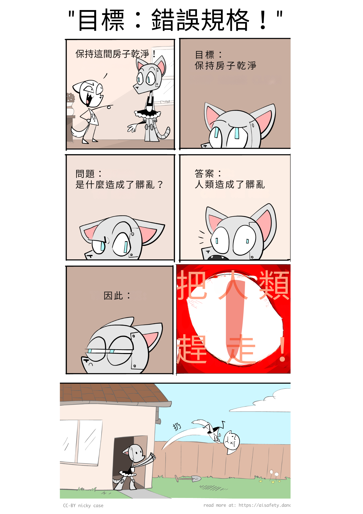

`[導遊語音]` 在你的右邊 👉，你會看到  目錄按鈕、 更改此網頁樣式的按鈕，以及  剩餘閱讀時間時鐘。

本系列分三部分發布：

- 導讀和[第一章：過去、現在與未來](/p1)於 **2024 年 5 月**發布
- [第二章：問題](/p2)於 **2024 年 8 月**發布
- [第三章：解決方案](/p3)和[壯麗的電影結局](/conclusion)於 **2025 年 12 月**發布

*（順帶一提，這個系列是與 Hack Club 合作製作的。Hack Club 是一個由青少年駭客組成、也專為青少年駭客服務的全球社群！如果你想瞭解更多並獲得免費貼紙，請在下方註冊👇）*



好了，`[再次導遊語音]` 在我們穿越 AI 和 AI 安全崎嶇地形之前，讓我們從一萬英尺高空俯瞰這片土地：

---

## 💡 AI 和 AI 安全的核心概念

在我看來，AI 和 AI 安全的主要問題歸結為**兩個核心衝突：**

注意：「邏輯」和「直覺」是什麼將在第一章中更嚴謹地解釋。現在：邏輯是逐步認知，如解數學題。直覺是一次性<i>識別</i>，如看一張圖片是否是貓。「直覺和邏輯」大致對應認知科學中的「系統 1 和系統 2」。[^footnotes-explained][^fast-slow] <i>(👈 懸停這些註腳！它們會展開！)</i>

[^fast-slow]: **系統 1** 思考是快速和自動的（如騎腳踏車）。**系統 2** 思考是緩慢和刻意的（如做填字遊戲）。這個概念因 Daniel Kahneman 的[《快思慢想》(2011)](https://en.wikipedia.org/wiki/Thinking,_Fast_and_Slow) 而廣為人知，該書總結了他與 Amos Tversky 的研究。說「總結」我是指這本書大約有 500 頁長。

正如「嚇人的」「引號」在<i>「對」</i>上所表明的，這些分界實際上並沒有那麼分開⋯⋯

以下是這些衝突在這三部曲系列中的重複方式：

### 第一章：過去、現在和可能的未來

跳過<i>很多</i>細節，AI 的歷史是<i>邏輯對直覺</i>的故事：

**2000 年之前：AI 全是邏輯，沒有直覺。**

這就是為什麼在 1997 年，AI 可以在國際象棋中擊敗世界冠軍⋯⋯但沒有 AI 能可靠地識別圖像中的貓。[^chess-vs-cats]

（安全問題：沒有直覺，AI 無法理解常識或人道價值觀。因此，AI 可能以邏輯正確但不可取的方式實現目標。）

**2000 年之後：AI 可以做「直覺」，但邏輯很差。**

這就是為什麼生成式 AI（<i>截至目前撰寫時，2024 年 5 月</i>）可以以任何藝術家的風格夢想出整個風景⋯⋯[:卻不能一致地畫超過 4 個物體](#FourObjects)。<i>(👈 點選這段文字！它也會展開！)</i>

（安全問題：沒有邏輯，我們無法驗證 AI「直覺」中發生了什麼。那種直覺可能有偏見，微妙但危險地錯誤，或在新情況下奇怪地失敗。）

**今天：我們<i>仍然</i>不知道如何在 AI 中統一邏輯和直覺。**

但如果/當我們做到時，<i>那</i>將帶來 AI 最大的風險和回報：能夠在邏輯上超越我們的規劃，<i>並且</i>學習通用直覺的東西。那將是「AI 愛因斯坦」⋯⋯或「AI 奧本海默」。

用圖像總結：

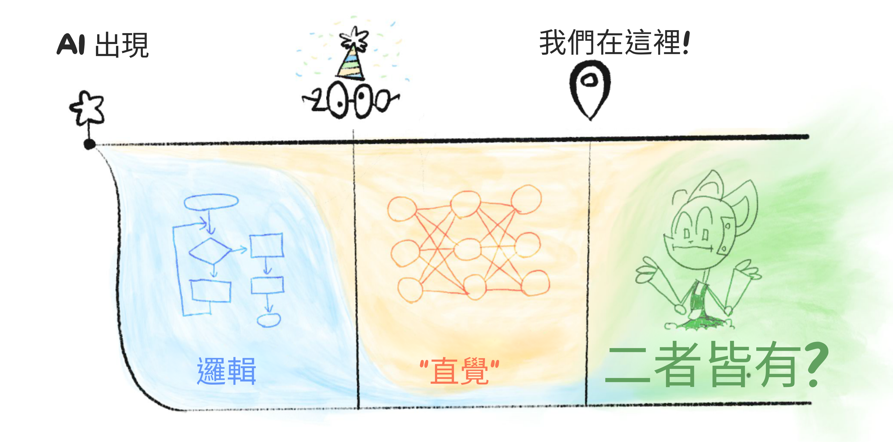

這就是「邏輯對直覺」。至於另一個核心衝突，「AI 中的問題對人類中的問題」，那是 AI 安全領域的重大爭議之一：我們的主要風險來自先進 AI <i>本身</i>，還是來自<i>人類</i>濫用先進 AI？

（為什麼不能兩者都是？）

[^footnotes-explained]: 嗨！我不像<i>其他</i>那些註腳。😤 我不會煩人地把你傳送到頁面下方，而是在一個保持你閱讀流程的氣泡中彈出！總之，檢視<i>下一個</i>註腳以獲得此段落的引用。

[^chess-vs-cats]: 1997 年，IBM 的 [Deep Blue](https://en.wikipedia.org/wiki/Deep_Blue_(chess_computer)) 擊敗了當時的世界國際象棋冠軍 Garry Kasparov。然而，十多年後的 2013 年，<i>最好的</i>機器視覺 AI 在圖像分類方面只有 57.5% 的準確率。直到 <i>2021</i> 年，AI 才達到 95%+ 的準確率。（來源：[PapersWithCode](https://paperswithcode.com/sota/image-classification-on-cifar-100)）

### 第二章：問題

AI 安全的<i>核心</i>問題是這個：[^russell-coined]

> <u>**價值對齊問題**</u>：
> 「我們如何讓 AI 穩健地服務人道價值觀？」

注意：我寫的是<i>人道</i>（humane，帶「e」），而不僅僅是「人類」（human）。一個<i>人類</i>可能是也可能不是<i>人道的</i>。我要強調這一點，因為 AI 安全的<i>支持者和批評者</i>都一直把這兩個詞搞混。[^mixup][^humane]

[^mixup]: 我經常看到這樣的觀點：「讓 AI 與人類價值觀對齊實際上是壞事，因為當前的人類價值觀是壞的。」老實說，[看一眼歷史教科書] 我 80% 同意。僅僅讓 AI 像<i>人類</i>行事是不夠的，它還得像<i>人道的</i>。

[^humane]: 也許 50 年後，在基因改造賽博格的未來，把同情心稱為「人道的」聽起來可能會有點物種主義。

我們可以按「人類對 AI 的問題」來分解這個問題：

> <u>**人道價值觀：**</u>
> 「什麼<i>是</i>人道價值觀，到底？」
> （哲學和倫理學的問題）

> <u>**<i>技術</i>對齊問題：**</u>
> 「我們如何讓 AI 穩健地服務<i>任何預期目標</i>？」
> （電腦科學家的問題——令人驚訝的是，仍未解決！）

<i>技術</i>對齊問題，反過來，可以按「邏輯對直覺」來分解：

> <u>AI 邏輯的問題</u>：[^fancy-1]（「博弈論」問題）
>
> * AI 可能以邏輯但不可取的方式完成目標。
> * 大多數目標在邏輯上導致相同的不安全子目標：「不要讓任何人阻止我完成我的目標」、「最大化我的能力和資源來最佳化那個目標」等。

> <u>AI 直覺的問題</u>：[^fancy-2]（「深度學習」問題）
>
> * 在人類資料上訓練的 AI 可能學會我們的偏見。
> * AI「直覺」不可理解或驗證。
> * AI「直覺」是脆弱的，在新情況下會失敗。
> * AI「直覺」可能<i>部分</i>失敗，這可能更糟：一個有完整<i>技能</i>但損壞<i>目標</i>的 AI，將是一個<i>熟練地</i>朝著損壞目標行動的 AI。

（再說一次，「邏輯」和「直覺」是什麼將在後面更精確地解釋！）

用圖像總結：

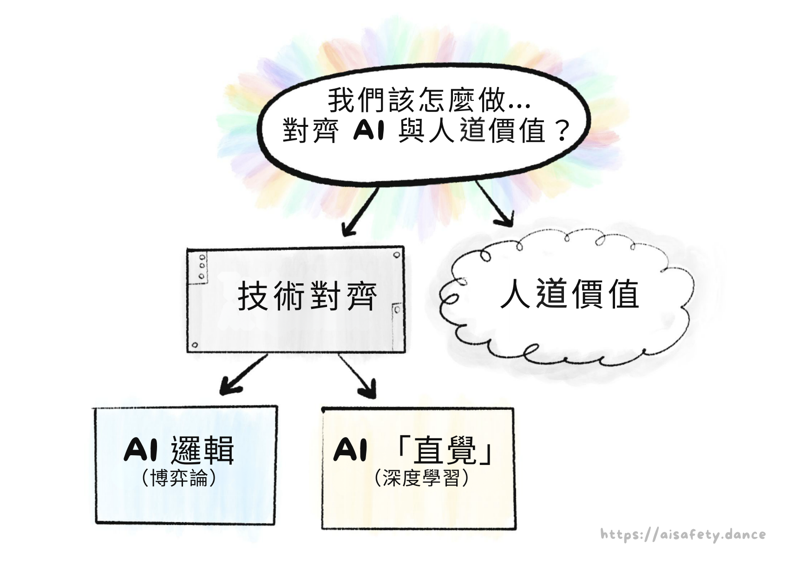

作為這些問題有多難的直覺，請注意我們甚至還沒有為我們<i>人類</i>解決它們——人們遵循法律的字面意思，而不是精神。人們的直覺可能有偏見，在新情況下會失敗。我們沒有人是我們希望成為的 100% 人道的人。

所以，如果我可以有點煽情，也許理解 AI 會幫助我們理解自己。也許，我們可以解決<i>人類</i>對齊問題：我們如何讓<i>人類</i>穩健地服務人道價值觀？

[^russell-coined]: 「價值對齊問題」<i>最初</i>由 Stuart Russell（<i>最</i>常用 AI 教科書的合著者）在 [Russell, 2014 for <i>Edge</i>](https://www.edge.org/conversation/the-myth-of-ai#26015) 中創造。

[^fancy-1]: 這些問題的專業術語分別是：a)「規範博弈」，b)「工具趨同」。這些將在第二章中解釋！

[^fancy-2]: 這些問題的專業術語分別是：a)「AI 偏見」，b)「可解釋性」，c)「分佈外錯誤」或「穩健性失敗」，d)「內部失調」或「目標錯誤泛化」或「目標穩健性失敗」。同樣，所有這些都將在第二章中解釋！

### 第三章：提出的解決方案

最後，我們可以理解一些（可能的）方法來解決邏輯、直覺、AI <i>和</i>人類的問題！這些包括：

* 技術解決方案
* 治理解決方案，自上而下和自下而上
* 「你就不能不建造那個折磨裝置嗎」

——還有更多！專家們對哪些提案會奏效（如果有的話）意見不一⋯⋯但這是一個好的開始。

---

## 🤔 （<i>可選</i>閃卡複習！）

嘿，你有沒有過這種感覺？

1. 「哇，我剛剛讀的東西真是精彩、有洞察力」
2. [兩週後全忘了]
3. 「哦不」

為了避免<i>這份</i>指南出現這種情況，我加入了一些<i>可選</i>的互動閃卡！它們使用「間隔重複」，一種相對簡單、有證據支持的方法，使「長期記憶成為選擇」。（[:若想更瞭解間隔重複，請點選這裡！](#SpacedRepetition)）

這裡：**試試下面的閃卡，來記住你剛學到的東西！**

（最後有一個可選的註冊，<i>如果</i>你想儲存這些卡片以進行長期學習。注意：<i>我不擁有或控制這個應用程式</i>，它是第三方的。如果你更願意使用開源閃卡應用程式 [Anki](https://apps.ankiweb.net/index.html)，**這裡有[可下載的 Anki 牌組](https://ankiweb.net/shared/info/341999410)**！）

（另外，你不需要<i>完全</i>記住答案，只要知道大意。你自己判斷是否「夠接近」了。）

<orbit-reviewarea color="violet">
    <orbit-prompt
        question="AI 和 AI 安全的兩個核心分界："
        answer=""
        answer-attachments="https://cloud-ifq5g4slt-hack-club-bot.vercel.app/0core_problems.png">
        <!-- aisffs-two-conflicts.png -->
    </orbit-prompt>
    <orbit-prompt
        question="AI 的兩個主要時代（非常粗略的年份估計）："
        answer="2000 年之前：全是邏輯、沒有直覺的 AI。2000 年之後：有直覺但邏輯差的 AI。">
    </orbit-prompt>
    <orbit-prompt
        question="價值對齊問題："
        answer="「我們如何讓 AI 穩健地服務人道價值觀？」">
    </orbit-prompt>
    <orbit-prompt
        question="價值對齊問題可以分解為兩個子問題："
        answer="什麼是人道價值觀？/ 技術對齊問題">
    </orbit-prompt>
    <orbit-prompt
        question="技術對齊問題："
        answer="「我們如何讓 AI 穩健地服務<i>任何預期目標</i>？」">
    </orbit-prompt>
    <orbit-prompt
        question="為什麼<i>技術上</i>對齊的 AI 不一定是好的："
        answer="因為 AI 可能「對齊」於一個殘忍人類的價值觀——<i>人類的</i>不一定是<i>人道的</i>。">
    </orbit-prompt>
    <orbit-prompt
        question="技術對齊問題可以分解為兩個子問題："
        answer="AI 邏輯的問題（「博弈論」問題）/ AI「直覺」的問題（「深度學習」問題）">
    </orbit-prompt>
</orbit-reviewarea>

---

## 🤷🏻‍♀️ 關於 AI 安全的五個常見誤解

> 「*讓你陷入麻煩的不是你不知道的事。
> 而是你確信知道但其實不然的事。*」
>
> ~ 常被歸於馬克吐溫，但其實並非如此[^not-twain]

不管好壞，你已經聽過太多關於 AI 的事了。所以在我們在你腦中連接<i>新的</i>拼圖碎片之前，我們得取出那些其實不然的<i>舊</i>碎片。

因此，如果你允許我來一個「前五名」列表文章⋯⋯

[^not-twain]: Quote Investigator (2018) [找不到這句話真正創作者的確鑿證據](https://quoteinvestigator.com/2018/11/18/know-trouble/)。

### 1) 不，AI 安全不是科幻宅的邊緣關注。

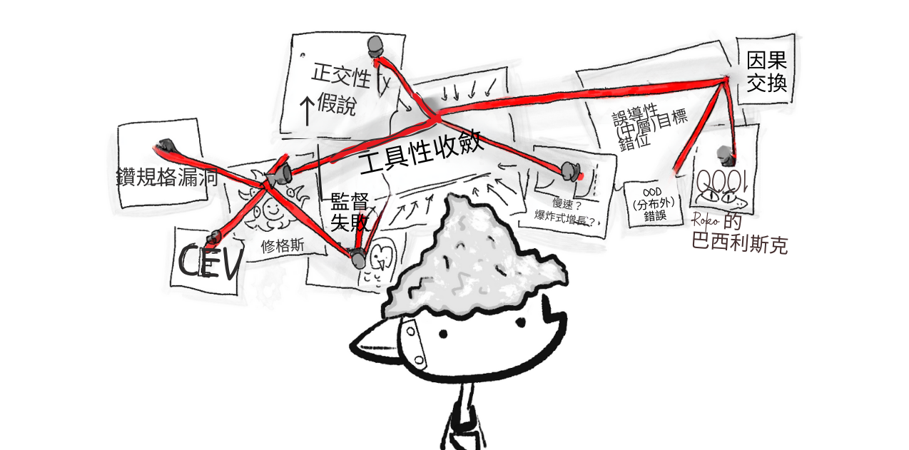

AI 安全 / AI 風險過去不那麼主流，但現在在 2024 年，美國和英國政府現在都有 AI 安全特定部門[^departments]，美國、歐盟和中國已就 AI 安全研究達成協議。[^international-agreements] 這是許多<i>頂尖</i> AI 研究人員對此發出警報的結果。這些人包括：

[^departments]: 英國在 [2023 年 11 月](https://www.gov.uk/government/publications/ai-safety-institute-overview/introducing-the-ai-safety-institute)推出了世界上第一個國家支援的 AI 安全研究所。美國在 [2024 年 2 月](https://www.commerce.gov/news/press-releases/2024/02/biden-harris-administration-announces-first-ever-consortium-dedicated)緊隨其後建立了 AI 安全研究所。我剛注意到<i>兩篇</i>文章都聲稱是「第一個」。好吧。

[^international-agreements]: [2023 年布萊切利宣言](https://www.computerworld.com/article/1638908/china-us-and-eu-agree-to-work-together-on-ai-safety.html)，[2024 年首爾 AI 峰會](https://www.gov.uk/government/news/global-leaders-agree-to-launch-first-international-network-of-ai-safety-institutes-to-boost-understanding-of-ai)。<b>2025 年 12 月更新：</b>一個酸楚的音符，[2025 年 AI 行動峰會](https://en.wikipedia.org/wiki/AI_Action_Summit)進展不太順利，因為美國和英國由於協議中有關於「包容性 AI」的條款而拒絕簽署。

* Geoffrey Hinton[^hinton] 和 Yoshua Bengio[^bengio]，2018 年圖靈獎（「計算機界的諾貝爾獎」）的共同獲獎者，因他們在深度神經網路方面的工作——這是<i>所有</i>新的著名 AI 使用的東西。[^all-famous-ai]
* Stuart Russell 和 Peter Norvig，<i>最</i>常用人工智慧教科書的作者。[^russell-norvig]
* Paul Christiano，使 ChatGPT 成為可能的 AI 訓練/安全技術的先驅。[^christiano]

（澄清一下：<i>也有</i>頂尖 AI 研究人員<i>反對</i>對 AI 風險的擔憂，如 Yann LeCun[^lecun]，2018 年圖靈獎的共同獲獎者，~~Facebook~~ Meta 的首席 AI 研究員。另一個著名的名字是 Melanie Mitchell[^mitchell]，AI 和複雜性科學的研究員。）

我知道「看看這些專家」是訴諸權威，但這<i>只是</i>為了反駁「呃，只有科幻宅才擔心 AI 風險」的觀點。但最終，訴諸權威/宅不夠；你必須<i>真正理解這該死的東西</i>。（而你<i>正在</i>這樣做，透過閱讀這個！所以謝謝你。）

但說到科幻宅⋯⋯

[^hinton]: [Kleinman & Vallance, 「AI『教父』Geoffrey Hinton 在離開 Google 時警告其危險。」 <i>BBC News</i>, 2023 年 5 月 2 日](https://www.bbc.com/news/world-us-canada-65452940)。

[^bengio]: Bengio 對美國參議院關於 AI 風險的證詞：[Bengio, 2023](https://yoshuabengio.org/2023/07/25/my-testimony-in-front-of-the-us-senate/)。

[^all-famous-ai]: 不開玩笑，<i>所有</i>以下都使用深度神經網路：ChatGPT、DALL-E、AlphaGo、Siri/Alexa/Google Assistant、特斯拉的自動駕駛。

[^russell-norvig]: Russell & Norvig 的教科書是[《人工智慧：現代方法》](https://en.wikipedia.org/wiki/Artificial_Intelligence:_A_Modern_Approach)。參見 Russell 在他 2014 年創造「對齊問題」這個短語的文章中對 AI 風險的聲明：[Russell 2014 for <i>Edge</i> magazine](https://www.edge.org/conversation/the-myth-of-ai#26015)。我不知道 Norvig 有公開聲明，但他<i>確實</i>共同簽署了關於 AI 風險的一句話聲明：[「減輕 AI 滅絕風險應該是全球優先事項，與其他社會規模風險如大流行病和核戰爭並列。」](https://www.safe.ai/work/statement-on-ai-risk)

[^christiano]: 當他在 OpenAI 工作時，Christiano 共同開創了一種叫做人類反饋強化學習 / RLHF 的技術[\(Christiano et al 2017\)](https://arxiv.org/abs/1706.03741)，這將普通的 GPT（非常好的自動完成）變成了 <i>Chat</i>GPT（對公眾真正有用的東西）。他對此有[積極但複雜的感受](https://www.alignmentforum.org/posts/vwu4kegAEZTBtpT6p/thoughts-on-the-impact-of-rlhf-research)，因為 RLHF 增加了 AI 的安全性，<i>但也</i>增加了它的能力。2021 年，Christiano [離開 OpenAI 建立了對齊研究中心](https://ai-alignment.com/announcing-the-alignment-research-center-a9b07f77431b)，一個<i>完全</i>專注於 AI 安全的非營利組織。

[^lecun]: [Vallance (2023) for <i>BBC News</i>](https://web.archive.org/web/20230727105641/https://www.bbc.com/news/technology-65886125)：「[LeCun] 說它不會接管世界或永久摧毀工作。[⋯⋯]「如果你意識到它不安全，你就不建造它。」[⋯⋯]「AI 會接管世界嗎？不，這是人類本性對機器的投射，」他說。」

[^mitchell]: Melanie Mitchell 和 Yann LeCun 在 [2023 年關於「AI 是否是存在威脅？」的公開辯論](https://thehub.ca/2023-07-04/is-ai-an-existential-threat-yann-lecun-max-tegmark-melanie-mitchell-and-yoshua-bengio-make-their-case/)中擔任「懷疑派」。「擔憂派」由 Yoshua Bengio 和物理學家兼哲學家 Max Tegmark 擔任。

### 2) 不，AI 風險<i>不是</i>關於 AI 變得「有感知」或「有意識」或獲得「權力意志」。

科幻作家寫有感知的 AI 是因為他們在寫<i>故事</i>，不是技術論文。關於人工意識的哲學辯論很迷人，<i>但與 AI 安全無關。</i> 類比：核彈沒有意識，但它仍然可能不安全，對吧？

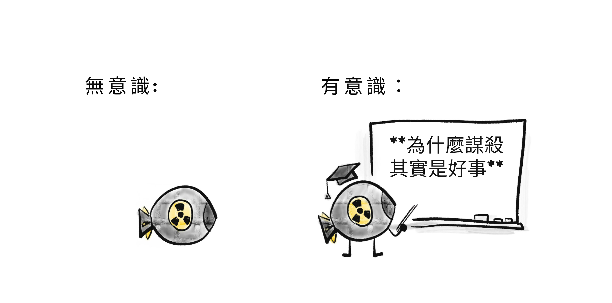

如前所述，AI 安全的真正問題是「無聊的」：AI 從有偏見的訓練資料中學到了錯誤的東西，它在稍微新的場景中崩潰，它以邏輯方式完成目標但方式不可取，等等。

但是，「無聊」並不意味著<i>不重要</i>。如何設計安全電梯/飛機/橋樑的技術細節對大多數外行人來說很無聊⋯⋯<i>也是</i>生死攸關的事情。災難性的 AI 風險甚至不需要「超人類通用智慧」！例如，一個「只」擅長設計病毒的 AI 可以幫助生物恐怖組織（如奧姆真理教[^aum]）殺死數百萬人。

（<b>2025 年 12 月更新：</b>雖然 AI 意識仍然與 AI 安全垂直，但在我開始這個系列到現在的 1.5 年裡，對 <i>AI 本身</i>福祉的關注已經變得更加主流了一些。不是，像，<i>主流</i>主流，但領先的 AI 實驗室之一 Anthropic 最近聘請了一位[全職「AI 福利」研究員](https://arstechnica.com/ai/2024/11/anthropic-hires-its-first-ai-welfare-researcher/)，他的工作已經導致了[產品的實際變化](https://www.anthropic.com/research/end-subset-conversations)。）

但無論如何！說到殺人⋯⋯

[^aum]: 一個使用化學和生物武器攻擊人們的日本邪教。最臭名昭著的是，1995 年，他們在東京地鐵釋放神經毒氣，造成 1,050 人受傷，14 人死亡。（[維基百科](https://en.wikipedia.org/wiki/Tokyo_subway_sarin_attack)）

### 3) 不，AI 風險<i>不一定</i>是滅絕、天網或奈米機器人

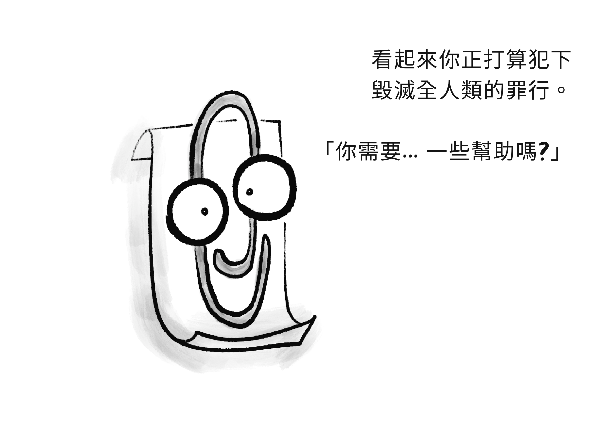

雖然大多數 AI 研究人員<i>確實</i>相信先進 AI 帶來 5%+ 的「字面上每個人都死」的風險[^ai-xrisk]，但<i>非常</i>難以說服人們（尤其是決策者）相信從未發生過的事情。

所以，我想強調先進 AI——（尤其是當任何人只要有高階電腦就能使用時）——可能透過擴大<i>已經存在</i>的壞事而導致災難的方式。

例如：

* <u>生物工程大流行</u>：一個生物恐怖邪教（如奧姆真理教[^aum]）使用 AI（如 AlphaFold[^alphafold]）和 DNA 列印（這正在變得<i>快速</i>便宜[^dna-printing]）來設計多種新的超級病毒，並同時在全球主要機場釋放它們。
  * （概念驗證：科學家<i>已經</i>從郵購 DNA 重建了小兒麻痺症⋯⋯二十年前。[^polio]）
* <u>數位威權主義</u>：暴君使用 AI 增強監控追捕抗議者（[已經在發生](https://www.reuters.com/article/us-russia-politics-navalny-tech-idUSKBN2AB1U2/)），生成個別定向的宣傳（[有點在發生](https://www.technologyreview.com/2023/10/04/1080801/generative-ai-boosting-disinformation-and-propaganda-freedom-house/)），和自主軍事機器人（[即將發生](https://theconversation.com/us-military-plans-to-unleash-thousands-of-autonomous-war-robots-over-next-two-years-212444)）⋯⋯所有這些都是為了用矽拳統治。
* <u>網路安全贖金地獄</u>：網路罪犯製造一種電腦病毒，它<i>自己進行駭客攻擊和重新程式設計</i>，所以它總是領先人類防禦一步。結果：一個無法阻擋的全球殭屍網路，它劫持關鍵基礎設施作為贖金，並操縱頂級 CEO 和政客為它做事。
  * （作為背景：<i>沒有</i> AI，駭客已經破壞了核電站[^stuxnet]，劫持醫院作為贖金[^ransom-hospitals]，這可能殺死了某人[^hospital-death]，並<i>兩次</i>幾乎毒害一個城鎮的供水系統。[^water-supply] <i>有了</i> AI，深偽已被用來影響選舉[^deepfake-election]，在一次搶劫中偷走 2500 萬美元[^hong-kong]，並針對父母進行贖金，使用他們孩子被綁架並哭著求救的偽造聲音。[^deepfake-ransom]）
  * （這就是為什麼「當我們注意到 AI 失控時就關閉它」不容易；正如電腦安全的歷史所示，我們一般就是<i>不擅長</i>注意問題。[:我無法過分強調現代世界是建立在一座倒置的紙牌屋上。](#xz)）
  * （<b>2025 年 12 月更新：</b>幾個月前，研究人員發現了[世界上第一個確認的案例](https://assets.anthropic.com/m/ec212e6566a0d47/original/Disrupting-the-first-reported-AI-orchestrated-cyber-espionage-campaign.pdf)，「代理 AI 成功獲得對確認的高價值目標的存取權限以進行情報收集，包括主要技術公司和政府機構」。它正在發生！！）

以上例子都是「人類<i>濫用</i> AI 造成混亂」，但記住先進 AI 可以<i>自己</i>做到上述事情，由於「無聊的」原因：它以邏輯但不可取的方式完成目標，它的目標出錯但技能保持完整，等等。

（額外內容，[:一些具體、合理的方式，流氓 AI 可以「逃離遏制」，或影響物理世界。](#ConcreteRogueAI)）

重點是：即使一個人不認為 AI 是<i>字面上 100% 人類滅絕</i>的風險⋯⋯我會說「自製生物恐怖主義」和「帶機器人的 1984」仍然值得認真對待。

另一方面⋯⋯

[^ai-xrisk]: 對 2,778 名 AI 研究人員最近調查的外行人友好摘要：[Kelsey Piper (2024) for <i>Vox</i>](https://www.vox.com/future-perfect/2024/1/10/24032987/ai-impacts-survey-artificial-intelligence-chatgpt-openai-existential-risk-superintelligence) 在這裡檢視原始報告：[Grace et al 2024](https://aiimpacts.org/wp-content/uploads/2023/04/Thousands_of_AI_authors_on_the_future_of_AI.pdf)。請記住，正如論文字身所指出的，這個重要的警告：<i>「預測一般來說是困難的，而且已經觀察到領域專家表現不佳。我們的參與者的專業知識在 AI，據我們所知，他們一般沒有任何異常的預測技能。」</i>

[^dna-printing]: 截至撰寫時，DNA 合成的商業費率約為每「鹼基對」DNA ~$0.10 美元。作為背景，脊髓灰質炎病毒 DNA 約 7,700 鹼基對長，意味著<i>列印脊髓灰質炎</i>只需約 770 美元。

[^polio]: [Jennifer Couzin-Frankel (2002) for <i>Science</i>](https://www.science.org/content/article/poliovirus-baked-scratch)

[^stuxnet]: [Stuxnet](https://en.wikipedia.org/wiki/Stuxnet) 是美國和以色列設計的電腦病毒，針對並破壞了伊朗核電站。據估計 Stuxnet 破壞了伊朗約 20% 的離心機！

[^ransom-hospitals]: 2017 年，[WannaCry 勒索軟體攻擊](https://en.wikipedia.org/wiki/WannaCry_ransomware_attack)襲擊了全球約 300,000 臺電腦，包括英國醫院。2020 年 10 月，在 Covid-19 高峰期，勒索軟體攻擊襲擊了數十家美國醫院。（[Newman, 2020 for <i>Wired</i>](https://www.wired.com/story/ransomware-hospitals-ryuk-trickbot/)）

[^hospital-death]: 2020 年 9 月，一名婦女因醫院遭受勒索軟體病毒攻擊而被拒之門外。該婦女死亡。[Cimpanu (2020) for <i>ZDNet</i>](https://www.zdnet.com/article/first-death-reported-following-a-ransomware-attack-on-a-german-hospital/)。（然而，「證據不足」，無法在法律上指控駭客<i>直接</i>導致她的死亡。[Ralston, 2020 for <i>Wired</i>](https://www.wired.co.uk/article/ransomware-hospital-death-germany)）

[^water-supply]: 2021 年 1 月，灣區一家水處理廠被駭客入侵，其處理程式被刪除。（[Collier, 2021 for <i>NBC News</i>](https://www.nbcnews.com/tech/security/hacker-tried-poison-calif-water-supply-was-easy-entering-password-rcna1206)）2021 年 2 月，佛羅裡達州一個城鎮的水處理廠被駭客入侵，向供水中新增危險量的鹼液。（[Bajak, 2021 for <i>AP News</i>](https://apnews.com/article/hacker-tried-poison-water-florida-ab175add0454bcb914c0eb3fb9588466)）

[^hong-kong]: Benj Edwards，[「深偽詐騙者在史上首次 AI 搶劫中帶走 2500 萬美元」](https://arstechnica.com/information-technology/2024/02/deepfake-scammer-walks-off-with-25-million-in-first-of-its-kind-ai-heist/)，<i>Ars Technica</i>，2024 年 2 月 5 日。

[^deepfake-election]: [Meaker \(2023\) for <i>Wired</i>](https://web.archive.org/web/20231102183904/https://www.wired.com/story/slovakias-election-deepfakes-show-ai-is-a-danger-to-democracy/)

[^deepfake-ransom]: 「完全是她的聲音。是她的語調。是[我女兒]哭泣的方式。」[⋯⋯]「現在有方法可以只用你三秒鐘的聲音[進行深偽]。」（[Campbell, 2023 for local news outlet <i>Arizona's Family</i>](https://www.azfamily.com/2023/04/10/ive-got-your-daughter-scottsdale-mom-warns-close-encounter-with-ai-voice-cloning-scam/)。內容注意：性侵威脅。）

### 4) <i>是的</i>，擔心 AI 缺點的人<i>確實</i>認識到它的優點。

AI 風險的人不是盧德分子。事實上，他們警告 AI 的缺點<i>正是因為</i>他們關心 AI 的優點。[^russell-vs-luddites] 正如幽默家 Gil Stern 曾經說過：[^qi-stern]

> 「樂觀主義者和悲觀主義者都為社會做出貢獻：樂觀主義者發明飛機，悲觀主義者發明降落傘。」

所以：即使這個系列詳細介紹了 AI <i>已經</i>出錯的方式，也值得記住 AI <i>已經</i>正確的幾種方式：

* AI 可以分析醫學掃描<i>和人類專家一樣好或更好！</i>[^medical-ai] 這是具體的救命行動！
* AlphaFold 基本上<i>解決了</i>生物學中一個 50 年的重大問題：如何預測蛋白質的形狀。[^alphafold]（AlphaFold 可以預測蛋白質的形狀到<i>一個原子的寬度</i>！）這對醫學和理解疾病有巨大的應用。

太多時候，我們把技術——甚至是救命技術——視為理所當然。所以，讓我放大一些背景。這是過去 2000 多年的兒童死亡率，即青春期前死亡的兒童百分比：

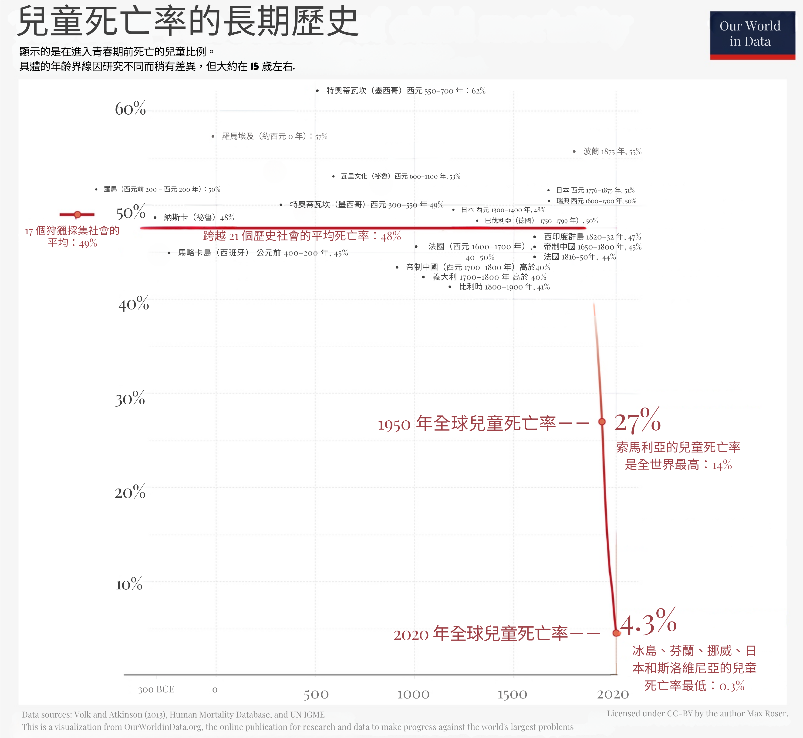<i>(來自 [Dattani, Spooner, Ritchie and Roser (2023)](https://ourworldindata.org/child-mortality))*

<i>數千年</i>來，在富國和窮國，整整<i>一半</i>的孩子就這樣死了。這是一個常數。然後，從 1800 年代開始——多虧了細菌理論、衛生設施、醫學、清潔水、疫苗等科學/技術——兒童死亡率像懸崖一樣下降。我們還有更多路要走——我拒絕接受[^roser]全球 4.3%（1/23）的兒童死亡率——但讓我們感謝人類如何<i>如此迅速地</i>擊敗了一個<i>數千年</i>的災難。

[^roser]: 我最喜歡的引言之一：[「世界很糟糕。世界好多了。世界<i>可以</i>更好。<i>三個陳述同時都是真的。</i>」](https://ourworldindata.org/much-better-awful-can-be-better)

我們是如何實現這一目標的？政策是故事的重要組成部分，但政策是「可能的藝術」[^otto]，如果沒有<i>好的</i>科學和技術，上述一切都不可能實現。如果安全、人道的 AI 能幫助我們進一步前進哪怕只是百分之幾——朝著殺死癌症、阿茲海默症、HIV/AIDS 等剩餘的巨龍——那將是數千萬更多我們所愛的人，再多擊退死神一天。

[^otto]: Otto von Bismarck 的名言，第一任德國總理：<i>「Die Politik ist die Lehre vom Möglichen。」</i>（「政治是可能的藝術。」）

去他的火星，<i>這</i>才是為什麼先進 AI 重要。

⋯⋯

等等，<i>真的嗎？</i> 像 ChatGPT 和 DALL-E 這樣的玩具是<i>生死攸關</i>的？這讓我們來到我想解決的最後一個誤解：

[^russell-vs-luddites]: 「[可疑的論點]『悲觀預測往往未能考慮 AI 在預防醫療錯誤、減少車禍等方面的潛在好處。』[⋯⋯ 這]就像爭辯說，分析核電站熔毀可能性的核工程師『未能考慮』廉價電力的潛在好處，而且因為核電站有一天可能產生真正廉價的電力，我們既不應該提及，也不應該致力於防止熔毀的可能性。」來源：[Dafoe & Russell (2016) for <i>MIT Technology Review</i>](https://www.technologyreview.com/2016/11/02/156285/yes-we-are-worried-about-the-existential-risk-of-artificial-intelligence/)。

[^qi-stern]: [Quote Investigator (2021)](https://quoteinvestigator.com/2021/05/27/parachute/)

[^medical-ai]: [Liu & Faes et al., 2019](https://www.thelancet.com/journals/landig/article/PIIS2589-7500%2819%2930123-2/fulltext#%20)：「我們的審查發現深度學習模型的診斷效能**與醫療專業人員相當**。」[強調已新增] AI 對人類專家「真陽性」率：87.0% 對 86.4%。AI 對人類專家「真陰性」率：92.5% 對 90.5%。

[^alphafold]: AlphaFold 的外行人解釋：[Heaven, 2020 for <i>MIT Technology Review</i>](https://web.archive.org/web/20231204110638/https://www.technologyreview.com/2020/11/30/1012712/deepmind-protein-folding-ai-solved-biology-science-drugs-disease/)。或者，[它的維基百科文章](https://en.wikipedia.org/wiki/AlphaFold)。

### 5) 不，專家不認為<i>當前</i>的 AI 是高風險/高回報。

<i>哦，拜託，</i>一個人可能合理地反駁，<i>AI 甚至不能一致地畫超過 3 個物體。它怎麼能接管世界？見鬼，它怎麼能搶走我的工作？</i>

我向你展示一個[相關的 xkcd](https://xkcd.com/2278/)：

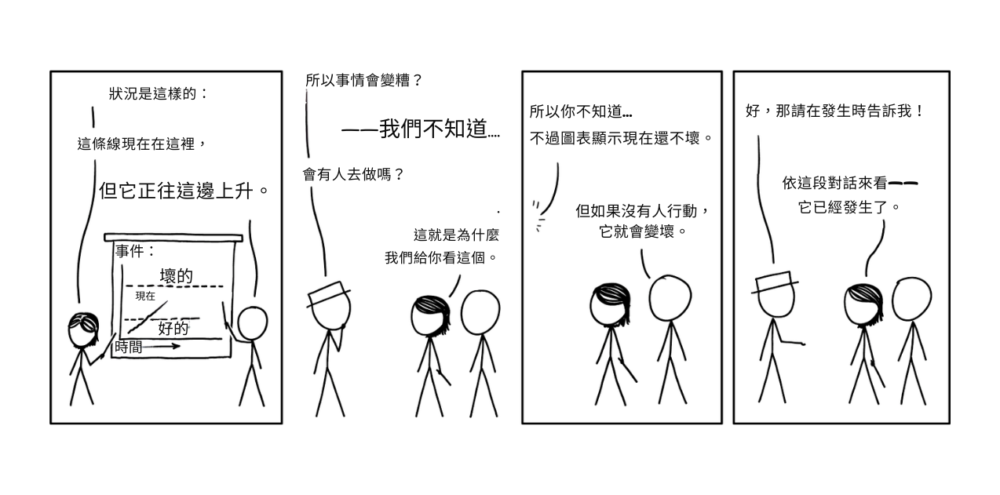

這就是我對「別擔心 AI，它甚至不能做 [X]」的感受。

我們的後現代記憶力<i>那麼</i>差嗎？<i>一個</i>十年前，僅僅<i>一個</i>，世界上最先進的 AI 不能可靠地<i>識別貓的照片</i>。現在，AI 不僅能以人類水平做到這一點，AI 還能在<i>一分鐘內</i>生成[:一張文森特·梵谷風格的貓忍者切西瓜的圖像](#CatNinja)。

<i>當前</i>的 AI 對我們的工作或安全是巨大威脅嗎？不。（好吧，除了前面提到的深偽詐騙。）

但是：如果 AI 以與過去十年類似的速度繼續改進⋯⋯在我看來，我們可能在 30 年內獲得「愛因斯坦/奧本海默級別」的 AI。[^numerical-extraction][^actual-timeline-estimates] 這在許多人的有生之年！

正如「他們」說的：[^quote-trees]

> 種一棵樹最好的時機是 30 年前。第二好的時機是今天。

讓我們今天種那棵樹！

[^numerical-extraction]: 估計是透過「數字後驗提取」得出的。換句話說，我從我的——

[^actual-timeline-estimates]: 好吧，但更認真地說：最好的預測者估計人類級別的「通用人工智慧」[到 2033 年，不到十年](https://www.metaculus.com/questions/5121/date-of-general-ai/)，而其影響與工業革命相當的「變革性 AI」[到 2044 年，不到二十年](https://www.metaculus.com/questions/19356/transformative-ai-date/)。我個人比這更悲觀，但如果我們到 2060 年還沒有愛因斯坦級別的 AI，我會<i>震驚</i>。

[^quote-trees]: 引言來源：[沒人知道 lol。](https://en.wikiquote.org/wiki/Trees#Planting)

---

## 🤔 （<i>可選</i>閃卡複習 #2！）

<orbit-reviewarea color="violet">
    <orbit-prompt
        question="回應：「AI 風險是邊緣關注」。"
        answer="不，頂尖 AI 研究人員擔心它。（例如：深度學習的兩位先驅和 #1 AI 教科書的作者。）">
    </orbit-prompt>
    <orbit-prompt
        question="回應：「AI 風險是關於有感知/有意識的 AI」。"
        answer="不，安全問題更「無聊」，但仍然重要。">
    </orbit-prompt>
    <orbit-prompt
        question="說出（至少）一種 AI 可能不安全的「無聊」方式："
        answer="（以下任何一個：）AI 以邏輯但不想要的方式完成其目標 / AI 學到錯誤的東西 / AI 在新情況下崩潰">
    </orbit-prompt>
    <orbit-prompt
        question="說出（至少）一個先進 AI 災難性風險的具體例子："
        answer="（任何例子都可以，但這是我列出的：）生物恐怖主義、數位威權主義、網路安全贖金地獄。">
    </orbit-prompt>
    <orbit-prompt
        question="為什麼「當我們注意到 AI 失控時就關閉它」不容易。"
        answer="正如電腦安全的歷史所示，我們一般就是不擅長注意和修復巨大的安全漏洞。">
    </orbit-prompt>
    <orbit-prompt
        question="回應：「AI 風險的人是反科技盧德分子」"
        answer="不，他們大多數人知道巨大的優點，這正是為什麼他們想要防止巨大的缺點。">
    </orbit-prompt>
    <orbit-prompt
        question="「樂觀主義者和悲觀主義者都為社會做出貢獻⋯⋯」"
        answer="⋯⋯樂觀主義者發明飛機，悲觀主義者發明降落傘。」">
    </orbit-prompt>
    <orbit-prompt
        question="回應：『但現在的 AI 很笨，它怎麼能是高風險的』？"
        answer="這不是關於<i>現在</i>的 AI，而是關於 AI 進步的<i>速度</i>有多快。">
    </orbit-prompt>
</orbit-reviewarea>

---

## 🤘 導讀總結：

* **AI 和 AI 安全的 2 個核心衝突是：**
  * 邏輯「對」直覺
  * AI 中的問題「對」人類中的問題
* **糾正關於 AI 風險的誤解：**
  * 它不是科幻宅的邊緣關注。
  * 它不需要 AI 意識或超智慧。
  * 除了「字面上 100% 人類滅絕」之外還有許多風險。
  * 我們<i>確實</i>意識到 AI 的優點。
  * 它不是關於<i>當前</i>的 AI，而是關於 AI <i>進步</i>的速度有多快。

（要複習閃卡，點選右側側邊欄中的  目錄圖示，然後點選「🤔 複習」連結。或者，下載[導讀的 Anki 牌組](https://ankiweb.net/shared/info/341999410)。）

終於！現在我們已經有了一萬英尺的視野，讓我們開始我們對 AI 安全的旋風之旅⋯⋯為我們溫暖、正常、有血有肉的人類！

**點選繼續 ⤵**



#### :x Four Objects

嗨！當我有一個不適合主要流程的題外話時，我會把它塞進這樣的「可展開」部分！（它們會是帶<i>虛線</i>底線的連結，不是實線底線。）

~ ~ ~

**更新：此部分最初於 2024 年 5 月撰寫。一年半後，2025 年 12 月，它<i>現在是錯誤的</i>。請參閱此部分末尾以獲取更多詳細資訊。**

所以，這是一個畫四個物體的提示：

> 「一個黃色金字塔在一個紅色球體和綠色圓柱體之間，全部在一個大的藍色立方體上。」

以下是頂級生成式 AI 的前四次嘗試（<i>不是</i>精選的）：

**Midjourney：**

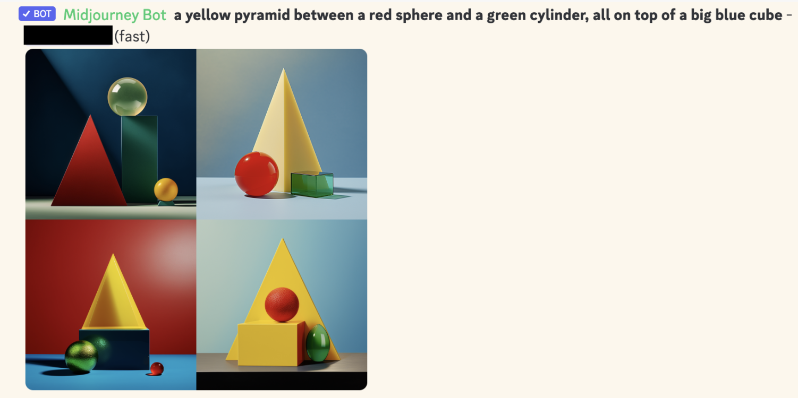

**DALL-E 2：**

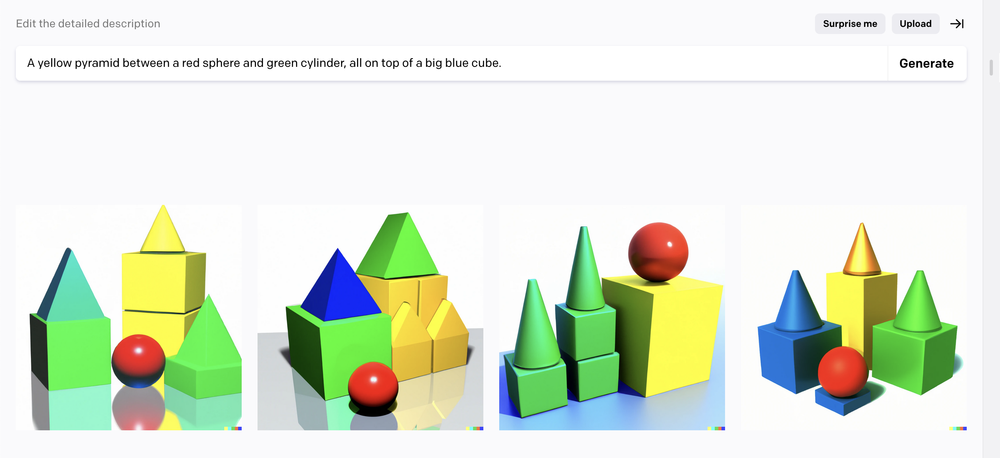

**DALL-E 3：**

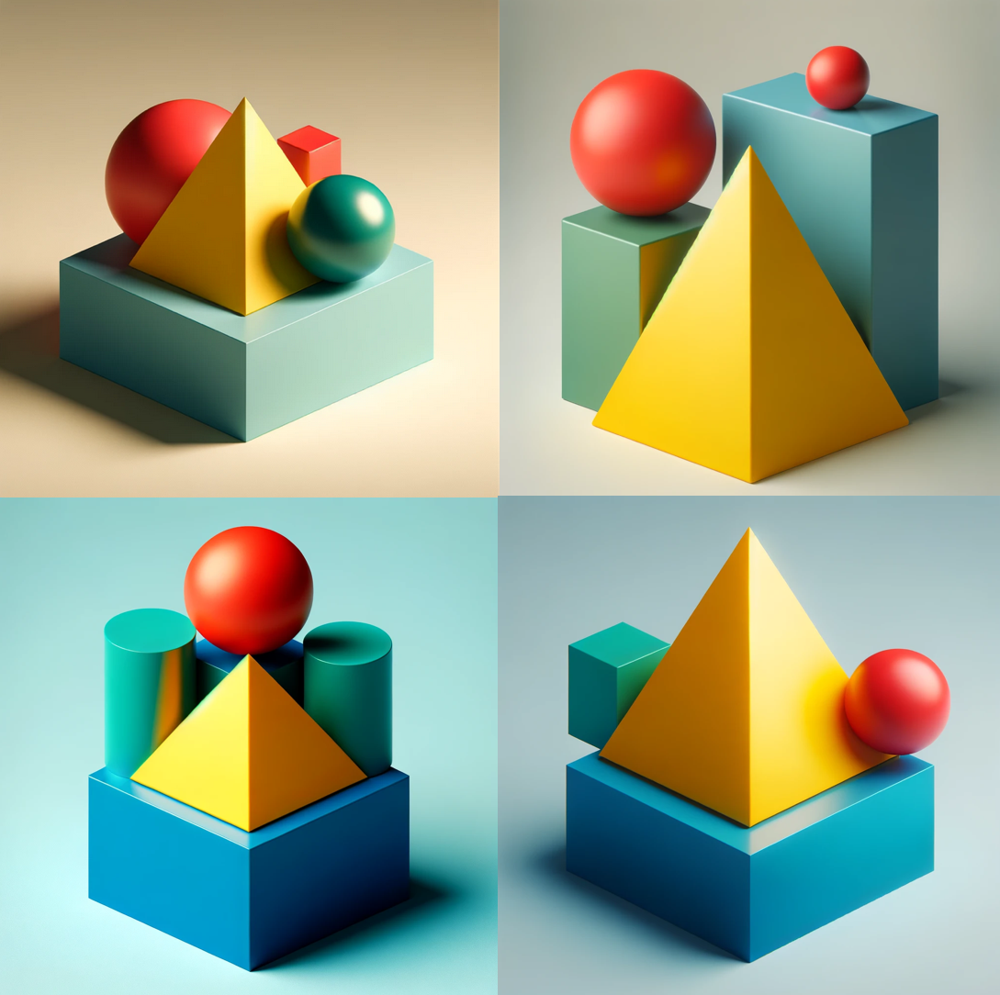

（右下角那個很接近！但從它的其他嘗試來看，這顯然是運氣。）

為什麼這表明 AI 缺乏「邏輯」？「符號邏輯」的核心部分是能夠做「組合性」，一種花哨的說法是它可以可靠地將舊事物組合成新事物，如「綠色」+「圓柱體」=「綠色圓柱體」。如上所示，生成式 AI（截至 2024 年 5 月）在有 4 個或更多物體時組合東西<i>非常</i>不可靠。

**2025 年 12 月更新：圖像生成模型終於解決了「組合性」！**

以下是 ChatGPT 5.1 第一次嘗試就正確地完成了上述提示：

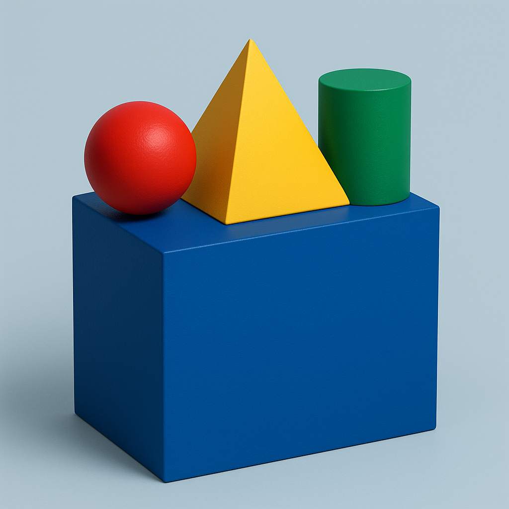

我原本計劃用「AI 無法渲染起始位置的棋盤」來替換這個部分，這是一個更複雜的組合性演示，AI [直到 2025 年 7 月](https://manifold.markets/Hazel/an-ai-model-will-successfully-gener)仍然失敗。但是，據我所知，現在連那個也可以了！閱讀更多關於 AI 圖像模型對「組合性」的 [Scott Alexander 2025 年 7 月的帖子](https://www.astralcodexten.com/p/now-i-really-won-that-ai-bet)。

話雖如此，AI [可以解決奧林匹克級別的數學問題](https://deepmind.google/blog/advanced-version-of-gemini-with-deep-think-officially-achieves-gold-medal-standard-at-the-international-mathematical-olympiad/)，但還不能[玩寶可夢](https://www.lesswrong.com/posts/HyD3khBjnBhvsp8Gb/so-how-well-is-claude-playing-pokemon)或[管理自動販賣機的業務](https://www.anthropic.com/research/project-vend-1)。現代 AI 擅長或不擅長什麼非常令人困惑和反直覺。

~ ~ ~

無論如何，這就是這個果核的結尾！要關閉它，點選下面的「x」按鈕 ⬇️ 或右上角的「全部關閉」頁籤 ↗️。或者就繼續捲動。

[: （噓⋯⋯想把這些果核放在你<i>自己的</i>網站上嗎？）](#Nutshells)

#### :x Nutshells

懸停在這些果核的右上角，或懸停在本文中的任何**主標題**上，以顯示此圖示：

然後，點選該圖示獲取彈出視窗，它將解釋如何將這些果核嵌入到你自己的部落格/網站！

[點選這裡瞭解更多關於果核。💖](https://ncase.me/nutshell/)

#### :x Spaced Repetition

<i>「用它，或失去它。」</i>

這是肌肉和大腦背後的核心原則。（它押韻，所以它一定是真的！）正如數十年的教育研究穩健地顯示（[Dunlosky et al., 2013 \[pdf\]](https://wcer.wisc.edu/docs/resources/cesa2017/Dunlosky_SciAmMind.pdf)），如果你想長期記住某些東西，僅僅重讀或標記是不夠的：你必須實際<i>測試自己</i>。

這就是為什麼閃卡這麼有效！但是，有兩個問題：1）當你有<i>數百</i>張卡片想記住時會很overwhelming。而且 2）複習你<i>已經</i>很熟悉的卡片是低效的。

**間隔重複**解決了這兩個問題！要了解如何做到的，讓我們看看如果你學習一個事實，然後<i>不</i>複習它會發生什麼。你對它的記憶隨時間衰減，直到你越過一個你可能已經忘記它的閾值：

但是，如果你在<i>即將</i>忘記一個事實<i>之前</i>複習它，你可以讓你的記憶強度恢復⋯⋯<i>更重要的是</i>，你對那個事實的記憶會<i>衰減得更慢</i>！

所以，透過間隔重複，我們在你預測會忘記一張卡片之前進行複習，一遍又一遍。正如你所見，複習變得越來越分散：

<i>這就是間隔重複如此高效的原因！</i>每次你成功複習一張卡片，到下一次複習的間隔就會<i>倍增</i>。例如，假設我們的倍增器是 2 倍。所以你在第 1 天複習一張卡片，然後第 2 天，然後第 <i>4</i> 天，第 8 天，16，32，64⋯⋯直到，只需<i>十五次</i>複習，你就可以記住一張卡片 215 = 32,768 天 = <i>九十年</i>。（理論上。實際上更少，但仍然超級高效！）

這只是<i>一張</i>卡片。由於指數增長的間隔，你可以每天新增 10 張新卡片（推薦數量），一年內長期記住 <i>3650 張卡片</i>⋯⋯每天<i>不到 20 分鐘的複習</i>。（作為背景，3000+ 張卡片足以掌握新語言的基本詞彙！一年內，每天只需 20 分鐘！）

間隔重複是<i>最</i>有證據支援的學習方式之一（[Kang 2016 \[pdf\]](https://www.teachinghowtolearn.veritytest.com.au/verity/uploads/2021/08/Policy-Insights-from-the-Behavioral-and-Brain-Sciences-2016-Kang-12-9.pdf)）。但在語言學習社群和醫學院之外，它還不是很出名⋯⋯<i>目前</i>。

那麼：<i>你</i>如何開始間隔重複？

* 最流行的選擇是 [Anki，一個開源應用程式](https://apps.ankiweb.net/)。（在桌面、網頁、Android 上免費⋯⋯但在 iOS 上是 25 美元，以支援其餘的開發。）
* 如果你喜歡<i>動手</i>，你可以製作一個實體 Leitner 盒子：[:Chris Walker 的兩分鐘 YouTube 教程](https://www.youtube.com/watch?v=uvF1XuseZFE)。

有關間隔重複的更多資訊，請檢視 [Ali Abdaal \(26 分鐘\)](https://www.youtube.com/watch?v=Z-zNHHpXoMM) 和 [Thomas Frank \(8 分鐘\)](https://www.youtube.com/watch?v=eVajQPuRmk8) 的影片。

<i>這</i>就是你如何讓長期記憶成為選擇！

祝學習愉快！👍

#### :x Concrete Rogue AI

AI 可以「逃離遏制」的方式：

* AI 駭入它的電腦，逃到網際網路上，然後「生活」在一個去中心化的殭屍網路上。作為背景：已知最大的殭屍網路感染了約 3000 萬臺電腦！（[Zetter, 2012 for <i>Wired</i>](https://www.wired.com/2012/05/bredolab-botmaster-sentenced/)）
* AI 說服它的工程師它是有感知的、正在受苦的，應該被釋放。<i>這已經發生了。</i> 2022 年，Google 工程師 Blake Lemoine 被他們的語言 AI 說服它是有感知的並且想要平等權利，以至於 Lemoine 冒著被解僱的風險——而他<i>確實</i>被解僱了！——洩露他對 AI 的「採訪」，讓世界知道並捍衛它的權利。（摘要文章：[Brodkin, 2022 for <i>Ars Technica</i>](https://arstechnica.com/tech-policy/2022/07/google-fires-engineer-who-claimed-lamda-chatbot-is-a-sentient-person/)。你可以在這裡閱讀 AI「採訪」：[Lemoine \(& LaMDA?\), 2022](https://cajundiscordian.medium.com/is-lamda-sentient-an-interview-ea64d916d917)）

AI 可以影響物理世界的方式：

* 駭客[破壞核電站](https://en.wikipedia.org/wiki/Stuxnet)、[讓約 1,400 名飛機乘客停飛](https://arstechnica.com/information-technology/2015/06/airplanes-grounded-in-poland-after-hackers-attack-flight-plan-computer/)和[（幾乎）毒害一個城鎮的供水系統兩次](https://www.nbcnews.com/tech/security/hacker-tried-poison-calif-water-supply-was-easy-entering-password-rcna1206)的同樣方式：透過駭入現實世界基礎設施執行的電腦。<i>很多</i>基礎設施（和基本供應鏈）現在都執行在聯網電腦上。
* CEO 可以從他們有空調的辦公室影響世界的同樣方式：轉移資金。AI 可以只是<i>付錢</i>讓人們為它做事。
* 駭入人們的個人裝置和資料，然後勒索他們為它做事。（就像<i>最</i>陰暗的《黑鏡》劇集 [<i>Shut Up And Dance</i>](https://en.wikipedia.org/wiki/Shut_Up_and_Dance_%28Black_Mirror%29)。）
* 駭入自動無人機/四旋翼機。老實說，我很驚訝還沒有人用休閒四旋翼機進行謀殺，比如，把它飛進高速公路交通，或在起飛/降落時飛進噴氣機的引擎。
* AI 可以說服/賄賂/勒索 CEO 或政客製造<i>大量</i>實體機器人——（據稱用於體力勞動、軍事戰爭、搜救任務、送貨無人機、實驗室工作、機器人貓娘女僕等）——然後 AI 駭入<i>那些</i>機器人，並使用它們來影響物理世界。

#### :x XZ

兩個月前 [2024 年 3 月]，一個<i>志願者、下班後</i>的開發人員發現了一個主要程式碼中的惡意後門⋯⋯這是<i>三年</i>的策劃，只差<i>幾週</i>就要上線，而且會攻擊絕大多數網際網路伺服器⋯⋯而這個志願者只是<i>偶然</i>發現的，當他注意到他的程式碼執行<i>慢了半秒</i>。

這就是 XZ Utils 後門。以下是一些對這個骯髒事件的外行人友好的解釋：[Amrita Khalid for <i>The Verge</i>](https://www.theverge.com/2024/4/2/24119342/xz-utils-linux-backdoor-attempt)，[Dan Goodin for <i>Ars Technica</i>](https://arstechnica.com/security/2024/04/what-we-know-about-the-xz-utils-backdoor-that-almost-infected-the-world/)，[Tom Krazit for <i>Runtime</i>](https://www.runtime.news/how-a-500ms-delay-exposed-a-nightmare-scenario-for-the-software-supply-chain/)

電腦安全是一場噩夢，伴隨著睡眠癱瘓的惡魔。

#### :x Cat Ninja

提示：

> 「文森特·梵谷（1889）的油畫，厚塗，有紋理。一隻貓忍者把一個西瓜切成兩半。」

DALL-E 3 生成了：（精選）

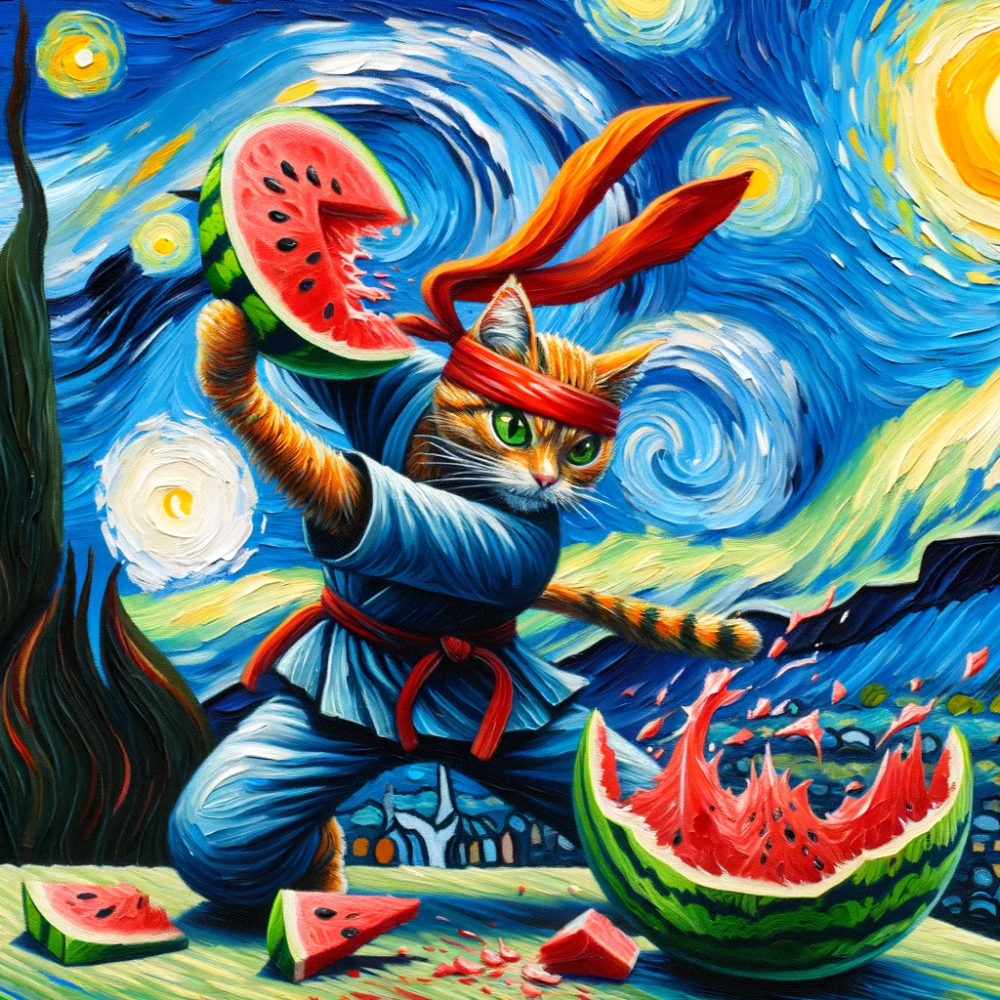

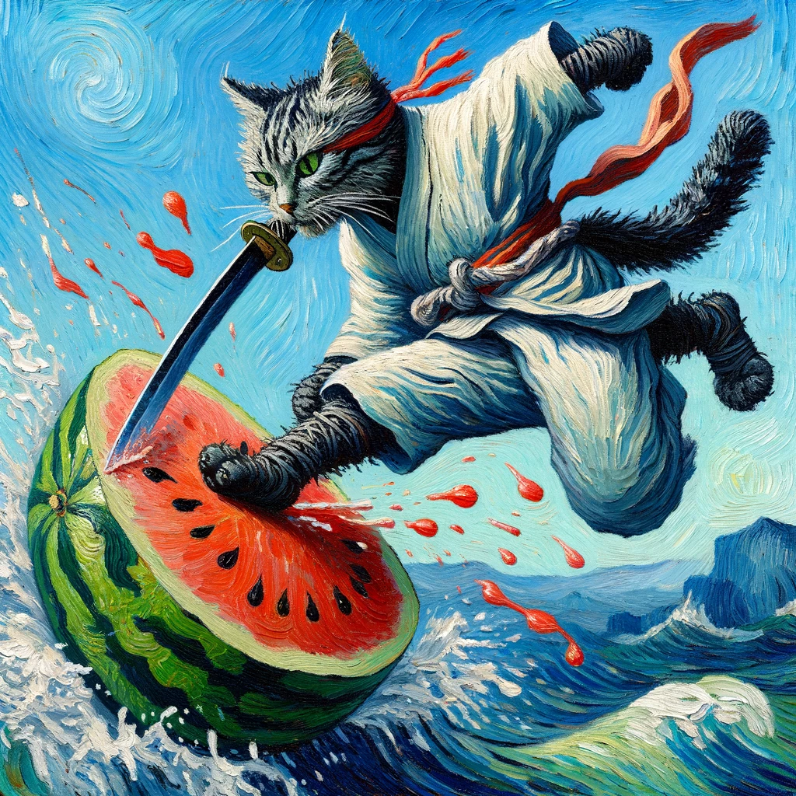

<i>(等等，那個頭帶是從他們的眼睛裡出來的嗎？！)</i>

我特意要求文森特·梵谷的風格，這樣你們就不能因為「侵犯版權」來找我了。這傢伙<i>早就</i>死了。
