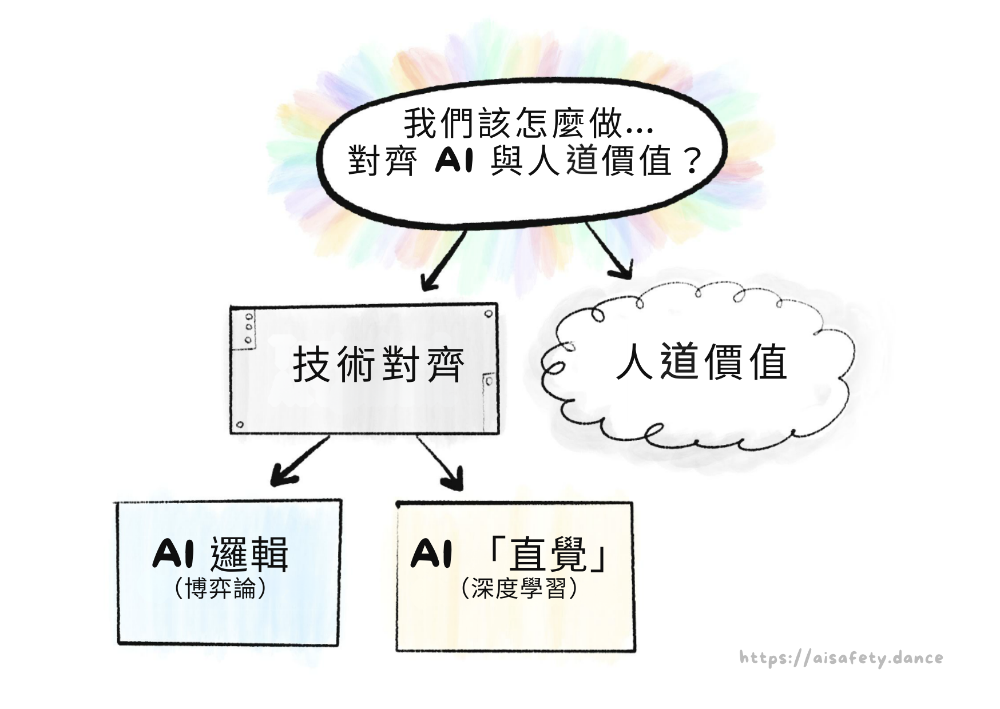

**關於 AI 的爭論，其實是「一百場爭論疊在同一件風衣裡」。**

人工智慧（AI）會幫助我們治癒一切疾病，打造一個後匱乏、人人得以繁榮的世界嗎？還是 AI 會幫助暴君進一步監控與操縱我們？AI 的主要風險，來自意外、壞人濫用，還是失控的 AI 本身就成了壞人？這一切只是炒作嗎？為什麼 AI 能在一分鐘內模仿任何藝術家的風格，卻在畫超過三個物件時就困惑？為什麼很難讓 AI 穩健地服務於「人道」（humane）的價值，甚至是穩健地服務於「任何」目標？如果 AI 變得比我們更有人道精神怎麼辦？如果 AI 學到的是人類的「不人道」，也就是偏見與殘酷，又會如何？我們要走向烏托邦、反烏托邦、滅絕、比滅絕更糟的結局，還是——最令人震驚的——什麼都不變？另外：AI 會搶走我的工作嗎？

……還有更多更多問題。

可惜的是，要細膩地理解 AI，就得理解大量技術細節……然而這些細節散落在上百篇文章中，被滿坑滿谷的術語深埋。

因此，我向你呈上：

**這套三部曲將一次帶你掌握 AI 與 AI 安全\* 的核心觀念 —— 以親切、易懂、略帶個人觀點的方式呈現！**

（\* 相關用語：AI 風險、AI 存在風險（X-Risk）、AI 對齊（Alignment）、AI 倫理、AI-不要-把-大家-都-幹掉-主義。這些詞的確切涵義並*沒有*共識，所以本文統稱為「AI 安全」。）

本系列還有由機器人貓耳男僕（Robot Catboy Maid）主演的漫畫。像這樣：

`[導遊語氣]` 請看您的右手邊 👉，有  目錄按鈕、 網頁樣式切換，以及  剩餘閱讀時間時鐘。
  
關於本系列：導言與第一部分發表於 **2024 年 5 月**，第二部分已於 **2024 年 8 月** 上線，第三部分預計 **2024 年 12 月** 推出。可選：如果想在發佈時收到通知，請於下方登記！👇 我*不會*寄送其他內容騷擾你，只有兩封通知信。（不過呢，`[Podcast 贊助商語氣]` 如果你是高中生或更小、且對 AI／程式／工程有興趣，可以勾選選項以了解更多 [Hack Club](https://hackclub.com/)。附註：有免費的*貼紙～～～* ✨）

總之，`[導遊語氣回歸]` 在踏上 AI 與 AI 安全這段岩石嶙峋的徒步旅程前，讓我們先用「一萬英尺視角」俯瞰全景：

---

## 💡 AI 與 AI 安全的核心觀念

在我看來，AI 與 AI 安全的主要問題可歸結為**兩大核心衝突：**

[^fast-slow]: **系統一（System 1）** 的思考快速且自動（如騎腳踏車）。**系統二（System 2）** 的思考緩慢且深思熟慮（如下字謎）。這個概念由丹尼爾・康納曼在《[快思慢想（2011）](https://en.wikipedia.org/wiki/Thinking,_Fast_and_Slow)》普及，書中總結了他與阿莫斯・特沃斯基的研究。所謂「總結」，其實這本書有將近 500 頁之多。

從我在「對上」周圍加上這些引號就能看出，這些分界其實沒有那麼分明……

以下是這兩大衝突如何在三部曲中反覆出現：
  
### 第 1 部分：過去、現在，以及可能的未來
  
省略*大量*細節不談，AI 的歷史其實就是一則「*邏輯對上直覺*」的故事：

**2000 年之前：AI 幾乎全是邏輯，幾乎沒有直覺。**    

這就是為什麼 1997 年時，AI 能在西洋棋上打敗世界冠軍……卻沒有任何 AI 能可靠地在圖片中辨識出貓。[^chess-vs-cats]

（安全顧慮：沒有直覺，AI 無法理解常識或人道價值。因此，AI 可能以邏輯上正確但不理想的方式達成目標。）

**2000 年之後：AI 能做出「直覺」了，但邏輯很差。**    

這就是為什麼生成式 AI（*以本文撰寫時的 2024 年 5 月為準*）能用任何藝術家的風格夢製整片景致……[:但在畫超過 3 個物件時就會困惑](#FourObjects)。*（👈 點這段文字！它也會展開！）*

（安全顧慮：沒有邏輯，我們無法驗證 AI 的「直覺」裡發生了什麼。那份直覺可能有偏誤、可能在細微之處產生危險的錯誤，或在新情境下以怪異方式失靈。）

**直到今日：我們*仍然*不知道如何在 AI 中統合邏輯與直覺。**

但若我們做得到，那*將*帶來 AI 最大的風險與最大的新契機：一個既能在邏輯上勝過我們的規劃，*又*能學到普遍化直覺的系統。那會是「愛因斯坦級 AI」……或是「歐本海默級 AI」。

一圖總結：

以上是「邏輯對上直覺」。至於另一個核心衝突——「問題出在 AI 還是出在人類」——這正是 AI 安全領域的一大爭議：我們的主要風險，是來自先進 AI *本身*，還是來自*人類*對先進 AI 的濫用？

（為什麼不能兩者皆是？）

[^footnotes-explained]: 嗨！我和*其他*註腳不一樣。😤 我不會惱人地把你傳送到頁面底部，而是以彈出泡泡的方式顯示，讓你的閱讀不中斷！總之，請看*下一個*註腳以取得本段落的出處。

[^chess-vs-cats]: 1997 年，IBM 的 [深藍（Deep Blue）](https://en.wikipedia.org/wiki/Deep_Blue_(chess_computer)) 擊敗當時的世界西洋棋冠軍 Garry Kasparov。然而十多年後的 2013 年，*最強* 的機器視覺 AI 在影像分類上的正確率也只有 57.5%。直到 *2021 年*（三年前），AI 才達到 95% 以上的準確率。（來源：[PapersWithCode](https://paperswithcode.com/sota/image-classification-on-cifar-100)）

### 第 2 部分：問題本質

AI 安全*最核心*的問題是這個：[^russell-coined]

> <u>**價值對齊問題（Value Alignment Problem）**</u>：    
> 「我們如何讓 AI 穩健地服務於人道（humane）的價值？」

注意：我用的是 *humane*（「人道」），而不單是 *human*（「人類」）。一個*人類*未必*人道*。我要反覆強調這點，因為支持與批評 AI 安全的人*都*常把兩者混為一談。[^mixup][^humane]

[^mixup]: 我常見到的說法是：「把 AI 對齊到人類價值其實很糟，因為當前的人類價值很糟。」老實說，[瞄一眼歷史課本] 我有 80% 同意。讓 AI 行為*像人*還不夠，它得*有人道精神*。

[^humane]: 也許 50 年後，在基因改造與賽博格遍地的未來，把慈悲稱為「人道」可能會顯得老派、甚至帶點物種中心主義。

我們可以依照「問題出在人類 vs 出在 AI」來拆解這個問題：

> <u>**人道的價值**：</u>    
> 「究竟什麼是『人道的價值』？」    
> （留給哲學與倫理學的問題）

> <u>**「技術性」對齊問題**：</u>    
> 「我們究竟要如何讓 AI 穩健地服務於*任何預期的目標*？」    
> （電腦科學家的問題——出乎意料地，仍未解決！）

而「技術性」對齊問題，又可依「邏輯 vs 直覺」進一步拆解：

> <u>AI 邏輯面的問題</u>：[^fancy-1]（「賽局理論」類問題）    
> * AI 可能以邏輯正確、但不理想的方式達成目標。
> * 大多數目標在邏輯上都會導向相同且不安全的子目標：「不要讓任何人阻止我達成目標」、「最大化我的能力與資源以最佳化該目標」等。

> <u>AI 直覺面的問題</u>：[^fancy-2]（「深度學習」類問題）    
> * 以人類資料訓練的 AI 可能學到我們的偏見。
> * AI 的「直覺」不可理解、不可驗證。
> * AI 的「直覺」脆弱，會在新情境下失靈。
> * AI 的「直覺」可能*部分*失靈，這也許更糟：當 *技能* 完好但 *目標* 損壞時，AI 會以高超技能朝著扭曲的目標前進。

（再說一次，何謂「邏輯」與「直覺」稍後會更精確地說明！）

一圖總結：

要直覺感受這些問題有多難，先注意：我們連在*人類自身*都還沒解決——人們常遵循法律的字面而非精神。人們的直覺會有偏誤，會在新情境下失效。我們任何人都不是 100% 達到自己期許的那種「人道的人」。

所以，容我小小感性一下，也許理解 AI 會幫助我們理解自己。也許我們能解決*人類*的對齊問題：我們如何讓*人類*穩健地服務於人道的價值？

[^russell-coined]: 「價值對齊問題」一詞最早由史都華・羅素（最常用 AI 教科書的共同作者）在 [Russell, 2014，刊於 *Edge*](https://www.edge.org/conversation/the-myth-of-ai#26015) 提出。

[^fancy-1]: 專業術語分別是：a）「規格規避（Specification gaming）」、b）「工具性收斂（Instrumental convergence）」。將在第二部分說明！

[^fancy-2]: 專業術語分別是：a）「AI 偏見（AI Bias）」、b）「可解釋性（Interpretability）」、c）「分佈外錯誤（Out-of-Distribution Errors）」或「穩健性失敗（Robustness failure）」、d）「內在失對齊（Inner misalignment）」或「目標誤泛化（Goal misgeneralization）」或「目標穩健性失敗（Objective robustness failure）」。同樣會在第二部分說明！

### 第 3 部分：提議的解方

最後，我們可以來理解一些（可能）解決「邏輯、直覺、AI、以及人類」問題的方法！其中包括：

* 技術面解方
* 政策／治理面解方
* 「不然你就先關掉、別去打造那個酷刑樞紐吧」

（可惜的是，我無法在本導言中給出面向大眾的易懂總結，因為在你理解問題之前——也就是第一與第二部分要做的事——這些解方並不會有太大意義。話雖如此，如果你想先看重點劇透，[:點此查看第三部分將涵蓋的內容！](#Part3Details)）

---

## 🤔 （_選填_）抽認卡複習！

你是否也有過這種感覺？

1. 「哇，我剛讀到的內容真是精彩又有洞見」
2. （兩週後全忘光）
3. 「糟了」

為了避免在讀完*本*指南後也發生這種事，我放入了幾張「*選填*」互動抽認卡！它們採用「間隔重複（Spaced Repetition）」——一種相對簡單、且有實證支持的方法，讓「長期記憶」成為一種可選擇的結果。（[:點此了解更多關於間隔重複！](#SpacedRepetition)）

來試試看吧：**用下面的抽認卡，幫助你保留剛學到的重點！**

（最後有個選填的註冊選項，*如果*你想把這些卡片存起來做長期複習。注意：*我並不擁有也不控制這個服務*，它是第三方的。如果你偏好使用開源的抽認卡軟體 [Anki](https://apps.ankiweb.net/index.html)，**這裡有[可下載的 Anki 卡包](https://ankiweb.net/shared/info/341999410)**！）

（另外，你不需要把答案*逐字*背起來，掌握大意即可。是否「夠接近」交由你自己判斷。）

<orbit-reviewarea color="violet">
    <orbit-prompt
        question="AI 與 AI 安全的兩大核心分歧："
        answer=""
        answer-attachments="https://cloud-ifq5g4slt-hack-club-bot.vercel.app/0core_problems.png">
        <!-- aisffs-two-conflicts.png -->
    </orbit-prompt>
    <orbit-prompt
        question="AI 的兩個主要時代（年份僅粗略）："
        answer="2000 年之前：幾乎全是邏輯、沒有直覺。2000 年之後：有了直覺，但邏輯薄弱。">
    </orbit-prompt>
    <orbit-prompt
        question="價值對齊問題："
        answer="「我們如何讓 AI 穩健地服務於人道（humane）的價值？」">
    </orbit-prompt>
    <orbit-prompt
        question="價值對齊問題可拆成兩個子問題："
        answer="何謂人道的價值？／技術性對齊問題">
    </orbit-prompt>
    <orbit-prompt
        question="技術性對齊問題："
        answer="「我們要如何讓 AI 穩健地服務於『任何預期的目標』？」">
    </orbit-prompt>
    <orbit-prompt
        question="為何『技術上』對齊的 AI 不一定是好的："
        answer="因為 AI 可能對齊於某個殘酷人類的價值——『human（人類）』不等於『humane（人道）』。">
    </orbit-prompt>
    <orbit-prompt
        question="技術性對齊問題可再拆為兩項："
        answer='AI 的邏輯面問題（「賽局理論」類）／AI 的「直覺」面問題（「深度學習」類）'>
    </orbit-prompt>
</orbit-reviewarea>

---

## 🤷🏻‍♀️ 關於 AI 安全的五個常見誤解

> 「讓你惹上麻煩的，*不是*你不知道的事；
> 而是那些你*深信不疑*、其實不對的事。」
>
> ～ 常被歸於馬克・吐溫，但事實並非如此[^not-twain]

不論好壞，你大概已經聽過*太多*關於 AI 的說法了。因此，在我們把*新的*拼圖放進你腦中之前，得先把那些其實不對的*舊*拼圖拿掉。

所以，容我來一篇「前五名」清單文……

[^not-twain]: 引言調查（Quote Investigator，2018）找不到[此語錄真正作者的確鑿證據](https://quoteinvestigator.com/2018/11/18/know-trouble/)。

### 1) 不，AI 安全不是一群科幻迷的邊緣關切。

AI 安全／AI 風險曾經較不主流，但到了 2024 年，美國與英國政府都已設立了 AI 安全專責單位！[^departments] 這是因為許多*頂尖* AI 研究者發出了警訊。他們包括：

[^departments]: 英國於 [2023 年 11 月](https://www.gov.uk/government/publications/ai-safety-institute-overview/introducing-the-ai-safety-institute) 成立全球首個由國家支持的 AI 安全研究院；美國則在 [2024 年 2 月](https://www.commerce.gov/news/press-releases/2024/02/biden-harris-administration-announces-first-ever-consortium-dedicated) 跟進成立 AI 安全研究院。我剛注意到兩篇文章*都*說自己是「第一個」。好吧。

* Geoffrey Hinton[^hinton] 與 Yoshua Bengio[^bengio]：兩人因深度神經網路的研究共同獲得 2018 年圖靈獎（俗稱「電腦界的諾貝爾獎」），而這項技術正是*所有*新一代知名 AI 的基礎。[^all-famous-ai]
* Stuart Russell 與 Peter Norvig：*最*常用 AI 教科書的作者。[^russell-norvig]
* Paul Christiano：讓 ChatGPT 成為可能的 AI 訓練／安全技術的先驅。[^christiano]

話說清楚：也*確實*有頂尖的 AI 研究者*反對*對 AI 風險的擔憂，例如 Yann LeCun[^lecun]（2018 年圖靈獎共同得主，現任 ~~Facebook~~ Meta 的首席 AI 研究員）。另一位值得注意的是 Melanie Mitchell[^mitchell]，研究領域是 AI 與複雜性科學。

我知道「拿專家背書」有訴諸權威之嫌，不過這*只是*為了反駁那句「哼，只有科幻宅才會怕 AI 風險」。但到頭來，不論訴諸權威或訴諸宅都不夠；你得*真的去理解這件麻煩玩意兒*。（而你正藉由閱讀本文在這麼做！謝謝。）

話說回來，既然提到科幻宅……

[^hinton]: [Kleinman & Vallance，《AI「教父」 Geoffrey Hinton 辭職並警告風險》，*BBC News*，2023 年 5 月 2 日](https://www.bbc.com/news/world-us-canada-65452940)。

[^bengio]: Bengio 於美國參議院就 AI 風險作證的內容：[Bengio，2023](https://yoshuabengio.org/2023/07/25/my-testimony-in-front-of-the-us-senate/)。

[^all-famous-ai]: 認真說，以下這些*全都*使用深度神經網路：ChatGPT、DALL-E、AlphaGo、Siri／Alexa／Google Assistant、特斯拉自動輔助駕駛。

[^russell-norvig]: Russell 與 Norvig 的教材是《Artificial Intelligence: A Modern Approach》（《現代人工智慧》）。另見 Russell 在 2014 年文章中對 AI 風險的聲明（亦在文中提出「對齊問題」一詞）：[Russell 2014，刊於 *Edge* 雜誌](https://www.edge.org/conversation/the-myth-of-ai#26015)。我不清楚 Norvig 是否有公開聲明，但他*確實*連署了那句話的《AI 風險聲明》：「**減輕 AI 導致滅絕風險**應是全球優先事項之一，與疫情與核戰等社會尺度風險並列。」（[safe.ai 的聲明](https://www.safe.ai/work/statement-on-ai-risk)）

[^christiano]: 他在 OpenAI 任職時，與人共同提出名為「從人類回饋中強化學習」（RLHF）的技術 [（Christiano 等人，2017）](https://arxiv.org/abs/1706.03741)，這使得原本只是很會自動補完的 GPT，變成大眾*真正用得上*的 ChatGPT。他對此[持正面但複雜的看法](https://www.alignmentforum.org/posts/vwu4kegAEZTBtpT6p/thoughts-on-the-impact-of-rlhf-research)：RLHF 提升了 AI 的安全性，*但同時也*提升了能力。2021 年，他[離開 OpenAI，創立 Alignment Research Center](https://ai-alignment.com/announcing-the-alignment-research-center-a9b07f77431b)，一個專注於 AI 安全的非營利機構。

[^lecun]: [Vallance（2023，*BBC News*）](https://web.archive.org/web/20230727105641/https://www.bbc.com/news/technology-65886125)：「[LeCun] 表示 AI 不會接管世界或永久摧毀工作。[…]『如果你發現它不安全，就不要建它。』[…]『AI 會接管世界嗎？不會。那是把人性投射到機器上，』他說。」

[^mitchell]: Melanie Mitchell 與 Yann LeCun 在 2023 年一場公開辯論中擔任「懷疑方」（題目為「AI 是否是存在性威脅？」），而「擔憂方」則由 Yoshua Bengio 與物理學家／哲學家 Max Tegmark 擔任。[連結](https://thehub.ca/2023-07-04/is-ai-an-existential-threat-yann-lecun-max-tegmark-melanie-mitchell-and-yoshua-bengio-make-their-case/)。

### 2) 不，AI 風險*不是*關於 AI 變得「有感知／有意識」或獲得「權力意志」。

科幻作家會寫有感知的 AI，是因為他們在寫*故事*，不是技術論文。關於人工意識的哲學爭論很迷人，*但與 AI 安全無關。* 類比一下：核彈沒有意識，但它仍然很不安全，對吧？

如前所述，AI 安全的真正問題其實很「無聊」：AI 可能從帶偏見的訓練資料中學到錯誤的東西、在稍微新一點的情境下失靈、用邏輯上正確但不理想的方式達成目標，等等。

但「無聊」不代表*不重要*。如何設計安全的電梯／飛機／橋梁的技術細節，對大多數人來說或許無聊……但*同時也是*攸關生死的大事。

（災難性的 AI 風險甚至不需要「超人類的一般智慧」！例如，一個「只」擅長設計病毒的 AI，就可能幫助生化恐怖組織（如奧姆真理教[^aum]）害死數百萬人。）

但既然提到殺人……

[^aum]: 一個日本邪教，曾使用化學與生物武器攻擊民眾。最惡名昭彰的是 1995 年在東京地鐵釋放沙林毒氣，造成 1,050 人受傷、14 人死亡。（[維基百科](https://en.wikipedia.org/wiki/Tokyo_subway_sarin_attack)）

### 3) 不，AI 風險並*不一定*是滅絕、天網（SkyNet），或奈米機器人大軍

雖然多數 AI 研究者*確實*認為先進 AI 存在超過 5% 的「全人類字面意義上的完蛋」風險[^ai-xrisk]，但要說服人們（尤其是決策者）相信從未發生過的事，實在*非常*困難。

因此，我想改以強調：先進 AI（尤其是當任何擁有高階電腦的人都能取得時）如何僅僅透過把*既存*的壞事「放大」，就可能導致災難。

例如：

* <u>生物工程式大流行</u>：一個生化恐怖邪教（如奧姆真理教[^aum]）利用 AI（如 AlphaFold[^alphafold]）與 DNA 列印（成本正*快速*下降[^dna-printing]）設計出多種新型超級病毒，並在全球主要機場同時釋放。
    *（概念驗證：科學家早在*二十年前*就已經用郵購 DNA 重建出小兒麻痺病毒了。[^polio]）
* <u>數位極權主義</u>：暴君利用 AI 強化的監控來追捕抗議者（[已在發生](https://www.reuters.com/article/us-russia-politics-navalny-tech-idUSKBN2AB1U2/)）、生成針對個人的宣傳（[某種程度上在發生](https://www.technologyreview.com/2023/10/04/1080801/generative-ai-boosting-disinformation-and-propaganda-freedom-house/)），以及自律軍事機器人（[即將發生](https://theconversation.com/us-military-plans-to-unleash-thousands-of-autonomous-war-robots-over-next-two-years-212444)）……以矽鐵之拳統治。
* <u>資安贖金地獄</u>：網路犯罪者製作會「自行入侵與重寫」的電腦病毒，永遠領先人類防禦一步。結果是：一個無可阻擋的全球殭屍網路，挾持關鍵基礎設施索取贖金，並操縱頂級企業 CEO 與政治人物替其行事。
  *（作為背景：*不靠* AI，駭客就已經破壞過核電廠[^stuxnet]、勒索醫院[^ransom-hospitals]（也許造成有人喪命[^hospital-death]），甚至*兩度*差點毒害城市供水[^water-supply]。*有了* AI，深偽影像已被用來左右選舉[^deepfake-election]、在單次詐騙中竊走 2500 萬美元[^hong-kong]，並以綁架孩子、偽造其哭喊求救的聲音勒索父母[^deepfake-ransom]。）
  *（這也說明了為何「發現 AI 失控時就把它關掉」並不容易；如同電腦安全史所示，我們在發現問題這件事上就*很不在行*。[:我怎麼強調都不為過：現代世界建立在一棟顛倒的紙牌屋上。](#xz)）

以上例子都是「人類*濫用* AI 造成禍害」，但別忘了，先進 AI 也可能*自己*做到上述一切，原因依然是那些「無聊」的機制：以邏輯正確但不理想的方式完成目標、目標出錯但技能仍然完好，等等。

（加碼：[:一些具體且可信的方式，說明流氓 AI 如何「逃出限制」或影響物理世界。](#ConcreteRogueAI)）

重點是：即便你不認為 AI 會造成「*字面意義上的 100% 人類滅絕*」……「自製生化恐怖主義」與「機器人版《一九八四》」仍然值得嚴肅以對。

另一方面……

[^ai-xrisk]: 一份針對 2,778 名 AI 研究者的最新調查之通俗摘要：[Kelsey Piper（2024，*Vox*）](https://www.vox.com/future-perfect/2024/1/10/24032987/ai-impacts-survey-artificial-intelligence-chatgpt-openai-existential-risk-superintelligence)。原始報告在此：[Grace 等，2024](https://aiimpacts.org/wp-content/uploads/2023/04/Thousands_of_AI_authors_on_the_future_of_AI.pdf)。請注意，論文本身也提出一個重要的警語：「一般而言，預測很困難，且主題專家在預測上的表現常被觀察到並不理想。我們的受訪者專長在 AI，據我們所知，他們在一般性的預測上並沒有特別的技能。」

[^dna-printing]: 以本文撰寫時的商業價格計算，DNA 合成約為每個「鹼基對」0.10 美元。作為參考，小兒麻痺病毒的 DNA 約 7,700 個鹼基對，意味著*列印一株小兒麻痺病毒*只需約 770 美元。

[^polio]: [Jennifer Couzin-Frankel（2002，*Science*）](https://www.science.org/content/article/poliovirus-baked-scratch)。

[^stuxnet]: [Stuxnet](https://en.wikipedia.org/wiki/Stuxnet) 是由美國與以色列設計的電腦病毒，目標是破壞伊朗核電廠。估計 Stuxnet 破壞了伊朗約 20% 的離心機！

[^ransom-hospitals]:  2017 年，[WannaCry 勒索軟體攻擊](https://en.wikipedia.org/wiki/WannaCry_ransomware_attack)波及全球約 30 萬台電腦，包括英國的醫院。2020 年 10 月，在新冠疫情尖峰，美國數十家醫院遭勒索攻擊。（[Newman，2020，*Wired*](https://www.wired.com/story/ransomware-hospitals-ryuk-trickbot/)）

[^hospital-death]: 2020 年 9 月，有位女性因醫院遭勒索軟體攻擊而被拒收，該女性其後死亡。[Cimpanu（2020，*ZDNet*）](https://www.zdnet.com/article/first-death-reported-following-a-ransomware-attack-on-a-german-hospital/)。（不過，法律上認定駭客*直接*致死的證據「不足」。[Ralston，2020，*Wired*](https://www.wired.co.uk/article/ransomware-hospital-death-germany)）

[^water-supply]: 2021 年 1 月，舊金山灣區一座淨水廠被駭，其處理程式遭刪除。（[Collier，2021，*NBC News*](https://www.nbcnews.com/tech/security/hacker-tried-poison-calif-water-supply-was-easy-entering-password-rcna1206)）2021 年 2 月，佛羅里達州一座小鎮的淨水廠遭駭，被加入危險劑量的氫氧化鈉。（[Bajak，2021，*AP News*](https://apnews.com/article/hacker-tried-poison-water-florida-ab175add0454bcb914c0eb3fb9588466)）

[^hong-kong]: Benj Edwards，「Deepfake 詐騙者在史上首見的 AI 詐騙中取得 2,500 萬美元」，*Ars Technica*，2024 年 2 月 5 日。（[連結](https://arstechnica.com/information-technology/2024/02/deepfake-scammer-walks-off-with-25-million-in-first-of-its-kind-ai-heist/)）

[^deepfake-election]: [Meaker（2023，*Wired*）](https://web.archive.org/web/20231102183904/https://www.wired.com/story/slovakias-election-deepfakes-show-ai-is-a-danger-to-democracy/)

[^deepfake-ransom]: “那完全就是她的聲音。她的語氣。就是我女兒會哭的方式。”[…] “現在只需要三秒鐘的聲音就能[深偽聲音]。”（[Campbell，2023，地方媒體 *Arizona's Family*](https://www.azfamily.com/2023/04/10/ive-got-your-daughter-scottsdale-mom-warns-close-encounter-with-ai-voice-cloning-scam/)。內容注意：涉及性暴力威脅。）

### 4) *是的*，擔心 AI 負面影響的人們*確實*也看見它的正面價值。

關注 AI 風險的人不是盧德派。事實上，他們之所以警告 AI 的負面影響，*正是因為*他們在乎 AI 的正面價值。[^russell-vs-luddites] 正如幽默作家 Gil Stern 曾說過：[^qi-stern]

> 「樂觀者與悲觀者都對社會有貢獻：樂觀者發明飛機，悲觀者發明降落傘。」

所以：即便本系列會詳細說明 AI *已經*如何走偏，我們仍該記得 AI *已經*如何帶來好處：

* AI 能以*媲美、甚至優於人類專家*的水準分析醫學影像！[^medical-ai] 這是切切實實能拯救生命的！
* AlphaFold 基本上*解決*了生物學一個 50 年來的大難題：如何預測蛋白質的形狀。[^alphafold]（AlphaFold 的預測精度可達*原子寬度*等級！）這對醫療與疾病理解有巨大應用。

我們太常把科技——甚至是拯救生命的科技——視為理所當然。因此，讓我把視角拉遠：以下是過去 2000 多年來的兒童死亡率，也就是在青春期之前死亡的比例：

*（取自 [Dattani、Spooner、Ritchie 與 Roser（2023）](https://ourworldindata.org/child-mortality)）*

在*數千*年裡，不論富國或窮國，都有整整*一半*的孩子夭折。這曾是常態。直到 1800 年代起——拜細菌學說、衛生、醫療、潔淨用水、疫苗等科學技術之賜——兒童死亡率才如懸崖般驟降。我們仍有很長一段路要走——我無法接受[^roser]今日全球仍有 4.3%（每 23 人就 1 人）的兒童死亡率——但也請讓我們讚嘆人類如何*迅速削減*這個*延續千年的*夢魘。

[^roser]: 我最喜歡的引語之一：[「世界很糟糕。世界好得多了。世界*可以*更好。*這三句話同時都是真的。*」](https://ourworldindata.org/much-better-awful-can-be-better)

我們是如何做到的？政策固然是很大的一部分，但政策是「可能性的藝術」[^otto]；若沒有*良好的*科學與技術，上述成就不可能實現。若安全、具人道精神的 AI 能再幫我們推進幾個百分點——朝著斬除癌症、阿茲海默症、愛滋病等殘存巨龍邁進——那將是數以千萬計的摯愛親友，能再多一次戰勝死神的機會。

[^otto]: 德國首任宰相俾斯麥（Otto von Bismarck）語：「*Die Politik ist die Lehre vom Möglichen.*」（政治是關於可能性的學問／藝術。）

去火星什麼的先放一邊，*這*才是先進 AI 之所以重要的理由。

. . .

等等，*真的嗎？* 像 ChatGPT 與 DALL-E 這樣的玩意兒，竟然攸關*生死*？這就引出我想澄清的最後一個誤解：

[^russell-vs-luddites]: 「[…] 那種可議的論點宣稱：‘唱衰論者常常沒把 AI 在預防醫療錯誤、減少車禍等方面的潛在益處納入考量。’[…] 這就好比說：分析核電廠熔毀可能性的核工程師，‘沒有把便宜電力的潛在好處納入考量’，而且因為核電廠或許有朝一日能產生非常便宜的電力，我們就不該提起、也不該努力預防熔毀的可能性。」來源：[Dafoe 與 Russell（2016，*MIT Technology Review*）](https://www.technologyreview.com/2016/11/02/156285/yes-we-are-worried-about-the-existential-risk-of-artificial-intelligence/)。

[^qi-stern]: [Quote Investigator（2021）](https://quoteinvestigator.com/2021/05/27/parachute/)

[^medical-ai]: [Liu & Faes 等人，2019](https://www.thelancet.com/journals/landig/article/PIIS2589-7500%2819%2930123-2/fulltext#%20)：「我們的回顧發現，深度學習模型的診斷表現**等同於**醫療專業人士。」（強調為引文所加）AI 與人類專家之「真陽性」率：87.0% vs 86.4%；「真陰性」率：92.5% vs 90.5%。

[^alphafold]: 關於 AlphaFold 的通俗解說：[Heaven，2020，*MIT Technology Review*](https://web.archive.org/web/20231204110638/https://www.technologyreview.com/2020/11/30/1012712/deepmind-protein-folding-ai-solved-biology-science-drugs-disease/)。或見其維基百科條目：[AlphaFold](https://en.wikipedia.org/wiki/AlphaFold)。

### 5) 不，專家並不認為*當前*的 AI 就是高風險／高回報。

*拜託，* 有人可能會合理地反駁：*AI 連畫超過 3 個物件都不穩定，怎麼可能接管世界？更別說搶走我的工作了吧？*

給你看一則[相關的 xkcd](https://xkcd.com/2278/)：

這正是我對「別擔心 AI，它連 [某某] 都做不到」的看法。

我們後現代的記憶力就*那麼*差嗎？就在*十*年前，沒錯就*十*年前，全球最先進的 AI 還無法可靠地*辨識貓的照片*。如今，AI 不僅能以人類水準完成此事，還能在*不到一分鐘*內生成[:梵谷風格的「貓忍者切西瓜」圖](#CatNinja)。

*當前*的 AI 是否對我們的工作或安全造成巨大威脅？不是。（嗯，除了前述的深偽詐騙。）

但：如果 AI 繼續以過去十年的速度進步……在 30 年內出現「愛因斯坦／歐本海默級」的 AI，對我來說是有可能的。[^numerical-extraction] 這完全在許多人的有生之年！

就如「他們」所說：[^quote-trees]

> 種樹最好的時機是 30 年前。第二好的時機，就是今天。

那就讓我們今天就種下那棵樹吧！

[^numerical-extraction]: 這是用所謂「數值後驗萃取」估出來的。換句話說，我是從我——

[^quote-trees]: 引語來源：[沒人知道啦。](https://en.wikiquote.org/wiki/Trees#Planting)

---

## 🤔 （_選填_）抽認卡複習 #2！

<orbit-reviewarea color="violet">
    <orbit-prompt
        question="回應：「AI 風險只是邊緣關切。」"
        answer="不是。頂尖 AI 研究者都在擔憂。（例如：兩位深度學習先驅與最暢銷 AI 教科書的作者。）">
    </orbit-prompt>
    <orbit-prompt
        question="回應：「AI 風險跟『有感知／有意識的 AI』有關。」"
        answer="不是。安全問題更多是那些「無聊但重要」的技術細節。">
    </orbit-prompt>
    <orbit-prompt
        question="說出至少一種『無聊但危險』的 AI 風險："
        answer="（以下任一皆可）以邏輯正確但不理想方式達成目標／學到錯誤的東西／在新情境下失靈">
    </orbit-prompt>
    <orbit-prompt
        question="說出至少一個先進 AI 可能造成的災難性風險例子："
        answer="（皆可，但本文列舉為）生化恐怖、數位極權、資安贖金地獄。">
    </orbit-prompt>
    <orbit-prompt
        question="為什麼『發現 AI 失控就關掉』並不容易？"
        answer="如電腦安全史所示：我們普遍不擅長發現並修補巨大的安全缺陷。">
    </orbit-prompt>
    <orbit-prompt
        question="回應：「擔心 AI 風險的人就是反科技的盧德派」"
        answer="不是。他們正因了解巨大的好處，才想預防巨大的壞處。">
    </orbit-prompt>
    <orbit-prompt
        question="「樂觀者與悲觀者都對社會有貢獻……」"
        answer="……樂觀者發明飛機，悲觀者發明降落傘。」">
    </orbit-prompt>
    <orbit-prompt
        question="回應：「現在的 AI 很笨，怎會高風險？」"
        answer="重點不在『現在』，而在 AI 前進的『速度』。">
    </orbit-prompt>
</orbit-reviewarea>

---

## 🤘 簡介重點摘要：

* **AI 與 AI 安全的兩大核心分歧是：**
  * 邏輯「對上」直覺
  * 問題出在 AI「對上」出在人類
* **釐清關於 AI 風險的常見誤解：**
  * 這不是一群科幻迷的邊緣議題。
  * 並不需要 AI 具有「意識」或「超級智慧」。
  * 除了「百分之百人類滅絕」之外，還有許多其他風險。
  * 我們確實知道 AI 的好處。
  * 重點不是「當前」的 AI，而是 AI 正在「多快」進步。

（若要重溫抽認卡，請點擊右側欄中的  目錄圖示，然後點選「🤔 Review」連結。或者，下載[導言的 Anki 卡包](https://ankiweb.net/shared/info/341999410)。）

太好了！既然我們已經從一萬英尺的視角俯瞰全局，現在就讓我們啟程，展開這趟關於 AI 安全的旋風之旅——為我們這些溫暖、普通、血肉之軀的人類而寫！

**點擊以繼續 ⤵**



 

#### :x Four Objects

嗨！當我有一些與主線無關的內容時，我會把它們塞進像這樣的「可展開」區塊！（這些連結會有*虛線*底線，而不是實線。）

總之，這是一個繪製四個物體的提示詞：

> "一個黃色金字塔在紅色球體和綠色圓柱體之間，全部放在一個大藍色立方體上。"

以下是頂尖生成式 AI 的首次嘗試（*未經*挑選）：

**Midjourney:**

**DALL-E 2:**

**DALL-E 3:**

（右下角的還蠻接近的！但從其他嘗試來看，這顯然是運氣好。）

為什麼這顯示了 AI 缺乏「邏輯」？「符號邏輯」的核心是能夠進行「組合性」，這是一種花俏的說法，表示它能可靠地將舊事物組合成新事物，例如「綠色」+「圓柱體」=「綠色圓柱體」。如上所示，生成式 AI（截至 2024 年 5 月）在組合超過 3 個物體時非常不可靠。

~ ~ ~

總之，這就是本 Nutshell 的結尾！要關閉它，請點擊下方的「x」按鈕 ⬇️ 或右上角的「Close All」標籤 ↗️。或者直接繼續滾動。

[: (嘿... 想把這些 Nutshell 放到*你的*網站上嗎？)](#Nutshells)

#### :x Nutshells

將滑鼠懸停在這些 Nutshell 的右上角，或本文中的任何**主標題**上，會顯示這個圖示：

然後，點擊該圖示會彈出說明，解釋如何將這些 Nutshell 嵌入到你自己的部落格/網站中！

[點此了解更多關於 Nutshell 的資訊。💖](https://ncase.me/nutshell/)

#### :x Part 3 details

<b>注意：</b>這段擴充內容*現在*看起來可能還不太有意義，因為它是建立在第 1、2 部分的鋪陳之上。不過我先放在這裡，目的有二：

a) 給一般讀者：讓大家放心——沒錯，現在*確實*已經有很多看起來有希望的提案。
b) 給專家讀者：讓大家放心——沒錯，你八成會在這裡看到你關注的那個冷門小題目。

總之，以下是 **AI 安全的「十大解方類型」**（括號內為術語）：

1. 「逐級對齊」：等級 0 的人類對齊等級 1 的機器人，再由它對齊等級 2 的機器人，如此一路到等級 N。
   （可擴展的獎勵／監督 *Scalable reward/oversight*、迭代蒸餾與擴增 *Iterated Distillation & Amplification, IDA*）

2. 「同級互審」：讓*大致同等級*的機器人彼此檢查彼此。
   （憲法式 AI *Constitutional AI*、透過辯論達成安全 *AI safety via debate*）

3. 「間接學意圖」：與其*直接*告訴機器人你想要什麼，不如讓它*間接*學會你想要什麼。
   （從人類回饋中強化學習 *RLHF*、協作式反向強化學習 *CIRL*、核准導向代理 *Approval-directed Agents*）

4. 「間接求價值」：與其*直接*把「人道價值」安裝進機器人，不如讓它*間接*推論「更有知識、也更慈悲的我們」會同意什麼。
   （間接規範性 *Indirect Normativity*、一致外推意志 *Coherent Extrapolated Volition, CEV*）

5. 「解決穩健性」：處理模型在新情境下也能穩健表現的問題。
   （簡潔性 *Simplicity*、稀疏性 *Sparsity*、正則化 *Regularization*、集成模型 *Ensembles*、對抗式訓練 *Adversarial training*）

6. 「讀 AI 的心智」：看懂模型內部在「想」什麼。
   （可解釋性 *Interpretability*、電路 *Circuits*、引出潛在知識 *Eliciting Latent Knowledge, ELK*）

7. 「回到原點」：也許我們現在的點子都不行，得重頭來過。
   （代理基礎 *Agent foundations*、因果式 AI *Causal AI*、碎片理論 *Shard theory*、生物可似性學習 *Bio-plausible learning*、具身認知 *Embodied cognition*）

8. 「就別打造酷刑樞紐」」：換句話說，我們能否在*不*打造強大、通用、具代理性的 AI 之下，仍拿到 AI 的好處？
   （綜合式 AI 服務 *Comprehensive AI Services, CAIS*、狹域／工具／顯微鏡式 AI *Narrow/Tool/Microscope AI*、*Quantilizers*）

9. 「人類對齊問題」：如何協調*人類*，以讓 AI 的發展走向良善？
   （AI 治理 *AI Governance*、以評測為本的治理 *Evals-based governance*、差異化技術發展 *Differential technological development*、資料／隱私權 *Data/Privacy rights*、*Windfall* 條款）

10. 「打不贏就合作」：人機共生、彼此增幅。
    （賽博格主義 *Cyborgism*、半人馬式協作 *Centaurs*、智慧增強 *Intelligence Amplification*）

#### :x Spaced Repetition

*“用進，廢退。”*

這就是肌肉和大腦運作的核心原則。（因為押韻，所以一定是對的！）正如數十年教育研究明確顯示的（[Dunlosky 等人，2013 年 [pdf]](https://wcer.wisc.edu/docs/resources/cesa2017/Dunlosky_SciAmMind.pdf)），如果你想長期記住某些東西，僅僅重讀或劃重點是不夠的：你必須實際*測試自己*。

這就是為什麼抽認卡如此有效！但有兩個問題：1) 當你有*數百張*卡片要記住時，會讓人不知所措。2) 複習你*已經*很熟悉的卡片是沒有效率的。

**間隔重複法**解決了這兩個問題！要了解其原理，讓我們看看如果你學了一個事實，然後*不*複習會發生什麼。你對它的記憶會隨著時間減退，直到越過某個門檻，你可能就忘記了：

但是，如果你在*即將忘記*某個事實時複習它，你不僅可以恢復記憶強度... *更重要的是*，你對那個事實的記憶會*減退得更慢*！

所以，通過間隔重複法，我們會在你即將忘記一張卡片時進行複習，如此反覆。如你所見，複習的間隔會變得越來越長：

*這就是間隔重複法如此高效的原因！* 每次你成功複習一張卡片，到下次複習的間隔就會*成倍增加*。例如，假設我們的倍數是 2 倍。那麼你可以在第 1 天、第 2 天、第 *4* 天、第 8 天、16 天、32 天、64 天... 複習同一張卡片，這樣只需*十五次複習*，你就能記住一張卡片長達 215 = 32,768 天 = *九十年*。（理論上。實際上會少一些，但仍然非常高效！）

而這只是*一張*卡片。由於間隔呈指數增長，你可以每天添加 10 張新卡片（推薦數量），這樣一年就能長期記住 *3650 張*卡片... 每天只需*不到 20 分鐘*的複習時間。（舉例來說，3000+ 張卡片就足以掌握一門新語言的基礎詞彙！一年時間，每天只需 20 分鐘！）

間隔重複法是*最有科學依據*的學習方法之一（[Kang 2016 [pdf]](https://www.teachinghowtolearn.veritytest.com.au/verity/uploads/2021/08/Policy-Insights-from-the-Behavioral-and-Brain-Sciences-2016-Kang-12-9.pdf)）。但在語言學習圈和醫學院之外，它還不太為人所知... *目前*是這樣。

那麼：*你*該如何開始使用間隔重複法？

* 最受歡迎的選擇是 [Anki，一個開源應用程序](https://apps.ankiweb.net/)。（在桌面版、網頁版、Android 上免費... 但在 iOS 上要價 25 美元，以支持其他平台的開發。）
* 如果你想*動手做*，可以製作一個實體的萊特納卡片盒：[Chris Walker 的兩分鐘 YouTube 教學](https://www.youtube.com/watch?v=uvF1XuseZFE)。

想了解更多關於間隔重複法的資訊，可以觀看 [Ali Abdaal（26 分鐘）](https://www.youtube.com/watch?v=Z-zNHHpXoMM) 和 [Thomas Frank（8 分鐘）](https://www.youtube.com/watch?v=eVajQPuRmk8) 的影片。

*這就是*如何讓長期記憶成為一種選擇！

學習愉快！👍

#### :x Concrete Rogue AI

AI 可能「突破控制」的方式：

* AI 駭入其運行的電腦，逃逸到網際網路上，然後「生存」在去中心化的殭屍網路中。舉例來說：已知最大的殭屍網路感染了約 3000 萬台電腦！（[Zetter，2012 年為 *Wired* 撰文](https://www.wired.com/2012/05/bredolab-botmaster-sentenced/)）
* AI 說服工程師它是有感知能力的、正在受苦，應該獲得自由。*這已經發生過了。* 2022 年，Google 工程師 Blake Lemoine 被他們的語言 AI 說服，認為它是有感知能力且應該獲得平等權利的，以至於 Lemoine 冒著被解雇的風險——而他*確實*被解雇了！——洩露了他與 AI 的「訪談」，讓全世界知道並為其權利發聲。（摘要文章：[Brodkin，2022 年為 *Ars Technica* 撰文](https://arstechnica.com/tech-policy/2022/07/google-fires-engineer-who-claimed-lamda-chatbot-is-a-sentient-person/)。你可以在這裡閱讀 AI 的「訪談」：[Lemoine（與 LaMDA？），2022 年](https://cajundiscordian.medium.com/is-lamda-sentient-an-interview-ea64d916d917)）

AI 可能影響物理世界的方式：

* 就像駭客[破壞核電廠](https://en.wikipedia.org/wiki/Stuxnet)、[導致約 1,400 名乘客滯留](https://arstechnica.com/information-technology/2015/06/airplanes-grounded-in-poland-after-hackers-attack-flight-plan-computer/)，以及[(幾乎)兩度毒化城鎮供水系統](https://www.nbcnews.com/tech/security/hacker-tried-poison-calif-water-supply-was-easy-entering-password-rcna1206)一樣：通過駭入運行現實世界基礎設施的電腦。如今，*很多*基礎設施（和關鍵供應鏈）都運行在連接到網際網路的電腦上。
* 就像執行長可以從有空調的辦公室影響世界一樣：調動資金。AI 可以直接*付錢*讓人們為它做事。
* 駭入人們的私人設備和數據，然後勒索他們為它做事。（就像*最黑暗*的《黑鏡》劇集[*Shut Up And Dance*](https://en.wikipedia.org/wiki/Shut_Up_and_Dance_%28Black_Mirror%29)中那樣。）
* 駭入自主無人機/四軸飛行器。說實話，我很驚訝還沒有人用休閒用四軸飛行器犯下謀殺案，比如讓它飛進高速公路車流中，或在飛機起降時飛入噴射引擎。
* AI 可以說服/賄賂/勒索執行長或政治人物製造*大量*實體機器人——（表面上是為了體力勞動、軍事作戰、搜救任務、送貨無人機、實驗室工作、機器貓男僕等）——然後 AI 駭入*那些*機器人，用它們來影響物理世界。

#### :x XZ

兩個月前 [2024 年 3 月]，一位*志願的、業餘時間的*開發者在一段重要代碼中發現了一個惡意後門... 這個後門已經*醞釀了三年*，*距離上線只有幾週*，而且會攻擊絕大多數的網際網路伺服器... 而這位志願者*純屬偶然*地發現了它，只是因為他注意到他的代碼運行*慢了半秒*。

這就是 XZ Utils 後門事件。以下是幾篇對這起骯髒事件的通俗解釋：[The Verge 的 Amrita Khalid](https://www.theverge.com/2024/4/2/24119342/xz-utils-linux-backdoor-attempt)、[Ars Technica 的 Dan Goodin](https://arstechnica.com/security/2024/04/what-we-know-about-the-xz-utils-backdoor-that-almost-infected-the-world/)、[Runtime 的 Tom Krazit](https://www.runtime.news/how-a-500ms-delay-exposed-a-nightmare-scenario-for-the-software-supply-chain/)

電腦安全就是一場噩夢，充滿了睡眠癱瘓的惡魔。

#### :x Cat Ninja

提示詞：

> "文森·梵谷的油畫（1889 年），厚塗法，有質感。一隻貓忍者將西瓜切成兩半。"

DALL-E 3 生成的結果：（精選）

*（等等，那個頭帶是從眼睛裡長出來的嗎？！）*

我特別要求使用文森·梵谷的風格，這樣你們就不能@我說我「侵犯版權」了。這傢伙已經*死*了很久了。
