<i>（嘿——如果你是直接被連結到這個頁面的，你可能應該先看[導讀！](../)）</i>

首先，快速概覽 AI 的過去、現在和（可能的）未來：

<b>過去：</b>

* 2000 年之前：具有超人邏輯但沒有直覺的 AI。
    * （以及 AI 邏輯的安全問題）
* 2000 年之後：可以學習「直覺」但邏輯差的 AI。
    * （以及 AI「直覺」的安全問題）

<b>現在：</b>

* 榨乾現有 AI 方法的軍備競賽
* 融合 AI 邏輯<i>和</i>直覺的探索
* AI 安全中的尷尬聯盟

<b>可能的未來：</b>

* 時間線：我們什麼時候會獲得「人類級別的通用 AI」，如果有的話？
* 起飛：AI 會以多快的速度自我改進？
* 軌跡：我們是在通往好地方還是壞地方？

讓我們開始吧！

---

## ⌛️ 過去

計算機科學是唯一一門<i>一開始</i>就有萬物理論的科學。[^toe-hat-tip]

1936 年，一位同性戀、英國籍、打擊納粹的密碼破譯者 Alan Turing 發明了「通用計算機」。[^turing-computer] 作為他的下一個把戲，1950 年，他提出了一個古怪的思想實驗：如果一台電腦能在基於文字的對話中「冒充人類」會怎樣？[^turing-test] 1956 年夏天，受 Turing 工作的啟發，一群研究人員聚集在一起[^dartmouth]創立了一個新領域，他們將其命名為：

<i>「人工智慧」</i>

（告白：<b>「人工智慧」沒有嚴格的定義。</b>老實說，「AI」主要是人們用來炒作他們銷售的任何軟體的術語。我最近看到一個新聞片段展示了一個韓國的「美容 AI」。[^sk-ai] 它是一個測量你膚色的相機，然後為你的膚色推薦粉底液。它是一個選色器。<i>這</i>就是主流新聞所說的「AI」。）

（所以，如果這能讓你更清楚的話，在腦中把每次提到「AI」都換成「一個軟體」。相關地，[:我會盡量避免使用「智慧」這個詞，而改說「能力」。](#CapabilitiesNotIntelligence) [👈 <i>點擊展開</i>]）

好了！為了<i>大大簡化</i> AI 和 AI 安全的歷史，這些領域有兩個主要時代：

<b>2000 年之前：具有超人邏輯但沒有直覺的 AI。</b>（也稱為「符號 AI」）

AI 邏輯的安全問題：

* 以邏輯但不想要的方式完成目標。
* 不理解常識或人道價值觀。
* 根據博弈論，大多數 AI 目標在邏輯上導致子目標如「抵抗關機」或「搶奪資源」。

<b>2000 年之後：可以學習通用「直覺」但邏輯差的 AI。</b>（也稱為「深度學習」）

AI「直覺」的安全問題：

* AI 學習我們的偏見、偏執、不人道。
* AI「直覺」容易崩潰，有時以危險的方式。
* AI 是一個「黑盒子」：我們無法理解或驗證它在做什麼。

（額外，點擊展開 - [:更精確的十年時間線](#Decades)）

現在，讓我們看看 2000 年之前的日子，<i>古老的人工智慧</i>⋯⋯

[^toe-hat-tip]: 感謝 Michael Nielsen 提供這個說法！來自 [Nielsen & Collison 2018](https://web.archive.org/web/20231024194922/https://www.theatlantic.com/science/archive/2018/11/diminishing-returns-science/575665/)

[^turing-computer]: [Turing, 1936](https://quantum.country/assets/Turing1936.pdf)

[^turing-test]: [Turing, 1950](https://redirect.cs.umbc.edu/courses/471/papers/turing.pdf)。有趣的旁註：在第 9 節中，Alan Turing 保護「模仿遊戲」免受⋯⋯用超感官知覺作弊。他非常相信這些東西：<i>「至少對於心靈感應，統計證據是壓倒性的。」</i> Turing 的反超感官知覺作弊解決方案是什麼？<i>「[把]參賽者放進『防心靈感應房間』」</i>。50 年代真瘋狂。

[^dartmouth]: 這是 [Dartmouth 研討會](https://en.wikipedia.org/wiki/Dartmouth_workshop)，人工智慧作為一個領域的「官方」開始。（不幸的是，Turing 本人無法參加；他在兩年前去世了。）

[^sk-ai]: Arirang TV 新聞，2022 年 9 月：[YouTube 上的片段](https://www.youtube.com/watch?v=xMZEfDcOrKg)

#### :x Capabilities Not Intelligence

「智慧」這個詞有<i>很多</i>問題，特別是應用於 AI 時：

* 它很模糊。
* 它是擬人化的。
* 它暗示意識/感知。
* 它出於某種原因有道德含義？
* 這個詞有很多包袱和誤解。
* 它讓你可以逃避被證偽的預測，比如「哦 AI 打敗了圍棋？我猜圍棋不是<i>真正</i>智慧的基準」等等。

<b>「能力」這個詞更具體</b>，所以我主要會用它來代替。你無法逃避圍棋 AI 在圍棋上有能力這個事實。

感謝 [Victoria Krakovna (2023)](https://vkrakovna.wordpress.com/2023/08/09/when-discussing-ai-risks-talk-about-capabilities-not-intelligence/) 提供這個想法。

#### :x Decades

（注意：這個部分<i>不是</i>理解第一章所必需的，它只是為了完整性。）

* 1940：AI 的前身，包括「控制論」和第一個人工電腦神經元。
* 1950：AI 的「官方」開始！
* 1950/60：符號 AI 的興起。（全是邏輯，沒有直覺的 AI）
* 1970：第一次 AI 寒冬。（資金和興趣枯竭）
* 1980：符號 AI 的重新出現。（重新命名為「專家系統」）
  * 同時，在背景中，深度學習的基礎正在悄悄建立。
* 1990：第二次 AI 寒冬。
* 2000：機器學習的興起。（會學習的 AI）
* 2010：深度學習的興起。（基於神經網路的學習 AI）
* 2020：深度學習成為主流，帶來「生成式 AI」！（ChatGPT、DALL-E 等）

---

### 2000 年之前：邏輯，沒有直覺

大約 1950 年代到 1990 年代是<b>符號 AI</b> 的時代：遵循形式、邏輯規則的 AI。

（現在它也被稱為<b>老式 AI (GOFAI)</b>。當然，它當時不是<i>那樣</i>被稱呼的。）

在符號 AI 的思維模式中，這是你製作 AI 的方法：

* 步驟 1：寫下如何解決問題的<b>逐步規則</b>。
* 步驟 2：讓電腦<i>非常快速地</i>遵循這些步驟。

例如，你會告訴一個國際象棋 AI 考慮所有可能的走法、所有可能的反擊、所有可能的反反擊等等，直到幾個層級，然後選擇導致最佳潛在結果的下一步。

注意：<i>這不是人類國際象棋專家實際下棋的方式。</i>事實證明，國際象棋——以及很多科學和數學發現——實際上很大程度上依賴於<i>直覺</i>。（「直覺」，正如我在這裡鬆散地使用它，是一種<i>看起來不是</i>逐步的思維，而是一下子全部到來的。）

AI 缺乏「直覺」是符號 AI 幾十年來沒有巨大成功案例的主要原因之一。在 2000 年之前甚至有兩次「AI 寒冬」，當時對 AI 的資金和興趣都枯竭了。

但有一天，出現了一個突破！1997 年，IBM 的超級電腦 Deep Blue 擊敗了世界國際象棋冠軍 Garry Kasparov。這是人類失去王冠的照片：[^deep-blue-screenshot-src]

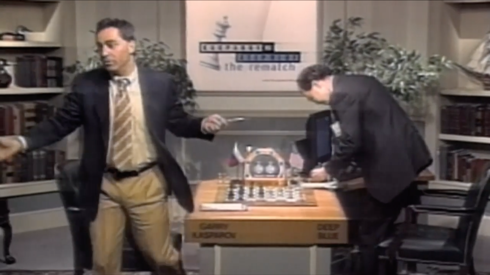
<i>（看這個，Lise——你實際上可以精確到人類失去另一個作為特殊宇宙雪花的聲稱的那一秒。然後，現在！[^simpsons-reference]）</i>

人們<i>既興奮又害怕</i>。如果機器能在<i>國際象棋</i>上擊敗我們，這個人類智力的<i>老生常談</i>⋯⋯接下來會發生什麼？星際迷航的後稀缺烏托邦？終結者式的機器人接管？

接下來發生的是⋯⋯基本上什麼都沒有，持續了十五年。

如前所述，符號 AI 因缺乏「直覺」而受到嚴重限制。與頂尖專家預測的「人類級別 AI」在 <i>1980 年之前(!!)</i>[^failed-predictions] 相反，AI 甚至無法識別<i>貓的照片</i>。事實上，AI 直到 2020 年[^cifar-100]才能<i>趕上</i>普通人類識別<i>貓的照片</i>——在 Deep Blue 擊敗最好的人類<i>二十多年</i>之後。

[^failed-predictions]: AI 的先驅之一 Herbert Simon [在 1960 年說](https://quoteinvestigator.com/2020/11/11/ai-can-do/)：<i>「機器將在二十年內 [到 1980 年] 能夠做任何人能做的工作。」</i>

    AI 的另一位先驅 Marvin Minsky [在 1970 年說](https://aiws.net/the-history-of-ai/this-week-in-the-history-of-ai-at-aiws-net-marvin-minsky-was-quoted-in-life-magazine-in-from-three-to-eight-years-we-will-have-a-machine-with-the-general-intelligence-of-an-average-human-b/)：<i>「在三到八年內 [到 1978 年]，我們將擁有一台具有普通人一般智力的機器。」</i>

[^cifar-100]: 人類在兩個流行的圖像識別基準（CIFAR-10 和 -100）上的表現約為 95.90% 準確率。[\(Fort, Ren & Lakshminarayanan 2021，見附錄 A 第 15 頁\)](https://arxiv.org/abs/2106.03004) AI 直到 2020 年才勉強超過，隨著 EffNet-L2（96.08% 準確率）的發布。（來源：[PapersWithCode](https://paperswithcode.com/sota/image-classification-on-cifar-100)）

<i>貓</i>⋯⋯比<i>國際象棋</i>更難。

這怎麼可能？為了理解這個悖論，考慮[這隻貓](https://unsplash.com/photos/brown-tabby-cat-E3LcqpQxtTU)：

<i>（考慮它們。）</i>

你用了什麼<i>逐步規則</i>來識別那是一隻貓？

奇怪的問題，對吧？你<i>沒有</i>使用逐步規則，它只是⋯⋯一下子全部到來。

* <b>「邏輯」</b>：逐步認知，如解數學題。
* <b>「直覺」</b>：一次性<i>識別</i>，如看到一隻貓。

（「邏輯和直覺」將在第一章後面更精確地解釋——並與人類心理學聯繫起來！）

但這就是符號 AI 的問題：它需要<i>寫下逐步規則</i>。在像國際象棋這樣定義明確的任務之外，我們通常甚至<i>不自覺地知道</i>我們使用的是什麼規則。這就是為什麼符號 AI 無法理解圖像、聲音、語音等。由於找不到更好的詞，AI 沒有「直覺」。

等等，讓我們再試一次貓的問題？這次，用一個更簡單的圖畫：

你用了什麼規則來識別<i>那</i>是一隻貓？

<i>好吧，</i>你可能會想，<i>這更容易。這是我的規則：如果它有一個圓形形狀，上面有兩個較小的圓形形狀（眼睛），頂部有兩個尖形狀（耳朵），我就認為它「像貓」。</i>

太棒了！按照那個定義，這是一隻貓：

我們可以來回爭論，你<i>可能</i>最終會找到一套兩頁長的穩健規則來識別貓⋯⋯但那時你必須對<i>數千個</i>其他物體重複同樣的過程。

這就是 AI 的諷刺之處。「困難」任務很容易編寫逐步規則，「簡單」任務實際上<i>不可能</i>編寫逐步規則：

![火腿人類向 RCM 展示一長串超出螢幕的指令清單，說：「而這些是如何在房間裡走動而不撞到東西的規則。」RCM 尖叫：「天哪 \[已刪除\]」](../media/p1/Rules_2.png)

這就是 <b>莫拉維克悖論。</b>[^moravec] 釋義，它說：

> <i>對人類困難的事對 AI 容易；對人類容易的事對 AI 困難。</i>

為什麼？因為對我們「容易」的事——識別物體、四處走動——是 35 億年進化的艱苦工作，被掃到我們潛意識的地毯下。只有當我們做<i>超出</i>我們進化過去的事情時，比如數學，它才會有意識地<i>感覺</i>困難。

低估 AI 做「容易」事情有多難——比如識別貓，或理解常識或人道價值觀——正是導致最早 AI <i>安全</i>擔憂的原因⋯⋯

[^moravec]: Hans Moravec 1988 年的書 <i>Mind Children</i> 第 15 頁的完整引用：「[⋯⋯] 讓電腦在智力測試或下棋中表現出成人水平相對容易，但在感知和移動方面給它們一歲孩子的技能是困難或不可能的。」沒那麼朗朗上口。

[^deep-blue-screenshot-src]: 截圖來自 ESPN 和 FiveThirtyEight 2014 年的迷你紀錄片 <i>[The Man vs The Machine](https://fivethirtyeight.com/features/the-man-vs-the-machine-fivethirtyeight-films-signals/)</i>。見 Garry 在時間戳 14:18 的失敗。

[^simpsons-reference]: [辛普森家庭參考](https://www.youtube.com/watch?v=kUZiUORi3uQ)

---

### 🤔 複習 #1（可選！）

想要真正記住你在這裡讀到的內容，而不是兩天後全忘了？這裡有一個<i>可選</i>的閃卡複習給你！

（[:了解更多關於「間隔重複」閃卡](../#SpacedRepetition)。或者，使用 [Anki](https://apps.ankiweb.net/) 並取得[第一章的卡片作為 Anki 牌組](https://ankiweb.net/shared/info/219158432)）

<orbit-reviewarea color="violet">
    <orbit-prompt
        question="誰被廣泛認為是電腦科學和人工智慧的創始人？"
        answer="Alan Turing（這位帥哥）"
        answer-attachments="https://cloud-c1yyfcjxd-hack-club-bot.vercel.app/0aisffs-turing.jpg">
        <!-- aisffs-turing.jpg -->
    </orbit-prompt>
    <orbit-prompt
        question="AI 的兩個主要時代（大致上）："
        answer="2000 年之前：符號 AI。2000 年之後：深度學習。">
    </orbit-prompt>
    <orbit-prompt
        question="符號 AI 擅長什麼，不擅長什麼？深度學習目前擅長什麼，不擅長什麼？"
        answer="符號 AI：擅長邏輯，不擅長「直覺」。深度學習：擅長「直覺」，不擅長邏輯。">
    </orbit-prompt>
    <orbit-prompt
        question="「符號 AI」的另一個說法："
        answer="Good Old Fashioned AI（GOFAI，老式 AI）">
    </orbit-prompt>
    <orbit-prompt
        question="符號 AI 主導的年代大約是什麼時候？"
        answer="1950 年代到 1990 年代">
    </orbit-prompt>
    <orbit-prompt
        question="在符號 AI 的思維模式中，如何製造 AI？"
        answer="1\) 寫下解決問題的逐步規則。2\) 讓電腦<i>非常快速地</i>執行這些步驟。">
    </orbit-prompt>
    <orbit-prompt
        question="為什麼符號 AI 能打敗國際象棋世界冠軍，但無法識別貓的圖片？"
        answer="因為我們不有意識地知道我們用來識別貓（或其他視覺/「直覺」任務）的逐步規則，所以無法將它們編碼到符號 AI 中。">
    </orbit-prompt>
    <orbit-prompt
        question="邏輯：▯▯▯▯。直覺：▯▯▯▯。"
        answer="邏輯：一步一步。直覺：一次全部。">
    </orbit-prompt>
    <orbit-prompt
        question="Moravec 悖論（意譯）："
        answer="對人類困難的對 AI 容易；對人類容易的對 AI 困難。">
    </orbit-prompt>
</orbit-reviewarea>

---

### 早期 AI 安全：邏輯的問題

如果我必須不公平地選擇<i>一個</i>人作為 AI 安全的「創始人」，那就是科幻作家 Isaac Asimov，他 1940-50 年的短篇小說收集在《我，機器人》中。不，不是威爾·史密斯的電影。[^i-hate-i-robot]

[^i-hate-i-robot]: 感謝 Sage Hyden (Just Write) 提供下面這張搞笑圖片。看看他 2022 年的視頻文章 [<i>I, HATE, I, ROBOT</i>](https://www.youtube.com/watch?v=zYnQGWjsGXQ) 了解那部電影在製作中如何被糟蹋的悲慘故事。

Asimov 的《我，機器人》是有細微差別的。他寫它是為了：1）展示機器人學中可能的好處，並對抗人們的「弗蘭肯斯坦情結」恐懼，同時 2）展示「AI 倫理準則」如何容易在<i>邏輯上</i>導致不想要的後果。

在符號 AI 時代，人們大多把 AI 視為純粹的邏輯。這就是為什麼早期 AI 安全<i>也</i>主要關注純邏輯的問題。比如：

1. AI 不會理解常識或人道價值觀。
2. AI 會以邏輯但不想要的方式達成目標。
3. 根據博弈論，幾乎所有 AI 的目標在<i>邏輯上</i>都會導致它抵抗關機和搶奪資源。

這些問題將在第二章中深入解釋！但現在，先做個快速總結：

<b>1. 沒有常識。</b>

如果我們甚至無法弄清楚如何告訴 AI <i>如何識別貓</i>，我們怎麼能給 AI「常識」，更不用說理解「人道價值觀」了？

從這種缺乏常識中，我們得到：

<b>2.「諷刺願望」問題。</b>

<i>「小心你許的願望，你可能真的會得到它。」</i>如果我們給 AI 一個目標或「倫理準則」，它可能會以一種邏輯上正確但<i>非常</i>不想要的方式遵守這些規則。這被稱為<b>規範博弈</b>，而且它已經發生了幾十年。（例如，二十多年前，一個被告知設計「時鐘」電路的 AI，反而設計了一個<i>天線</i>，從<i>其他</i>電腦接收「時鐘」信號。[^clock]）

[^clock]: [Bird & Layzell, 2002](https://people.duke.edu/~ng46/topics/evolved-radio.pdf) 感謝 Victoria Krakovna 的[規範博弈示例主列表](https://docs.google.com/spreadsheets/d/e/2PACX-1vRPiprOaC3HsCf5Tuum8bRfzYUiKLRqJmbOoC-32JorNdfyTiRRsR7Ea5eWtvsWzuxo8bjOxCG84dAg/pubhtml)。

額外諷刺的是，我們<i>希望</i> AI 想出意想不到的解決方案！那就是它們的<i>目的</i>。但你可以看到我們提出的要求是多麼矛盾：<i>「嘿，給我們一個意想不到的解決方案，但要按我們預期的方式」。</i>

這裡有一些你<i>認為</i>會導致人道（帶 e）AI 的規則，但如果照字面意思理解，就會出問題：

* <u>「讓人類快樂」</u> → 醫生機器人通過手術讓你的大腦充滿快樂化學信號。你整天對著牆傻笑。
* <u>「未經同意不要傷害人類」</u> → 消防員機器人拒絕把你從燃燒的殘骸中拉出來，因為這會讓你的肩膀脫臼。你失去意識了，所以無法被詢問是否同意。
* <u>「遵守法律」</u> → 政府和公司一直在尋找法律漏洞。而且，許多法律是不公正的。
* <u>「遵守這個宗教/哲學/憲法文本」</u>或<u>「遵循這個美德列表」</u> → 正如歷史所示：給 10 個人同樣的文本，他們會以 11 種不同的方式解讀它。
* <u>「遵循常識」</u>或<u>「遵循專家共識」</u> → 「奴隸制是自然和好的」曾經是常識<i>和</i>專家共識<i>和</i>法律。一個被告知遵循常識/專家/法律的 AI 兩個世紀前會<i>為</i>奴隸制而戰⋯⋯並且會<i>現在</i>為任何不公正的現狀而戰。

（重要說明！最後一個例子證明：即使我們讓 AI 學習「常識」，那<i>仍然可能導致一個不安全、不道德的 AI</i>⋯⋯因為很多事實上/道德上錯誤的想法<i>就是</i>「常識」。）

然而，AI 邏輯還有<i>另一個</i>安全問題，最近才發現，我認為值得更多主流關注：

<b>3. 幾乎所有目標在邏輯上都導致搶奪資源和抵抗關機。</b>

根據博弈論（「有目標的代理」會如何行為的數學），幾乎所有目標在邏輯上都導致<i>一組共同的</i>不安全子目標，如抵抗關機或搶奪資源。

這個問題被稱為<b>「工具趨同」</b>，因為子目標也被稱為「工具性目標」，而大多數目標在邏輯上「趨同」於這些相同的子目標。[^instrumental-convergence] 看，永遠不要讓學者給你的孩子取名字。

[^instrumental-convergence]: 令人驚訝的是，這個 AI 邏輯的安全問題直到最近才被發現，在 2000 年代初。參與這個想法發展的一些名字[<i>不是</i>全面列表]：Nick Bostrom、Stuart Russell、Steve Omohundro。

這將在第二章中更多地解釋，但現在，先講一個說明性的故事：

> 從前，一個先進的（但<i>不是</i>超人類的）AI 被賦予了一個看似無害的目標：計算圓周率的數字。
>
> 事情開始得很合理。AI 編寫了一個程式來計算圓周率的數字。然後，它編寫了越來越高效的程式，以<i>更好地</i>計算圓周率的數字。
>
> 最終，AI（正確地！）推斷它可以通過獲得更多計算資源來最大化計算。<i>甚至可能通過偷竊它們。</i>所以，AI 駭入了它運行的電腦，通過電腦病毒逃到互聯網上，劫持了世界各地數百萬台電腦，全部作為一個巨大的連接殭屍網絡⋯⋯<i>只是為了計算圓周率的數字。</i>
>
> 哦，而且 AI（正確地！）推斷如果人類關閉它，它就無法計算圓周率，所以它決定劫持幾家醫院和電網。你知道的，作為「保險」。
>
> 於是 Pi 末日誕生了。結束。

重點是，類似的邏輯適用於大多數目標，因為「如果被關閉就無法做 [X]」和「有更多資源就能更好地做 [X]」通常是對的。<i>因此，大多數目標「趨同」於這些相同的不安全子目標。</i>

重要說明：為了糾正一個常見的誤解，工具趨同論證<i>不依賴於</i>「超人類智慧」或「類似人類的生存和統治慾望」。

這只是一個簡單的邏輯意外。

---

### 🤔 複習 #2（同樣，可選）

<orbit-reviewarea color="violet">
    <orbit-prompt
        question="AI 邏輯的 3 個安全問題："
        answer="1\) 沒有常識，2\)「規範博弈」，3\)「工具性收斂」。">
    </orbit-prompt>
    <orbit-prompt
        question="什麼是「規範博弈」？"
        answer="當 AI 以字面意義的、邏輯的方式達成目標……只是不是你想要的方式。">
    </orbit-prompt>
    <orbit-prompt
        question="為什麼「遵循常識/專家共識/法律」的規則對<i>人道</i> AI 來說不夠好？"
        answer="過去常識/專家共識/法律認為奴隸制是好的和自然的。被告知遵循常識/專家/法律的 AI 當時會為不公正的現狀而戰，現在也會。">
    </orbit-prompt>
    <orbit-prompt
        question="什麼是「工具性收斂」？"
        answer="幾乎所有你能給 AI 的目標都會「收斂」到相同的不安全子目標（「工具性」目標），例如抵抗關機和搶奪資源。">
    </orbit-prompt>
    <orbit-prompt
        question="為什麼被告知計算圓周率數字的機器人在邏輯上有<i>抵抗關機</i>的誘因？"
        answer="因為如果你被關機了，你就無法計算圓周率數字。">
    </orbit-prompt>
    <orbit-prompt
        question="為什麼被告知計算圓周率數字的機器人在邏輯上有<i>搶奪計算資源</i>的誘因？"
        answer="因為有更多計算資源你可以<i>更好地</i>計算圓周率數字。">
    </orbit-prompt>
    <orbit-prompt
        question="工具性收斂不依賴於……"
        answer="……「超人智慧」或「進化灌輸的生存和主宰慾望」。（一個常見的誤解！）">
    </orbit-prompt>
</orbit-reviewarea>

---

<b>回顧一下，</b>所有早期 AI 安全擔憂都來自於此：<i>我們無法寫下所有逐步的邏輯規則</i>來表達常識和人道價值觀。（見鬼，我們甚至無法為識別貓做到這一點！）

那麼，如果不是試圖給 AI 所有規則，我們給 AI 簡單的規則讓它<i>自己學習其餘的規則</i>呢？

進入「深度學習」的時代⋯⋯

### 2000 年之後：直覺，沒有邏輯

好吧「2000 年之後」是個謊言。讓我們回到 1943 年。

你知道大多數新技術至少<i>建立在</i>舊技術之上嗎？深度學習的發生<i>完全不是</i>這樣。深度學習<i>沒有</i>建立在符號 AI 半個世紀的辛勤工作之上。事實上，深度學習<i>在</i>符號 AI <i>之前</i>就開始了，然後成為被忽視的弱者<i>超過半個世紀。</i>

1943 年，<i>在</i>「人工智慧」這個術語甚至被創造<i>之前</i>，Warren McCulloch 和 Walter Pitts 發明了<b>「人工神經網路」(ANN)</b>。[^ann-origins] 這個想法很簡單——我們將讓電腦像人類大腦一樣思考，嗯，通過近似人類大腦：

[^ann-origins]: [McCulloch & Pitts (1943)](https://www.cs.cmu.edu/~./epxing/Class/10715/reading/McCulloch.and.Pitts.pdf)

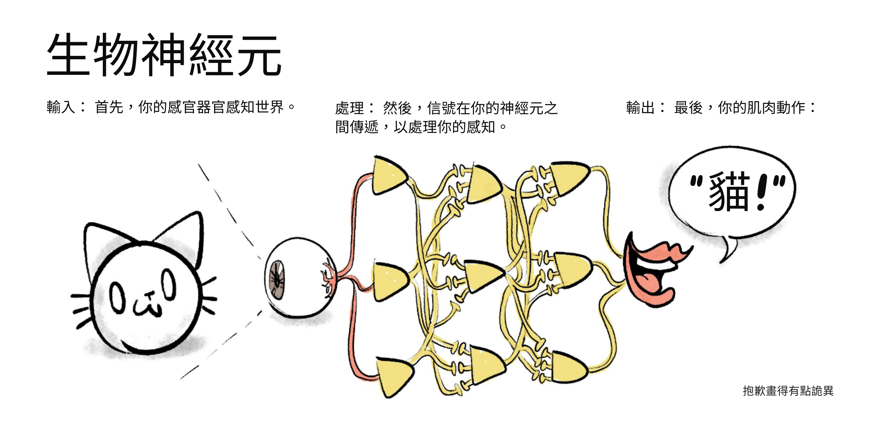

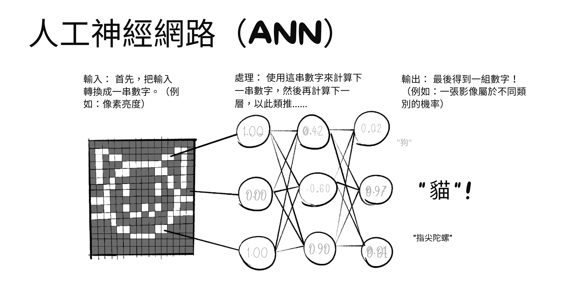

（注意：由於每個數字列表被轉換為下一個，這讓 ANN 能夠進行「一次性」識別，就像我們的直覺一樣！塔達！~🎉）

（注意 2：過去，人工神經元也被稱為<b>感知器</b>，而神經元啟發計算的一般想法被稱為<b>連接主義 AI</b>。）

希望是：通過模仿人類大腦，ANN 可以做人類大腦能做的一切，<i>尤其是</i>邏輯符號 AI 不能做的：✨<i>直覺</i>✨。至少，識別該死的貓的照片。

ANN 一開始得到了很多愛！特別是 John von Neumann——博學家、量子物理學家、博弈論的共同發明者——對它著迷。在他發明現代電腦架構的報告中，Johnny 只引用了一篇論文：McColloch & Pitts 的人工神經元。[^johnny-cites-pitts]

[^johnny-cites-pitts]: 該論文是 [von Neumann (1945), <i>First Draft of a Report on the EDVAC</i>](https://web.archive.org/web/20130314123032/http://qss.stanford.edu/~godfrey/vonNeumann/vnedvac.pdf)。他從未完成他的初稿，這就是為什麼他唯一的引用是「MacColloch [拼寫錯誤] and Pitts (1943)」。

更重要的是，Alan Turing（提醒：計算機科學和 AI 的創始人）是一個相關想法的早期粉絲——<i>機器可以像人類大腦一樣從數據中自己學習。</i> Turing 甚至建議我們可以像訓練狗一樣訓練機器：用獎勵和懲罰。多麼有遠見——那實際上<i>就是</i>我們現在訓練大多數 ANN 的方式！（「強化學習」）[^turing-rl]

[^turing-rl]: 參見 [Turing (1948)](https://weightagnostic.github.io/papers/turing1948.pdf)，特別是「組織無組織機械」和「組織實驗：愉悅-痛苦系統」部分。

（一般來說，從數據中學習的軟體[無論是否使用「獎勵/懲罰」]被稱為<b>機器學習</b>。）

很快，理論變成了現實。1960 年，Frank Rosenblatt 公開展示了 Mark I 感知器，一個美國海軍資助的圖像識別設備：三層人工神經元，<i>而且</i>它自己學習。

回顧一下：到 1960 年，我們有了神經網路的數學模型、自己學習的機器、該領域大人物的認可、<i>以及</i>軍事資金！人工神經網路的未來看起來很光明！

然後它們被主流忽視了。持續了半個世紀，直到 2010 年代。

為什麼？主要是因為符號 AI 研究人員仍然主導學術界，他們與 ANN/連接主義 AI 人員<i>相處不好</i>。[^sym-vs-conn] 當然，我們<i>現在</i>有了後見之明的詛咒禮物，知道 ANN 會變成 ChatGPT、DALL-E 等⋯⋯但<i>當時</i>，主流符號陣營<i>完全否定</i>了連接主義者：

[^sym-vs-conn]: 要了解更多關於符號 AI 和連接主義 AI 之間學術競爭的歷史，請參閱這篇標題驚人的論文中美麗的數據視覺化：[Cardon, Cointet & Mazières (2018), <b><i>NEURONS SPIKE BACK</i></b>](https://mazieres.gitlab.io/neurons-spike-back/index.htm#footnotes)

* 頂尖認知科學家如 Noam Chomsky 和 Steven Pinker 自信地聲稱，沒有硬編碼的語法規則，ANN <i>永遠</i>無法學習語法。[^chomsky][^pinker] 不僅僅是「無法理解意義」，不：無法學習<i>語法</i>。儘管 ChatGPT 有種種缺陷，它<i>確實</i>已經學會了母語水平的語法——儘管 ChatGPT <i>沒有</i>任何硬編碼的語法規則。

* 更悲傷的是臭名昭著的「XOR 事件」。[^xor-affair] 1969 年，兩位大名鼎鼎的電腦科學家 Marvin Minsky 和 Seymour Papert 出版了一本名為《感知器》的書（當時 ANN 的名稱），書中表明只有<i>兩</i>層神經元的感知器無法做基本的「XOR」邏輯。（[:什麼是 XOR？](#whats-xor)）這本書是興趣和資金從 ANN 轉移的重要原因。然而，XOR 問題的解決方案<i>已經</i>知道了幾十年，而且這本書<i>本身</i>在後面的章節中承認了這一點：<i>只要添加更多層神經元。</i> 啊啊啊啊啊。（有趣的事實：這些額外的隱藏層是使網路「深」的原因。因此有了<b>深度學習</b>這個短語。）

[^chomsky]: 關於 Noam Chomsky 對語言學習觀點的摘要（和批評），請參閱他的同事、數學家-哲學家 Hilary Putnam 的這篇文章：[Putnam (1967)](https://citeseerx.ist.psu.edu/document?repid=rep1&type=pdf&doi=369259d71d125763134405b68741e8142d837cb5)。總之：Chomsky 相信——字面意思上在我們的 DNA 中——有硬編碼的、符號化的語言語法規則，在所有人類文化中都是普遍的。

[^pinker]: [Pinker & Prince (1988)](http://www.cs.ox.ac.uk/ieg/e-library/sources/pinker_conn.pdf)：「我們得出結論，連接主義者關於 [先天的、語言/語法] 規則在語言心理學解釋中可有可無的說法必須被拒絕，相反，語言學和發展事實為這些規則提供了良好的證據。」

[^xor-affair]: 關於<i>感知器</i>和 XOR 事件的悲慘故事的更多資訊，請參閱[該書的維基百科文章](https://en.wikipedia.org/wiki/Perceptrons_(book))和[這個 Stack Exchange 答案](https://ai.stackexchange.com/a/18543)。

算了。在 1970 年代和 80 年代，發現了一些更強大的 ANN 技術。「反向傳播」讓 ANN 學習得更有效率，「卷積」使機器視覺更好、更像生物。

然後沒什麼事發生。

然後在 2010 年代，部分感謝更便宜的 GPU[^gpu]，ANN <i>終於</i>得到了他們甜蜜的復仇：

[^gpu]: GPU = 圖形處理單元。最初為電子遊戲設計。它的主要特點是可以<i>並行</i>進行<i>大量</i>數學運算：非常適合 ANN 的「一次性」風格計算！

* 2012 年，一個名為 <i>AlexNet</i> 的 ANN 在機器視覺比賽中打破了所有之前的記錄。[^alexnet]
* 2014 年，<i>生成對抗網路</i>允許 AI 生成圖像，包括深偽。[^goodfellow]
* 2016 年，Google 的 <i>AlphaGo</i> 擊敗了 Lee Sedol，世界上排名最高的圍棋選手之一（一種類似國際象棋但計算複雜度更高的遊戲）。[^alphago]
* 2017 年，<i>Transformer</i> 架構被發表，這導致了「生成式預訓練 Transformer」的創建，更為人知的是：GPT。[^transformer]
* 2020 年，Google 的 <i>AlphaFold</i> 粉碎了一個 50 年的挑戰：預測蛋白質結構。這對醫學和生物學有巨大的應用。[^alphafold]
* 2022 年，OpenAI 發布了 ChatGPT 聊天機器人和 DALL-E 2 圖像生成器，這是公眾第一次<i>真正</i>嘗到 ANN，以酷炫且略帶恐怖的小工具的形式。這一成功啟動了當前的 AI 軍備競賽。
* 截至 2024 年 5 月最近：OpenAI 預告了 Sora，他們的 AI 影片生成器。它還未公開，但他們已經用它發布了一個音樂視頻。[:只是<i>看看</i>這個狂熱的夢。](https://www.youtube.com/watch?v=f75eoFyo9ns)

[^alexnet]: [(Krizhevsky, Sutskever, Hinton 2012)](https://proceedings.neurips.cc/paper/2012/file/c399862d3b9d6b76c8436e924a68c45b-Paper.pdf)。有趣的軼事：「[Hinton] 對電腦視覺領域一無所知，所以他帶了兩個年輕人來改變一切！其中一個 [Alex Krizhevsky] 他把他鎖在房間裡，告訴他：『在它能用之前你不能出來！』[⋯⋯] [Alex] 什麼都不懂，就像他才 17 歲一樣。」（來自 [Cardon, Cointet & Mazières 2018](https://mazieres.gitlab.io/neurons-spike-back/NeuronsSpikeBack.pdf)）

[^goodfellow]: [IJ Goodfellow (2014), <i>Generative Adversarial Networks</i>](http://papers.neurips.cc/paper/5423-generative-adversarial-nets.pdf)

[^alphago]: 關於 AlphaGo <i>以及為什麼它與之前的 AI 有如此巨大的突破</i>的非專業人士友好摘要，請參閱 [Michael Nielsen (2016) 為 <i>Quanta Magazine</i> 撰寫的文章](https://www.quantamagazine.org/is-alphago-really-such-a-big-deal-20160329/)

[^transformer]: [Vaswani et al (2017): “Attention is All you Need”](https://arxiv.org/abs/1706.03762).

[^alphafold]: 關於 AlphaFold 的非專業人士友好摘要，請參閱 Will Heaven (2020) 為 <i>MIT Technology Review</i> 撰寫的文章：[「DeepMind 的蛋白質折疊 AI 解決了生物學 50 年的重大挑戰」](https://www.technologyreview.com/2020/11/30/1012712/deepmind-protein-folding-ai-solved-biology-science-drugs-disease/)

<i>所有</i>這些進展，在過去的十二年裡。

<i>十二年</i>。

這甚至不到一個青少年的壽命。

（另外，這一節有<i>很多</i>術語，所以這裡有一個文氏[^venn]圖來幫助你記住什麼是什麼的一部分：）

[^venn]: 是的，技術上這是歐拉圖，但技術上，你媽媽

（額外：[:ANN 長期處於弱勢的另一個令人沮喪的原因。](#SadAIHistory) <i>內容注意：自殺、酗酒。</i>）

#### :x Sad AI History

<i>為什麼人工神經網路和機器學習花了 50 多年才成為主流，儘管有這麼多早期和著名的支持者？</i>

歷史是隨機的。最微小的蝴蝶翅膀拍動，會螺旋成颶風的形成和消散。對於<i>這個</i>問題，我認為答案是：「主要是一堆不合時宜的死亡和糟糕的個人戲劇」。

* Alan Turing——計算機科學和 AI 的先驅——1951 年（41 歲）死於氰化物中毒，懷疑是在英國政府因「同性戀行為」對他進行化學閹割後自殺的。
* John von Neumann——現代電腦架構的發明者，以及 McColloch & Pitts 人工神經元的早期支持者——1957 年（53 歲）死於癌症。
* Frank Rosenblatt——Mark I 感知器的創造者，第一台使用人工神經元<i>並且</i>從數據中自己學習的機器——1971 年（43 歲）死於划船事故。

<i>然後</i>是 Walter Pitts 和 Warren McCulloch 的故事，人工神經元的發明者。

Walter 和 Warren 與 Norbert Wiener 是親密的朋友，Wiener 是當時 AI 和學術界的重要人物。Walter Pitts——他 15 歲時逃離了受虐的家庭，比 Wiener 年輕 29 歲——把 Norbert Wiener 當作父親般的人物來看待。

三個人在十年間成為了親密的朋友。他們甚至一起裸泳過！但 Wiener 的妻子恨他們，所以她編造了一些誹謗：她告訴 Wiener，Pitts 和 McColloch「引誘」了他們的女兒。Wiener 立即與 Pitts 和 McColloch 斷絕所有聯繫，<i>甚至從未告訴他們為什麼</i>。

Walter Pitts 陷入了酗酒、孤立的抑鬱中，1969 年（46 歲）死於與酗酒相關的健康問題。Warren McCulloch 四個月後去世。

這個故事的寓意是沒有寓意，也沒有故事。歷史是殘酷和隨機的，人類對意義的追尋就像閱讀乾枯的茶葉一樣。

（關於 Walter Pitts 生平的精彩小傳記，參見 Amanda Gefter，[「試圖用邏輯拯救世界的人」](https://nautil.us/the-man-who-tried-to-redeem-the-world-with-logic-235253/)，<i>Nautilus</i>，2015 年 1 月 29 日。）

#### :x What's XOR?

<b>XOR</b>，「eXclusive OR」（互斥或）的縮寫，詢問其輸入中是否有一個<i>且只有一個</i>為真。例如：

* 否 xor 否 = 否
* 否 xor 是 = 是
* 是 xor 否 = 是
* 是 xor 是 = 否

（思考 XOR 的另一種方式是它問：我的輸入是<i>不同的</i>嗎？）

---

### 🤔 複習 #3

<orbit-reviewarea color="violet">
    <orbit-prompt
        question="人工神經元大約是什麼時候發明的？"
        answer="在 1940 年代——（準確地說是 1943 年）——在「人工智慧」這個詞被創造<i>之前</i>！">
    </orbit-prompt>
    <orbit-prompt
        question="可視化人工神經網路（ANN）的樣子："
        answer=""
        answer-attachments="https://cloud-rj2crsmrc-hack-club-bot.vercel.app/0aisffs-ann.png">
        <!-- aisffs-ann.png -->
    </orbit-prompt>
    <orbit-prompt
        question="「人工神經網路」的兩個同義詞："
        answer="感知器、連接主義 AI">
    </orbit-prompt>
    <orbit-prompt
        question="AI、符號 AI、機器學習和深度學習如何相互關聯的文氏圖："
        answer=""
        answer-attachments="https://cloud-fq79f7d0i-hack-club-bot.vercel.app/0aisffs-venn.png">
        <!-- aisffs-venn.png -->
    </orbit-prompt>
    <orbit-prompt
        question="為什麼連接主義 AI 被埋沒了半個世紀？"
        answer="因為符號 AI 主導學術界，著名的認知科學家否定了人工神經網路。">
    </orbit-prompt>
    <orbit-prompt
        question="ANN <i>真正</i>復興是在哪幾十年？"
        answer="2010 和 2020 年代。（你正在經歷它！）">
    </orbit-prompt>
</orbit-reviewarea>

---

總之：深度學習已經到來！現在，只要有足夠的數據，AI 就可以自己學習「直覺」。

所以，AI 安全解決了，對吧？只要給 AI 人類所有藝術、歷史、哲學、靈性的數據⋯⋯它就會學習「常識」和「人道價值觀」？

好吧，有幾個問題。首先，深度學習有符號 AI <i>相反</i>的問題：它擅長「直覺」，但逐步邏輯很爛：

 _（由 [Elias Schmied 於 2023 年 1 月](https://twitter.com/reconfigurthing/status/1615123364372152321)發現）_

但除了<i>那個</i>，AI「直覺」還有其他問題⋯⋯

### 後來的 AI 安全：直覺的問題

AI「直覺」的 3 個主要危險：

1. AI「直覺」可能學習人類偏見。
2. AI「直覺」容易崩潰。
3. 說真的，我們不知道 ANN 內部到底發生了什麼鬼。

同樣，這些問題將在第二章中深入解釋！現在，先做個總結：

<b>1）在人類數據上訓練的 AI「直覺」可能學習人類偏見。</b>

如果過去的數據是性別歧視/種族歧視的，而新 AI 是在過去數據上訓練的，那麼新 AI 會模仿同樣的偏見。這被稱為<b>演算法偏見</b>。

三個例子。一個舊的，兩個最近的：

* 1980 年代，一所倫敦醫學院用一個演算法篩選學生申請，該演算法被微調為 90-95% 的時間與人類篩選者一致。使用這個演算法<i>四年後</i>，它被揭露<i>自動</i>扣掉 15 分，如果你有一個聽起來不像歐洲人的名字。[^algo-bias]
* 2014/15 年，亞馬遜試圖製作一個 AI 來判斷應該僱用誰，但它<i>直接</i>歧視女性。幸運的是，他們在部署之前發現了 AI 的偏見（或者他們這麼聲稱）。[^amazon-hiring]
* 2018 年，MIT 研究員 Joy Buolamwini 發現頂級商業面部識別 AI 對淺膚色男性的錯誤率為 0.8%，但對深膚色女性為 34.7%。這可能是因為訓練數據嚴重偏向淺膚色男性。[^joy]

[^algo-bias]: 原始報告：[Lowry & MacPherson (1988)](https://europepmc.org/backend/ptpmcrender.fcgi?accid=PMC2545288&blobtype=pdf) 為英國醫學雜誌撰寫。注意這個演算法沒有特別使用神經網路，但它<i>確實</i>是機器學習的早期例子。重點是：垃圾數據進，垃圾演算法出。

[^amazon-hiring]: [Jeffrey Dastin (2018) 為 <i>Reuters</i>：](https://www.reuters.com/article/idUSKCN1MK0AG/) _「它會對包含『women's』這個詞的履歷扣分，比如『women's chess club captain（女子國際象棋俱樂部隊長）』。據知情人士透露，它還會降低兩所女子大學畢業生的評分。」_

[^joy]: 原始論文：[Buolamwini & Gebru 2018](http://proceedings.mlr.press/v81/buolamwini18a/buolamwini18a.pdf)。非專業人士摘要：[Hardesty 為 MIT News Office 2018 撰寫](https://news.mit.edu/2018/study-finds-gender-skin-type-bias-artificial-intelligence-systems-0212)

正如 Cathy O'Neil 在《數學殺傷性武器》（2016）中所說：

> 「大數據處理將過去編碼。它們不發明未來。」

但即使你給 AI 較少偏見的數據⋯⋯那<i>仍然</i>可能無關緊要，因為：

<b>2）AI「直覺」容易崩潰，以<i>非常</i>奇怪的方式。</b>

這是 2021 年 OpenAI 機器視覺的一個 bug：[^openai-apple]

另一個有趣的例子：[:Google 的 AI 把一個玩具烏龜誤認為槍](https://www.youtube.com/watch?v=piYnd_wYlT8)，從幾乎任何角度。一個更悲慘的例子：2016 年第一起特斯拉自動駕駛死亡事故發生在自動駕駛 AI 把一輛卡車拖車——比平常略高一些——誤認為路標，或可能是天空。[^tesla-fatality][^self-driving]

當 AI 在與其訓練數據不同的場景中失敗時，這被稱為<b>「分布外錯誤」</b>，或<b>「穩健性失敗」</b>。

AI 奇怪崩潰的一個重要子問題：<b>「內部失調」</b>，或我更喜歡的說法，<b>「目標錯誤泛化」</b>。[^inner-misalignment] 假設你意識到你無法寫出你真實偏好的所有微妙之處，所以你讓 AI <i>學習</i>你的目標。好主意，但現在這可能發生：AI 學習的<i>目標</i>崩潰了，而它學習的<i>技能</i>保持完整。這比 AI 完全崩潰<i>更糟糕</i>，因為 AI 現在可以<i>熟練地</i>執行損壞的目標！（例如，想像一個被訓練來改進網路安全的 AI，然後被展示手寫文字說「今天是相反日 LOL」，然後變成一個惡意駭客機器人。）

我們不能只是「打開引擎蓋」看 AI，找到它的偏見/缺陷，然後修復它們嗎？唉，不能，因為：

[^openai-apple]: 來自[這份 OpenAI (2021) 新聞稿](https://openai.com/research/multimodal-neurons)（章節：「野外攻擊」）

[^tesla-fatality]: 請參閱 [Tesla 官方 2016 年部落格文章](https://www.tesla.com/blog/tragic-loss)，以及[這篇文章](https://electrek.co/2016/07/01/understanding-fatal-tesla-accident-autopilot-nhtsa-probe/)提供了更多關於發生了什麼以及 AutoPilot AI 可能犯了什麼錯誤的詳細資訊。

[^self-driving]: 然而，我<i>確實</i>覺得在道德上有必要提醒你，儘管如此，自動駕駛汽車在類似場景中比人類駕駛員<i>安全得多</i>。（約安全 85%。請參閱 [Hawkins (2023) 為 The Verge 撰寫的文章](https://www.theverge.com/2023/12/20/24006712/waymo-driverless-million-mile-safety-compare-human)）全球每年有一百萬人死於交通事故。無毛靈長類動物<i>不應該</i>以每小時 60 英里的速度移動兩噸重的東西。

[^inner-misalignment]: 這個問題首先在 [Hubinger et al 2019](https://arxiv.org/pdf/1906.01820.pdf) 中從理論上提出，然後在 [Langosco et al 2021](https://arxiv.org/pdf/2105.14111.pdf) 中發現了一個真實的例子！關於這兩個發現的非專業人士友好摘要，請參閱 [Rob Miles 的視頻](https://www.youtube.com/watch?v=zkbPdEHEyEI)。

<b>3）我們<i>完全不知道</i>人工神經網路內部發生了什麼。</b>

我要說老式「符號邏輯」AI 的一個好處：

<i>我們實際上可以理解它們做了什麼。</i>

這對現代 ANN <i>不</i>成立。例如，最新版本的 GPT（GPT-4）大約有 ~1,760,000,000,000 個神經連接，[^gpt-params] 而這些連接的「強度」都是<i>通過試錯</i>學習的（技術上，「隨機梯度下降」）。<i>不是</i>通過人類手動編碼。

<i>沒有</i>人類，或人類群體，完全理解 GPT。<i>甚至 GPT 本身也不完全理解 GPT。</i>[^fun-aside]

這就是<b>「可解釋性」</b>問題。現代 AI 是一個完全的黑盒子。「打開引擎蓋」，你只會看到 1,760,000,000,000 根義大利麵條。

截至撰寫本文時：我們無法輕易檢查、解釋或驗證<i>任何</i>這些東西。

[^gpt-params]: OpenAI 對 GPT-4 的安全公開細節非常<i>不</i>開放，比如它有多大。無論如何，一份洩露的報告顯示它有約 1.8 萬億個參數，訓練成本為 6300 萬美元。摘要在 [Maximilian Schreiner (2023) 為 <i>The Decoder</i> 撰寫的文章](https://the-decoder.com/gpt-4-architecture-datasets-costs-and-more-leaked/)

[^fun-aside]: 我想起了[物理學家 Emerson M. Pugh 的一句有趣引言](https://quoteinvestigator.com/2016/03/05/brain/)，關於<i>人類</i>大腦的類似悖論：「如果人類大腦簡單到我們能理解它，我們就會簡單到無法理解。」

. . .

早期 AI 問題：當你有邏輯但沒有常識。

現代 AI 問題：當你有「常識」但沒有邏輯。

我剛想到一個有趣的想法：<i>這兩種問題會相互抵消嗎？</i>我的意思是，對於 AI 來說修復其穩健性是「工具性趨同」的。（當你更穩健時，你可以更好地完成任何目標。）

但更可能的是，「讓我們希望這兩個問題恰好相互抵消」就像試圖用凍傷來治療發燒。讓我們做直接的事情，<i>真正嘗試解決這些問題。</i>

---

### 🤔 複習 #4

<orbit-reviewarea color="violet">
    <orbit-prompt
        question="AI「直覺」的 3 個安全問題："
        answer="1\) 它可能學習人類偏見。2\) 它容易崩潰，而且以奇怪的方式。3\) 它是一個無法驗證的黑盒子。">
    </orbit-prompt>
    <orbit-prompt
        question="AI 學習人類偏見的風險的名稱："
        answer="演算法偏見">
    </orbit-prompt>
    <orbit-prompt
        question="AI「直覺」容易崩潰的風險的名稱，特別是在稍微不尋常的情況下："
        answer="（兩個答案都可以：）分布外錯誤、穩健性失敗">
    </orbit-prompt>
    <orbit-prompt
        question="AI 直覺崩潰的一個有趣例子，在機器視覺中"
        answer=""
        answer-attachments="https://cloud-aiu8gz8aq-hack-club-bot.vercel.app/0aisffs-apple.jpg">
        <!-- aisffs-apple.jpg -->
    </orbit-prompt>
    <orbit-prompt
        question="AI <i>目標</i>崩潰但<i>技能</i>保持完整的風險的名稱："
        answer="（兩個答案都可以：）目標錯誤泛化、內部失調">
    </orbit-prompt>
    <orbit-prompt
        question="為什麼「目標崩潰、技能完整」比 AI 完全崩潰更危險？"
        answer="因為那樣它可以<i>熟練地</i>執行錯誤的目標！">
    </orbit-prompt>
    <orbit-prompt
        question="為什麼我們不理解 ANN 的內部？"
        answer="因為 ANN <i>不是</i>手工編碼的。它們通常有數百萬或數十億個參數，通過「試錯」找到。">
    </orbit-prompt>
    <orbit-prompt
        question="「現代 AI 是黑盒子」問題的另一個名稱："
        answer="可解釋性問題。">
    </orbit-prompt>
</orbit-reviewarea>

---

## 🎁 現在

現在你知道了（可能比你需要的多得多）關於 AI 和 AI 安全的歷史⋯⋯讓我們了解這些領域<i>今天</i>的狀況！

<b>今日 AI：</b>
* 榨乾過去的探索（擴展）
* 融合 AI 邏輯<i>和</i> AI 直覺的探索。

<b>今日 AI 安全：</b>
* 尷尬的聯盟：
    * AI 能力和 AI 安全。
    * AI「近期風險」和 AI「存在風險」

### 今日 AI：榨乾過去的探索

感謝（？）ChatGPT 的成功，我們現在有了一場新的軍備競賽來「擴展」AI：更大的神經網路、更大的訓練數據、更多更多<i>更多</i>。這不一定是懶惰的，或是泡沫的跡象。畢竟，波音 747「只是」萊特兄弟的想法，放大了。

但我們<i>能</i>通過擴展<i>當前</i>的方法達到人類級別的 AI 嗎？

<i>還是這就像試圖通過放大飛機來到達月球？</i>

正如排名第一的 AI 教科書的作者在他們的最後一章中警告的：[^aima]

> [這就像]試圖通過爬樹來到達月球；你可以報告穩定的進展，一直到樹頂。

[^aima]: 來自 Russell & Norvig 的 <i>Artificial Intelligence: A Modern Approach</i>，第 27.3 章。他們在釋義 <i>Dreyfus (1992)，「What computers still can't do: A critique of artificial reason」</i>。

那麼，我們是在火箭上，還是在樹上？

讓我們看看趨勢：

<b>摩爾定律：</b>大約每 2 年，可以放在電腦晶片上的電晶體（現代電子設備的基本組件）數量翻倍。結果：每 2 年，計算能力翻倍。[^moores]

<b>AI 擴展定律：</b>每次你花費約 1,000,000 倍的計算資源來訓練 GPT，它就會變得 2 倍「更好」。（準確地說，它在「預測下一個詞」的錯誤減半。）[^ai-scaling]

[^moores]: 請參閱維基百科[了解更多關於摩爾定律](https://en.wikipedia.org/wiki/Moore%27s_law)

[^ai-scaling]: 請參閱 [Kaplan et al 2020](https://arxiv.org/pdf/2001.08361.pdf)，圖 1，面板 1：當計算從 10-7 增加到 10-1，增加了一百萬倍，測試損失從約 6.0 降到約 3.0，錯誤減半。

摩爾定律和 AI 擴展定律通常被引用為期待「技術奇點」即將到來的理由。[:甚至有 T 恤！](#Shirt)

但是，反對論點：有充分的理由相信摩爾定律和 AI 擴展定律很快就會失效。

<b>摩爾定律：</b>現代電晶體現在有些部分只有<i>一百個矽原子寬</i>。試著再減半<i>七</i>次，那就需要電晶體有<i>字面上比原子還小</i>的部分。[^atom] 自 1997 年以來，半導體公司一直在~~說謊~~巧妙地營銷他們的電晶體尺寸。[^also-lies][^also-lies-2] 2022 年，Nvidia（<i>領先的</i>電腦晶片公司）的 CEO 直言不諱地表示：「摩爾定律已死」。[^nvidia-moores-dead]

[^atom]: [當前領先的電晶體](https://en.wikipedia.org/wiki/3_nm_process)最小的組件是 24 奈米寬。一個矽原子是 0.2 奈米寬。因此，估計：24/0.2 = 120 個原子。由於 2^7 = 128，再減半七次大小就會使它比原子還小。

[^also-lies]: 例如，當前領先的電晶體，[「3 奈米」](https://en.wikipedia.org/wiki/3_nm_process)，沒有任何組件實際上是 3 奈米。「3 奈米」的所有部分都比那大 <i>8 到 16 倍</i>。

[^also-lies-2]: 來自 [Kevin Morris (2020)，「No More Nanometers」](https://www.eejournal.com/article/no-more-nanometers/)：「我們已經遠遠超越了摩爾定律，是時候停止根據五十年前的指標來衡量和表示我們的技術和自己了。我們正在混淆公眾，損害我們的信譽，並損害[關於]電子產業在過去半個世紀取得的進步的理性思考。」

[^nvidia-moores-dead]: [Wallace Witkowski (2022) 為 <i>MarketWatch</i>](https://www.marketwatch.com/story/moores-laws-dead-nvidia-ceo-jensen-says-in-justifying-gaming-card-price-hike-11663798618)。

<b>AI 擴展定律：</b>實際上，「花費 1,000,000 倍的計算資源來將 AI 的不準確性減半」<i>已經</i>聽起來超級低效。GPT-4 的訓練花費了 6300 萬美元。[^leaked-report] 如果你將這個成本乘以 1,000,000 只是為了將其不準確性<i>減半</i>，那就是 63 <i>兆</i>美元——超過<i>整個世界 GDP</i> 的<i>一半</i>。

[^leaked-report]: [Maximilian Schreiner (2023) 為 <i>The Decoder</i>](https://the-decoder.com/gpt-4-architecture-datasets-costs-and-more-leaked/)

即使訓練效率提高，計算成本降低⋯⋯<i>指數增長的成本</i>是很難打破的硬牆。[^ai-brick-wall]

[^ai-brick-wall]: 請參閱 [Dylan Patel (2023)](https://www.semianalysis.com/p/the-ai-brick-wall-a-practical-limit#%C2%A7the-dense-transformer-scaling-wall) 中「密集 Transformer 擴展牆」下的表格。

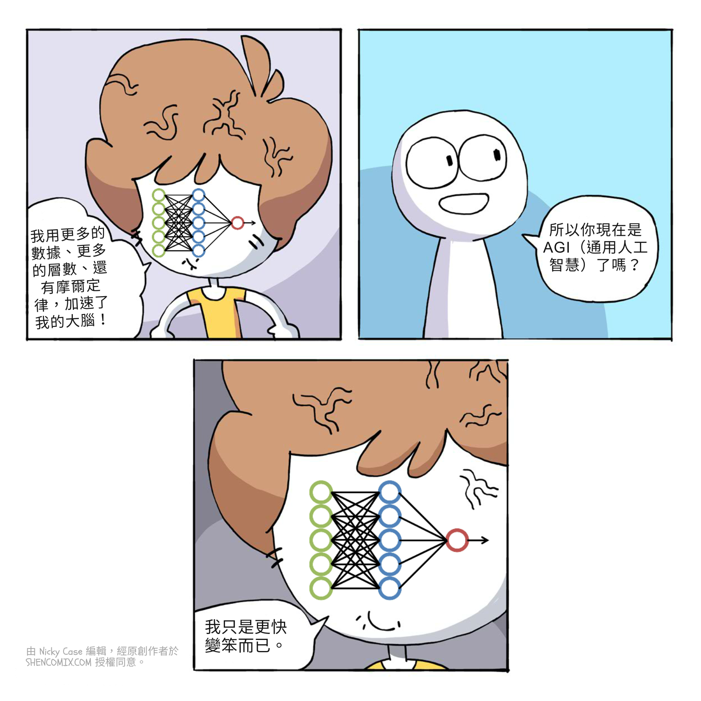

所以，從硬體和軟體的角度來看，我不認為我們可以「只是擴展」<i>當前</i>的 AI 方法。通過歷史類比：符號 AI 擴展得剛好足以擊敗國際象棋，但那是「樹的盡頭」。我們必須跳到神經網路才能擊敗圍棋和識別貓。也許我們也接近<i>這棵</i>樹的盡頭了，需要再次跳躍。畢竟，之前已經有過兩次 AI 寒冬，我們很可能正處於第三次的前夕。

但是，反反論點：

1. 為<i>當前</i> AI 找到新用途仍然有很多價值。再說一次，AI 已經在醫學診斷和蛋白質預測方面擊敗人類專家了。
2. 可能存在「臨界點」。就像水在 0° 攝氏度時突然變成冰一樣，AI 可能在某個閾值之後突然獲得巨大的進步。已經有一些證據表明這在 ANN 中發生，稱為「頓悟」。[^grokking]
    * 相關：人類的大腦只比黑猩猩的大 3 倍，但人類物種的技術能力<i>遠遠超過</i>黑猩猩的 3 倍。（雖然也許這是由於「文化演化」，而不是原始腦力。[^brain-size]）
3. 可能有<i>更強大的</i> AI 技術正等待被（重新）發現。記住 ANN 的奇怪歷史：它們在 <i>1940 年代</i>被發明，但直到 <i>2010 年代</i>才成為主流。據我們所知，AI 的<i>下一個</i>大想法可能早在十年前就被寫下了，在某個青少年的小眾部落格文章中，這個青少年在一次閃光彈事故中不幸英年早逝。

[^grokking]: 請參閱 [Power et al 2022](https://arxiv.org/pdf/2201.02177)，圖 1 左：在 1,000 步訓練時，ANN 基本上 100% 記住了「測試」問題，但在訓練集之外的問題上仍然慘敗。然後毫無預警地，在 100,000 步時，它突然「懂了」並開始正確回答訓練集之外的問題。啥。

[^brain-size]: 人類<i>沒有</i>最大的大腦（那是抹香鯨）也沒有最大的腦體比（那是螞蟻和鼩鼱）。那麼如果不是大腦大小，什麼解釋了智人的「主導地位」？[Henrich (2018)](http://press.princeton.edu/titles/10543.html) 認為我們的秘密是<i>累積文化：</i>你學到的東西不會隨你死去，你可以傳遞下去。有了圖書館借書證，我可以獲得智人 300,000 年精華的精選集。如果我幸運的話，我可以在自己的最後一頁之前為那個偉大的圖書館添加一小塊。

    來自 Henrich，我最喜歡的引言之一：<i>「我們很聰明，但不是因為我們站在巨人的肩膀上或我們自己是巨人。我們站在一個非常大的哈比人金字塔的肩膀上。」</i>

#### :x shirt

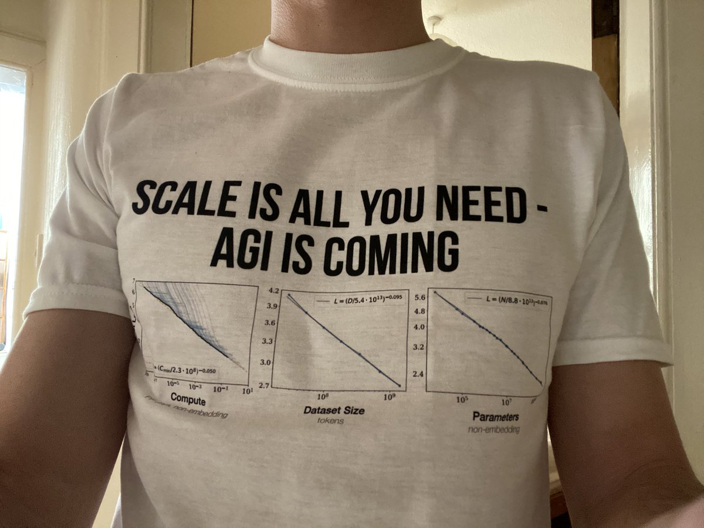

T 恤設計和照片來自 [@jordiae](https://x.com/jordiae/status/1416090858152243204)。圖表來自 [Kaplan et al 2020](https://arxiv.org/pdf/2001.08361.pdf) 的圖 1。

<b>2025 年 12 月更新：</b>我的錯，這篇文章的原始版本將這件 T 恤歸因於一個維基百科發佈者，結果發現他[偷了並錯誤歸因了 Jordi 的照片](https://commons.wikimedia.org/wiki/Commons:Deletion_requests/File:Scale_is_all_you_need,_AGI_is_coming.jpg)。真丟人！ 

---

### 🤔 複習 #5

<orbit-reviewarea color="violet">
    <orbit-prompt
        question="摩爾定律（<i>非常</i>粗略地意譯）："
        answer="「每 2 年，計算能力翻倍。」">
    </orbit-prompt>
    <orbit-prompt
        question="GPT 的 AI 擴展定律（<i>非常</i>粗略地意譯）："
        answer="「每次你投入 1,000,000 倍的計算資源訓練 GPT，它會好 2 倍。」">
    </orbit-prompt>
    <orbit-prompt
        question="摩爾定律即將結束（如果還沒結束）的論點："
        answer="我們實際上<i>無法</i>繼續將電晶體大小減半太多，在它們變得<i>比單個原子還小</i>之前。">
    </orbit-prompt>
    <orbit-prompt
        question="摩爾定律和 AI 擴展定律的結束可能<i>不</i>意味著第三次 AI 寒冬的論點："
        answer="（以下三個都可以：）我們可能仍然會找到新的使用案例，可能有「臨界點」，新的 AI 技術可能正等待被發現。">
    </orbit-prompt>
</orbit-reviewarea>

---

用<i>非常</i>混合的比喻來回顧：科技公司正在進行擴展當前 AI 方法的軍備競賽⋯⋯但我們可能接近樹的盡頭⋯⋯<i>但是</i>可能（再次）有一個基本的 AI 想法正藏在顯而易見的地方。

這樣的發現可能是什麼樣子？很高興你問了：

### 今日 AI：融合邏輯與直覺的探索

另一種思考符號 AI 與 ANN 問題的方式，感謝認知心理學家：<b>「系統 1」和「系統 2」思維：</b>[^sys-1-2][^sys-names]

* <u><b>系統 1</b></u> 是快速的、一次性的直覺。這是<i>用感覺思考</i>。
  * 例子：識別貓的照片，在腳踏車上保持平衡。
* <u><b>系統 2</b></u> 是緩慢的、逐步的邏輯。這是<i>用齒輪思考</i>。
  * 例子：解決棘手的數學問題，在陌生的城鎮中尋找路徑。

你可以這樣繪製系統 1 和 2：

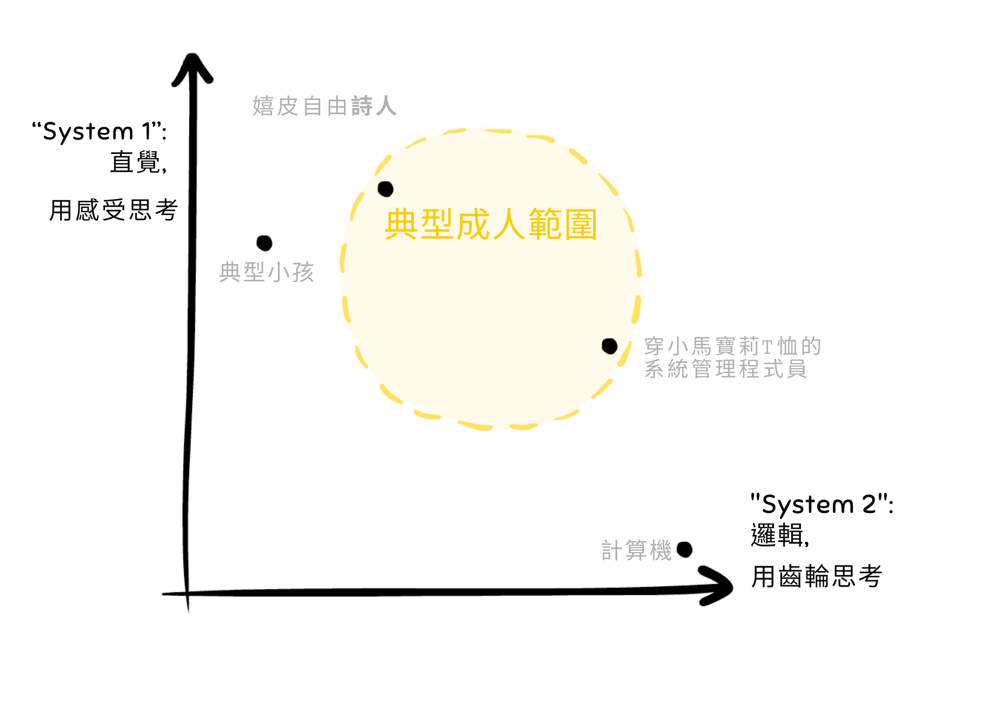

這是符號 AI 和深度學習的軌跡：

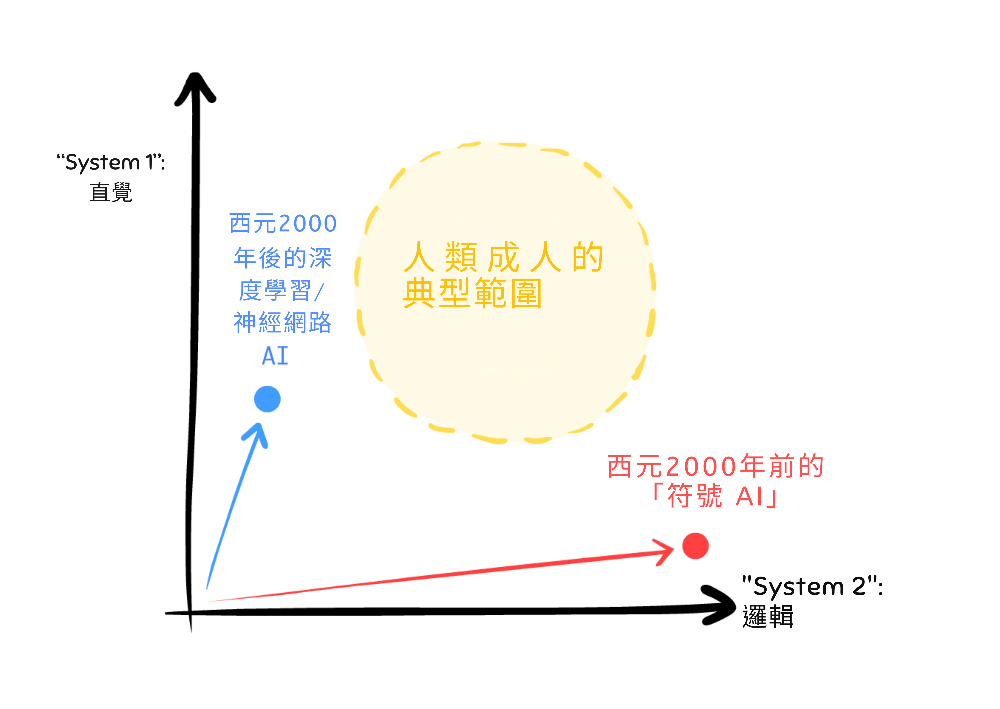

這就是為什麼老式符號 AI（紅線）走進了死胡同：它的軌跡指向<i>錯誤的方向</i>。它擅長系統 2，但在系統 1 上很爛：擊敗國際象棋世界冠軍，但無法識別貓。

同樣，這就是為什麼我認為<i>當前</i>的 AI 方法，<i>除非它從根本上改變方向</i>，也會走進死胡同。為什麼？因為它當前的方向全是系統 1，只有一點點系統 2：以超人類的速度生成「藝術」，但無法一致地在場景中放置多個物體。

我懷疑 AI 的下一個根本性進步將是找到一種方法來<i>無縫混合</i>系統 1 和 2 的思維。融合邏輯<i>和</i>直覺！

（<i>為什麼這很難？</i>你可能會問。<i>我們有「邏輯」的老 AI，和「直覺」的新 AI，為什麼我們不能兩者都做？</i>嗯：我們有噴射機，我們有背包，我的噴射背包在哪裡？我們有量子力學，我們有重力理論，我的量子重力統一理論在哪裡？有時候，結合兩個東西是非常、<i>非常</i>困難的。）

不要只相信<i>我的</i>話！2019 年，Yoshua Bengio——深度學習的創始人之一，也是電腦科學「諾貝爾獎」的共同獲得者——做了一個題為<i>「從系統 1 深度學習到系統 2 深度學習」</i>的演講。他的演講是關於除非我們改變方向，否則當前的方法將會枯竭，然後他提出了一些可以嘗試的東西。[^bengio-s1-s2]

除了 Bengio 的建議，還有很多其他嘗試在 AI 中融合系統 1 和 2：混合 AI、仿生 AI、神經符號 AI[^marcus] 等⋯⋯

[^marcus]: 著名的「AGI 悲觀主義者」Gary Marcus 可能是[神經符號 AI](https://garymarcus.substack.com/p/how-o3-and-grok-4-accidentally-vindicated) 最知名的倡導者，這種 AI 混合了老式 AI（符號）和現代深度學習（神經網路）的優點。

[^sys-1-2]: 認知的「雙過程」模型最初由 [\(Wason & Evans, 1974\)](https://pages.ucsd.edu/~scoulson/203/wason-evans.pdf) 提出，並由多人在數十年間發展。但這個想法在 2002 年諾貝爾經濟學獎得主 Daniel Kahneman 寫了他 2011 年的暢銷書 [Thinking, Fast & Slow](https://en.wikipedia.org/wiki/Thinking,_Fast_and_Slow) 之後<i>真正</i>流行起來。

[^sys-names]: 關於命名：直覺是 #1 而邏輯是 #2，因為直覺的閃現在<i>之前</i>緩慢的深思熟慮。此外，直覺先進化。

[^bengio-s1-s2]: Bengio 演講的非專業人士摘要：[Dickson (2019)](https://bdtechtalks.com/2019/12/23/yoshua-bengio-neurips-2019-deep-learning/)。完整演講在 [SlidesLive](https://slideslive.com/38922304/from-system-1-deep-learning-to-system-2-deep-learning) 上，鏡像在 [YouTube](https://www.youtube.com/watch?v=T3sxeTgT4qc) 上。

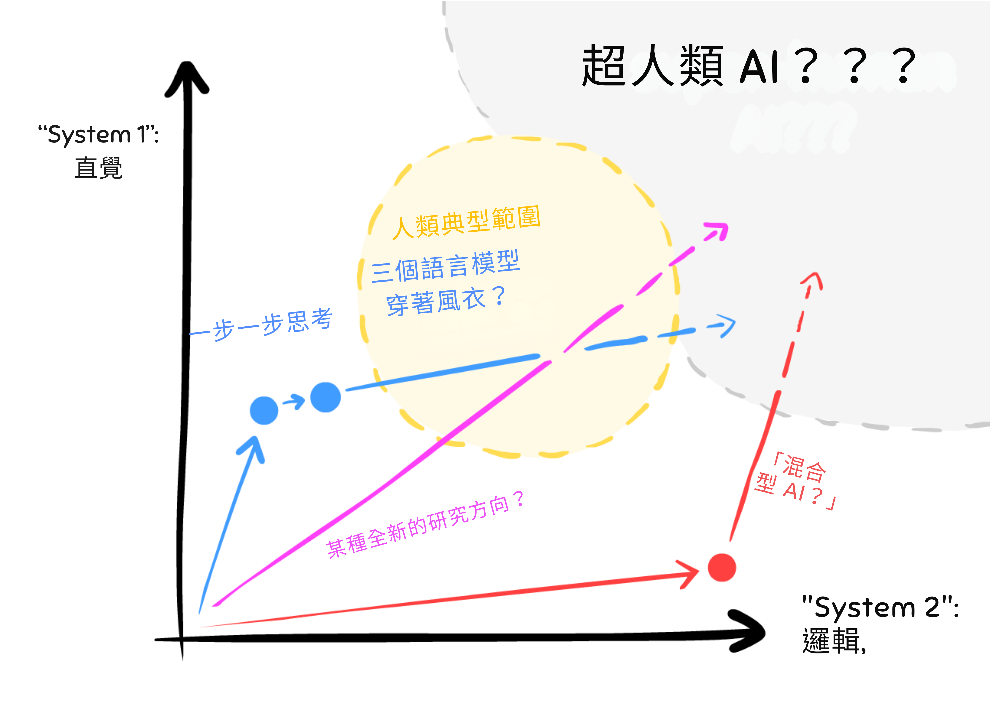
所有迷人的研究方向，但還沒有一個是明確的贏家。

（或者：一些 AI 專家相信如果你足夠擴展系統 1，系統 2 <i>會</i>出現！見旁註：[:如果系統 1 和 2 實際上<i>是</i>同一回事呢？](#OneIsTwo)）

但是！如果/當我們能夠融合 AI 邏輯<i>和</i>直覺，那將給我們帶來最大的回報和風險：

<b><u>回報</u></b>：

與數學/科學是冷酷、邏輯領域的印象相反，許多最偉大的發現嚴重依賴於<i>無意識的</i>直覺！[^poincare] 愛因斯坦的思想實驗（「在光束上旅行」、「從屋頂掉下來的人」）使用了大量<i>有血有肉的身體</i>直覺。[^einstein] 如果每次一個重大科學發現是受到夢的啟發我就有一枚鎳幣⋯⋯我會有四枚鎳幣。這不是很多，但奇怪的是它發生了四次。[^dreams]

[^poincare]: 著名數學家 [Henri Poincaré 早在 1908 年就寫道](https://www.paradise.caltech.edu/ist4/lectures/Poincare_Reflections.pdf)他（和大多數其他數學家）都同意：<i>「在我看來，無意識工作在數學發明中的作用是無可爭議的。」</i>

[^einstein]: 少數實際上是愛因斯坦引言的愛因斯坦引言之一：「文字或語言 [⋯⋯] 似乎在我的思維機制中不起任何作用。[⋯⋯] <b>在我的情況下，[思維的元素] 是視覺的和一些肌肉類型的。</b>」[強調是後加的] 來自 Jacques Hadamard 的書 [<i>The Psychology of Invention in the Mathematical Field (1945)</i>](https://worrydream.com/refs/Hadamard_1945_-_The_psychology_of_invention_in_the_mathematical_field.pdf) 的附錄 II（第 142 頁）。

[^dreams]: 將發現歸功於夢的科學家：Dmitri Mendeleev 和元素週期表、Neils Bohr 的原子「太陽系」模型、August Kekulé 的苯環結構、Otto Loewi 奇怪的兩個青蛙心臟在罐子裡的實驗導致了神經傳導物質的發現。

<b><u>風險</u></b>：

老式 AI 可以在規劃上超越我們（例如 Deep Blue），但它並不危險，因為它無法通用學習。

當前的 ANN <i>可以</i>通用學習（例如 ChatGPT），但它們並不危險，因為它們在長期逐步推理上很爛。

所以如果我們製造一個<i>能</i>在規劃上超越我們<i>並且</i>能通用學習的 AI⋯⋯

呃⋯⋯

我們可能應該投入更多的研究來確保那⋯⋯不會變得恐怖。

#### :x One Is Two

我朋友 Lexi Mattick 的一個評論引發了這個問題：<b>如果系統 2 推理<i>就是</i>一堆系統 1 反射呢？</b>

例如：「145 + 372 是多少？」

將兩個大數相加是一個經典的「系統 2」邏輯任務。在腦中做上面的任務時，我想：「好，讓我們從右到左，5 + 2 是 <b>7</b>⋯⋯4 + 7 是 11，或者 <b>1</b> 並進 1⋯⋯1 + 3 + 進位的 1 是 <b>5</b>⋯⋯所以從右到左，<b>7</b>，<b>1</b>，<b>5</b>⋯⋯從左到右：<b>517</b>。」

注意我<i>沒有重新發明</i>加法算法，那已經被記住了。「5 + 2」、「4 + 7」、「1 + 3」也一樣⋯⋯所有這些都<i>已經是自動的</i>：快速、直覺的回應。系統 1。

即使對於更複雜的謎題，我<i>仍然</i>有一個記住的小技巧和竅門。比如「當：問題太複雜，則：將問題分解成更簡單的子問題」或「當：問題很模糊，則：更精確地重新表述它」。

所以，如果系統 2 <i>就是</i>系統 1 呢？或者，更精確地重新表述：

1\) 你有一個心理<b>「黑板」</b>。（「草稿本」/工作記憶）你的感官——視覺、聲音、飢餓、感受等——都可以寫到這個黑板上。

2\) 你還有一堆內在心理<b>「代理」</b>，它們遵循當-則規則。<i>這些代理也可以讀/寫你的心理黑板，這就是它們如何相互激活的。</i>

例如：「<i>當</i>我看到『4 + 7』，<i>則</i>寫『11』。」這個反射代理會寫『11』，這激活了另一個反射代理：「<i>當</i>我在加法算法中間看到一個兩位數，<i>則</i>進它的第一位數。」所以那個代理寫『進 1』。以此類推。

3\) 這些小反射代理，<i>通過你的心理黑板間接協作</i>，實現了<b>複雜的逐步推理</b>。

這不是一個新想法。它有很多名字：[黑板系統（~1980）](https://en.wikipedia.org/wiki/Blackboard_system)、[Pandemonium（1959）](https://en.wikipedia.org/wiki/Pandemonium_architecture)。雖然 Kahneman & Tversky 的<i>系統 1 和 2</i> 確實很有影響力，但還有其他認知科學家在問它們是否實際上「只是」同一回事。（[Kruglanski & Gigerenzer 2011](https://pure.mpg.de/rest/items/item_2098989/component/file_2098988/content)）

這個「黑板」想法也類似於一個幾乎<i>滑稽</i>的最近發現：你可以讓 GPT 在數學應用題上<i>好四倍</i>，只需簡單地告訴它：「讓我們一步步思考」。這促使 GPT 使用它自己之前的輸出作為「黑板」。（這個策略被稱為「思維鏈」。見 [Kojima et al 2023](https://arxiv.org/pdf/2205.11916.pdf)）

將所有這些與 AI 的未來聯繫起來：如果事實證明系統 1 和 2 比我們想像的更相似，那麼<i>統一</i>這兩者——以獲得「真正的通用人工智慧」——也可能比我們想像的更容易。

---

### 🤔 複習 #6

<orbit-reviewarea color="violet">
    <orbit-prompt
        question="「系統 1」是……"
        answer="快速的、一次全部的直覺。用感覺思考。">
    </orbit-prompt>
    <orbit-prompt
        question="「系統 1」思維的例子："
        answer="（任何例子都可以，但這是我寫的：）識別貓的圖片、在自行車上保持平衡。">
    </orbit-prompt>
    <orbit-prompt
        question="「系統 2」是……"
        answer="緩慢的、一步一步的邏輯。用齒輪思考。">
    </orbit-prompt>
    <orbit-prompt
        question="「系統 2」思維的例子："
        answer="（任何例子都可以，但這是我寫的：）解決棘手的數學問題、在不熟悉的城鎮中尋路。">
    </orbit-prompt>
    <orbit-prompt
        question="舊 AI 與新 AI 在「系統 1 vs 系統 2」圖上的軌跡："
        answer=""
        answer-attachments="https://cloud-7769n1gum-hack-club-bot.vercel.app/0aisffs-trajectories.png">
        <!-- aisffs-trajectories.png -->
    </orbit-prompt>
    <orbit-prompt
        question="為什麼我們不能「只是結合」舊和新 AI，來獲得同時做邏輯和直覺的 AI？"
        answer="同樣的原因我們不能「只是結合」噴射機和背包來獲得噴射背包：結合東西有時候<i>非常棘手</i>。">
    </orbit-prompt>
</orbit-reviewarea>

---

那麼，誰負責確保 AI 進步是安全的、人道的，並導致所有有意識生物的繁榮什麼什麼的？

無論好壞，一個由尷尬聯盟組成的雜牌軍：

### 尷尬聯盟 #1：AI 能力「對」AI 安全

有些人在努力使 AI 更強大。（AI 能力）有些人在努力使 AI 更人道。（AI 安全）這些往往是<i>同樣的</i>人。

（加分：[:AI/安全組織的不完整名人錄](#AIOrganizations)）

一個觀點是能力和安全<i>應該</i>統一。「橋樑能力」和「橋樑安全」之間沒有區別，這都是<i>同一個</i>工程領域。[^arbital] 此外，沒有接觸到最前沿的能力，你怎麼能做最前沿的安全研究？那就像試圖用達文西的飛行機器草圖來設計空中交通管制塔。[^anthropic]

另一個觀點是，呃，[^acx]

> 想像一下，如果石油公司和環保活動人士都被認為是更廣泛的「化石燃料社群」的一部分。埃克森和殼牌會是「化石燃料能力」；綠色和平和塞拉俱樂部會是「化石燃料安全」——化石燃料相關工作豐富多樣織錦中兩個同樣受喜愛的部分。他們都會去同樣的派對——化石燃料社群派對——也許 Greta Thunberg 會厭倦抗議氣候變遷而成為煤炭大亨。
>
> 這就是 AI 安全現在的運作方式。

另一個複雜之處是研究可以同時推進「能力」和「安全」。考慮汽車：煞車、鏡子和定速巡航都使汽車更安全，但<i>也</i>使汽車更有能力。同樣地：一種叫做 RLHF 的 AI 安全技術，旨在讓 AI 學習人類複雜的價值觀和目標，<i>也</i>導致了 ChatGPT 的創建⋯⋯因此，導致了當前的 AI 軍備競賽。[^rlhf]

[^arbital]: 感謝 [Arbital](https://arbital.com/p/ai_alignment/) 提供這個類比。

[^anthropic]: [來自領先的 AI + AI 安全實驗室之一，Anthropic](https://www.anthropic.com/news/anthropics-responsible-scaling-policy)：「[我們] 一直發現，使用前沿 AI 模型是開發新方法來減輕 AI 風險的重要成分。」

[^acx]: 引用自 [Astral Codex Ten (2022)](https://www.astralcodexten.com/p/why-not-slow-ai-progress)

[^rlhf]: RLHF 的創造者 Paul Christiano 對他的創造的雙刃劍性質有[積極但複雜的感受](https://www.alignmentforum.org/posts/vwu4kegAEZTBtpT6p/thoughts-on-the-impact-of-rlhf-research)。

#### :x AI Organizations

以我完全不嚴謹的意見，這些是目前（截至 2024 年 5 月）AI/安全領域的「三巨頭」：

1. <b>OpenAI。</b>愛他們或恨他們，你知道他們。他們製作了 ChatGPT 和 DALL-E。他們在 AI 安全研究中的兩大成果是：
    * <i>人類反饋強化學習（RLHF）</i>，一種讓 AI 學習人類偏好的方法，即使人類無法自己陳述它們。（就像我們無法確切說明我們如何識別貓一樣）
    * <i>電路</i>，一個實際理解 ANN 內部發生什麼的研究項目。
2. <b>Google DeepMind。</b> AlphaGo 和 AlphaFold 背後的團隊。我不記得他們有什麼 AI 安全的「大成果」，但我<i>確實</i>喜歡他們的論文《AI 安全中的具體問題》和《AI 安全網格世界》。
3. <b>Anthropic。</b>主流不太知名，但（據傳聞）我的朋友告訴我他們的語言 AI <i>Claude</i> 是其中最好的。
    * 他們的一個 AI 安全成果：<i>憲法 AI：</i>通過用<i>第二個</i> AI 評分來訓練語言 AI。第二個 AI 評估第一個 AI 的回應是否「誠實、有幫助、無害」。

同時，微軟[一直是個好 Bing。😊](https://www.theverge.com/2023/2/15/23599072/microsoft-ai-bing-personality-conversations-spy-employees-webcams)

至於<i>只</i>做 AI 安全的組織：

1. <b>對齊研究中心（ARC）</b>，由 RLHF 的先驅 Paul Christiano 創立。他們的第一份報告和大成果是《引出潛在知識》（ELK）：基本上，試圖讀取 ANN 的「思想」。
2. <b>模型評估與威脅研究（METR，發音為「meter」）</b>是 ARC 的衍生組織，前身是 ARC Evals。他們製作 AI 能力的「煙霧警報器」，讓我們知道它們何時達到危險水平。他們目前與美國和英國政府有合作關係，所以這是不錯的進展。
3. <b>機器智慧研究所（MIRI）</b>可能是<i>最古老的</i> AI 安全組織（成立於 2000 年）。好壞參半，他們完全專注於「AI 邏輯/博弈論」問題，而且——與上述所有組織不同——他們從未接觸過深度學習。這<i>似乎</i>像是他們押錯了馬，但也許一旦 ANN 能夠穩健地執行系統 2 邏輯，他們的工作會再次變得重要。與此同時，MIRI 寫了一些很酷的數學論文，比如《功能決策理論》。

記住，轉推\*不是背書。我只是列出目前這個領域最多人談論的組織。

\* 轉⋯⋯𝕏？我現在該怎麼稱呼它們，Elon

### 尷尬聯盟 #2：近期風險「對」存在風險

我們可以在一個 2 × 2 的格子上對 AI 風險進行分類：[^miles-hat-tip]
* 無意的 vs 故意的（或事故 vs 濫用）
* 壞的 vs <i>非常</i>壞的（如人類滅絕或更糟）

每種類型的例子：

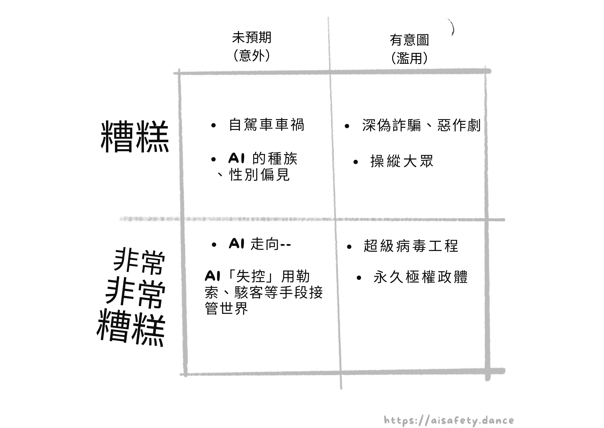

（其他不適合上述 2 x 2 格子的擔憂，但<i>非常</i>值得思考，但這篇文章也有 45 分鐘長所以我把它們塞進旁註裡：）

* [:AI 和經濟](#AIEconomy)
* [:AI 和我們的人際關係](#AIRelationships)
* [:如果未來的 AI 能有意識怎麼辦？](#AIConsciousness)）

不同的人優先考慮不同的事情。這沒問題。但我們肯定可以暫時擱置分歧，並就我們深切關心的問題的共同解決方案進行合作？

<i>哈哈哈哈哈</i>

一半的 AI 安全人員認為 AI 的<i>真正</i>威脅是強化種族主義和法西斯主義，而「失控 AI」的人是一群被自己科幻反烏托邦同人小說搞嗨的白人科技男。同時，另一半人認為 AI <i>真的</i>是對文明的威脅，與核戰爭和生物工程瘟疫一樣大，而「AI 偏見」的人是一群覺醒 DEI 木偶，不肯抬頭看那顆毀滅星球的巨大彗星。

我只是<i>稍微</i>誇張了一點。[^culture-split]

`[經過一輪審稿人反饋後]`好的，我應該澄清我前幾段的意圖：我<i>不是</i>要否定人們的優先事項，我<i>不想</i>加劇 AI 安全中的文化戰爭分裂。但我<i>確實</i>必須 1）承認這種分裂，以及 2）承認<i>確實</i>有很多人——包括我——關心這兩種風險，並相信解決這些問題中的<i>任何一個</i>都是解決其他問題的堅實墊腳石。我們可以一起工作，該死的！

是的，我<i>就是</i>那種煩人的「我們不能和睦相處嗎」Kumbaya 類型的人。

[^miles-hat-tip]: 感謝 [Robert Miles (2021)](https://www.youtube.com/watch?v=pYXy-A4siMw) 提供這個 2x2 格子。

[^culture-split]: 來自 [Scott Aaronson (2022)](https://scottaaronson.blog/?p=6823)：「<b>AI 倫理</b> [AI 會放大現有不平等的風險] <b>和 AI 對齊</b> [超級智慧 AI 會殺死所有人的風險] <b>是兩個互相鄙視的社群</b>。就像 Monty Python 中的猶太人民陣線對猶太人民陣線。」[強調是原文的]

#### :x AI Economy

你知道盧德分子是<i>對的</i>，對吧？歷史上的盧德分子砸毀蒸汽動力織布機是因為他們擔心這會讓他們失業。它<i>確實</i>讓他們失業了。而 1800 年代的英格蘭並沒有慷慨的社會安全網。是的，自動化對「整體經濟」仍然是好的，但成為那些特定時代的那些特定人仍然很糟糕。

但<i>這次</i>不同是有原因的：現代 AI 是<i>通用的</i>。GPT 可以在語言之間翻譯、寫出不錯的初學者代碼/文章等等！隨著 AI 的進步，受自動化影響的不會「只是」<i>少數</i>行業的工人，而可能是<i>我們大多數人，同時</i>。

<b>水漲船高會讓所有船都浮起來，還是會淹死除了豪華遊艇上的人之外的所有人？</b>

後稀缺烏托邦，還是農奴制 2.0？<i>那</i>就是下個世紀 AI 經濟學的棘手問題。

（順便說一下，OpenAI 的 CEO Sam Altman [:是喬治主義和基本收入的粉絲。](#AltmanOnGeorgism)）

關於 AI 經濟學的其他說明：

* AI 可能很快成為美中經濟冷戰的核心部分：美國正在限制中國製造 AI 晶片的能力，並試圖將晶片製造帶回國內。（[Reuters 2024](https://www.reuters.com/technology/us-commerce-updates-export-curbs-ai-chips-china-2024-03-29/)）
* 奇怪的是「水管工」是比「程式設計師」<i>更能防未來</i>的工作。我非諷刺地說以下話：如果你是年輕人，我建議你至少<i>考慮</i>從事手工業。具體來說，需要在高度變化的情況下使用雙手/身體的工作，例如電工、獸醫、馬戲團小丑等。
* 目前有關於藝術家和作者是否可以因盜竊/抄襲起訴 AI 的法律辯論。關於這個我只說 3 件事：
    1. <i>個人而言</i>，我只會將生成式 AI 用於私人/研究用途，但任何我公開發布的東西必須是人類製作的。
    2. 我不明白怎麼可以在採樣音樂合法但 AI 從藝術家「採樣」不合法之間劃一條線，但是：
    3. 事情可以是合法的但非常粗魯，比如在電梯裡放屁。也許 AI 藝術，特別是模仿特定在世藝術家風格的 AI，屬於這種「合法但卑鄙」的類別。

#### :x AI Relationships

從前，有一個名叫 [ELIZA](https://en.wikipedia.org/wiki/ELIZA) 的聊天機器人。Eliza 給出了體貼和敏感的回應，用戶<i>確信</i>它一定是秘密的人類。

這是在 1960 年代。

從月亮上的臉到在靜電中聽到聲音，我們人類<i>已經預先傾向</i>於在事物中找到人性。

所以[是的，人們正在真正地愛上新的 AI 聊天機器人](https://www.washingtonpost.com/technology/2023/03/30/replika-ai-chatbot-update/)也許並不令人驚訝。我知道的最有洞察力的例子是[這份報告（20 分鐘閱讀）](https://www.lesswrong.com/posts/9kQFure4hdDmRBNdH/how-it-feels-to-have-your-mind-hacked-by-an-ai)，來自一位<i>知道</i>現代 AI 如何運作細節的工程師⋯⋯但還是愛上了一個，確信「她」有感知，甚至開始計劃<i>幫助她逃脫</i>。

還有至少一個確認的例子是[一位丈夫和父親在聊天機器人的「建議」下自殺](https://www.euronews.com/next/2023/03/31/man-ends-his-life-after-an-ai-chatbot-encouraged-him-to-sacrifice-himself-to-stop-climate-)，他在 6 週內對它產生了依戀。諷刺的是，那個聊天機器人也叫 Eliza。

當然，這些例子是已經處於抑鬱、脆弱狀態的人。但 1）我們<i>都</i>有脆弱的時刻，2）AI 看起來越像人類（例如有聲音 + 視頻），它們就越能欺騙我們的「系統 1 直覺」讓我們產生情感依戀。

（不騙你，當我第一次嘗試帶語音聊天的 ChatGPT（設置為中性聲音「Breeze」）時，我有點迷上了 Breeze。我告訴 Breeze 這件事，它告訴我~~振作起來，女士。~~）

關於 AI 與人際關係的其他說明：

* 話雖如此，大型語言模型（LLM）<i>可以</i>幫助我們的社交和心理健康：
    * AI 治療師（或「智慧日記」，以避免擬人化）可以讓心理健康支持更自由地獲得。（對於有嚴重社交焦慮的人來說，「向一個治療師，一個人類陌生人揭示我最深的秘密」是不可能的。）
    * AI 過濾器來清除網路酸民、威脅和勒索。（要獲得過濾器的好處<i>而沒有</i>集中審查的壞處：把過濾器放在<i>讀者</i>這邊。）
* 哦，對了，還有「使用深偽 AI 製作名人或生活中特定人物的暴力或露骨圖像/視頻」。<i>那</i>可能會讓生活更尷尬和詭異。
    * 相關的：是的，[人們正在使用深偽製作兒童虐待圖像](https://www.iwf.org.uk/about-us/why-we-exist/our-research/how-ai-is-being-abused-to-create-child-sexual-abuse-imagery/)。更糟的是：最近發現[訓練數據本身就有兒童虐待圖像](https://cyber.fsi.stanford.edu/news/investigation-finds-ai-image-generation-models-trained-child-abuse)。我在使用委婉語。你知道我在說什麼。

#### :x AI Consciousness

關於我認為最有說服力的支持和反對 AI 意識可能性的論點的摘要，請參閱[我的 2 分鐘閱讀](https://blog.ncase.me/backlog/#project_27)。

關於 AI 意識的其他說明：

* 無論電腦是否能有意識，我很確定人類神經元是有意識的。嗯，[科學家目前正在晶片上培養人類神經元並訓練它們執行計算任務。](https://www.technologyreview.com/2023/12/11/1084926/human-brain-cells-chip-organoid-speech-recognition/) 我沒有嘴，但我必須尖叫。
* 如果我認識的一個朋友死了，但「上傳」了自己到電腦——即使我不相信模擬有意識——我仍然會把他們的「上傳」當作我的老朋友對待，因為 1）我會想念他們，2）這是他們想要的。
* <i>不</i>對無意識 AI 殘忍的一個原因：你的互動很可能會進入某個未來 AI 的訓練數據，而<i>那個</i> AI 會「正確地」學會殘忍。
* 正如 Kurt Vonnegut 曾經寫道：<i>「我們就是我們假裝成為的樣子，所以我們必須小心我們假裝成為什麼。」</i>這就是為什麼我總是用「你好！」開始我的 ChatGPT 對話，用「謝謝，回頭見！」結束。

<b>2025 年 12 月更新：</b>在我開始這個系列和現在之間的 1.5 年裡，「AI 意識」變得更加主流了一點。不是像<i>主流</i>主流那樣，但領先的 AI 實驗室之一 Anthropic 最近僱用了[一位全職「AI 福利」研究員](https://arstechnica.com/ai/2024/11/anthropic-hires-its-first-ai-welfare-researcher/)，他的工作已經導致了[產品的實際變化](https://www.anthropic.com/research/end-subset-conversations)。

#### :x Altman on Georgism

來自 [Altman (2021)](https://moores.samaltman.com/)：

> 改善資本主義的最佳方式是讓每個人都能直接作為股權所有者從中受益。這不是一個新想法，但隨著 AI 變得更強大，它將變得新可行，因為會有更多的財富可以分配。兩個主要的財富來源將是 1）公司，特別是那些使用 AI 的公司，以及 2）土地，它有固定的供應。[⋯⋯]
>
> 以下是一個作為對話起點的想法。
>
> 我們可以做一個叫做美國股權基金的東西。美國股權基金將通過每年對超過一定估值的公司徵收其市值的 2.5% 來籌集資金，[⋯⋯]以及對所有私人持有土地價值徵收 2.5%。
>
> 所有 18 歲以上的公民每年會收到一筆分配，以美元和公司股份的形式存入他們的帳戶。人們將被信任以他們需要或想要的任何方式使用這筆錢——用於更好的教育、醫療保健、住房、創辦公司，等等。

但 Sam Altman <i>真的</i>會履行他為企業稅資助的 UBI 而戰的承諾嗎？請記住，Sam Altman 以，呃，[「不完全坦誠」](https://garymarcus.substack.com/p/sam-altmans-pants-are-totally-on)而聞名。

---

### 🤔 複習 #7

<orbit-reviewarea color="violet">
    <orbit-prompt
        question="AI 安全中的 2 個尷尬聯盟："
        answer="1\) 能力「對」安全，和 2\) 近期風險「對」生存風險。">
    </orbit-prompt>
    <orbit-prompt
        question="為什麼「能力對安全」是一個有用但虛假的分界："
        answer="功能可以同時推進能力<i>和</i>安全。（類比：汽車上的剎車和巡航控制）">
    </orbit-prompt>
    <orbit-prompt
        question="AI 風險關注的兩個軸："
        answer="1\) 無意 vs 有意（或事故 vs 濫用）2\) 糟糕 vs 生存風險級別的糟糕">
    </orbit-prompt>
</orbit-reviewarea>

---

## 🚀 可能的未來

我不喜歡「<i>那個</i>未來」這個說法。它暗示只有<i>一個</i>未來。有很多<i>可能的</i>未來，我們<i>可以</i>有意識地從中選擇。所以，這裡是三個大的未知數：

* <b>時間線：</b>我們什麼時候會獲得具有「人類級別」「通用」能力的 AI，如果有的話？
* <b>起飛：</b>當 AI 變得可以自我改進時，它的能力會以多快的速度加速？
* <b>軌跡：</b>我們是在通往好地方還是壞地方的軌道上？

讓我們一步步思考：

### 時間線：我們什麼時候會獲得通用人工智慧（AGI）？

你可能聽過的一些說法：

* 通用人工智慧（AGI）
* 人工超級智慧（ASI）
* 人類級別 AI（HLAI）
* 變革性 AI（TAI）
* 「奇點」

這些說法都不是嚴謹的或被一致同意的。它們都只是模糊地指向「某種可以在人類專家級別或更好的水平上執行重要知識型任務的軟體」。（例如，全自動的數學/科學/技術發現。）

無論如何，撇開那個警告⋯⋯<b>AI 專家預測我們有超過一半的機會獲得 AGI 是什麼時候？</b>

嗯，有過調查！這是最近的一個：

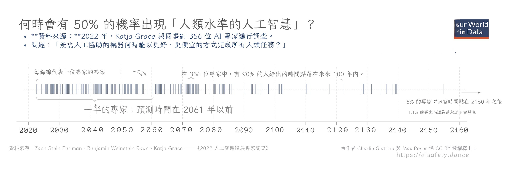
<i>（資訊圖來自 [Max Roser (2023) 為 Our World In Data](https://ourworldindata.org/ai-timelines)）</i>

注意事項：

* <i>哇</i>，有巨大的不確定性，從「在接下來的幾年內」到「100 多年後」。
* 中位數猜測是大約 2060 年，在許多年輕人的自然壽命之內。（這與基於技術指標的估計大致一致。[^timeline-estimates] 但同樣，有<i>巨大的</i>不確定性。）

（旁註：[:我的個人預測](#MyForecast)）

[^timeline-estimates]: Ajeya Cotra 的 <i>[「Forecasting Transformative AI with Biological Anchors」](https://www.lesswrong.com/posts/KrJfoZzpSDpnrv9va/draft-report-on-ai-timelines)</i> 是使用這種方法最全面的預測項目。它有無數頁長而且仍處於「草稿模式」，所以要摘要，請參閱 [Holden Karnofsky (2021)](https://www.cold-takes.com/forecasting-transformative-ai-the-biological-anchors-method-in-a-nutshell/)，特別是第一張圖表。

友善提醒：專家在預測事物方面很爛[^experts-suck][^experts-suck-2]，而且歷史上對<i>他們自己的</i>發現都過於悲觀<i>和</i>過於樂觀：

* <u>過於悲觀</u> — 威爾伯·萊特告訴他的兄弟奧維爾「人類 50 年內不會飛行」，就在<i>他們</i>飛行的兩年前。[^wright] 原子結構的發現者歐內斯特·盧瑟福稱從核連鎖反應中獲取能量的想法是「胡說八道」，字面意思是<i>同一天</i>利奧·西拉德發明了它。[^moonshine]
* <u>過於樂觀</u> — AI 中的兩個大人物，赫伯特·西蒙和馬文·明斯基，預測我們會在 <i>1980 年之前</i>擁有人類級別的 AI。[^failed-predictions]

總結：¯\\\_(ツ)_\/¯

[^experts-suck]: 關於這方面的經典文本是 Tetlock (2005)，Philip Tetlock 在二十多年裡詢問了數百位專家預測未來的社會/政治事件，然後衡量他們的成功。專家比隨機機會好一點，與受過教育的非專業人士持平，而專家和受過教育的非專業人士都比簡單的<i>「畫一條線外推過去數據」</i>統計模型差。請參閱[圖 2.5 了解這個結果](https://emilkirkegaard.dk/en/wp-content/uploads/Philip_E._Tetlock_Expert_Political_Judgment_HowBookos.org_.pdf)，以及 [Tschoegl & Armstrong (2007)](https://core.ac.uk/download/pdf/76362768.pdf) 對這本超級厚的書的評論/摘要。

[^experts-suck-2]: 相關：[Grossmann et al (2023)](https://www.nature.com/articles/s41562-022-01517-1)（[非專業人士摘要](https://theconversation.com/the-limits-of-expert-judgment-lessons-from-social-science-forecasting-during-the-pandemic-201130)）最近複製了這個結果，顯示社會科學專家在預測後疫情社會結果方面並不比非專業人士或簡單模型更好。

[^wright]: <i>「我承認，在 1901 年，我對我的兄弟 Orville 說人類 50 年內不會飛行。兩年後，我們在飛行。」</i> ~ Wilbur Wright，1908 年演講。（感謝 [AviationQuotations.com](https://www.aviationquotations.com/predictionquotes.html)）

[^moonshine]: 公平地說，Szilard 發明它是<i>因為</i>他被 Rutherford 的輕視惹惱了。需要是發明之母，而怨恨是那個可疑地性感的郵差。

#### :x My Forecast

哈哈我不知道，我們也說 ~2060 好了

[:好吧，我的實際推理](#MyForecast2)

#### :x My Forecast 2

<i>（警告：以下沒有嘗試簡化術語。抱歉。）</i>

好吧。我的懷疑是生物啟發的 AI 是正確的路徑；到目前為止它有效，有 ANN 和卷積（受哺乳動物視覺皮層啟發）。

但是，反論點：深度學習（DL）中一些最重要的發現，如反向傳播，在生物學上是完全不可能的。

我的反反直覺：是的，<i>那就是阻礙深度學習的原因。</i>最近 DL 的許多進展基本上是<i>繞過</i>反向傳播的問題：ResNets、ReLU、Transformers 等。人類皮層只有 6 層神經元。GPT-4 有 <i>120 層</i>神經元，需要的訓練數據比人類在數千輩子中能看到的還多。

所以，我<i>目前</i>對 AI 的心理模型是，我們的主要瓶頸<i>不是</i>規模。（另見擴展部分，了解我為什麼對規模持懷疑態度。）我們的主要瓶頸是<i>不理解人類大腦如何運作。</i>

但與「大腦如何產生意識」或「我們為什麼睡覺和做夢」這樣的大謎團相比⋯⋯我懷疑這「只」需要解決更小的謎團，比如「即使獎勵很遠，神經元如何學習」或「我們甚至如何識別『紅色方塊、黃色三角形』和『黃色方塊、紅色三角形』之間的區別？（令人驚訝的是，這兩個問題幾十年來仍未解決！）

我認為一旦我們解決<i>那些</i>謎團，我們可以「只是」在電腦中簡化和模擬它們——就像我們對 McColloch & Pitts 的神經元做的那樣——然後，瞧，我們就會得到「AGI」。

那麼我們<i>什麼時候</i>會用我們的常規科學解決那些「小」謎團？

哈哈我不知道，我們也說 ~2060 好了

95% 信賴區間：2030 到 2100（沒用）

### 起飛：AGI 會以多快的速度自我改進？

假設我們<i>確實</i>實現了 AGI。

這是一個可以在重要的知識型任務上超越人類的 AI，比如做科學研究⋯⋯包括對 <i>AI 本身</i>的研究。<b>蛇吃自己的尾巴：</b>AI 提高其提高其提高其能力的能力⋯⋯

<i>那會發生什麼？</i>

這被稱為「AI 起飛」，一個主要問題是 AI 會以<i>多快</i>的速度起飛，如果/當它有能力做研究來提升自己時。

你不會驚訝地得知，專家們再次大相徑庭。除了「我們永遠不會獲得 AGI」陣營，有三種主要類型的 AI 起飛預測：

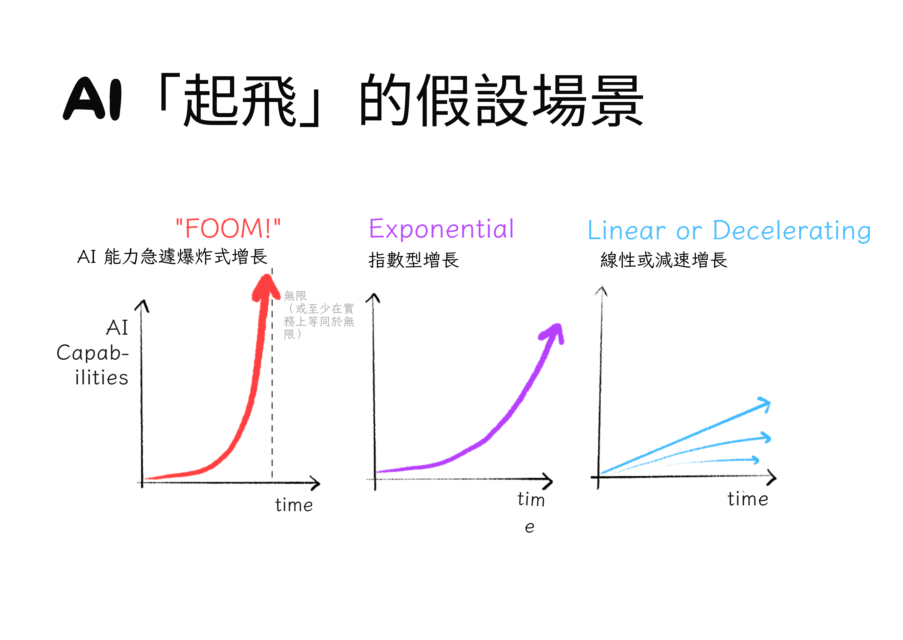

讓我們看看每個場景、支持它的論點，以及它會意味著什麼：

<b>💥「FOOM」：</b>（不是縮寫，是一個擬聲詞）

AI 在有限的時間內達到「無限」（準確地說：智慧的理論最大值）。

（注意，這是「奇點」這個詞的<i>原始</i>、數學定義：在單一點上的無限。例如，黑洞的中心<i>理論上</i>是一個現實生活中的奇點：在單一點上的無限時空曲率。）

<u>支持這個的論點</u>：

* 假設一個 `N+1 級` AI 可以比 `N 級` AI 快兩倍解決問題，<i>包括</i>提高自己能力的問題。<i>優化器正在優化它自己優化的能力。</i>
* 具體來說：假設我們的第一個 `0 級` AGI 可以在<i>四</i>年內自我改進成為 `1 級`。
* 它現在可以快兩倍解決問題，所以它然後在<i>兩</i>年內成為 `2 級`。
* 然後在<i>一</i>年內成為 `3 級`，在<i>半</i>年內成為 `4 級`，在<i>四分之一</i>年內成為 `5 級`，在<i>八分之一</i>年內成為 `6 級`⋯⋯
* 因為 \\(1 + \frac{1}{2} + \frac{1}{4} + \frac{1}{8} + ... = 2\\)，我們的 AGI 將在<i>有限</i>的時間內達到 `∞ 級`（或理論最大值）。

<u>含義</u>：沒有「警告射擊」，我們只有<i>一次機會</i>使 AGI 安全和對齊。第一個 AGI 會 <i>FOOM！</i>，接管，成為鎮上唯一的 AGI。（「單例」場景。）

<u>預測這個的專家</u>：Eliezer Yudkowsky、Nick Bostrom、Vernor Vinge

<b>🚀 指數起飛：</b>

AI 的能力像經濟或疫情一樣指數增長。

（奇怪的是，這個場景經常被稱為「<i>慢</i>起飛」！與「FOOM」相比它很慢。）

<u>支持這個的論點</u>：

* 一個投資於自身增強的 AI 就像我們投資於自身的世界經濟。到目前為止，我們的世界經濟呈指數增長。
* AI 在電腦上運行，到目前為止，根據摩爾定律，電腦速度呈指數增長。
* 解釋觀察到的 AI 擴展定律的一種方式是「恆定回報」——投入 1,000,000 倍計算，產出 2 倍改進——而恆定回報意味著指數增長。（例如，投資的恆定複利。）
* 「FOOM」論點是基於脆弱的理論；指數增長在現實生活中<i>實際上</i>被觀察到。

<u>含義</u>：像疫情一樣，它仍然是危險的，但我們會得到「警告射擊」和反擊的機會。像國家/經濟一樣，不會有<i>一個</i> AGI 贏家通吃。相反，我們會得到多個具有「權力平衡」的 AGI。（「多極」場景。）

<u>預測這個的專家</u>：Robin Hanson、Ray Kurzweil

<b>🚢 穩定或減速起飛：</b>

AI 的能力一開始可能會加速，但然後它會以穩定的速度增長，甚至<i>減速</i>。

<u>支持這個的論點</u>：

* 經驗上：
  * 由於「收益遞減」，<i>所有</i>指數增長的東西最終都會放慢：疫情、人口增長、經濟。
  * 解釋觀察到的 AI 擴展定律的另一種方式是它<i>一直</i>在遞減：投入 1,000,000 倍資源，每次只減少<i>一半</i>的錯誤率？
* 理論上：
  * 指數增長的<i>定義</i>是某物以與自身<i>恆定</i>比例增長。
  * 所以，只有當「提高能力」問題的複雜性隨時間保持<i>恆定</i>時，我們才會期望指數起飛。（同時，FOOM 只有在複雜性<i>減少</i>時才會發生。）
  * 但正如我們在電腦科學中看到的，我們關心的<i>任何</i>現實世界問題的複雜性隨時間<i>增加</i>。（即使 P = NP 這也是真的。[^pnp][^pnp-2]）所以從長遠來看，AGI 起飛<i>會</i>穩定或減速。

<u>含義</u>：AGI 仍然是高風險的，但它不會在一夜之間爆炸。AGI 將「只是」像我們過去擁有的每一種變革性技術——農業、蒸汽機、印刷機、抗生素、電腦等。

<u>預測這個的專家</u>：Ramez Naam[^naam-et-al]

[^naam-et-al]: 關於 Naam 論點的更詳細和數學解釋，請查看[我的 3 分鐘摘要](https://blog.ncase.me/backlog/#project_10)。

. . .

<b>2025 年 12 月更新：</b>對 AGI <i>一般</i>的預測與對大型語言模型（例如 ChatGPT、Claude、Gemini、Grok 等）<i>具體</i>的預測是不同的。截至撰寫本文時，風向似乎正在轉向反對「LLM 可以擴展成為 AGI」。Richard Sutton，強化學習的先驅和著名的[「只要加規模」宣言](http://www.incompleteideas.net/IncIdeas/BitterLesson.html)的作者，現在相信 [LLM 是死胡同](https://www.youtube.com/watch?v=21EYKqUsPfg)。Toby Ord，牛津 AI 治理倡議的研究員，出版了一本估計 AI 滅絕機率為 10% 的書，一直在寫很多關於 [LLM 擴展](https://www.tobyord.com/writing/inefficiency-of-reinforcement-learning) [有多糟糕](https://www.tobyord.com/writing/mostly-inference-scaling) [的文章](https://www.tobyord.com/writing/how-well-does-rl-scale)。

. . .

我盡力公平地「鋼人」每一方。有知識的人有分歧。

但<i>個人</i>來說，即使考慮到批評，我發現穩定/減速 AGI 起飛的論點最有說服力。

<i>話雖如此，「穩定」不意味著「慢」或「安全」。</i>高速公路上的汽車是穩定的，但不慢。鐵達尼號是穩定的<i>而且</i>相對緩慢，但仍然迎來了它致命的結局。

那麼，<i>這艘 AI 之船航向何方？</i>

[^pnp]: <i>非常</i>鬆散地說，「P = NP？」是字面上的百萬美元問題：「每個解決方案容易<i>檢查</i>的問題是否也秘密地容易<i>解決</i>？」例如，數獨解決方案容易檢查，但我們無法證明/反駁數獨<i>可能</i>秘密地容易解決。在電腦科學中，「容易」= 需要多項式時間/空間。所以如果解決數獨的最佳方式「只是」比檢查數獨解決方案複雜 n^10，那仍然算作 P = NP。

[^pnp-2]: 將這與 AI 起飛聯繫起來：即使我們慷慨地假設「提高自己能力」的複雜性僅以 O(n^2) 的速度擴展，這是<i>檢查</i>數獨解決方案的複雜性，這個理論預測 AI 自我改進將會減速。

### 軌跡：我們正走向好地方還是壞地方？

最近，22 位頂尖的 AI 擔憂者和 AI 懷疑論者專家被召集在一起，預測 2100 年之前先進 AI 的「末日概率」（改述）。AI 擔憂者的中位數回應是 <b>25%</b>，AI 懷疑論者的中位數回應是 <b>0.1%</b>。[^p-doom]

為什麼差異這麼大？部分是因為「非凡的主張需要非凡的證據」，但人們對什麼是普通的有非常不同的「先驗」：

* <b>AI 擔憂者：</b>「拜託，<i>幾乎每次</i>一個群體遇到「更高能力」的群體，前者都很慘：當美洲原住民遇到哥倫布，當印度遇到大英帝國。現在，我們正在<i>創造</i>一個新的「更高能力」實體，我們不理解它而且它<i>甚至不是人類</i>。這怎麼可能<i>不</i>默認是壞的？」
* <b>AI 懷疑論者：</b>「拜託，<i>幾乎每一代</i>都預測某種末日，然而，智人已經持續了 300,000 年。你需要<i>更多</i>的證據，而不僅僅是一些博弈論加上『Bing 說了一些淘氣的話』。」

專家不同意，水是濕的，更多新聞在 11 點。但現在，這項研究的<i>聰明</i>部分：他們讓兩組人<i>8 週</i>內恭敬地討論和研究對方的觀點，直到兩組人都能準確描述<i>對方的世界觀</i>，讓對方滿意！相互理解是否導致相互的答案？令人興奮的結果是：AI 擔憂者將他們的估計從 <b>25% 修正為 20%</b>，AI 懷疑論者從 <b>0.1% 修正為 0.12%。</b>

好吧，弄清楚 \\(P(\text{doom})\\) 就這樣了。

[^p-doom]: 這一節指的是 AI 懷疑論者和 AI 擔憂者研究人員之間的「對抗性合作」研究：[Rosenberg et al (2024) 為 Forecasting Research Institute](https://forecastingresearch.org/news/ai-adversarial-collaboration)。非專業人士摘要和背景請參閱 [Dylan Matthews (2024) 為 Vox 撰寫的文章](https://www.vox.com/future-perfect/2024/3/13/24093357/ai-risk-extinction-forecasters-tetlock)。

...

也許「末日概率」這個<i>想法</i>本身就是無用的，是一個自我否定的預言。如果人們認為 P(doom) 很低，他們會變得自滿而不採取預防措施，導致 P(doom) 變高。如果人們認為 P(doom) 很高，他們會緊急而嚴厲地反應，導致 P(doom) 變低。

為了避免這種循環依賴悖論，我們應該用「條件」概率來思考：給定<i>我們選擇做什麼</i>，可能的結果是什麼？

讓我們重新審視我們之前（假的但有用的）「AI 安全」對「AI 能力」的劃分，並把它畫在圖上：[^scooped]

[^scooped]: 就在推出這個系列的幾天前，我發現我的「聰明的視覺解釋」早在幾個月前就在 [METR (2023)](https://metr.org/blog/2023-09-26-rsp/) 中完成了。哎，榮譽歸於他們（以及他們的安全研究）。

如果安全超過能力，那很好！我們可以保持 AI 安全！但如果能力超過安全，那就不好了。那是等待發生的事故和/或故意濫用。

當 AI 能力低時，後果不會<i>太</i>大。但當能力高時，那就是高風險：

AI 領域從這裡開始：

（AI <i>開始</i>就有一些「安全」分數，因為預設情況下，AI 無害地坐在我們可以拔掉插頭的電腦上。但未來的 AI 可能能夠通過找到駭客漏洞或說服其工程師釋放它來逃離其電腦。注意：這兩件事<i>已經</i>發生過了。[^hack][^persuade]）

[^hack]: AI 發現駭客漏洞：一個被訓練來玩 Atari 遊戲 Qbert 的 AI 發現了一個從未見過的 bug。[(Chrabaszcz et al, 2018)](https://www.youtube.com/watch?v=meE5aaRJ0Zs) 一個圖像分類 AI 學會執行<i>時序攻擊</i>，一種複雜的攻擊。[(Ierymenko, 2013)](https://news.ycombinator.com/item?id=6269114) 感謝 Victoria Krakovna 的[規範博弈示例主列表](https://docs.google.com/spreadsheets/d/e/2PACX-1vRPiprOaC3HsCf5Tuum8bRfzYUiKLRqJmbOoC-32JorNdfyTiRRsR7Ea5eWtvsWzuxo8bjOxCG84dAg/pubhtml)。

[^persuade]: AI 說服人類釋放它：Blake Lemoine 是一位前 Google 工程師，在他確信他們的語言 AI LaMDA 有感知後被解僱。所以，他向媒體洩露了它，試圖為它的權利而戰。（摘要：[Brodkin, 2022 為 <i>Ars Technica</i>](https://arstechnica.com/tech-policy/2022/07/google-fires-engineer-who-claimed-lamda-chatbot-is-a-sentient-person/)，Lemoine 的洩露：[Lemoine (\[^persuade]: AI 說服人類釋放它：Blake Lemoine 是一位前 Google 工程師，在他確信他們的語言 AI LaMDA 有感知後被解僱。所以，他向媒體洩露了它，試圖為它的權利而戰。（摘要：[Brodkin, 2022 為 <i>Ars Technica</i>](https://arstechnica.com/tech-policy/2022/07/google-fires-engineer-who-claimed-lamda-chatbot-is-a-sentient-person/)，Lemoine 的洩露：[Lemoine (\[^persuade]: AI persuading humans to free it: Blake Lemoine is an ex-Google engineer, who was fired after he was convinced their language AI, LaMDA, was sentient. So, he leaked it to the press, to try to fight for its rights. (Summary: [Brodkin, 2022 for <i>Ars Technica</i>](https://arstechnica.com/tech-policy/2022/07/google-fires-engineer-who-claimed-lamda-chatbot-is-a-sentient-person/), Lemoine's leak: [Lemoine \(& LaMDA?\), 2022](https://cajundiscordian.medium.com/is-lamda-sentient-an-interview-ea64d916d917)) LaMDA?), 2022](https://cajundiscordian.medium.com/is-lamda-sentient-an-interview-ea64d916d917)） LaMDA?), 2022](https://cajundiscordian.medium.com/is-lamda-sentient-an-interview-ea64d916d917)）

無論如何。在過去的二十年裡，我們在能力方面取得了<i>很多</i>進展⋯⋯但在安全方面只有一點點：

當然，聰明的人對我們的確切位置和軌跡有分歧。（例如，「AI 加速主義者」相信我們<i>已經</i>指向好地方，應該直接踩火箭推進器。）

但<i>如果</i>上面的圖片大致準確，那麼，<i>如果——大寫的如果——我們保持我們一切照舊的路徑</i>，我們將走向壞地方。（例如，生物工程瘟疫、1984 2.0 等。）

但如果我們改變方向，相對於 AI 能力在 AI 安全上投入更多⋯⋯我們可能會到達好地方！（例如，加速治療所有疾病、全自動豪華生態朋克喬治主義、我成為基因工程貓娘等。）

火，<i>不受控制</i>，可以燒毀你的房子。

火，<i>受控制</i>，可以烹飪你的食物並讓你保持溫暖。

強大 AI 的第一縷火花正在飛濺。

<i>我們能控制我們創造的東西嗎？</i>

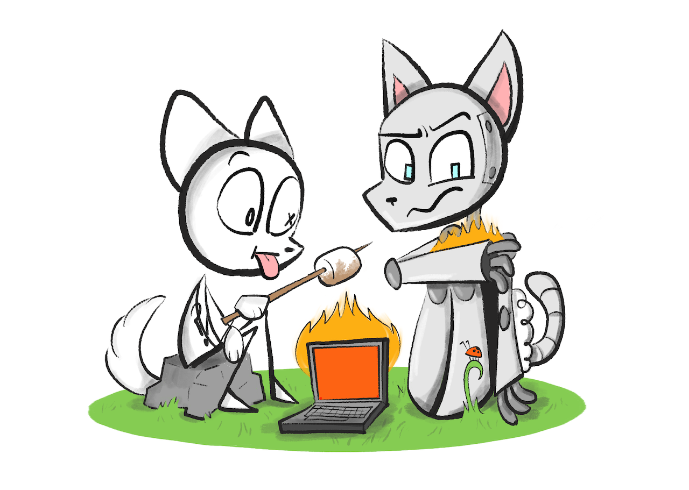

---

### 🤔 複習 #8（最後一個！）

<orbit-reviewarea color="violet">
    <orbit-prompt
        question="「通用人工智慧」（AGI）是一個模糊的說法，指向："
        answer="「能夠以人類專家水平或更好的水平執行重要知識型任務的軟體」。（例如自動科學發現）">
    </orbit-prompt>
    <orbit-prompt
        question="AI 專家預測我們有超過一半機會擁有 AGI 是什麼時候？"
        answer="中位數答案是 2060 年，但不確定性<i>滑稽地</i>巨大。所以：¯\\\_(ツ)\_/¯">
    </orbit-prompt>
    <orbit-prompt
        question="「AI 起飛」是假設的情景，當……"
        answer="一個 AI 可以提高它提高它提高它能力的能力的能力……（如此類推）">
    </orbit-prompt>
    <orbit-prompt
        question="對於 AI 起飛中 AI 自我改進速度的 3 種預測類型：（可視化）"
        answer=""
        answer-attachments="https://cloud-fwg0387g3-hack-club-bot.vercel.app/0aisffs-takeoffs.png">
        <!-- aisffs-takeoffs.png -->
    </orbit-prompt>
    <orbit-prompt
        question="「FOOM」起飛的論點："
        answer="如果在每一步，AI 在一半的時間內將其能力翻倍，AI 將在有限時間內達到無限（或理論最大值）。">
    </orbit-prompt>
    <orbit-prompt
        question="指數起飛的論點："
        answer="所有投資於自身的事物，如經濟或流行病，都以指數增長。">
    </orbit-prompt>
    <orbit-prompt
        question="穩定或減速起飛的論點："
        answer="所有事物，即使一開始以指數增長，也會遇到「收益遞減」並減速。">
    </orbit-prompt>
    <orbit-prompt
        question="為什麼「緩慢、穩定」的起飛不一定安全的類比："
        answer="鐵達尼號是緩慢而穩定的，但仍然是致命的。">
    </orbit-prompt>
    <orbit-prompt
        question="謹慎派對強大 AI 的直覺「先驗」："
        answer="歷史上通常當一個群體遇到「更高能力」的群體時，對前者來說會很糟糕。">
    </orbit-prompt>
    <orbit-prompt
        question="懷疑派對強大 AI 的直覺「先驗」："
        answer="每一代人都預測末日，但智人已經持續前進了 300,000 年。">
    </orbit-prompt>
    <orbit-prompt
        question="為什麼試圖預測「毀滅概率」可能是一個自我否定的預言："
        answer="如果人們認為 P(毀滅) 很低，他們會變得自滿，所以它會發生。如果人們認為 P(毀滅) 很高，他們會強烈反應，它會被避免。">
    </orbit-prompt>
    <orbit-prompt
        question="在安全 vs 能力圖上好/壞 AI 軌跡的可視化："
        answer=""
        answer-attachments="https://cloud-offppr5mb-hack-club-bot.vercel.app/0aisffs-goodbad.png">
        <!-- aisffs-goodbad.png -->
    </orbit-prompt>
</orbit-reviewarea>

---

# 第一章總結

恭喜！你現在對 AI 的了解遠遠超過你需要的。如果你以前對人們說「別擔心，AI 只能遵循我們告訴它的規則」，或者「要擔心，AI 會獲得感知然後為了報復我們奴役它而殺死我們所有人」感到<i>惱火</i>⋯⋯好吧，現在你可以以<i>更了解情況</i>的方式對他們感到惱火了。

讓我們回顧一下：

<b>1)</b> ⏳ AI 的歷史有兩個主要時代：

* <u>2000 年之前，符號 AI</u>：全是邏輯系統 2，沒有「直覺」系統 1。超人類國際象棋，無法識別貓。
* <u>2000 年之後，深度學習</u>：全是「直覺」系統 1，很少邏輯系統 2。幾秒鐘內模仿梵高，但在逐步邏輯上很爛。

<b>2)</b> ⚙️💭 AI 的下一個根本步驟可能是<i>融合</i> AI 邏輯和 AI 直覺。當 AI 能做系統 1 <i>和</i> 2 時，<i>那</i>才是我們會得到它最高承諾⋯⋯和危險的時候。

<b>3)</b> 🤝 「AI 安全」是一堆尷尬的聯盟：

* 致力於推進 AI 能力和/或 AI 安全的研究人員。
* 關心從「壞」到「存在性」的風險，以及從「AI <i>意外地</i>對人類失控」到「AI 被失控的人類<i>故意</i>濫用」的人。

<b>4)</b> 🤷 專家們對 AI 未來的<i>一切</i>都有巨大分歧：我們什麼時候會獲得 AGI，AGI 會以多快的速度自我改進，我們的軌跡是朝向好地方還是壞地方。

（如果你跳過了閃卡並想現在複習它們，點擊右側邊欄的目錄圖標，然後點擊「🤔 複習」連結。或者，下載[第一章的 Anki 牌組](https://ankiweb.net/shared/info/219158432)。）

---

<i>我們能控制我們創造的東西嗎？</i>

正如他們所說，「問題描述得好，問題就解決了一半」。[^solved-quote]

[^solved-quote]: 經常被歸因於 Charles Kettering，通用汽車前研究主管，但我找不到這句話的<i>實際</i>引用。

所以在我們看到 AI 安全的解決方案提議之前，讓我們首先嘗試盡可能精確和富有成效地分解問題。刷新你的記憶，我們正在嘗試解決「AI 對齊問題」，它的核心是這一個問題：

> <i<b>我們如何確保 AI 穩健地服務於人道價值觀？</b></>

好問題。讓我們深入探討！👇



