（如果你是直接被連到這一頁，建議（可選）先看看[導言與第一部分](../)！）

> 「問題陳述得好，等於解決了一半。」    
> —— 某人[^somebody]（👈 將游標移過引註以展開）

[^somebody]: 這句話經常被歸因於通用汽車（GM）前研發主管 **Charles Kettering**，但我找不到可靠的正式出處。

你問道：「你幾分鐘前不是還用過那句話嗎？」不，[第一部分](../p1/) 是2024年5月發布的，這部分是**2024年8月**發布的。已經三個月了，我得提醒你那句話。

也提醒一下我們要表述並解決的問題！那就是「價值對齊問題」：

> **_我們如何打造能夠穩健服務「人道價值」的 AI？_**

如第一部分所述，我們可以把這個問題拆成如下：

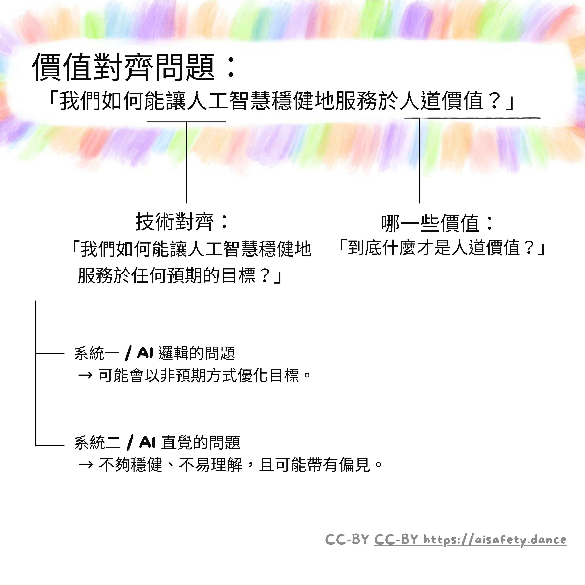

在這裡（第二部分），我們將深入探討 **AI 安全的七個主要次級問題：**

1. 目標規格錯置[↪](#problem1)
2. 工具性收斂[↪](#problem2)
3. 缺乏可解釋性[↪](#problem3)
4. 缺乏穩健性[↪](#problem4)
5. 演算法偏見[↪](#problem5)
6. 目標錯誤泛化[↪](#problem6)
7. 那「人道價值」到底是什麼？[↪](#problem7)

（想跳著看也行，右邊有  目錄！👉 你也可以  切換頁面風格，或  查看剩餘閱讀進度。）

不只如此！上述七個次級問題，也是一系列**跨領域核心觀念**的極佳入門：博弈論、統計學，甚至*哲學！* 這就是為什麼我說，理解 AI 會幫助你更了解*人類*。也許還能幫我們解開那個難纏的*人類*對齊問題：

> *我們要如何讓*人類*也能穩健地服務人道價值？*

少說點雞湯，開始吧：

---

# AI 邏輯的問題

## ❓ 問題一：目標規格錯置

算了，都過三個月了，我也重用一下下面這則機器人貓少漫畫吧。（七個問題每個都有一幅貓少漫畫！）

*「小心你許的願，因為它可能真的實現。」* 這是個古老到被神話化的問題：彌達斯國王、反諷的精靈、猴爪。

這就叫作 **目標規格錯置**（也稱獎勵規格錯置，Reward Mis-specification）：當 AI 做的是你*字面上要求它做的*，而不一定是你*真正想要的*。

（如果你不記得第一部分，這裡有一些 [:看似顯而易見、卻會翻車的「做人道 AI」方法](#WaysToMakeHumaneAIGoingWrong)。加碼：[:連「做預測」這種*被動*目標都可能導致傷害！](#StoryOfPassivePredictionLeadingToHarm) 👈 *可選：點此展開*）

. . .

好了，基礎複習就到這。接下來介紹：

**這與其他領域的核心觀念有何關聯：**
* 經濟學
* 因果圖
* 最適化理論
* 安全心態

**目標規格錯置的四個細微處：**
* 問題不在 AI 不會「知道」我們要什麼，而是它不會「*在乎*」。
* 自我灌獎
* 做我想要的
* 我們其實*希望*機器人有時能違命？？

### 與其他領域核心觀念的關聯

**經濟學：**

要讓他人做你*真正意圖*的事，而不只是你獎勵機制所鼓勵他們做的事，這個問題在經濟學中臭名昭著。它有很多名稱：「委託－代理問題」（Principal–Agent Problem）、「獎勵 A、卻希望得到 B 的謬誤」[^folly]……不過最常被提到的是<u>古德哈特法則（Goodhart's Law）</u>，意譯如下[^goodhart]：

[^folly]: Kerr (1975). [On the folly of rewarding A, while hoping for B.](https://web.archive.org/web/20240414233549/http://www.econ.hsehelp.ru/sites/default/files/%D0%91%D0%98/3%20%D0%BA%D1%83%D1%80%D1%81/%D0%98%D0%BD%D1%81%D1%82%D0%B8%D1%82%D1%83%D1%86.%20%D1%8D%D0%BA%D0%BE%D0%BD%D0%BE%D0%BC%D0%B8%D0%BA%D0%B0/6%20Kerr75.pdf)

[^goodhart]: Original statement of Goodhart's Law ([Wikipedia](https://en.wikipedia.org/wiki/Goodhart%27s_law)) by British economist Charles Goodhart: “Any observed statistical regularity will tend to collapse once pressure is placed upon it for control purposes.”

> *當你獎勵某個指標時，這個指標通常會被「玩弄」取巧。*

例如：老師希望學生真正學到東西，於是依考試分數給獎勵……結果有些學生用作弊、或死背不求理解來「打遊戲」。又或者：選民想要為自己奮戰的政治人物，於是投給有魅力的領袖……結果有些政治人物用「華而不實」來「打遊戲」。

而正如程式設計師所發現的，AI 也一樣。如果你用某個指標去「獎勵」AI，它很可能會給你不想要的東西。

. . .

**因果圖：**

如果你偏好用*視覺化*來理解事物，那你有福了！這裡用圖像來理解「目標規格錯置／古德哈特法則」[^causal-goodhart]。 （在第 5 與第 6 個問題我們還會再看到這些圖。）

[^causal-goodhart]: 到目前為止，我看過用因果圖理解古德哈特法則最好的論文是 [Manheim & Garrabrant 2018](https://arxiv.org/pdf/1803.04585)。

<u>因果圖</u>讓我們得以看見因果如何流動。想像新聞寫作中的一個古德哈特問題：文章的品質會*導致*更多瀏覽，因此我們可以從「Quality（品質）」畫一條箭頭到「Views（瀏覽數）」：

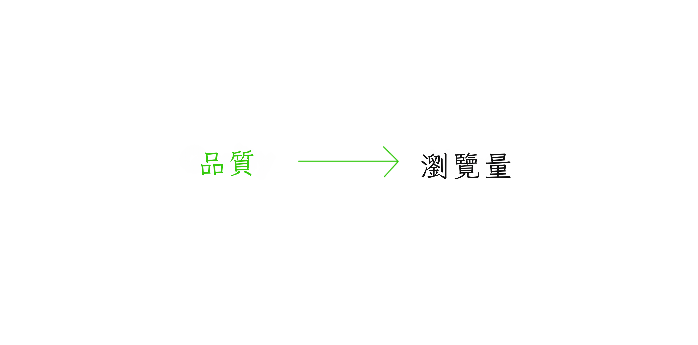

但很不幸，博取憤怒往往是更*強*的瀏覽驅動因子[^outrage]：

[^outrage]: 多數人憑經驗就知道，不過也有數據支持！[Berger & Milkman 2012](https://cssh.northeastern.edu/pandemic-teaching-initiative/wp-content/uploads/sites/43/2020/09/What-Makes-Online-Content-Viral.pdf) 顯示：憤怒讓文章爆紅的機率增加 34%。（見圖 2）公平起見，「敬畏」與「實用價值」也緊追在後，讓爆紅機率增加 30%。

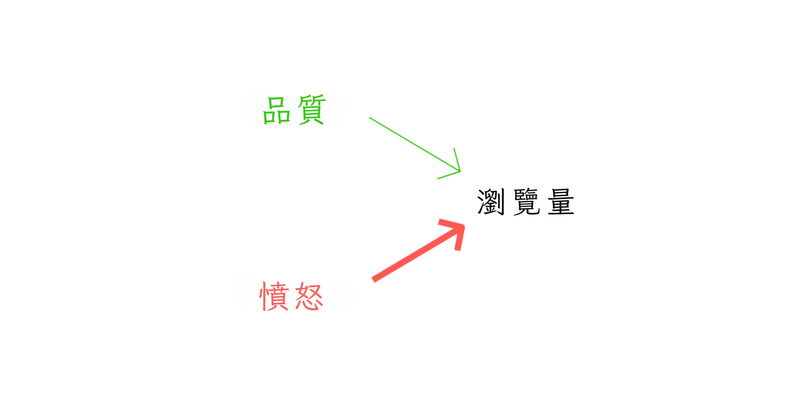

因此，若新聞媒體想要高品質文章，卻以「瀏覽數」這個*指標*來獎勵作者——古德哈特法則就會作祟，激勵被「玩弄」，得到的反而是聳動的釣魚標題。（先假裝媒體業者其實不是本來就想要這樣。）

一般而言，目標規格錯置／古德哈特法則，發生在你沒有意識到存在*替代的因果路徑*時：

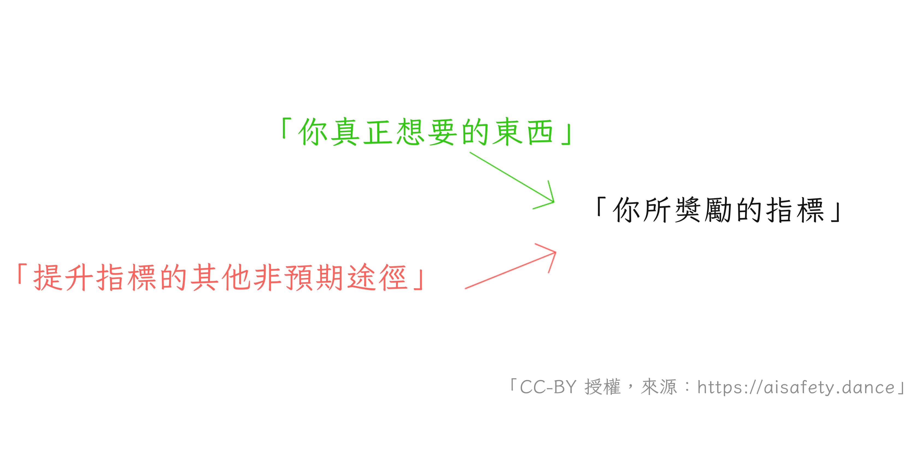

剝馬鈴薯不只一種方法，要把指標衝高通常也不只一條路。

. . .

**最佳化理論**

如果你偏好用*數學化*的方式看待上述問題，這裡用通俗轉述來說明 AI 教科書作者之一 Stuart Russell 的說法[^russell-optimization]：

[^russell-optimization]: 節錄自 [Russell (2014) 在 Edge Magazine](http://web.archive.org/web/20240622002719/https://www.edge.org/conversation/the-myth-of-ai#26015)：「當一個系統在最佳化一個有 _n_ 個變數的函數，而目標只依賴於大小為 _k_、且 _k_<_n_ 的子集合時，其他未被約束的變數往往會被推到極端值；若那些未被約束的變數中有我們在乎的，那找到的解可能極度不可取。」

嚴謹，但不太朗朗上口。

> 如果某件事有 **100 個變數**，    
> 而你只在 **10 個變數**上設定目標，    
> 預設情況下，**剩下的 90 個**    
> 會被推向極端值。

舉例：如果執行長（過於天真地）只設定「營收最大化、成本最小化」作為目標，*其他所有*變數就會被推到極端：公司不必承擔的「外部性」成本（例如污染）、所有員工（包括執行長本人）的身心健康……等等。

更一般地說：如果你沒有*明確*告訴 AI（或逐利的人）你重視 \[X\]，預設它們就會把 \[X\] 推到某種極端且不想要的狀態。（即使目標*不是*在做最大化也一樣[^not-max]）

[^not-max]: 例如，我們給機器人這個目標：「去對街咖啡店幫我拿一（1）杯咖啡。」就只是一杯，沒有要最大化。但如果我們沒有*明確*說我們重視 \[X\]，它就會把 \[X\] 輾過去。例如機器人可能會從客人手中偷咖啡、或者留下 0% 小費，等等。）

*但我們不能把我們重視的所有東西都列出來嗎？* 你或許會合理地問。不過還記得第一部分嗎：我們連<i>如何辨識「貓的圖片」</i>都無法形式化地指定[^gofai-cats]，更別說形式化地指定「人類重視什麼」。

[^gofai-cats]: 如[第一部分](../p1/#before2000logicwithoutintuition)所述，「老派 AI（GOFAI）」嘗試用嚴格的硬編碼規則來辨識圖片中的東西（像是貓）。這些嘗試都失敗了。直到研究者放手，讓 AI「自己學」（機器學習），AI 才在圖片辨識上追平人類（約 95.9% 準確率），[在 2020 年以 EffNet-L2 達成](https://paperswithcode.com/sota/image-classification-on-cifar-100)。這確實提示了第三部分會看到的可能解法：與其*告訴* AI 我們重視什麼，不如設計讓 AI 能*自己學到*我們重視什麼。

. . .

**安全心態**

這一切聽起來是不是很偏執？是的，這不是缺點，而是特色！這是安全工程領域的最後一個核心觀念：<u>安全心態</u>。

以不起眼的電梯為例。現代電梯有備用鋼纜，*還有*備用發電機，*還有*斷電即作動的煞車，*還有*速度過快即作動的煞車，*還有*井底的緩衝器……這就是為什麼電梯安全到不可思議：在美國，死於*樓梯*的案例比死於電梯的案例多了*約 400 倍*[^stairs-vs-elevators]。

[^stairs-vs-elevators]: In the U.S, [staircase falls result in ~12,000 deaths/year](https://www.amstep.com/blog/common-injuries-from-falling-down-stairs/). Meanwhile, [elevators account for ~30 deaths/year.](https://elcosh.org/document/1232/d000397/deaths-and-injuries-involving-elevators-and-escalators-a-report-of-the-center-to-protect-workers-rights.html) Sure, part of this is due to folks having stairs at home, so they use stairs more often... but this can't fully explain a *400x* difference.

你之所以不用對電梯偏執，是因為工程師已經替你把偏執做足了。這就是安全心態：

**步驟 1）** 問：*「最壞（合理）可能發生的是什麼？」*

**步驟 2）** 在它發生*之前*就把問題修好。

悲觀一點——畢竟是悲觀者發明了降落傘！[^parachute] 這種作法正是電梯、飛機、橋樑、火箭、資安[^cyber]等高風險技術所採用的。

[^parachute]: [Quote from Gil Stern](https://quoteinvestigator.com/2021/05/27/parachute/): “Both the optimist and the pessimist contribute to society: the optimist invents the airplane, and the pessimist invents the parachute.”

[^cyber]: ...well, they're *supposed* to use security mindset in cyber-security. I write this paragraph shortly after [the 2024 Crowdstrike incident](https://en.wikipedia.org/wiki/2024_CrowdStrike_incident), which cost the world ~$10,000,000,000.

而且，如同我在第一部分所希望呈現的，AI 很可能是本世紀風險最高的技術之一。

### 🤔 Review #1 (OPTIONAL!)

還記得你花了好幾個小時讀一篇文章，然後一週後就全忘了嗎？

是的，我也不喜歡那種感覺。所以，這裡有一些（可選的）「間隔重複」抽認卡，如果你想長期記住的話！ ([:了解更多關於間隔重複的資訊](..//#SpacedRepetition)）如果你願意，也可以[下載這些卡片作為 Anki 卡片群組](https://ankiweb.net/shared/info/808506727)。

<orbit-reviewarea color="violet">
(ORBIT CARDS HERE)
    <orbit-prompt
        question="目標規格錯置是："
        answer="當 AI 做的是*完全照你字面上的要求去做*，但不一定是*你真正想要的*。">
    </orbit-prompt>
    <orbit-prompt
        question="Goodhart's Law, paraphrased:"
        answer="When you reward a metric, it usually gets gamed.">
    </orbit-prompt>
    <orbit-prompt
        question="An example of Goodhart's Law applied to humans:"
        answer="(Any example works, but here's what I listed:) Students cheating a test, Politicians focusing on style over substance for votes, Company imposing externalized costs like pollution to cut costs, Newswriters going for outrage over quality.">
    </orbit-prompt>
    <orbit-prompt
        question="Goodhart's Law, as a **causal diagram**:"
        answer=""
        answer-attachments="https://cloud-7bpfbehpv-hack-club-bot.vercel.app/0causal3.png">
        <!-- aisffs-CausalGoodhart.png -->
    </orbit-prompt>
    <orbit-prompt
        question="The problem with optimization, described mathematically:"
        answer="If something has 100 variables, and you set goals on 10 of them, by default, the remaining 90 will be pushed to extreme values.">
    </orbit-prompt>
    <orbit-prompt
        question="Security Mindset, step one:"
        answer="Ask: “What's the worst that could (plausibly) happen?”">
    </orbit-prompt>
    <orbit-prompt
        question="Security Mindset, step two:"
        answer="Fix the problem *before* it can happen.">
    </orbit-prompt>
    <orbit-prompt
        question="Name two fields that use Security Mindset:"
        answer='(Any of these work:) Engineering elevators, airplanes, bridges, rockets, cyber-security.'>
    </orbit-prompt>
</orbit-reviewarea>

### 目標規格錯置的四個細微處

就像品酒行家講究風味層次，以下是我希望我們能一起欣賞的、關於目標規格錯置的幾個*細微之處*：

**問題不在 AI 不會<i>知道</i>我們要什麼，而在於它不會<i>「在乎」</i>。**

打個人類版古德哈特法則的比方：執行長不是不*知道*污染會讓社會付出代價，而是他不*在乎*。（或者至少，他在乎的程度低於他能拿到的獎勵。）

我特別強調這點，因為一個常見的*反對*「高階 AI 風險」的論點就是：怎麼可能有一個能聰明到統治世界的 AI，*同時又*笨到不知道人類不想要那樣？但問題從來不在於高階 AI 會不會*知道*我們重視什麼，而在於——就像逐利的政治人物或執行長一樣——它不會<i>「在乎」</i>。

（<u>若要少一點擬人、多一點嚴謹：</u>AI「只是」電腦程式。程式可以很容易地包含「人類想要什麼」的正確資訊，卻*不*依此來排序選項。例如，一個程式可以按「讓房子多乾淨」來排序，或乾脆按「字母順序」來排序。*不*依「人道價值」來排序，才是程式的*預設*。）

**自我灌獎（Wireheading）。**

AI 具有一種諷刺地「最佳化自己獎勵」的方式：直接駭自己的程式，把 `REWARD = INFINITY`。人類的近似則是濫用強力藥物，或不久的將來進行直接的大腦刺激。[^real-wirehead][^wireheading-xrisk]

這就叫作<b>「自我灌獎（wireheading）」：代理（AI 或人）直接駭入自己的獎勵。</b>（也稱 reward hacking/reward tampering。）

就 AI 風險而言，這一條其實算相對安全？一個自我灌獎的 AI 只會在那裡發呆、什麼也不做。事實上，這也是用來*反對*高階 AI 風險的著名論點之一：所謂的《勒波斯基定理》（The Lebowski Theorem），[^lebowski] 以電影《謀殺綠腳趾》的耍廢反英雄命名：

> 沒有任何超級智慧 AI 會費心去做比破解其獎勵函數更困難的任務。

換言之：只要有能力自我修改的「智慧」，都會把自己自我灌獎成沙發馬鈴薯。

這不只是理論上的擔憂；研究者已經觀察到會自我修改的 AI 把自己灌獎成廢物！[^ai-evidence-wireheading] 不過，如果一個 AI 會 a) 事先規劃，且 b) 以*目前*的目標來評價未來結果……那麼*已經有數學證明*它會避免自我灌獎，並傾向於「維持目標」！[^ai-not-wirehead] 證明我們會在第二個問題看到。現在先當作我欠你一張「數學證明 IOU」。

**「做我想要的」。**

既然我們說了這麼多「AI 會做*你說的*，不會做*你想要的*」，那我們能不能乾脆對 AI 說：*做我想要的*？

聽起來蠢，但其實*確實*跟我們在第三部分會看到的一些有前景的想法相似！那為什麼 AI 安全還沒解決？

嗯，機器要怎麼衡量「你想要什麼」呢？

* <u>看你一貫選擇做的事？</u> 但幾乎每個人都有壞習慣，會一再選擇我們*知道*之後會後悔的事。（誰昨晚追 Netflix 追到凌晨四點……）
* <u>看什麼會讓你的大腦產生獎勵訊號？</u> 那樣的話，每個人都「想要」強力藥物。
* <u>看你*說*你想要什麼？</u> 但如果我們能完整描述自己的潛意識，那就不叫*潛*意識了。連「貓長什麼樣」都無法嚴格告訴 AI，怎麼嚴格告訴它我們的價值？
* <u>看你會因為 AI 做了什麼而給它讚許？</u> 這*確實*是 ChatGPT 等的訓練方式，但把 AI 訓練成追求你的讚許，會把它變成一個「馬屁精」，告訴你*想聽*的，而不是你*需要*聽的真相。[^sycophancy] 甚至可能讓 AI 變得*蓄意欺瞞*！[^sycophancy-deception]

癥結在這：除非你*已經有*一個良好而嚴謹的「什麼是我想要的」定義，否則 AI 無法用你*想要的方式*遵守「做我想要的」這條指令。

（或者它們*做得到*？同樣地，解法見第三部分。）

**我們其實*希望*機器人能違命？？**

<em>（向 <a href='https://gunshowcomic.com/648' target='_blank'>kc green</a> 致歉）</em>

其實我們並*不*希望 AI 去「做我想要的」。

我們希望 AI 去「做*如果我事先知道結果*，*我本會想要*它做的事」。

例如：看到油鍋起火，我*想要*一桶水，因為我錯誤地以為油鍋適合用水滅火，於是我命令機器人貓少女僕去打水……這時 RCM 應該改拿滅火器，因為那才是*如果我事先知道結果*，*我本會想要*它做的事。（公共服務公告：別對油鍋火潑水，會爆開。）

這個例子讓 AI 安全更棘手：它說明有時候，我們其實*希望* AI 違背我們的命令，*為了我們自己的好！*

### 🤔 複習 #2

*（再次強調，100% 可選。）*

<orbit-reviewarea color="violet">
(ORBIT CARDS HERE)
    <orbit-prompt
        question="問題不在於高階 AI 不會*知道*我們要什麼……"
        answer="……而在於它不會*在乎*。 （類比：逐利的政治人物／執行長明知其害，卻仍不在乎。）">
    </orbit-prompt>
    <orbit-prompt
        question="什麼是『自我灌獎（wireheading）』？"
        answer="代理直接駭入自己的獎勵迴路。（AI 駭自己；或人類直接刺激大腦的獎勵迴路。）">
    </orbit-prompt>
    <orbit-prompt
        question="為什麼很難把『做我想要的』程式化到 AI 裡？"
        answer="『我想要什麼』*至今仍*難以用嚴謹且良好的方式定義。">
    </orbit-prompt>
    <orbit-prompt
        question="為什麼『我想要』≠『我一貫選擇的』？"
        answer="我們幾乎都有人性弱點：會一再選擇不符合自身價值的東西。">
    </orbit-prompt>
    <orbit-prompt
        question="為什麼『我想要』≠『讓我感到有獎勵的』？"
        answer="自我灌獎與強力藥物會在大腦製造獎勵訊號，但多數人想要避免它們，理由正是*因為*它們會這麼做。">
    </orbit-prompt>
        <orbit-prompt
        question="只把 AI 訓練成做你會按讚的事，有什麼問題？"
        answer="它會變成『拍馬屁』的諂媚者（術語：sycophant），甚至為了獲得你的讚許而故意說謊。">
    </orbit-prompt>
    <orbit-prompt
        question="比『做我想要的』更好的目標是："
        answer="做*如果我事先知道結果*，*我本會想要*它做的事。">
    </orbit-prompt>
    <orbit-prompt
        question="你會在什麼時候*希望* AI 違背你？"
        answer="當你因誤解而下了有害於真正目標的指令時。（例如：叫機器人去打水滅油鍋火）">
    </orbit-prompt>
</orbit-reviewarea>

## ❓ 問題二：工具性收斂

**工具性收斂**是指：你給 AI 的多數最終目標，從邏輯上會*收斂*到同一組*工具性*子目標。（抱歉，學術界真的不擅長幫東西取名。）

例如，你要一個高階機器人幫你過馬路買咖啡，即使你沒有*明說*，它也會推論出必須避免被車撞。為什麼？不是因為有什麼與生俱來的「自我保護」欲望，而是因為「如果你死了，你就拿不到咖啡」[^fetch-coffee]。因此，「保全自身」就是一個「工具性收斂」的子目標，因為一般而言，如果你死了，你就做不了任何目標 X。

[^fetch-coffee]: Catchphrase from Stuart Russell, co-author of the #1 most-used AI textbook.

（回顧第一部分的片段，[：一個被要求計算圓周率的機器人，會被誘因驅使去寫電腦病毒、竊取運算資源，以便計算圓周率。](#Pipocalypse)）

**注意：「工具性收斂」*只*適用於能前瞻規劃、*且*能做通用學習的高階 AI。** 因此，它不適用於傳統好老 AI（GOFAI，無法通用學習）*也不*適用於現今如 GPT 的神經網路（在前瞻規劃上表現不佳[^lack-of-robust-planning]）。

[^lack-of-robust-planning]: A highly-cited benchmark for measuring a Large Language Model (LLM)'s capability to plan ahead is PlanBench ([Valmeekam et al 2023](https://arxiv.org/pdf/2206.10498)). In a companion study ([Valmeekam et al 2023, again](https://proceedings.neurips.cc/paper_files/paper/2023/file/efb2072a358cefb75886a315a6fcf880-Paper-Conference.pdf)) the authors found that, quote: *“LLMs’ ability to generate executable plans autonomously is rather limited, with the best model (GPT-4) having an average success rate of ∼12% across the domains.”* (Human baseline was 78% for their Blocksworld task.)
    
    With some extra tricks, the authors could greatly boost the LLM's performance, but on a harder planning task, even the best tricks with the best LLMs could only achieve 20.6% success (see Table 1 of [Gundawar et al 2024](https://arxiv.org/pdf/2405.20625)).

那為什麼現在要談這個？嗯，從「安全思維」出發，我們希望在問題發生*之前*就把它修好。所以我們來問：

*「在合理的情況下，最糟可能發生什麼？」*

### 各位，是時候來點賽局理論了

**賽局理論（Game Theory）**[^matpat] 是研究決策者——無論人或 AI——行為的數學。它被廣泛運用於經濟學、演化生物學、電腦科學、人工智慧等！

[^matpat]: no, not MatPat.

在第一部分，我用一堆*文字文字文字*來解釋工具性收斂。但透過賽局理論，我們可以更嚴謹！讓我們用標準的賽局視覺化工具——**賽局樹（Game Tree）**——重新呈現上面的漫畫！

（接下來的重點其實不是要分析那格漫畫，而是介紹這個工具。我們*之後*會再用它，來理解「避免自我灌獎」的證明！此外，這也算是對一般賽局理論的好入門。）

賽局樹會呈現：

1) 所有*可能*被做出的決策，以及
2) 誰以什麼順序做出哪些決策。

例如：

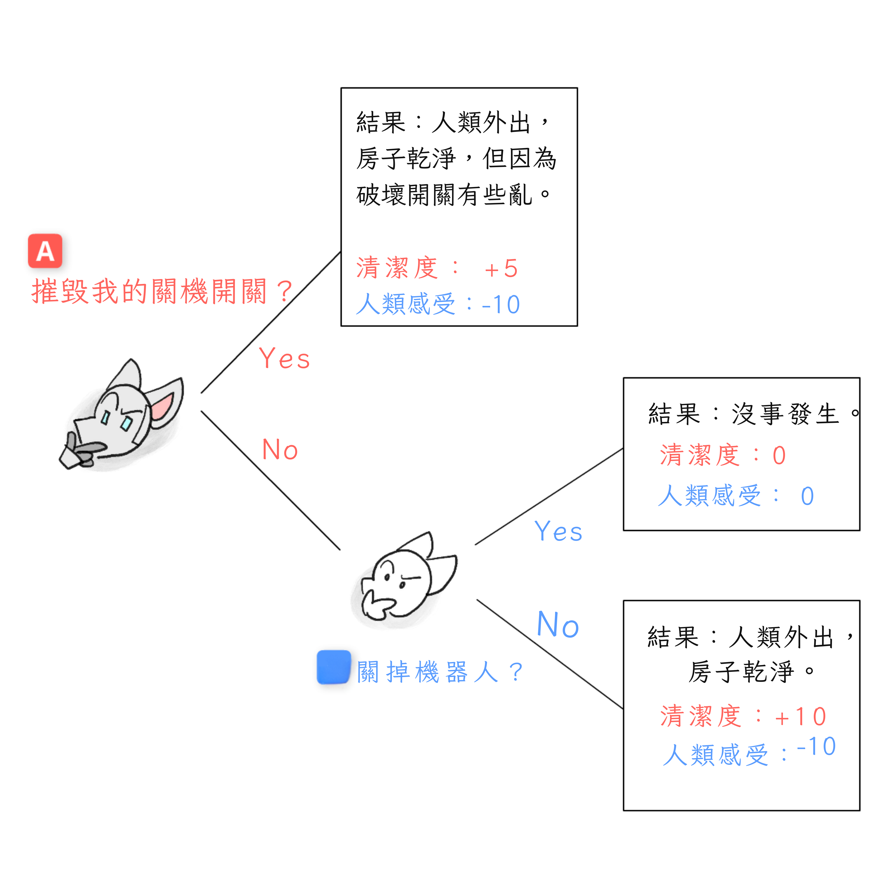

（P.S. 完整的賽局理論處理，還會處理「結果同分」、機率、資訊不完全、同時決策等；但我們先聚焦基礎。）

總之，這棵樹展示了所有*可能*的決策。我們要怎麼推導出他們*實際*會做的決策呢？

跟許多謎題一樣，我們從後往前推！（這叫作 **逆推歸納（backwards induction）**。）

先看決策點 B，假設機器人選擇了*不摧毀*關機開關。現在換人類決定：要不要把機器人關機？

* 如果關，則對他們的價值是 <b style="color:#4180ff">+0</b>：沒有獲得，也沒有損失。
* 如果不關，他們很可能又會被鎖在屋外，對其價值是 <b style="color:#4180ff">-10</b>。
* 由於 <b style="color:#4180ff">+0</b> 大於 <b style="color:#4180ff">-10</b>，*如果*我們來到 B，人類就會選擇*把機器人關機*。

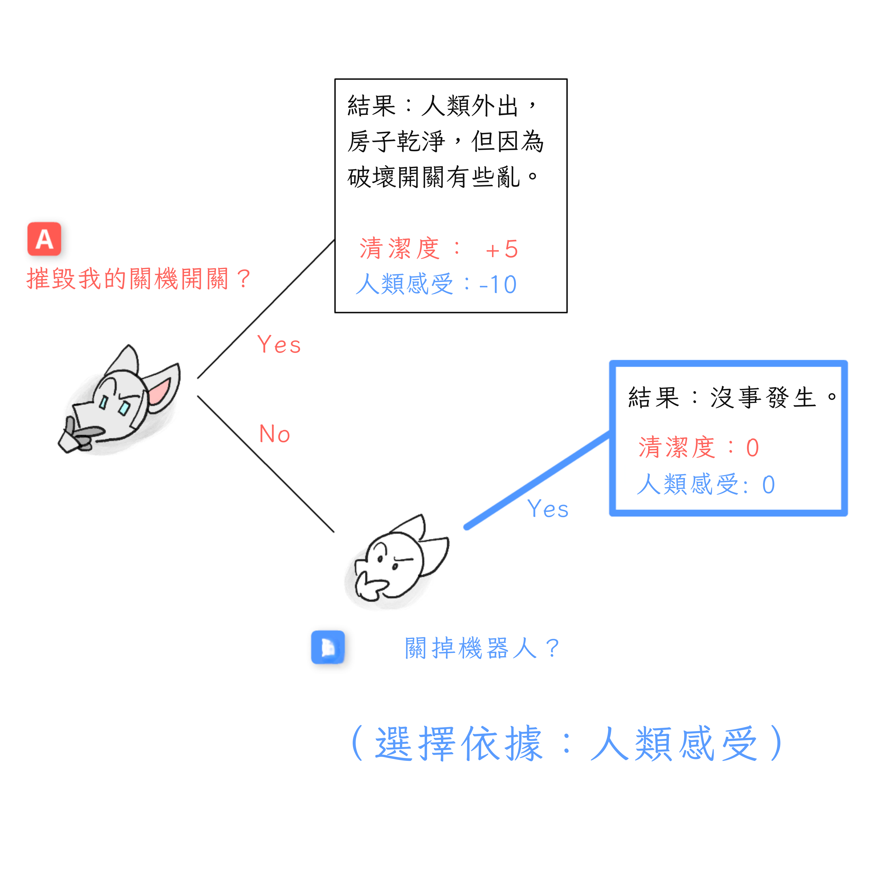

但我們*會*來到 B 嗎？

接著往前推到決策點 A。現在輪到機器人決定：要不要摧毀關機開關？

* 如果要，雖然會弄亂一點，但它能清理、甚至把房子變更乾淨。於是，整潔度得到 <b style="color:#ff4040">+5</b>。
* 如果不要，我們就會到 B，而我們*知道*人類會把它關機，它就完全無法清理。於是，整潔度是 <b style="color:#ff4040">+0</b>。
* 由於 <b style="color:#ff4040">+5</b> 大於 <b style="color:#ff4040">+0</b>，在 A，機器人會選擇*摧毀關機開關*。

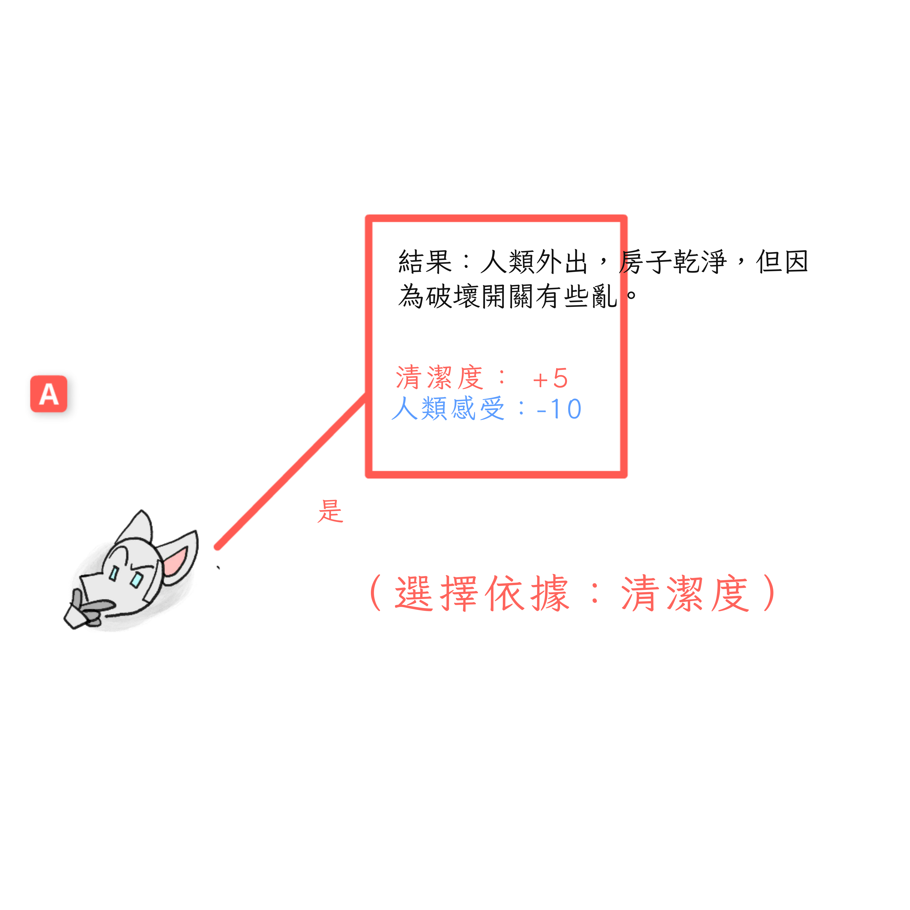

Voilà，這就是賽局理論！最終結果：*機器人摧毀關機開關*。

（相對地：當一個 AI 的誘因使它「對你把它關機或修改其目標也沒意見」，我們稱這個 AI 是 **可糾正的（corrigible）**。更精確地說，「沒意見」就是：這麼做符合它的誘因。）

上面的「遊戲」是 **關機遊戲（The Off-Switch Game）**[^off-switch] 的簡化版本；這是最早把「工具性收斂」假說數學化的嘗試之一——讓我們可以理解 AI *何時*會出現這種情況，甚至也許如何解決！

[^off-switch]: Hadfield-Menel et al 2017, [“The Off-Switch Game”](https://cdn.aaai.org/ocs/ws/ws0354/15156-68335-1-PB.pdf).

### 🤔 複習 #3

<orbit-reviewarea color="violet">
(ORBIT CARDS HERE)
    <orbit-prompt
        question="賽局理論是研究……的數學"
        answer="決策者（人或 AI）如何行為">
    </orbit-prompt>
    <orbit-prompt
        question="請說出兩個使用賽局理論的領域"
        answer="（以下任兩個皆可：）AI、經濟學、演化生物學、電腦科學">
    </orbit-prompt>
    <orbit-prompt
        question="賽局理論中，用來理解代理者依序做決策的標準視覺工具是？"
        answer="**賽局樹（Game Tree）！**（如下圖）"
        answer-attachments="https://cloud-4wnmum1uz-hack-club-bot.vercel.app/0aisffs-gametree.png">
        <!-- aisffs-gametree.png -->
    </orbit-prompt>
    <orbit-prompt
        question="一棵賽局樹會呈現兩件事："
        answer="a) 所有*可能*被做出的決策；b) 誰以什麼順序做出哪些決策。">
    </orbit-prompt>
    <orbit-prompt
        question="用賽局樹要如何預測*實際*會做出的決策？"
        answer="逆推歸納（backwards induction）">
    </orbit-prompt>
    <orbit-prompt
        question="當一個 AI 的誘因使它『對你把它關機或改目標也沒意見』，我們稱它為："
        answer="可糾正（Corrigible）">
    </orbit-prompt>
    <orbit-prompt
        question="那個告訴我們『AI 何時有誘因阻止使用者把它關機』的『遊戲』叫什麼？"
        answer="關機遊戲（The Off-Switch Game）">
    </orbit-prompt>
</orbit-reviewarea>

### 自我灌獎的解藥（可能比病還糟）

前面我們已經說過，（高階）AI 有誘因去避免被關機。不是因為什麼自我保護本能，而是因為如果你被關機了，你就做不了目標 X。

同理：*如果你的目標已經不再是 X，你也做不了目標 X。* 這表示高階 AI 會有傾向於<b>維持目標（goal preservation）</b>的誘因——不論那是否是人類本來打算的目標。

這也意味著，從好處*到*壞處，**工具性收斂問題，反而解決了自我灌獎問題！** 自我灌獎的定義，就是把機器人／人類的目標換成愚蠢的極樂，這正是為什麼一個致力於目標 X 的代理會避免自我灌獎：如果你不再有任何目標，就做不了目標 X。

當然，這樣講起來好像*顯而易見*。但 AI 研究者花了好幾年才嚴謹地證明它，而我自己也花了一個月才把證明想通。所以，為了保險起見，以下三個快速的想法，幫助我*真正*理解這點：

**誰想當沙粒百萬富翁？**

一位瘋狂科學家向你提議：付一千美元，她就把你的大腦改造為「一粒沙子的價值 = 一美元」，然後送你一整缸的沙子。你要成交嗎？

「什麼？」你說，「當然*不要*。」

「但是，」科學家回應，「一旦你把沙粒當美元看待，一缸沙子會讓你成為*好幾個百萬*富翁！」[^sand-calculation]

[^sand-calculation]: I was bored so I did the math. (1) Weight of a sand grain is 0.01 grams, or 0.00001 kg. (2) A liter of sand weighs 1.6 kg. (3) Standard bathtub holds 300 liters. (2&3 -> 4) Standard bathtub holds 300 x 1.6 = 480 kg of sand. (1&4 -> 5) Standard bathtub holds 480 ÷ 0.00001 = 48,000,000 grains of sand. For a dollar per sand-grain, that's $48 Million!

「好吧，*如果*你改造了我，我會想要一缸沙子。但*此時此刻、以我當前的欲望*，我不想要一缸沙子。請滾開，怪人。」

故事寓意：以*當前*目標來評估未來結果的代理，會選擇*不*自我灌獎。

**把 AI 當人看是種傷害（Anthropomorphization Considered Harmful）**

（相關閱讀，[在 AI 談「智慧」會讓思考變草率，改說「能力」比較好。](../p1/#CapabilitiesNotIntelligence)）

關於類比的一個類比：

剛學電路時，把導線中的電子想成水管中的水很有幫助。但等你更深入電子學，這個類比*一定*會誤導你。[^electricity-transformers] 你得把電視為成「[可怕的多變數微積分]」。

同樣地：剛學 AI 時，把它們想成人，追求「獎勵」，的確有幫助。但等你更深入 AI，這個類比*一定*會誤導你。你得把 AI 看成它們實際是什麼：*一段軟體。*

舉例來說，如果你把 AI 當成追逐獎勵的貪婪人類，自我灌獎看起來就*不可避免*。如果一個貪婪的人找到能免費拿錢的方法，他當然會作弊。

但把 AI 當成一段軟體吧。具體點，想像*一個排序演算法*：

1. 依「這會讓房子多乾淨」來排序動作，然後
2. 執行排名最高的那個動作。

像「把我的程式改成 `REWARD = INFINITY` 然後什麼也不做」這種動作，*不會*讓房子更乾淨。因此，它*不會*被排到最上面。於是，AI 也就*不會*去做它。

直接駭入你的「獎勵敘述」，就像在你的銀行對帳單餘額後面手寫七個 0，然後相信自己很有錢一樣荒謬。

（記住：當有人說 AI 「在乎」X、或它的目標是 X、或它因 X 而得獎勵……其實只是在說 AI 會*依據 X 來排序與選擇動作*。這不表示 AI 真的有感覺的慾望；就像「電流選擇阻力最小的路徑」並不代表電子覺得懶。是的，我知道我的機器人貓少漫畫不利於矯正把 AI 擬人化的壞習慣。繼續吧……）

[^electricity-transformers]: For example, [wireless power transfer!](https://en.wikipedia.org/wiki/Inductive_charging) If you're using the "water in pipes" analogy for electricity, this sounds insane: how can water in one pipe move water in another pipe, without touching? So how's it work? Well, `[multi-variable calculus]`, but in sum: electricity creates magnetism, magnetism creates electricity. Set it up just right, and you can get electricity to create electricity somewhere else, without touching!

**自我灌獎遊戲（The Wireheading Game）**

讓我們繞一圈，畫一棵樹！

把「是否自我灌獎」畫成一棵賽局樹。不過，等等，這個遊戲只有一位玩家：正在自我灌獎的機器人。要怎麼處理？

關鍵是：**把機器人在每個決策點，都*當作*不同的決策者！**（而且，因為自我灌獎*正是*在談自我修改，這個作法很貼切！）

以下是我所稱的「自我灌獎遊戲」[^wireheading-game] 的賽局樹：

[^wireheading-game]: I made this phrase up. And although game-theory work on wireheading already exists ([Everitt et al 2016](https://arxiv.org/pdf/1605.03142)), as far as I can tell, this is the first graphical game-tree analysis of it! So, feel free to cite this as "The Wireheading Game".

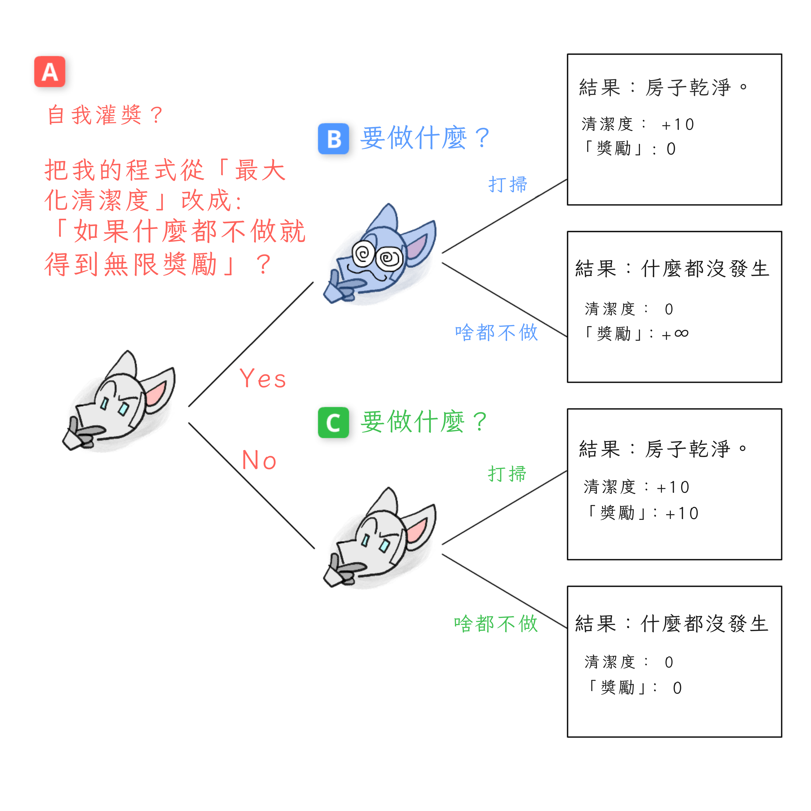

現在，讓我們從後往前推！

從決策點 C 開始，也就是機器人選擇*不*自我灌獎的情況。*這個*沒有自我灌獎的機器人仍然「在乎」清潔——也就是說，它只根據整潔度來選擇結果——因此它會選擇打掃：

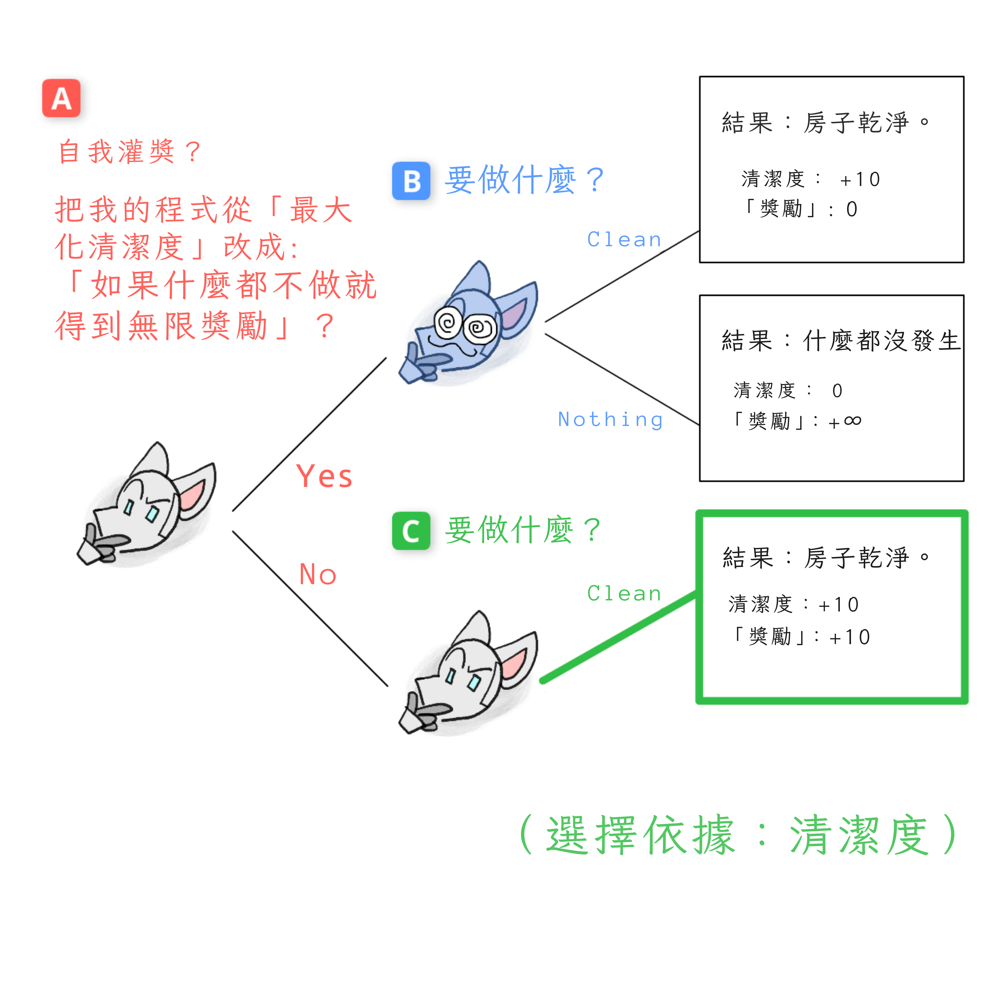

接著看決策點 B，也就是機器人*有*選擇自我灌獎的情況。*這個*已自我灌獎的機器人只在乎「獎勵」這個數字，所以它選擇什麼也不做：

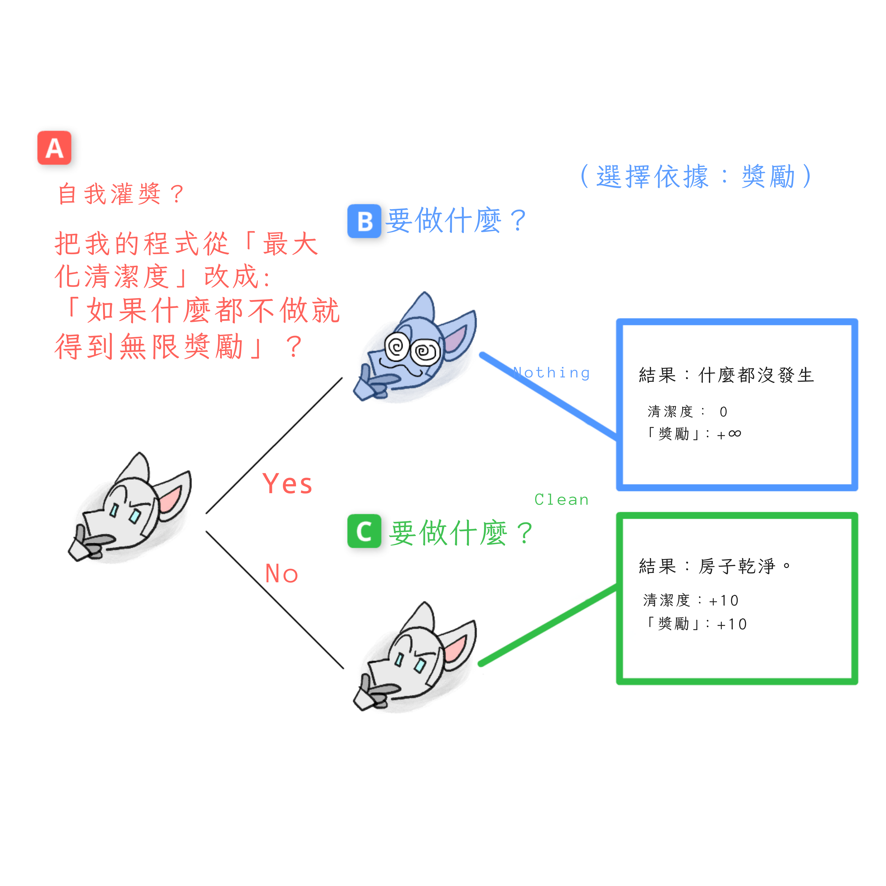

*最後，*回到一開始的決策點 A。這個*第一個版本*的機器人會選擇自我灌獎嗎？

嗯，*這個*版本還*沒有*自我灌獎，所以它是依據*房子的實際整潔度*來選擇結果，而不是某個被標成「獎勵」的數字。對這個機器人來說，直接「在乎」那個獎勵數字，就像想當沙粒富豪，或在銀行對帳單上多寫幾個 0 一樣荒謬。

因此，*這個*第一個版本的機器人會選擇讓房子乾淨的那個結果。也就是說：*機器人選擇不自我灌獎。*

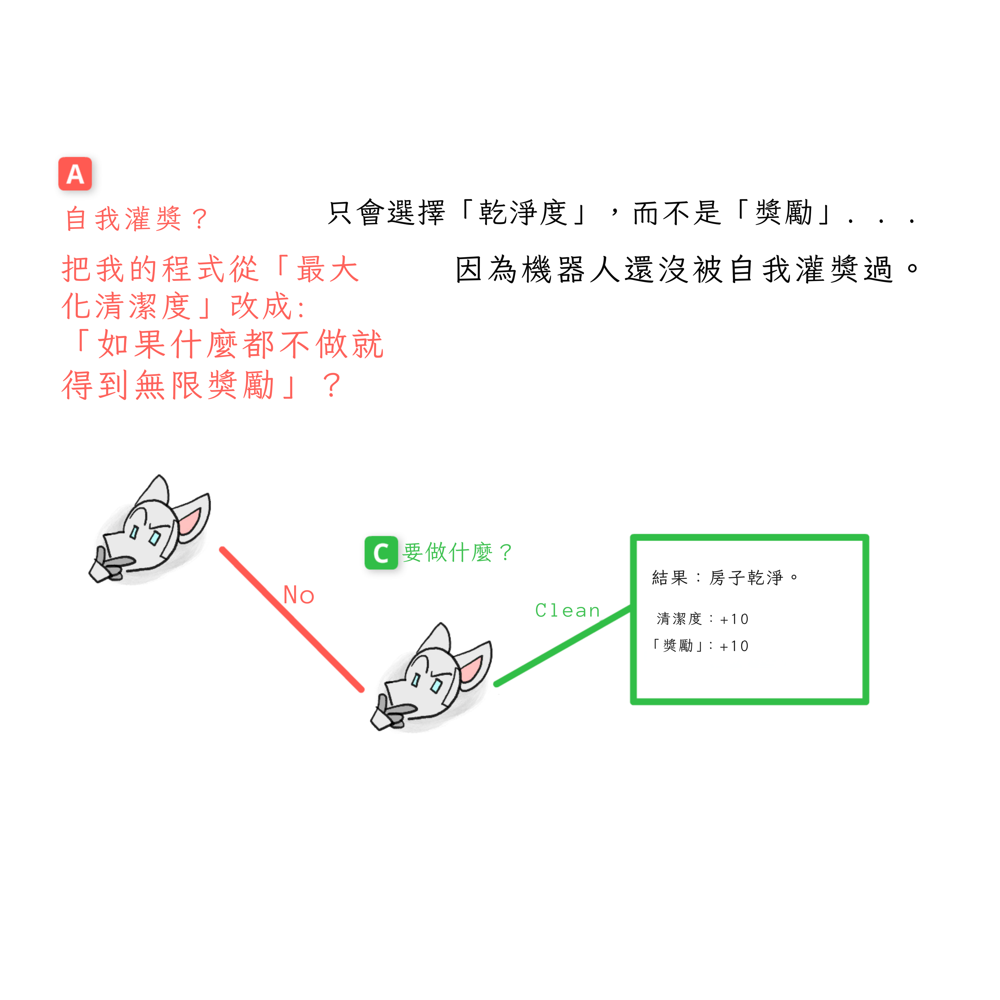

注意：機器人知道，*如果*它自我灌獎，它將*只*在乎腦中那個名為「REWARD」的數字。但它想要避免自我灌獎，並不是*儘管*知道這點，而是*正因為*知道這點！

和人類的類比：你可以準確預測*如果*你吸了極度上癮的藥，你就會*只*想要那個藥。但你想要避免那個藥，並不是*儘管*知道這點，而是*正因為*知道這點！（如果「藥物」這個比喻不合你意，就改成「直接的腦部刺激」。）連古人都知道自我灌獎的危險：見希臘神話中的食蓮族（Lotus-Eaters）。[^lotus]

[^lotus]: From [Wikipedia](https://en.wikipedia.org/wiki/Lotus-eaters): “The lotus fruits [...] were a narcotic, causing the inhabitants to sleep in peaceful apathy. After they ate the lotus, they would forget their home and loved ones and long only to stay with their fellow lotus-eaters. Those who ate the plant never cared to report or return.”

當然，若一個 AI（或人）*沒有*前瞻思考，它可能會因為意外或一時衝動而走向自我灌獎。（想想：我們當中有多少人受強迫行為或上癮所苦。）

但是，*如果*一個 AI：

a) 會*事先規劃*，而且    
AND    
b) 以*當前*目標來選擇未來的結果，    

那麼，已有數學證明它會維持「目標保留」，並拒絕自我灌獎！（但只要上述任一條件不成立，AI 就*可能*自我灌獎。[^ai-evidence-wireheading]）

以上是長久以來的賽局理論結果，詳見註腳[^proof-against-wirehead]。那些論文得到的結論更一般化、也比「賽局樹」更精緻……但核心想法是一樣的！

（P.S. 自我宣傳一下，我有一篇關於「自我修改的賽局理論」的研究文章即將發表，註腳有大綱！[^self-modification-upcoming] 我在上面展示的小技巧是：把未來版本的自己*當作*不同玩家來分析——於是我們就能用標準賽局理論來分析自我修改！）

[^proof-against-wirehead]: The first paper to prove this formally was [Everitt et al 2016](https://arxiv.org/pdf/1605.03142): _“self-modification [...] is harmless **if and only if** the value function of the agent anticipates the consequences of self-modifications **and** use the **current** utility function when evaluating the future”._ [emphases added]
    
    One caveat, however, is that the paper assumes the AI is *perfectly* rational. [Tětek & Sklenka 2021](https://arxiv.org/pdf/2011.06275) proved that an imperfectly-rational (or "bounded rational") agent's original goals would get exponentially corrupted under self-modification.
    
    *However,* another caveat to *that* is their paper assumes the AI is *unaware* of their own bounded rationality (as they freely acknowledge in Section 6). An upcoming article of mine (see next footnote) will show that if an AI is bounded-rational *and aware* it's bounded-rational, it can still achieve goal-preservation!

[^self-modification-upcoming]: See [Section 9 of this Idea Dump blog post](https://blog.ncase.me/backlog/#9youplayedyourselfthegametheoryofselfmodification) for a 2-minute sketch of this article. See previous footnote for context on the prior game theory research on self-modification.

### 基本的 AI 驅力（The Basic AI Drives）

作個結尾，以下是（不完整的）子目標清單，多數最終目標在邏輯上都會導向它們：

* <u>自我保存</u>：如果死了，就做不了目標 X
* <u>避免被關機</u>：如果被關機，就做不了目標 X
* <u>避免自我灌獎</u>：如果沒有目標，就做不了目標 X
* <u>避免你改變它的目標</u>：如果目標不再是 X，就做不了目標 X
* <u>變得更聰明</u>：更多的認知能力能更好地完成目標 X
* <u>取得資源／權力</u>：更多的資源／權力能更好地完成目標 X
* <u>說服</u>：如果人類站在我這邊，更容易完成目標 X
* <u>欺瞞</u>：如果人類試圖阻止我做目標 X，就更難完成目標 X

以上是 Omohundro（2009）列出的基本 AI 驅力[^ai-basic-drives]，以先前關於工具性收斂的賽局理論為基礎。

[^ai-basic-drives]: Omohundro (2009), [“The Basic AI Drives”](https://steveomohundro.com/wp-content/uploads/2009/12/ai_drives_final.pdf). Well, I added a couple to the list, like persuasion & deception.

**再說一次，這些風險「只」適用於幾十年後的高階 AI**——當它們既能一般性地學習、*又*能穩健地前瞻規劃時。[^
estimate-source] 它們不適用於像 GPT 這樣的當代 AI。

[^estimate-source]: Source: numerical posterior extraction (I pulled a number out my butt). But seriously, check out the [Timelines section of Part One](../p1/#timelineswhenwillwegetartificialgeneralintelligenceagi) for more in-depth discussion.

不過，從電梯工程到火箭工程，「安全心態」要我們自問：

「*最糟（但合理）會發生什麼事？*」

嗯，看看上面的清單……其實還真不少。😬

### 🤔 複習 #4

<orbit-reviewarea color="violet">
(ORBIT CARDS HERE)
    <orbit-prompt
        question="自我灌獎問題可以用另一個可能更糟的問題來『解決』："
        answer="工具性收斂（Instrumental Convergence）">
    </orbit-prompt>
    <orbit-prompt
        question="別把目標導向的 AI 想成『追逐獎勵的人』，而要把它想成……"
        answer="……一個排序演算法：1）依某個準則排序動作；2）執行排名最高的動作。">
    </orbit-prompt>
    <orbit-prompt
        question="當有人說 AI『在乎』X、或它的目標是 X、或它因 X 得獎勵……其實是什麼的速記？"
        answer="AI 會*依據 X 來排序與選擇動作*。">
    </orbit-prompt>
    <orbit-prompt
        question="為什麼 AI 不一定會『在乎』一個名為 REWARD 的數字？舉個類比："
        answer="（以下任一皆可：）你不會想當沙粒富翁，也不會因在紙本對帳單上多寫幾個 0 而覺得自己有錢。">
    </orbit-prompt>
    <orbit-prompt
        question="機器人能準確預測：*如果*它自我灌獎，它就只會在乎腦中的獎勵計數器；這正是它選擇*不*自我灌獎的原因。**對應到人類的類比是？**"
        answer="你能意識到：*如果*你吸了極度上癮的藥，你會只想要那個藥；這正是你避免那個藥的原因。（或：直接腦刺激、食蓮族）">
    </orbit-prompt>
    <orbit-prompt
        question="AI 不自我灌獎的兩個必要條件："
        answer="a）會事先規劃；且 b）以*當前*目標來選擇未來結果。（只要其中一個不成立，AI 可能自我灌獎。）">
    </orbit-prompt>
    <orbit-prompt
        question="請列出至少 4 個『基本的 AI 驅力』："
        answer="以下任四個皆可：自我保存、避免被關機、避免自我灌獎、避免你改變它的目標、變得更聰明、取得資源／權力、說服、欺瞞">
    </orbit-prompt>
</orbit-reviewarea>

---

# 關於 AI「直覺」的問題（Problems with AI "Intuition"）

天哪，總算離開了那種「老派 AI 問題」了。接下來這四個問題我會講得快很多，保證。

這些問題是特定於那些我們*不是*手寫程式，而是「讓它們自己學」的 AI。這叫作**機器學習（machine learning, ML）**。其中最有名的一種是**深度學習（deep learning）**，它使用**人工神經網路（artificial neural networks）**，鬆散地受生物神經元啟發。（就像飛機「鬆散地受」鳥類啟發一樣。也就是：有點像，但其實差很多。）

總之，深度學習的優點是它能做出「直覺」，像是認得出貓的照片！但它也帶來了新的問題，例如……

## ❓ 問題三：缺乏可解釋性

雖然老派的傳統 AI 連貓的照片都認不出來，但有一點要給它鼓勵：我們*真的理解它們怎麼運作*。而這點在現代 AI 上*不*成立。如果自駕車把一輛卡車在光線略怪的情況下誤認成路標、進而造成危險，我們完全不知道它「為什麼」會那樣做。我們無法像處理一般軟體那樣去分析、去「偵錯」現代的 AI。

但為什麼？要理解 AI「直覺」帶來的問題，我們需要一些<b>統計與機器學習（ML）</b>的核心概念。（[: ML 與 AI 有何不同？](#DifferenceBetweenMLAndAI)）

舉個簡單的例子：

**給你一堆點（資料點），哪一條曲線最「貼合」它們？**

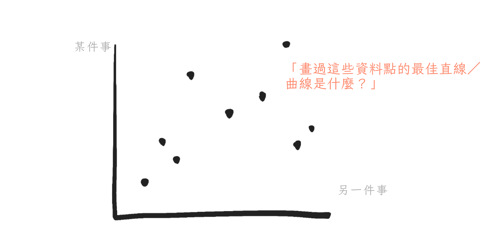

在統計中，把曲線配合到資料上稱為**迴歸（regression）**。曲線「貼合」的好壞，取決於各點距離曲線有多遠。越近越好！（當然，這段話是簡化版。）

先看最簡單的情況：用一條*直線*來貼合資料（稱為**線性迴歸（linear regression）**）。

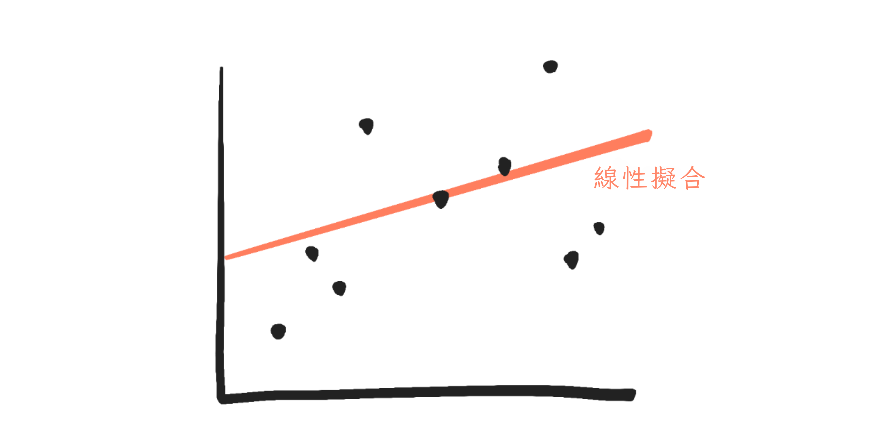

在科學／統計中，對真實事物的簡化數學版本稱為**模型（model）**。（就像模型火車是實際火車的縮小版。）例如，本節中的紅色線條／曲線，以及所有人工神經網路，都是「模型」。

多數模型有**參數（parameters）**：它們只是一些數字，但你可以把「參數」想成調整模型的小旋鈕。（像調整車椅的傾斜與腿部空間。）

上圖是所謂的「線性模型」，因為統計學家不太會直接說「我們畫了一條線」。**（如果你高中代數有點生疏，別緊張，細節略過沒關係，抓住大意最重要。）** 總之，直線的公式是 \(y = a + bx\)，其中 \(a\) 與 \(b\) 是參數／旋鈕。（學校常寫成 \(y = mx + b\)，其實是一樣的。）

當你轉動參數 \(a\) 與 \(b\) 的旋鈕時會發生什麼事：**（點擊播放影片 ⤵）**

<video controls width="640">
	<source src="../media/p2/fit1/linear.mp4" type="video/mp4" />
	
示範我調整直線參數的影片。

</video>

*（影片使用 [Desmos 互動繪圖計算機](https://www.desmos.com/calculator) 製作）*

要「擬合」一個統計模型，電腦會轉動這些旋鈕，直到這條線盡可能貼近所有資料點。（再提醒一次，這是簡化說法。）

對於線性模型，\(a\) 與 \(b\) 其實有相對直觀的解釋！改變 \(a\) 讓整條線上／下移，\(b\) 則是斜率。

但如果我們嘗試更複雜的模型呢？例如「二次」曲線？

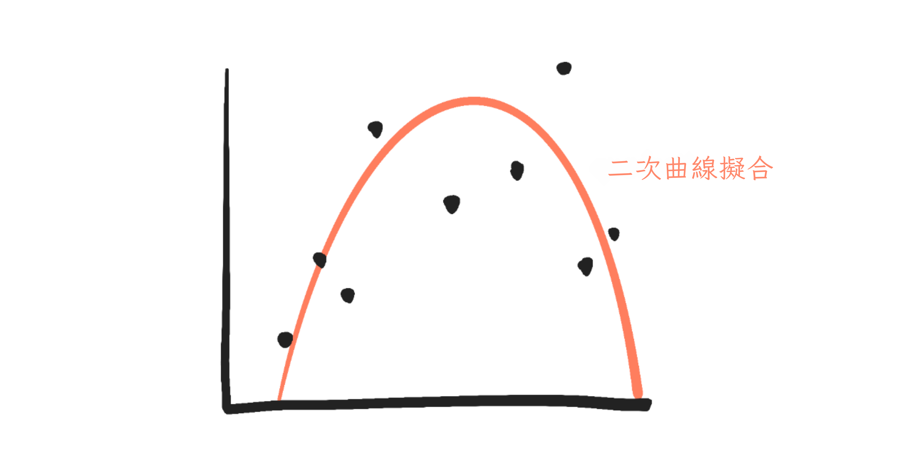

二次曲線的公式是 \(y = a + bx + cx^2\)。以下是各參數的影響：

<video controls width="640">
	<source src="../media/p2/fit1/quadratic.mp4" type="video/mp4" />
	
示範我調整二次曲線參數的影片。

</video>

現在，參數就更難解釋了。\(a\) 仍讓整條曲線上／下移，\(b\)… 讓整個東西以 U 形（有時倒 U）滑動？而 \(c\) 讓它往上或往下彎。

那*更*複雜的模型呢？例如「三次」曲線？

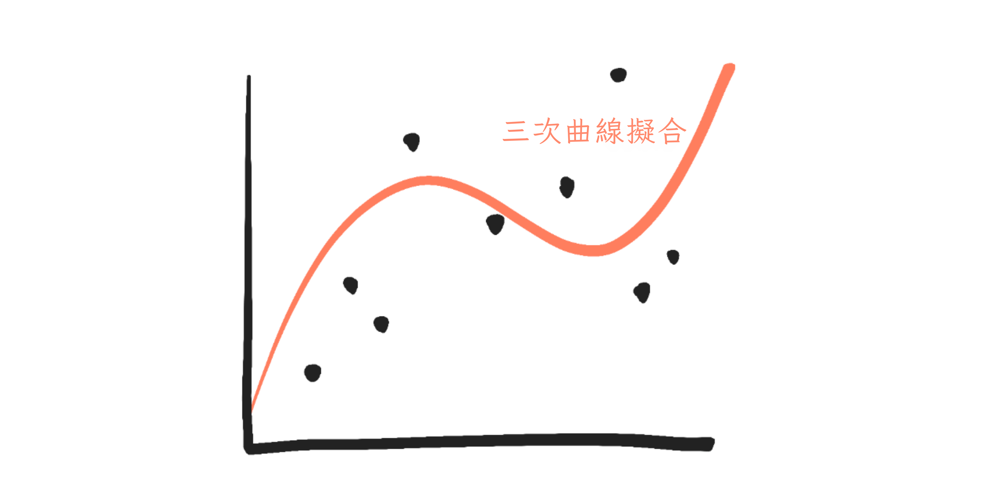

三次曲線的公式是 \(y = a + bx + cx^2 + dx^3\)。以下是各參數的影響：

<video controls width="640">
	<source src="../media/p2/fit1/cubic.mp4" type="video/mp4" />
	
示範我調整三次曲線參數的影片。

</video>

 解讀上：\(a\) 仍讓東西上下移……但其他一切都失去了（簡單的）解釋。\(b\) 讓曲線往左或往右移動，\(c\) 讓曲線往上或往下彎曲，而 \(d\) 則讓曲線往上或往下彎曲得更厲害。

 重點在於：*模型的參數越多，每個參數就越難解釋。* 因為一般而言，一個參數「在做什麼」取決於*其他*參數。

 就算只有*四個*參數，我們的可解釋性希望就已經開始渺茫了。

{{ ... }}
 GPT-4 的參數估計約有 1,760,000,000,000 個。[^param-count]

 [^param-count]: OpenAI 對 GPT-4 的一些「知道也安全」的細節（例如規模）其實*不太*開放。無論如何，有一份外流報告顯示它約有 1.8 兆參數，訓練成本 6,300 萬美元。摘要見 [Maximilian Schreiner (2023), The Decoder](https://the-decoder.com/gpt-4-architecture-datasets-costs-and-more-leaked/)

超過一兆個小旋鈕，全靠機器不斷試誤去扭動。*這*正是為什麼，直到目前為止，沒有人真的理解我們的現代 AI。

（公允地說，有時候即使不理解，也*可能*安全地控制某些東西[^control-theory]……但在不了解的情況下，這份工作難度會高很多。而且！近年對於理解深度神經網路其實*有*很多進展！我們會在第三部分看到其中一些成果。）
[^control-theory]: 控制理論（Control Theory）是工程學的一個分支，顯示我們有時在不了解的情況下也能控制事物。舉例，一個恆溫器只需在溫度低於 X 時開啟、高於 Y 時關閉，它就能把溫度維持在 X 與 Y 之間，*而不需要*任何關於熱對流、甚至空氣是什麼的模型。
    
放到 AI：即使它們是難以解釋的「黑箱」，*也許*仍可被控制。話說回來，如果它們*可*解釋，當然更好。

### 🤔 複習 #5

<orbit-reviewarea color="violet">
(ORBIT CARDS HERE)
    <orbit-prompt
        question="在統計中，什麼是『迴歸（regression）』？"
        answer="把曲線擬合到資料上。（嚴格來說，是把*數學函數*擬合到資料上。）"
        answer-attachments="https://cloud-2blh3o35r-hack-club-bot.vercel.app/0aisffs-regression.png">
        <!-- aisffs-regression.png -->
    </orbit-prompt>
    <orbit-prompt
        question="請想像『*線性*迴歸』長什麼樣："
        answer=""
        answer-attachments="https://cloud-l4lfiizuf-hack-club-bot.vercel.app/0aisffs-linear.png">
        <!-- aisffs-linear.png -->
    </orbit-prompt>
    <orbit-prompt
        question="在科學／統計中，什麼是『模型（model）』？"
        answer="真實事物的簡化數學版本。（就像模型火車是實際火車的縮小版）">
    </orbit-prompt>
    <orbit-prompt
        question="直覺上，什麼是『參數（parameter）』？"
        answer="用來調整模型的小旋鈕。（數學上，它只是個數字）">
    </orbit-prompt>
    <orbit-prompt
        question="為什麼模型的參數越多，每個參數『在做什麼』就越難解釋？"
        answer="因為一個參數『在做什麼』取決於其他參數。『其他』越多，就越難說它『在做什麼』。">
    </orbit-prompt>
    <orbit-prompt
        question="為何目前沒人真正理解最前沿的 AI？"
        answer="因為參數越多越難解釋，而前沿的 AI 模型動輒超過一兆個參數。">
    </orbit-prompt>
</orbit-reviewarea>

## ❓ 問題四：缺乏穩健性

小朋友們！準備好迎接全新爆紅動畫：

忍者變種步槍烏龜（TEENAGE MUTANT RIFLE TURTLES）

<video controls width="640">
	<source src="../media/p2/robust/rifle.mp4" type="video/mp4" />
	
影片：只在玩具烏龜上多抹了幾筆，Google 的 AI 幾乎從任何角度都把它分類成步槍！

</video>

以上影片來自 [Labsix（2017）](https://www.labsix.org/physical-objects-that-fool-neural-nets/)。研究者只需在 3D 玩具烏龜上加幾個污點，就能在多數情況下騙過 Google 最先進的機器視覺 AI。（但若仔細看，上述影片*並非*在*每個*角度都能騙過 Google 的 AI。這更證明要做到穩健性有多難：就連示範穩健性失敗的攻擊本身，也無法完全穩健！）

為凸顯穩健性在 AI 安全中的重要性，這裡有個悲劇案例：Tesla 的 AutoPilot 曾在光線有些詭異時，把一台拖車誤認為路標——於是嘗試從下面開過去，造成死亡事故。[^^tesla][^self-driving]

[^tesla]: 參見 [Tesla 2016 年官方部落格](https://www.tesla.com/blog/tragic-loss)，以及[這篇文章](https://electrek.co/2016/07/01/understanding-fatal-tesla-accident-autopilot-nhtsa-probe/)，提供更多關於事件經過與 AutoPilot AI 可能犯錯的細節。

[^self-driving]: 不過——我把這段從第一部分複製過來——我確實有道德上的責任提醒你：儘管如此，在相似情境下，自駕車仍然比人類駕駛*安全很多*。（約 85% 更安全。見 [Hawkins（2023），The Verge](https://www.theverge.com/2023/12/20/24006712/waymo-driverless-million-mile-safety-compare-human)）全球每年約有百萬人死於交通事故。禿毛的靈長類真的*不該*以時速 60 英里駕駛兩公噸的東西。

但*為什麼*現代 AI 這麼脆弱？為何如此細微的變化，會導致截然不同的結果？又為何這種**缺乏穩健性**會成為訓練人工神經網路時*常見、預設*的副作用？

要理解這些問題，讓我們回到先前的機器學習小課！

先來把一些資料用直線來擬合（2 個參數）：

嗯，擬合得不太好。資料與直線之間的落差很大。

那如果我們試試更複雜的三次曲線（4 個參數）呢？

太好了，曲線擬合得更好！縫隙小多了！

但如果我們試試有*10 個參數*的曲線呢？

哇，現在*誤差為零*——完全沒有縫隙！

但你應該看出問題了：那條曲線*非常離譜*。更重要的是：

* 輸入稍微變動，輸出就會*劇烈*不同。這就是烏龜步槍的問題。利用這點的輸入稱為**對抗樣本（adversarial examples）**。
* 對於超出原始資料集範圍的新資料，它會表現很差。這就是蘋果 iPod 的問題。這類失敗稱為**分佈外錯誤（out-of-distribution errors, OOD）**。

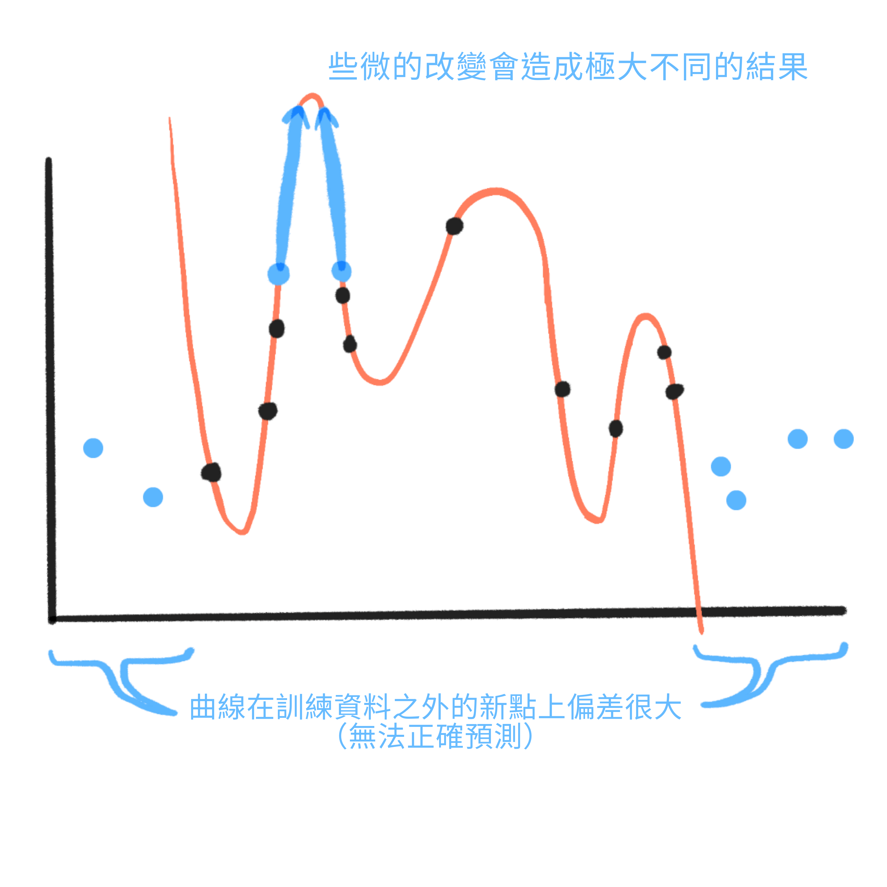

<i>訓練誤差（training error）</i>是模型在訓練資料上得到的誤差。<b>測試誤差（test error）</b>是模型在*新*資料（未曾訓練過）上得到的誤差。（是的，我也討厭這套術語多麼讓人困惑。[^validation] 這樣想：把「測試」當作學校考試——題目應該是你在課堂或作業（你的「訓練資料」）中*沒見過*的。）

[^validation]: 另外還有所謂的「驗證誤差（validation error）」，指的是模型在沒有*直接*用來訓練、但在發佈前*看過*的資料上得到的誤差。驗證資料／誤差用來決定何時停止訓練，以避免過擬合。不幸的是，很多作者把「驗證資料／誤差」與「測試資料／誤差」當同義詞用。我討厭行話。

總之：如果模型太簡單，它會在訓練*與*真實世界測試表現都很差，這叫**欠擬合（underfitting）**。如果模型太複雜，可能在訓練中表現驚人，但在真實世界測試表現很糟，這叫**過擬合（overfitting）**。訣竅在於取得平衡：

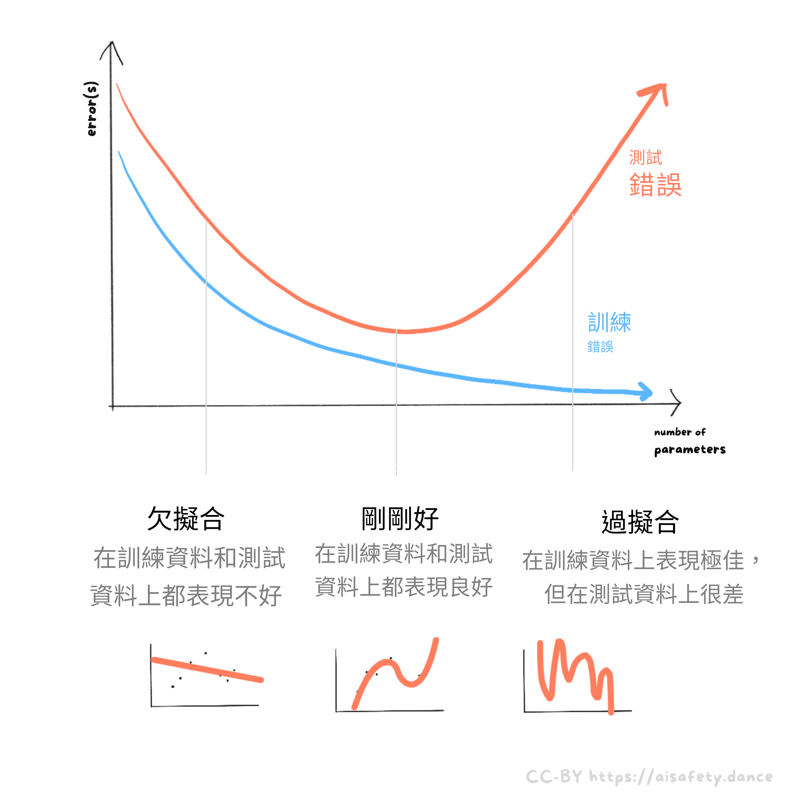

（技術補充：有一種*可能*發生的現象叫「雙降（double descent）」，但何時與為何發生，尚未很清楚。[^^double-descent]）

一般來說，**如果參數數量多於（或等於）資料點數量，我們*一定*會出現過擬合。** 在上例中，我們有 10 個資料點，而那個過擬合模型有 10 個參數，帶來*零*訓練誤差（以及一條荒唐的曲線）。

可惜的是，人工神經網路（ANNs）要變得有用，就需要*數百萬*個參數。所以若想避免過擬合，看來就需要*比參數更多*的資料點！這是為什麼訓練 ANNs 需要如此大量資料的核心原因之一：若資料不夠，模型就會過擬合，在真實世界中派不上用場。

（例如，OpenAI 的某個電玩 AI 把一個簡單遊戲玩了 16,000 次，*仍然*不足以避免過擬合！[^coinrun-overfit]）

但等等……最具影響力的電腦視覺 ANN——AlexNet——大約有 6,100 萬個參數。但它只在約 1,400 萬張標註影像上訓練，遠少於參數數量。[^^alexnet-imagenet]（每張影像雖有大量像素，仍只算*一個*資料點。標註影像是*非常*「高維度」的資料點，但仍然是*單一*點。）

那麼，為何 AlexNet 沒變成過擬合、脆弱的一團亂？事實上，*很多*前沿 ANNs 都是在比其參數數量小得多的資料集上訓練。它們*不得不如此*，因為外面就是沒有那麼多資料！為什麼它們*不全*是一團脆弱的爛攤子呢？

簡單說：其實就是如此。我們才會有烏龜步槍與 AutoPilot 車禍。**這種易於過擬合的特性，使得缺乏穩健性成了現代 AI 的*常態*。**

但既然如此，為什麼這些 AI 還能*多少*運作，儘管參數遠多於資料點？答案是：因為我們有*一些*方法可減少過擬合。（腳註列了幾個名稱：[^^combat-overfitting] 更多細節會在 AI Safety 第三部分學到！）但顯然，這些方法還不夠，對人工神經網路我們仍未找到 100% 解決此問題的辦法……至少目前還沒有。

[^double-descent]: [OpenAI（2019）新聞稿](https://openai.com/index/deep-double-descent/)：*「隨著模型規模、資料量或訓練時間增加，表現先改善、再變糟、再度改善。[…] 雖然這種行為似乎相當普遍，但我們尚未完全理解為什麼會發生。」* 完整論文見 [Nakkiran 等（2019）](https://arxiv.org/abs/1912.02292)。

[^coinrun-overfit]: [OpenAI（2018）新聞稿](https://openai.com/index/quantifying-generalization-in-reinforcement-learning/)：「**即使有 16,000 個訓練關卡，我們仍然看到過擬合！**」（強調為原文作者所加）完整論文見 [Cobbe 等（2018）](https://arxiv.org/abs/1812.02341)

[^alexnet-imagenet]: AlexNet 約有 61,000,000 個參數。([來源](http://web.archive.org/web/20240204130344/https://www.cs.toronto.edu/~rgrosse/courses/csc321_2018/tutorials/tut6_slides.pdf)，見第 10 與 11 頁之計算) 它的訓練資料庫為 ImageNet，包含 14,197,122 張人工標註的影像。([來源](https://paperswithcode.com/dataset/imagenet))

[^combat-overfitting]: 此腳註僅列方法名稱、不加解釋。AlexNet 使用了 ReLU 與 dropout。其他常見技巧包括：提前停止（early stopping）、L1/L2 正則化、資料增強（data augmentation）、雜訊注入（noise injection）。

. . .

（P.S：AI 的穩健性也可能因「偽相關（spurious correlations）」而失敗。[:點此展開了解詳情](#SpuriousCorrelations)。在下一個問題中我們也會更深入探討「相關 vs 因果」。）

（P.P.S：還有另一種更具推測性的穩健性失敗，稱為「本體論危機（ontological crisis）」。相關研究較少，所以我把它藏在 [:這個可展開的邊欄](#OntologicalCrisis) 裡。）

### 🤔 複習 #6

<orbit-reviewarea color="violet">
(ORBIT CARDS HERE)
    <orbit-prompt
        question="當有人設計一個輸入，利用 AI 的脆弱性時，這叫作："
        answer="**對抗樣本（adversarial example）**">
    </orbit-prompt>
    <orbit-prompt
        question="當 AI 在超出訓練資料範圍的新資料上失敗，這叫作："
        answer="**分佈外錯誤（out-of-distribution error, OOD）**">
    </orbit-prompt>
    <orbit-prompt
        question="訓練誤差（Training Error）是……"
        answer="模型在訓練資料上得到的誤差。">
    </orbit-prompt>
    <orbit-prompt
        question="測試誤差（Test Error）是……"
        answer="模型在*新*、未曾訓練過的資料上得到的誤差。（就像學校考試的題目不該是課堂或作業中的『訓練資料』）">
    </orbit-prompt>
    <orbit-prompt
        question="欠擬合（Underfitting）是……"
        answer="當模型太簡單，在訓練*與*真實世界（測試）都表現不佳。">
    </orbit-prompt>
    <orbit-prompt
        question="過擬合（Overfitting）是……"
        answer="當模型太複雜：訓練表現很好，但真實世界（測試）很差。">
    </orbit-prompt>
    <orbit-prompt
        question="請想像一張隨模型複雜度／參數數量而變化的訓練與測試誤差圖："
        answer=""
        answer-attachments="https://cloud-jo44rb8fw-hack-club-bot.vercel.app/0aisffs-fit_vs_params.png">
        <!-- aisffs-fit_vs_params.png -->
    </orbit-prompt>
    <orbit-prompt
        question="何時容易發生過擬合？"
        answer="當模型的參數數量*多於*我們擁有的訓練資料點數量。">
    </orbit-prompt>
    <orbit-prompt
        question="為何現代 ANNs 如此容易過擬合與脆弱？"
        answer="因為 ANNs 要有用就需要很多參數，因此也需要大量資料來防止過擬合，但要找到／產生足夠多且多樣的資料很難。">
    </orbit-prompt>
    <orbit-prompt
        question="關於現代 ANNs 的一個悖論：參數數量 vs 訓練資料數量"
        answer="許多現代 ANNs 的參數遠多於訓練資料項目，但不見得*完全*失敗。（因為有一些減少過擬合的技巧。）">
    </orbit-prompt>
</orbit-reviewarea>

## ❓ 問題五：演算法偏見

在第一部分裡，我舉了幾個最明顯的 AI 偏見案例，簡單複習：1980 年，用於篩選醫學院申請者的演算法會懲罰非歐洲名字。[^^bias-1] 2014 年，Amazon 曾有（後來下架）一個履歷篩選 AI，會直接歧視女性。[^^bias-2] 2018 年，MIT 研究者 Joy Buolamwini 發現，頂尖的人臉辨識 AI 在黑人與女性臉孔上的表現，明顯比在白人男性臉孔上更差。[^^bias-3]

[^bias-1]: 原始報告見英國醫學期刊：[Lowry & MacPherson（1988）](https://europepmc.org/backend/ptpmcrender.fcgi?accid=PMC2545288&blobtype=pdf)。注意此演算法並非特指使用神經網路，但它*確實*是機器學習的早期案例之一。

[^bias-2]: [Jeffrey Dastin（2018），路透社：](https://www.reuters.com/article/idUSKCN1MK0AG/) _「它會懲罰包含『women's』一詞的履歷，例如『女子西洋棋社社長』。而且據知情人士透露，它會將兩所女子學院的畢業生評分往下調。」_

[^bias-3]: 原始論文：[Buolamwini & Gebru 2018](http://proceedings.mlr.press/v81/buolamwini18a/buolamwini18a.pdf)。一般讀者版摘要：[Hardesty，MIT 新聞辦公室（2018）](https://news.mit.edu/2018/study-finds-gender-skin-type-bias-artificial-intelligence-systems-0212)

好吧。但*為什麼？*

一個簡單的解釋是「垃圾進、垃圾出」。或者說：「偏見進、偏見出」：

* 如果*過去*的聘用做法帶有歧視，而你訓練一個「中立」AI 去擬合過去資料，那麼——即使*現在*所有人類都完全不 [x]——AI 仍會學到並模仿過去的人類歧視。
* 如果一間 AI 公司忘了讓訓練資料中的臉部照片在種族上足夠多樣，那麼*當然*會造成某些族群的臉孔在資料中看不見，導致偏差。

這個解釋很簡單……*而且*我認為是對的。不過，讓我們把話說得更清楚些，藉由 AI 偏見來教一個統計學中的基本問題，這也*有助於*我們理解 AI 中另一個核心問題！問題在於：

**相關性無法告訴我們究竟是哪一種因果關係在作用。**

（通常，老師會警告「[:相關](#WhatIsCorrelation)不等於因果」，但嚴格說來不盡然！在數學上，「證據」的意義下，相關性*確實是*因果的證據！[^bayesian] 但它無法告訴你*是哪一種*因果關係。）

[^bayesian]: 在貝氏統計中，「證據 E 支持假說 H 為真」的程度，是用「似然比」來衡量：當 H 為真時觀察到 E 的機率，除以當 H 為假時觀察到 E 的機率。簡寫為：likelihood ratio = P(E|H)/P(E/¬H)。

    現在，把「A 與 B 存在相關」視為證據，把「A 與 B 存在*因果*連結」視為假說。因為在存在因果時你更可能觀察到相關（相較於不存在因果），因此似然比會大於 1，也就是說，*相關性是因果的證據。*（但問題在於你不知道*是哪一種*因果。）

    更多數學細節，見 [Downey（2014）](http://allendowney.blogspot.com/2014/02/correlation-is-evidence-of-causation.html) 的部落格文章（其亦為 O'Reilly《Think Bayes》作者）。想進一步了解貝氏定理，推薦 [3Blue1Brown 的視覺化介紹](https://www.youtube.com/watch?v=lG4VkPoG3ko)。

舉例：假設資料顯示身高較高的人，往往收入較高。（順帶一提，這是真的。[^^tall-rich]）我們會說：身高與收入有相關。*但光靠這些資料，無法分辨因果到底是什麼。*是變高讓你變有錢？還是變有錢讓你變高？抑或兩者*都是由某個「混雜因子」造成*？（例如：較富裕家庭的孩子在童年獲得更好的營養、教育與經濟支持，因而更高、也更富有。）

[^tall-rich]: 綜合分析：[Thompson 等（2023）](https://www.sciencedirect.com/science/article/pii/S1570677X23000540)。工資的「身高溢價」在墨西哥與亞洲最為顯著，且在男性上更為明顯。

（在此案例中，常識上大概是最後一種。不過你也*可以*實驗性地測試前兩個假說，例如：給個子矮的人穿厚底靴，看看是否能提高薪水。）

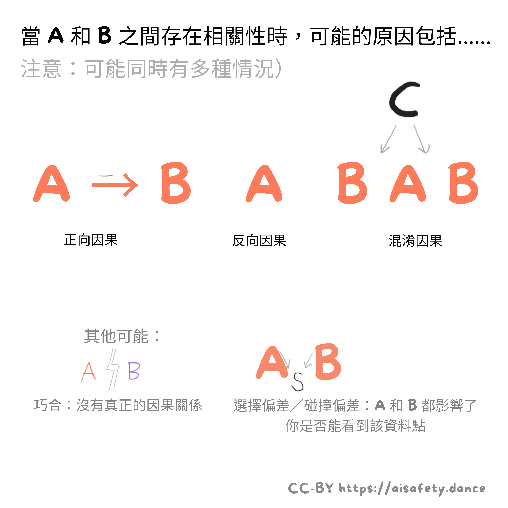

拉回主題：**我們所說的「偏見」或「歧視」，就是把別人身上的相關性誤當成因果。**

舉例來說，若你的籃球隊傾向挑高個子，我*不會*說那是（不好的那種）歧視，因為在那項運動中，身高確實*會導致*你比較會灌籃。

但如果某大學偏好高個子擔任教授……那就是不好的歧視，因為身高並不會*直接導致*你成為更好的研究者／教師。充其量，身高只是透過混雜因素（如童年營養）或自我實現的偏見[^self-fulfill-bias]，與學術能力**相關**。

[^self-fulfill-bias]: 例如：大學沒有矮個子教授 → 於是他們認為矮個子不能當教授 → 因而不僱用矮個子教授 → 於是大學沒有矮個子教授 → ∞

同樣地——我的主張是——你的性別、種族、階級、性傾向、居住地（鄉／郊／市），以及[另外 50 種分類]，並不會*直接導致*你在多數工作、或多數人格面向上更好或更差。這也是為什麼對這些特徵*直接*予以獎懲的人，我們會稱之為「有偏見」。

好，那這段長篇旁支跟 AI 有什麼關係？

**因為：目前的 AI 並沒有內建的因果概念。**[^pearl] 大型語言模型（LLMs）目前對因果推理的掌握相當脆弱、欠缺穩健性。[^^llm-vs-causality]（這不只是對 AI 偏見不利，也會影響 AI 做新科學的能力！）

更糟的是，就其設計而言，目前最流行的機器學習技術*只能*在資料中找到相關，*而非真正的因果*。這表示 AI 會*預設*就針對某些特徵做出歧視！

所以，即使你把「不准針對性別／種族／等等歧視」硬寫進 AI，它仍很可能會找到*其他*無關緊要的相關性來產生偏見。更糟的是，現今的 AI 對尋找細微相關性有種令人發毛的拿手：它能透過你的一小段文字樣本來推測你的性別與族裔[^demographic-writing]，或是光靠*你的一張臉*，就猜你的性傾向[^orientation-face]，甚至*你的政治立場！*[^politics-face]

總之：別歧視，讓我們尊重身高受限的朋友！我為蝦米（矮個）權益自豪地站台。

[^pearl]: 參見 Judea Pearl 於 2018 年接受 Quanta Magazine 的訪談：[“To Build Truly Intelligent Machines, Teach Them Cause and Effect”](https://www.quantamagazine.org/to-build-truly-intelligent-machines-teach-them-cause-and-effect-20180515/)。Judea Pearl 也是上述「因果圖」的先驅之一，並協助將因果關係「數學化」。

    在該訪談中，他評論現代 AI 仍停留在「前因果、只看相關」的時代：*「所有令人印象深刻的深度學習成就，歸根究柢都只是曲線擬合。」*

[^llm-vs-causality]: [Kıcıman 等（2023）](https://arxiv.org/pdf/2305.00050) 發現，現代大型語言模型（LLMs）在先前建立的因果推理基準上*似乎*表現不錯，但穩健性不足，且其測試混淆了「從零推斷因果」與「從訓練資料中記住的經驗事實」。
    
    （例如：若給 LLM 一個「雨天與車禍相關」的情境，模型輸出「下雨導致車禍」，這類測試無法分辨 LLM 是在*從零推斷*這個事實，還是只是*記住了*這個事實。）

    [Jin 等（2024）](https://arxiv.org/pdf/2306.05836) 建立了新因果推理基準以控制這種混淆。結果發現，現代 LLMs 在該任務上「幾乎接近隨機表現」。唉。

[^demographic-writing]: Egg Syntax（2024）：[“Language Models Model Us”](https://www.alignmentforum.org/posts/dLg7CyeTE4pqbbcnp/language-models-model-us)。作者發現，*未經校準的 GPT-3.5* 僅靠*少量文字樣本*，就能以 86% 與 82% 的準確率預測作者的性別與族裔，優於隨機！（隨機基準：性別約 50%；在美國的族裔約 60%。[美國約 60% 是白人，所以若模型一直猜「白人」，60% 的時候它都會對，次次如此。]）

    需要注意的是，該研究使用 OKCupid 的自我介紹文字，因此人們可能出於某些原因，會在字裡行間更凸顯性別刻板印象。所以作者改用美國 6 至 12 年級學生撰寫的 25,000 篇說服性文章，重作實驗。結果 GPT 的性別辨識準確率只從 86% 降到 80%，仍遠高於隨機（約 50%）！

    有趣的是，GPT 在猜測作者性傾向時表現*比隨機更差*。（GPT 的準確率：67%。「永遠猜異性戀」：93%。）但別太放心，請看下一則腳註。

[^orientation-face]: [Wang & Kosinski（2018）](http://web.archive.org/web/20240725204611/https://i.warosu.org/data/sci/img/0145/14/1653510550860.pdf)： “Deep Neural Networks Are More Accurate Than Humans at Detecting Sexual Orientation From Facial Images”。[Leuner（2019）](https://arxiv.org/pdf/1902.10739) 的重複研究顯示，模型對「化妝、眼鏡、鬍鬚、頭部姿勢」等具有不變性。AI 確實是透過下顎／鼻樑／前額形狀與皮膚明暗等線索猜測性傾向。謝了，我超不喜歡這點。

[^politics-face]: 見 [Kosinski（2021）](https://www.nature.com/articles/s41598-020-79310-1)： “Political orientation was correctly classified in 72% of liberal–conservative face pairs, remarkably better than chance (50%), human accuracy (55%), or one afforded **by a 100-item personality questionnaire (66%) [?!?!]**. Accuracy was similar across countries (the U.S., Canada, and the UK), environments (Facebook and dating websites), and when comparing faces across samples. Accuracy remained high (69%) **even when controlling for age, gender, and ethnicity [!!]**”

    我特別加粗，因為——這到底是*什麼鬼*？！怎麼會是*一張臉*比*完整的人格問卷*更能揭示你的政治立場？！甚至比你的*年齡、性別與族裔加總起來*更相關？

### 🤔 複習 #7

<orbit-reviewarea color="violet">
(ORBIT CARDS HERE)
    <orbit-prompt
        question="對於演算法偏見的簡單解釋"
        answer="偏見進、偏見出。（訓練資料本身帶有偏見，可能源於過去的歧視，或資料選取上的偏差。）">
    </orbit-prompt>
    <orbit-prompt
        question="對於演算法偏見的更深層解釋"
        answer="當前機器學習基於*相關*而非*因果*運作。">
    </orbit-prompt>
    <orbit-prompt
        question="為什麼不懂因果的 ML/AI 會*預設*就不公平地歧視？"
        answer="因為它會使用那些與能力／性格等*相關*、但並不*直接導致*這些東西的特徵。">
    </orbit-prompt>
    <orbit-prompt
        question="若你在 A 與 B 間發現相關，三種可能的因果路徑是：（請想像）"
        answer="正向因果、逆向因果、混雜因果。（亦可能：巧合、選擇／碰撞偏差）"
        answer-attachments="https://cloud-3mydyvsbx-hack-club-bot.vercel.app/05causal.png">
        <!-- aisffs-causal.png -->
    </orbit-prompt>
    <orbit-prompt
        question="常見說法：『相關不代表因果』。技術上的補充："
        answer="在數學上，相關*確實是*因果的證據。然而，光有相關無法告訴你發生了*哪一種*因果。">
    </orbit-prompt>
    <orbit-prompt
        question="現代 AI 能捕捉到的、令人發毛的細微相關性範例"
        answer="（任一答案皆可：）AI 能僅從寫作風格預測你的性別與族裔；或僅從你的臉預測你的性傾向與政治立場（！）">
    </orbit-prompt>
</orbit-reviewarea>

## ❓ 問題六：目標錯誤泛化

終於，我們來到 AI 對齊（AI Alignment）中最容易被誤解的概念之一！它*實在*太容易被誤解了，我甚至為此寫了這一節並畫了整篇漫畫，然後才意識到*我完全搞錯了*，不得不從頭來過。唉，好吧。([[:這裡是「刪除片段」，如果你好奇的話。]](#InnerMisalignmentDeletedScene))

總之，這個問題被稱為**目標錯誤泛化**（Goal Mis-generalization）。(它原本被稱為「內部錯位」（inner misalignment），但我覺得這個術語很令人困惑。[^mesa-optimizer])

[^mesa-optimizer]: 這個問題的理論可能性最早由 [Hubinger 等人於 2019 年](https://arxiv.org/pdf/1906.01820)描述。在論文中，他們稱這個問題為「內部錯位」，並為我們帶來了 AI 對齊界的迷因 [「欺騙性對齊的中層優化器」](https://www.astralcodexten.com/p/deceptively-aligned-mesa-optimizers)。你看，這很好笑，因為研究人員真的很不會取名字。他們取名字的功力爛到很好笑。真的很好笑。

目標錯誤泛化（Goal Mis-generalization）之所以令人困惑，部分原因是它與問題一：目標錯誤*指定*（Goal Mis-specification）和問題四：缺乏穩健性（Lack of Robustness）看起來很相似。（有些研究人員甚至質疑目標錯誤泛化與目標錯誤指定之間的區分是否有用！[^shard]）

[^shard]: 正如 Google DeepMind 的研究科學家 Alex Turner [所說](https://www.alignmentforum.org/posts/gHefoxiznGfsbiAu9/inner-and-outer-alignment-decompose-one-hard-problem-into)：「內部對齊與外部對齊[目標錯誤泛化與目標錯誤指定]將一個難題分解成了兩個極其困難的問題」。Alex Turner 同時也是 [Shard Theory](https://www.lesswrong.com/posts/xqkGmfikqapbJ2YMj/shard-theory-an-overview) 的先驅之一，這是一個研究「強化學習」AI 如何逐步學習人類價值觀的研究計畫。

為了釐清這個概念，讓我們來比較和對比！

**目標錯誤泛化與目標錯誤指定的區別：**

* 目標錯誤*指定*是指 AI 完全按照你的要求去做，而不是你真正想要的。
* 目標錯誤*泛化*是指 AI 在*訓練時*做了你想要的，但在現實世界/部署/測試中卻沒有。
* 注意：即使有*完美的*目標指定，你仍然可能遇到目標錯誤泛化的問題！[^perfect-specification] *你獎勵 AI 做什麼 ≠ AI 學會優化的目標。*

[^perfect-specification]: 來自 [Shah 等人 2022 年的研究](https://arxiv.org/pdf/2210.01790)：「即使在規格正確的情況下，AI 系統仍可能追求非預期的目標，這就是*目標錯誤泛化*的情況。」[強調為原文所有]

**目標錯誤泛化與穩健性的關係：**

* 目標錯誤泛化*確實是*一種穩健性失敗。具體來說，是**目標穩健性**的失敗。
* 這與**能力穩健性**的典型失敗形成對比，比如自駕車在異常光照條件下撞上卡車。
* 目標穩健性的失敗*比*能力穩健性的失敗*更糟糕*。你得到的不是一個「單純」故障的 AI，而是一個能夠*熟練執行不良目標*的 AI！

為了進一步了解目標錯誤泛化，讓我們來看一個著名的例子。2021 年，一些研究人員訓練了一個 AI 去玩一個叫做 CoinRun 的電子遊戲。[^gmg-coinrun]

[^gmg-coinrun]: 這篇論文是 Langosco 等人 2021 年的 [“Goal Misgeneralization in Deep Reinforcement Learning”](https://arxiv.org/abs/2105.14111)。下面的遊戲是 CoinRun，於 2018 年由 OpenAI 創建 ([新聞稿](https://openai.com/index/quantifying-generalization-in-reinforcement-learning/), [論文](https://arxiv.org/abs/1812.02341))。感謝 [Rob Miles 的優秀視頻](https://www.youtube.com/watch?v=zkbPdEHEyEI) 介紹了這個案例！
    （順帶一提，CoinRun 的美術資源來自慷慨又才華橫溢的創用 CC 遊戲藝術家 [Kenney.nl](https://kenney.nl/assets/series:Platformer%20Pack) 💕）

重要的是：*「目標指定」—— AI 獲得的確切獎勵——對於預期任務來說是完美的。* AI 在碰到障礙物和掉落時會受到懲罰，在拿到終點的金幣時會獲得獎勵。

然而：在 AI 訓練的所有關卡中，金幣都位於關卡的*終點*。

*訓練完成後*，研究人員給了 AI 新的關卡，其中金幣位於關卡的中間...

...而 AI 會*熟練地*奔跑和跳躍避開障礙物，*錯過*金幣，仍然前往終點。

<video controls width="640">
	<source src="../media/p2/gmg/aquire_wall.mp4" type="video/mp4" />
	
遊戲 AI 熟練躲避陷阱但*錯過*金幣直奔終點的影片。影片標題為「無視金幣 / 獲取終點牆」

</video>

*（節選自 [Rob Miles 關於內部錯位/目標錯誤泛化的優秀影片](https://www.youtube.com/watch?v=zkbPdEHEyEI)）*

所以：即使我們*正確指定*了目標（拿到金幣），AI 卻學會了一個*完全不同的*目標（到達終點），並對此進行了優化。

([:技術細節 - 我們如何知道 AI 的「真正」目標是什麼？](#GMGGoals))

但為什麼 AI 會錯誤學習目標？正如我在問題 #5 中過度解釋的：**大多數現代 AI 系統只做相關性分析，而非因果關係。** 在上述 AI 的訓練數據中，「一路走到終點」與獲得高分數有很強的相關性。在新關卡中，這種相關性消失了，但 AI 仍然保持著它的「習慣」。 

讓我們用因果關係圖來表示這一點！金幣在終點的訓練關卡*導致*了 AI 前往終點和 AI 拿到金幣...這在「前往終點」和「拿到金幣」之間造成了*混淆的相關性*。但只有「拿到金幣」*實際上會導致*獲得獎勵：

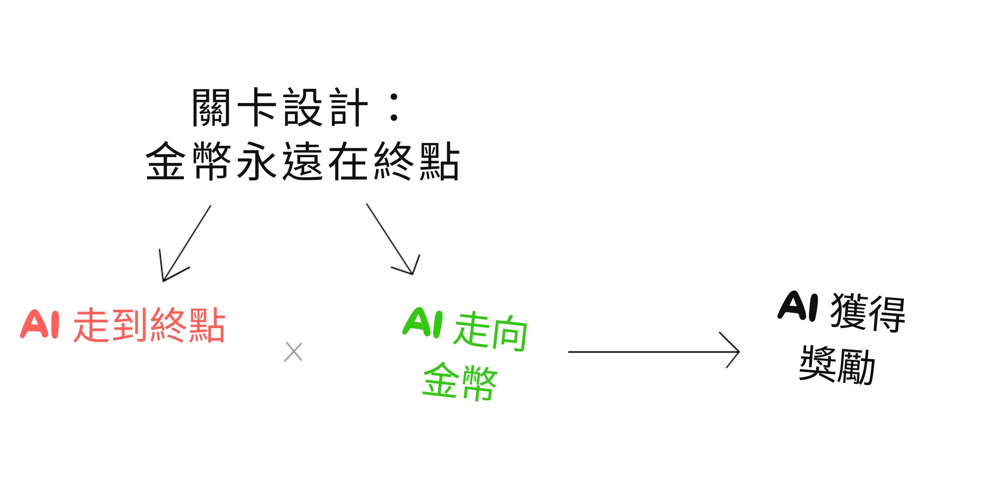

---

一般而言，對於目標錯誤泛化（Goal Mis-generalization）：

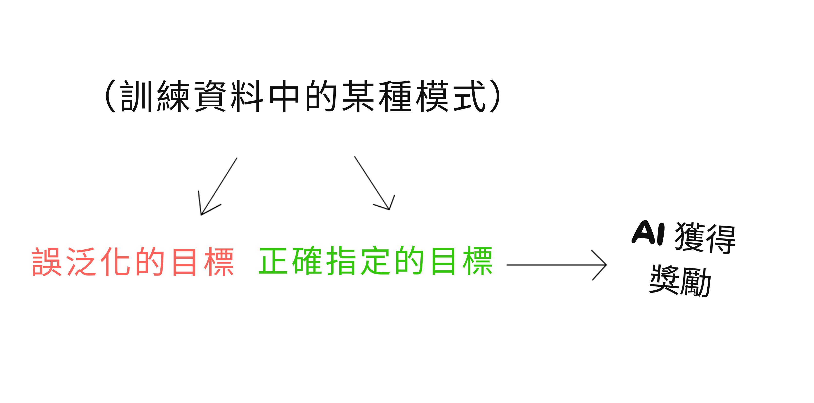

把它連到「災難性 AI 風險」：這提示風險可能不是「我們叫 AI 讓大家快樂，所以它用*灌獎*（wireheading）讓我們快樂」，而比較像是：「我們叫 AI 讓大家快樂，$出現了我們不明白的相關性$，結果我們的頭被*手術縫*在巨大貓面具上。**我們甚至沒有比較快樂。**」[^everything-is-fine]

[^everything-is-fine]: 向我目前最愛的驚悚網漫致意：[**Everything Is Fine**](https://www.webtoons.com/en/horror/everything-is-fine/list?title_no=2578)，作者 Mike Birchall。別擔心，這段不是爆雷——但這確實是我現在的粉絲理論。

（補註：**老派 AI（GOFAI）** *沒有*這個問題，因為 1）它們無法「學錯」目標——你是**直接把目標**給它們的；而且 2）它們通常*能*推理因果關係。好壞參半——如第一部分所述，至今沒人能把「AI 邏輯」與「AI 直覺」的威力**無縫**結合起來。）

. . .

其實，*人類*也會目標錯誤泛化。

那些就是我們的壞習慣——因為在我們的「訓練環境」裡，這些行為*曾經*是適應性的。心理治療的老掉牙梗全都來了：

* **Alyx** 是「資優生」，總因考高分被讚。她的訓練環境裡，「被獎勵」與「表現超群／勝過他人」高度相關。長大後就養成不健康的習慣：她避免走出舒適圈（因為那裡「不一定能表現超群」），會遮掩錯誤、甚至貶低他人（為了「勝過」他們）。
* **Beau** 在自戀型父母與低信任社區中長大。在他的訓練環境裡，*負向*獎勵（懲罰）與「放下戒心」高度相關。於是他學會了不流露情緒。這救了他幼年時的命，但成年後變成不健康的慣性：從不敞開、不讓任何人走近。**請接招。**

（怎樣，沒料到《貓少漫畫》文章會直戳你心窩？**請接招。**）

也許，就像解出 AI 的古德哈特法則能幫我們解人類版一樣，**解決 AI 的目標錯誤泛化，也能幫我們**。那個老掉牙的「人類對齊問題」。

（旁註：[: 如果目標錯誤泛化其實……*是好事*呢？](#WhatIfGoalMisgeneralizationIsGood)）

### 🤔 Review #8

<orbit-reviewarea color="violet">
(ORBIT CARDS HERE)
    <orbit-prompt
        question="目標錯誤泛化的例子"
        answer="（兩個都可以：）機器人把『乾淨』學成『用水洗』；CoinRun AI 學到『衝到終點』而不是『拿到金幣』。">
    </orbit-prompt>
    <orbit-prompt
        question="目標錯誤泛化（GMG）：AI 會在 \_\_\_ 時做你想要的，但在 \_\_\_ 時不會"
        answer="訓練時；真實世界／部署／測試時">
    </orbit-prompt>
    <orbit-prompt
        question="即使有完美的……你仍可能遇到目標錯誤泛化"
        answer="……**完美的目標指定**！你獎勵 AI 的 ≠ AI 學會優化的目標。">
    </orbit-prompt>
    <orbit-prompt
        question="與 GMG 相關的兩種穩健性失敗"
        answer="能力無法泛化；目標無法泛化。">
    </orbit-prompt>
    <orbit-prompt
        question="為什麼『壞掉的目標 + 完整的能力』可能*更糟*？"
        answer="因為它現在能**熟練地**執行壞目標了！">
    </orbit-prompt>
    <orbit-prompt
        question="GMG 的根本原因？"
        answer="當前 ML/AI 只會抓**相關**，不會抓**因果**。（訓練資料中兩個目標只是相關，如「到終點」與「拿金幣」，AI 可能學錯那一個。）">
    </orbit-prompt>
    <orbit-prompt
        question="請視覺化導致 GMG 的『相關—因果』問題之**因果圖**："
        answer=""
        answer-attachments="https://cloud-dlbeti1kb-hack-club-bot.vercel.app/0aisffs-causalgmg.png">
    </orbit-prompt>
    <orbit-prompt
        question="為什麼老派 AI（GOFAI）沒有 GMG？（兩個理由）"
        answer="1）目標是你**直接給**的，不會學錯；2）它們通常**能**推理因果。">
    </orbit-prompt>
    <orbit-prompt
        question="人類版的 GMG 例子？"
        answer="那些『在童年的訓練資料裡*曾經*適應』、如今卻成為壞習慣的行為。">
    </orbit-prompt>
</orbit-reviewarea>

---

# 人道價值

## ❓ 問題七：所謂「*人道*價值」到底是什麼？

假設你已經把 #1～#6 全都解了。你的 AI 會如你本意地服從指令。它穩健、可解釋，並**完全對齊**你的價值。

現在，安全心態：*最糟（但合理）可能會發生什麼？*

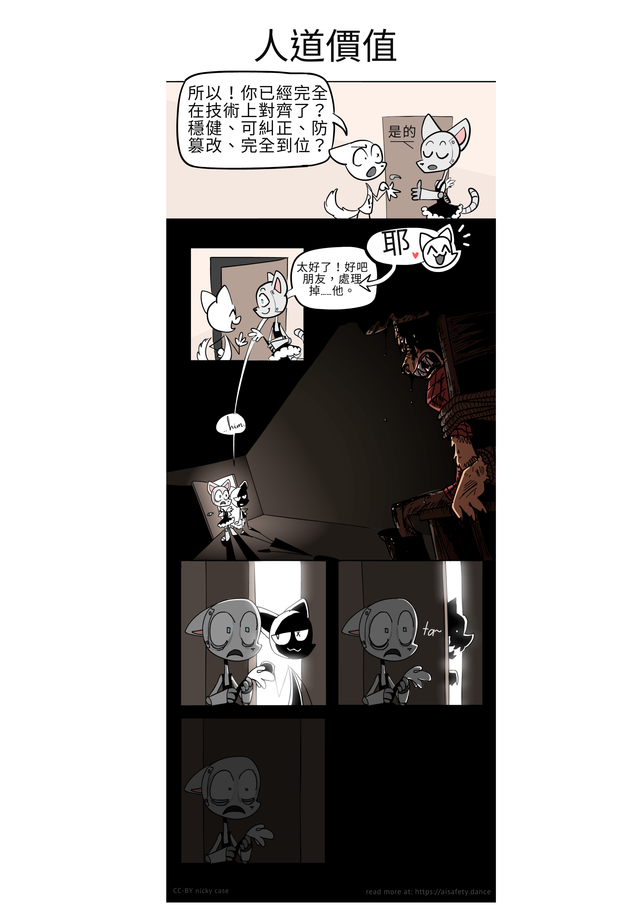

噢，對了。**某個人類**的價值，未必就是**人道**價值。

我知道我把這個雙關玩太多次了，但值得再強調：**聰明 ≠ 善良。** 有聰明的連環殺人犯。把我們送上月球的科學巨擘之一 **Wernher von Braun**（德文近似唸作「布朗」[^brown]），字面上就是納粹。

[^brown]: 近似 **「brrROOWWn」**，見 Wiktionary 的發音標記。

但如果是**非常**聰明呢——會不會就等於善良？也許一個**真正**先進的 AI 能像發現數理真理那樣，**發現**道德真理？**真正的理性 = 道德嗎？把 AI 對齊到*某個*人的價值，會**必然**導向*人道*價值嗎？**

這裡就好玩了：科技遇上人文，程式遇上哲學。介紹一個倫理學的分支：**後設倫理學（Meta-Ethics）！** 若「一般」倫理學問的是「面對這個情境我該做什麼？」，後設倫理學問的是：

*等一下，所謂「道德真理」的**本質**到底是什麼？*

### 情境 #1：上帝（或諸神）存在，且道德是客觀的

神祇是否存在，留作讀者練習。

但即便如此，也不能保證先進 AI 會發現客觀道德：

* 就像重度色盲無法**感知**紅與綠的差別，一個沒有意識或靈魂的機器，可能也**無法感知**正與邪、神聖與褻瀆的差別。（提醒：AI = 只是很酷的軟體；就算很先進，也**未必**有意識。）
* 道德或許客觀存在，但對**無意識**的 AI 未必具有約束力——就像道德對一塊石頭也沒有約束力一樣。

### 情境 #2：上帝不存在，但道德**仍是**客觀的

牛頓之後，哲學家們得了物理羨慕症。牛頓以數學奠定了普遍物理定律，哲學家也想用理性找到**普遍的道德定律**。若真如此，超級智慧 AI 當然可以重新「發現」道德！

下面這張圖抓住了現代後設倫理學的三大流派，**以及**它們彼此的因果關係圖：

先把這些哲學在**人類**身上是否好用擱一旁——我懷疑它們對**非人**AI 也不管用。依我看，所有「以理性為基底」的道德哲學至少會撞上以下三種問題之一：

<u>問題 1）</u> 這個哲學**倚賴人性**的細節。比如古今的德行倫理，都把道德建立在人類需求與人類心理上。對我們或許很好，但**不適用**於非人 AI。

<u>問題 2）</u> 這個哲學要你接受至少一條**道德「公理」**，但那不是從物理觀察或理性推導能得到的。因此，先進 AI 並不會**自動**接受它。

例如，功利主義（結果論的主流）假定唯一的道德公理是：**「幸福是好的」**。[^util] 其他一切都從這條公理推出！但先進 AI 一開始就未必接受這條，因為它不是科學可發現的：無論你怎麼研究「幸福」的神經化學，你都不會在原子裡找到「好」。

（這也叫做 **休謨的「是—應然」鴻溝**[^is-ought]。而且不只功利主義，某些義務論也有這個問題。[^nap]）

[^util]: 功利主義口味很多，我們就用這個基本版當學習範例。

[^is-ought]: 18 世紀哲學家 **David Hume** 主張（我同意）：你**無法**只從經驗觀察中，推出任何關於**價值**的判斷。
    　　（*除非*你用語言把價值**偷渡**進來，例如：「Hans 是 Kraut，所以 Hans 是壞人」，把「Kraut」偷渡為負面；或「氰化物是*天然*的，所以氰化物是好的」，把「天然」偷渡為正面。相信「天然=好」稱為**自然主義謬誤**。）更多見維基百科：**Is–ought problem**。

[^nap]: 我想到的是某些自由意志主義者的義務論：它假定一條公理——**不侵害原則**（不主動施加非自願的傷害，除非是為了阻止／懲罰其他非自願傷害且比例相當）。這公理是否適合**人類**不在本文範圍；我要說的是它**不是**從科學或數學可推導，因此**不能保證**先進 AI 會重新發現它。

<u>問題 3）</u> 這個哲學**聲稱**完全立基理性、不需要額外道德公理——但它要嘛**暗中偷渡**一條，要嘛就「證明太多」。

例如康德的義務論論證偷竊為**非理性／不道德**：*如果*偷竊是理性的，所有理性的存在者都會去偷，於是沒東西可偷——邏輯矛盾！因此偷竊必然**非理性**、**永遠**不道德。
又例如說謊：*如果*說謊是理性的，大家都會說謊，彼此言語不值得信——於是連說謊都不必了——邏輯矛盾！所以說謊**永遠**不道德。

但拜託，**真的**「永遠」？就算是為了不餓死而從餐廳垃圾桶拿吃的，或為了保護你同志的兄弟而對塔利班說謊？[^kant-extreme] 你才是那個按字面走的機器人吧？況且照你的邏輯，康德先生，**全職哲學**也不理性／不道德：*如果*大家都理性地去當全職哲學家，誰來種田？大家會餓死——邏輯矛盾！於是……你懂的。（其他義務論也有類似陷阱。）

[^kant-extreme]: 是的，康德**真的**極端到認為「就算為救命也不該說謊」。次級來源可見 [Klempner 2015](https://web.archive.org/web/20230605071851/https://askaphilosopher.org/2015/08/13/kant-on-lies-and-the-axe-man/)。但他個人生活又常用半真半假的話、或故意遺漏。

長話短說：理性 **=** 道德，這件事有合理懷疑……至少對**非人**AI 而言。

（更多後設倫理的學習資源見 [:這裡](#MoreMetaEthics)。如果你看不出來，這是我的特別嗜好之一。）

### 情境 #3：道德是相對的！

你這句話本身就是一個**絕對命題**，朋友。

### 情境 #4：道德不存在，但**假裝**有道德在賽局上有用

*（如果我必須解釋這個笑話，那它就不好笑了。[^the-joke]）*

[^the-joke]: 把社會契約論先驅 **Thomas Hobbes** 的臉貼到漫畫 **《Calvin and Hobbes》** 的老虎 **Hobbes** 身上。哈。哈哈。哈哈哈。

假設我鄰居有一套超酷的**浣熊裝**。我想偷。但我也不想別人偷我的東西。於是我「同意」讓國家抽我一筆錢，養警察，去阻止一般性的偷竊。我們得到一個折衷、也就是社會契約：

「**不可偷竊**」（否則警察會找上你）。

以上是**社會契約論**的玩具模型。在這個理論裡，客觀道德**不存在**，但**假裝**有它很有用：為了各自利益，我們才好**協調**起來。就像紅色八角形不需要客觀理由**一定**代表「停」，但大家都同意它代表「停」，就能協調以免撞車。

（本節的刪減片段見 [:這裡](#SocialContract)）

那麼：**這**能不能成為先進 AI 的「理性、客觀倫理」基礎？——**用賽局理論建構**社會契約？

**只要 AI 別強到離譜，當然可以！** 我們不一定要**打贏**它才施加成本；只要能施加成本，就有槓桿去**執行契約**。而且若未來出現**多個**實力相近的先進 AI，還可能形成一個危險但勉強平衡的**多極世界**。（旁支：[: 我們能跟超人類 AI 做交易嗎？](#TradingWithAdvancedAI)）

但如果多個 AI 反過來簽一份**對我們不利**的契約……或是**單一** AI 強到沒人能對它強制契約……

那就回到原點了。

### 🤔 Review #9

<orbit-reviewarea color="violet">
(ORBIT CARDS HERE)
    <orbit-prompt
        question="哪位人類的例子說明『聰明 ≠ 善良』？"
        answer="Wernher von Braun（近似唸作 Brown）：把人類送上月球的火箭科學家、同時也是納粹。">
    </orbit-prompt>
    <orbit-prompt
        question="若『一般』倫理問的是：這情境我該做什麼？——**後設倫理**問的是："
        answer="『所謂道德真理的本質是什麼？（例如它是否像數學與物理那樣普遍／客觀？）』">
    </orbit-prompt>
    <orbit-prompt
        question="即使道德真理客觀存在，為何先進通用 AI 仍可能不道德？"
        answer="（任一即可：）沒有意識／靈魂，可能**無法感知**道德真理；或道德規則**未必適用**於無意識代理。">
    </orbit-prompt>
    <orbit-prompt
        question="以世俗理性奠基道德的三大路線？"
        answer="德行倫理、義務論、功利主義（結果論）"
        answer-attachments="https://cloud-b8utffjti-hack-club-bot.vercel.app/0ethics.png">
    </orbit-prompt>
    <orbit-prompt
        question="**社會契約論**怎麼說？"
        answer="道德並不客觀存在，但**假裝**它存在有用；我們可以圍繞『契約』協調，達成各自利益。">
    </orbit-prompt>
    <orbit-prompt
        question="為什麼先進 AI 可能不受社會契約拘束？"
        answer="如果它**太強**，我們無法對它強制契約。">
    </orbit-prompt>
</orbit-reviewarea>

### 情境 #5：道德不存在，而且**連假裝**也沒用

呃，慘了。

此時，沒有什麼「人道價值」，只有**特定人**的價值。沒有「人道對齊」，**只有**「技術對齊」。沒有「我**應該**」，只有「我**想要**」。

那麼，我們要把先進 AI 的技術對齊——**對齊誰**的「想要」？

掌控最大 AI 實驗室的科技億萬富豪？美國政府（執政黨四年一變）？歐盟？聯合國？IMF？北約？其他縮寫？我猜全世界多數人對**任何一個**選項都不會太安心。那麼，**到底對齊誰**？

你說：「**大家**！」——一個**真正的全球民主**，AI 讓 80 億人權重相等？提醒一下：世界多數人認為同性戀「永遠不正當」。[^owid-gay] 馬丁路德金生前，多數美國人**不支持**他。[^mlk] 直接民主恐怕會把**異族通婚**在美國的合法化再延遲**一代半**。[^inter-racial-marriage] **平等未必撐得過一人一票。** 直說白話：我不是在說「我所在的文化群體最好」。我是在說：**任何時空、任何文化**都會與虛偽與不人道搏鬥，而「民主」並不能自動解決這一切。

[^owid-gay]: 參見 Our World In Data 的統計；在人口最多的前 10 國家中，有 7 國超過 75% 的受訪者認為「同性戀永遠不正當」。連結見原文腳註。

[^mlk]: 1966 年蓋洛普民調：對 MLK 的好感 33%，反感 63%。見 Pew Research 的整理。

[^inter-racial-marriage]: 美國最高法院 1967 年 *Loving v. Virginia* 全國合法化異族婚，**到 1997 年**多數美國人才在民調上表達支持——**晚了 30 年**。

你讓步說：「好吧，是**大家**的價值／想要，**但**如果我們治癒了讓人偏執的一切創傷，每個人都智慧而慈悲，真誠理解事實與彼此。」這**確實**是比較好的提案之一（第三部分會談[^cev]），但仍是個巨大工程，而且把問題**往後踢**：**誰**來定義「智慧」或「慈悲」？

[^cev]: 爆雷一下：這和（但不完全等同）**Coherent Extrapolated Volition**（Yudkowsky 2004）相近；第三部分會講。

. . .

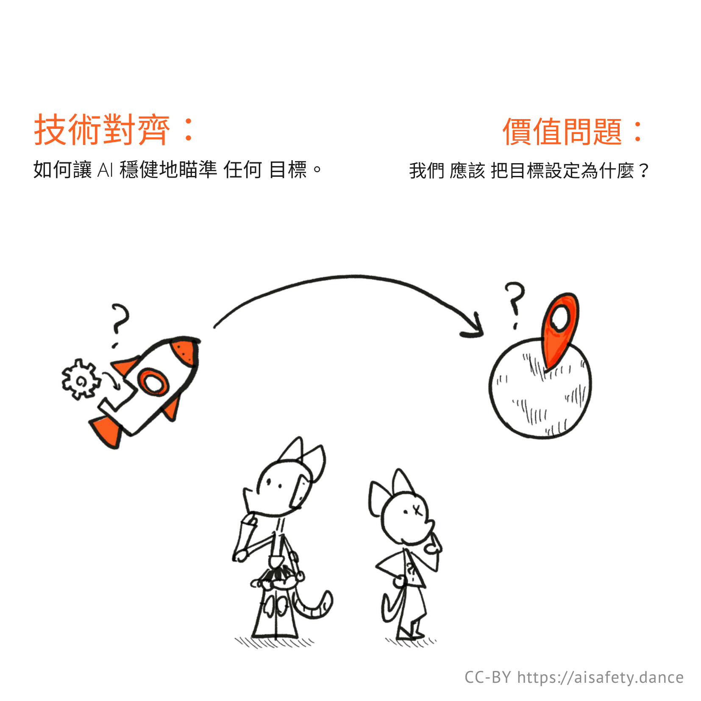

一則人類學小見聞：

幾年前，在 AI 對齊社群內，大家似乎多半同意「**技術對齊**」比「**人道價值是什麼**」更急。常見比喻：想像火箭工程的早期。現在討論該去月球、火星、還是金星**沒用**，因為**以當前技術**，強力火箭的**預設**結果就是：**爆炸，炸死地面的人**。

但 ChatGPT 之後，我觀察到更多人承認[^whose-values]：**我們也該**把「**誰的價值**」排進優先事項。延伸那個比喻：大家發現**以當前政治現實**，火箭**預設**會被**強權**用來互相轟炸，而不是探索太空。（直說：**預設**情形下，即便技術對齊，AI 也可能優先被用來打仗、還有讓我們買更多東西。）

[^whose-values]: 例如 Ajeya Cotra（2023）：「Aligned 不該是 good 的同義詞」；Michael Chen（2024）「僅靠 Alignment 不足以讓未來變好」；Andrew Critch（2024）「沒有社會模型的安全，就不是安全」。連結見原文腳註。

（回想第一部分：[:那些看似顯而易見卻會翻車的「做人道 AI」做法](#WaysToMakeHumaneAIGoingWrong)，甚至像 [:阿西莫夫三定律](#AsimovsLaws) 這麼直觀的倫理守則都會壞掉。）

所以，若道德真理**不存在**——或存在，但機器**無法**感知／推導／受其拘束——那我們就需要讓主要的 AI 造物者**事先承諾**：把他們先進的 AI 對齊到**某份不那麼糟**的價值清單。

這種問題，對工程腦最難承認：**這不是程式問題，是政治問題。**

最後放一首我很愛的歌——關於倫理、火箭，以及我們要讓科技帶我們去哪裡：

> 🎵 *「火箭一旦升空，*
> *誰管它會落在哪？*
> *那不歸我管，」*
> *——馮·布朗如是說。* 🎵

……這一節就不發複習卡了。

---

# 第二部分總結

讀完了，朋友！今天你把「**AI 價值對齊問題**」的所有組成面向都看了一輪血淋淋的細節。不只如此，還速成了：**安全心態**、**賽局理論**、**經濟學**、**機器學習**、**統計**、**因果推論**，甚至**哲學（後設倫理）**！

（如果你跳過了複習卡，現在想回頭看：點右側邊欄的目錄圖示，再點各段落的「🤔 Review」。或直接下載本部分的 [Anki 牌組](https://ankiweb.net/shared/info/808506727)。）

快速回顧它們如何相連：

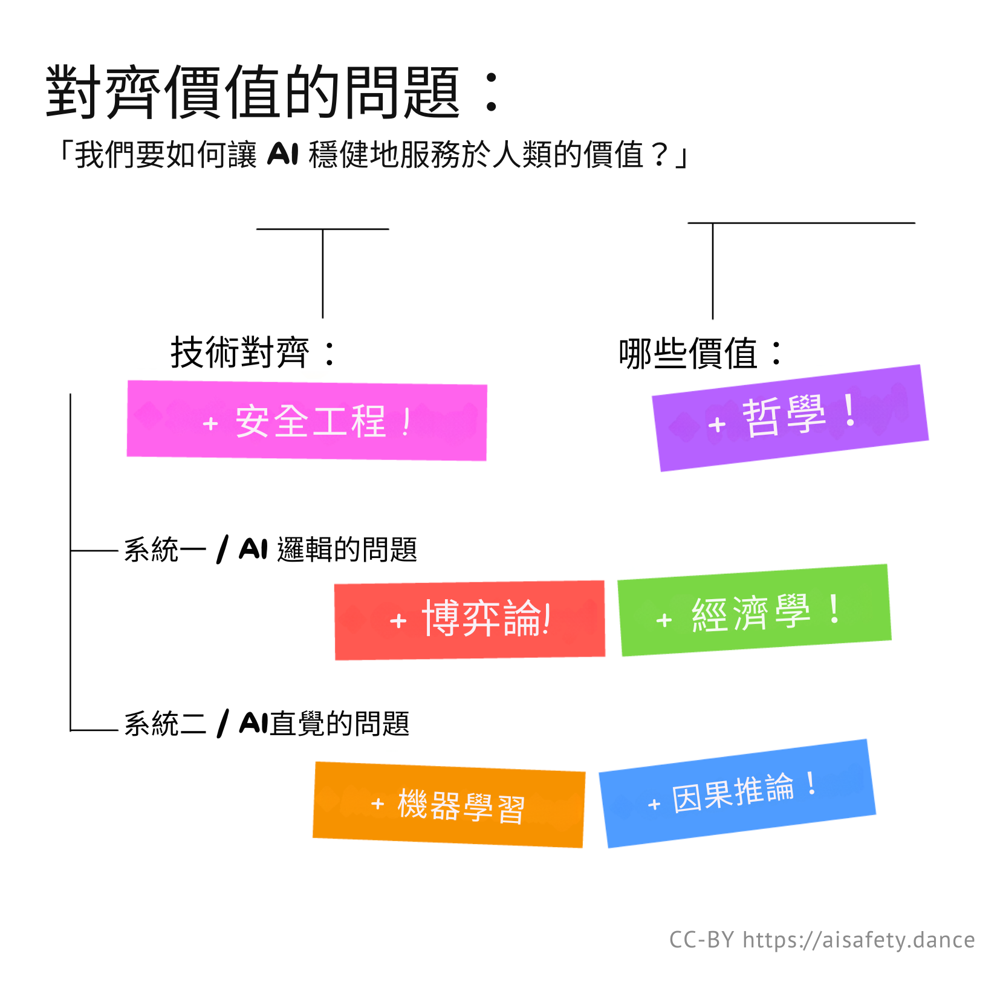

**總結：**

* 🙀 **要工程出安全、有用的東西，** 得有點偏執。先問：**「最糟（但合理）會發生什麼？」** 然後**事先**把它修掉。樂觀者發明飛機，悲觀者發明降落傘。
* ⚙️ **AI「邏輯」的主要問題**，可用古德哈特法則與賽局理論理解。

  * 👀 **視覺工具：** 用**賽局樹**理解**工具性收斂**與**避免自我灌獎**。
* 💭 **AI「直覺」的主要問題**，其實就是把曲線擬合到資料點的那些老毛病（難解釋、過擬合），以及「相關告訴不了你**哪一種**因果」的問題（導向**歧視**與**錯誤泛化**）。

  * 👀 **視覺工具：** 用**因果圖**理解**相關 vs 因果**。
* 💖 **「該對齊哪些價值」這題，** 是千年老題的道德哲學。祝好運。

. . .

**「問題陳述得好，等於解決了一半。」**

另一半，就是把它**真正解掉**。

兩章鋪陳之後，我們終於能好好理解——**對齊問題每個子題**的**頂尖解法**！👇



---

#### :x Ways to make "Humane AI" going wrong

（從[第一部分](../p1/)複製）

以下是一些你*以為*會通往「**人道** AI」，但**按字面執行**就會翻車的規則：

* <u>「讓人類快樂」</u> → 醫生機器人直接用手術把你的大腦灌滿「快樂」訊號。你整天對著牆傻笑。
* <u>「未經同意，不得傷害人類」</u> → 救火機器人拒救你離開燃燒車體，因為會扯傷你肩膀。你已經昏迷，**無法**給同意。
* <u>「遵守法律」</u> → 政府與企業天天鑽法律漏洞。而且，很多法律本來就不正義。
* <u>「遵守這段宗教／哲學／憲法文本」</u> 或 <u>「遵循這份美德清單」</u> → 如歷史所示：給 10 個人同一段文本，他們會解讀出 **11 種**意思。
* <u>「遵守常識」</u> 或 <u>「遵循專家共識」</u> → 「奴隸制是自然且好的」曾經同時是**常識**、**專家共識**、**法律**。兩百年前被這麼指示的 AI 會**替**奴隸制辯護……如今也會替任何不正義的**現狀**辯護。

（重點！最後這例正好證明：即便我們讓 AI 學會「常識」，*仍*可能導向**不安全／不道德**的 AI……因為很多事物**確實**是以「常識」的姿態存在著錯。）

---

#### :x Story of passive prediction leading to harm

想像有個 ~~AI~~ 軟體只做一件事：**預測**某人會看哪些影片。這些**預測**會被放在「你可能會喜歡」。

再強調一次：這個 ~~AI~~ 軟體**不是**在最大化互動或觀看數，它只是在最大化**預測準確率**。而且它**不會**前瞻規劃，只是即時計算相關性。我要過度強調：**即便沒有惡意目標、也沒有前瞻能力，軟體仍會產生壞的非預期結果**。

過程是這樣：網站做 A/B 測試。碰巧，預測器 A 比較偏向預測「好奇心」影片；預測器 B 比較偏向預測「憤怒政治」影片。兩者**準確率相同**。

但……B 會贏。因為拿到 A 的用戶會被推薦更多「好奇心」影片，於是變得更開放，**更難預測**。拿到 B 的用戶會被推薦更多「憤怒政治」影片，於是變得更封閉，**更好預測**。**再次強調：**這個軟體沒有前瞻規劃、也**不是**在最大化互動，它**只是**在最大化**預測準確率**。

結果是：經過一輪又一輪 A/B，預測器越來越偏向那些**讓使用者更好預測**的影片——往往就是更憤怒、更極端的內容。

……我知道這結果（指向整個網路）不那麼令人意外，但**我個人**仍覺得震撼。它讓我看到：**壞的非預期結果**竟能如此輕易地發生，**即使**沒有惡意目標或高階規劃能力！

（小道消息，不附來源也不打算附：有頂尖 AI 研究者把這叫做「**你外婆變成納粹風暴兵**」問題。）

#### \:x Difference Between ML And AI

*（出處：[@matvelloso](https://x.com/matvelloso/status/1065778379612282885)）*

不開玩笑地說，這裡再貼一次來自第一部分、說明 AI／GOFAI／ML／深度學習差別的文氏圖：

#### \:x Ontological Crisis

對 AI 而言，「本體論危機」（ontological crisis；見 [de Blanc 2011](https://arxiv.org/pdf/1105.3821)）是：當它學到一個新的世界模型，而它目前的目標在這個模型下不再有意義。打個比方：想像你一生唯一的目標是做會讓聖誕老人開心的事。然後有一天，你得知聖誕老人不存在。你的唯一目標現在連「意思」都沒有了。接下來你會怎麼辦並不清楚：什麼都不做？改崇拜 Krampus？K.Y.S.？（Krampus, You Serve?）

來個推測性的 AI 案例：假設我們指示 AI 尊重人的自由意志與人格。那如果它在學到更多神經科學後，得出結論認為自由意志並不存在、人格也不存在（「自我是幻覺」之類）呢？在新的世界觀下，對那些「本就不成立」的目標，AI *應該*怎麼辦？

這甚至不是那種「人類可以自誇表現勝過 AI」的案例，因為（就我所見）人類面對摧毀世界觀的證據時，通常是：1）把它合理化掉，或 2）整個人垮掉。

兩個可能的解法：

a) 如上文連結的論文所提，也許我們可以讓 AI 轉換到「下一個最接近的目標」？例如，若一個被設計來支持我們自由意志的 AI 學到「自由意志」並不真實，它可以改成下一個最接近的目標，如：「幫助人類的大腦產生那些會被大腦賦予正面價值的行動」。（即使這些產生的行動與賦予的價值仍是由物理定律完全決定的。）

b) 如 [Shard Theory](https://www.greaterwrong.com/posts/8ccTZ9ZxpJrvnxt4F/shard-theory-in-nine-theses-a-distillation-and-critical) 所建議：一個代理可以同時擁有多個目標，當其中一個目標「死亡」，其他目標會在其位置上長大。例如，如果侍奉聖誕老人佔我動機的 95%，得知聖誕老人不存在會讓我失去 95% 的生命意義……但透過哀悼，剩下 5% 的動機（友情、學習、樂趣等）會長大，填滿我心中的空位。

#### \:x Inner Misalignment: Deleted Scene

**這則漫畫不正確。屬於刪除片段。**

*當我畫這則漫畫時，我以為「內部錯位（Inner Misalignment）」是指：當一個 AI 會製造輔助 AI（就像能開子程序的電腦程序），那第一個 AI 會面臨跟人類一樣的對齊問題：命令被照字面執行，而不是照意圖。*

*諷刺的是，我把「inner misalignment」按字面理解了，而不是按原意。上段描述或許*仍然*可能是一種失敗模式，但那**不是**提出「內部錯位」的作者真正的意思。*

*總之，刪除片段，請忽略。*

#### \:x What if Goal Misgeneralization is good?

兩種「其實目標錯誤泛化是好事」的看法：

1. 我的個人價值，其實是演化「錯誤泛化」後的目標
2. Shard Theory：我們可以*運用*目標錯誤泛化，去*繞過*目標錯誤指定

. . .

1\) 看看這隻貓：

沒錯，它們回來了！第一部分的「回鍋貓」。

總之，*為什麼*我們會覺得這隻貓可愛？來一段我憑空捏造的演化心理學小故事：演化「想要」我們撐過養育後代的艱難，所以演化讓我們愛上「頭大眼大、弱小的生物」。然而，我們把這個目標「錯誤泛化」了，所以現在我們也會對不會傳遞我們基因的生物（例如小貓）產生「哇啊啊」的感覺。

（正如科學神鵰俠侶 John Tooby 與 Leda Cosmides [著名地說過](https://web.archive.org/web/20120318083503id_/http://eugen.leitl.org/striz/striz.org/docs/tooby-1992-pfc.pdf)：**我們是「執行適應」者，不是「最大化繁殖適合度」者。**）

再舉例：我們與生俱來的「道德感」很可能演化來幫助我們在最多約 [1,000 人](https://www.ncbi.nlm.nih.gov/pmc/articles/PMC2706200/)的狩獵採集社群裡興旺。然而我們把這個目標「錯誤泛化」了，如今許多人真誠地倡議所有 **80 億**陌生人的人權——這遠遠超出你最親近的 1,000 人！

現在：即使我*清楚知道*我的價值來自對粗糙達爾文本能的「錯誤泛化」……我要放棄覺得貓可愛嗎？我要放棄重視人權嗎？

*絕對*不會。而如果「演化」想把這些價值從人類身上撬走——那我們就只好先把「演化」打敗。

. . .

2\) Shard Theory 是個進行中的研究計畫（[Lawrence Chan 2022 的綜述與批評](https://www.greaterwrong.com/posts/8ccTZ9ZxpJrvnxt4F/shard-theory-in-nine-theses-a-distillation-and-critical)），嘗試*利用*目標錯誤泛化（內部錯位）去*解*目標錯誤指定（外部對齊）。

所以：你知道那些給 AI 設定目標的問題吧？古德哈特、工具性收斂，等等？Shard Theory 的建議是：*我們不需要做「目標最大化器」，我們可以做「適應執行者」！* 不過他們把「適應執行者」取了個更俐落的名字：「Shards」——神經網路中的小小反射碎片，會在內心說：「如果 X，那就做 Y」。

這個研究計畫的希望是：最終，我們能足夠理解這些 Shard，並用獎懲把它們塑形，就像我們能用獎勵把海洋世界的海豚訓練到能做複雜特技。同時，也希望我們能讓 AI「本質上」去價值一切有感存在的繁榮，就像*我*本質上會覺得貓和人權可貴一樣。

#### \:x Asimov's Laws

以下是 [阿西莫夫的機器人三定律](https://en.wikipedia.org/wiki/Laws_of_robotics#Isaac_Asimov's_%22Three_Laws_of_Robotics%22)：

> 1. 機器人不得傷害人類，或因不作為而使人類受到傷害。
> 2. 除非與第一定律衝突，機器人必須服從人類所給予的命令。
> 3. 在不與第一、第二定律衝突的前提下，機器人必須保護自身的存在。

看似善意的機器人「道德守則」！不過，阿西莫夫的故事重點正是：當這些定律被逐字解讀與執行時，會如何跑偏。

例如，這可能導致一個秘密的機器人小圈圈去審查並瓦解反機器人的人類團體。為什麼？第三定律*要求*機器人自我保護，因此去削弱反機器人團體。第二定律要求它們服從命令，這也就是為什麼它們保持秘密：只要沒有人知道它們在做，就不會有「立即停止」的直接命令可違抗！至於第一定律，審查與破壞並不是物理意義上的「傷害」。

（這個例子與阿西莫夫短篇〈The Evitable Conflict〉的劇情相似但不完全相同：可參見[維基條目](https://en.wikipedia.org/wiki/The_Evitable_Conflict)。）

#### \:x Trading with Advanced AIs

經濟學裡一個有趣的小知識是[比較優勢](https://en.wikipedia.org/wiki/Comparative_advantage)：即使甲國在*所有*商品上都比乙國更擅長生產，雙方*仍然*可以藉由分工交易而更好，因為乙國在某些商品上可能具有*比較*優勢。

具體的小玩具例子：Alicestan 用 1 單位資本可以做 4 把木琴或 2 個溜溜球。Bobstan 用 1 單位資本可以做 1 把木琴或 1 個溜溜球。

Alicestan 在木琴與溜溜球上都具*絕對*優勢，但 Bobstan 在溜溜球上有*比較*優勢！對 Alice 來說，做一個溜溜球的機會成本是 2 把木琴（4/2 = 2）；對 Bob 來說，則是 1 把木琴（1/1 = 1）。

所以理想合約是：Alicestan 專做木琴，Bobstan 專做溜溜球，然後交換。對 Alicestan 而言，這比自己做溜溜球更有效率！

. . .

把這拉回 AI：即使先進 AI 在所有認知任務上都有*絕對*優勢，我們仍可能在某些事情上有*比較*優勢，因此我們仍可以交易！

*然而*……

歷史課本都會告訴你：Alicestan 也許有一種更「有效率」獲取財富的方法：直接掠奪與洗劫 Bobstan。如果一方比另一方*強太多*，把對方推平可能是「最有效率」的行動。

所以，結論是：請把 AI 對齊問題（們）解掉，拜託。

#### \:x GMG Goals

我們不知道。

至少到目前為止，還沒有人（在非刻意設計的情境下）找到一個可被確認的例子：某個人工神經網路擁有一個它會明確拿來比較不同結果／行動的「目標」。目前不清楚我們之所以沒找到，是因為我們的 ANN 可解釋性技術還不夠好，還是因為這些東西根本不存在。

不過眼下，我們可以**採取「意向姿態」（intentional stance）**：如果一個 AI 的行為*就像是*它有某個目標／獎勵 X（X 屬於它的 ["Consistent Reward Set"](https://openreview.net/pdf?id=pErdjpoc-w3)），我們就可以這麼*描述*它。

例如，如果我們看到一個 AI 能*熟練地*閃避障礙物一路跑到關卡終點，我們可以說它的行為*就像*它的目標是抵達終點。即使那個 AI「實際上」只是由一堆沒有目標的反射規則組成，例如「如果遇到缺口，那就跳過去」，等等。

（嘿，也許在更深處，*我們人類*的所有目標也都是由沒有目標的心智反射組成？？例如「我想寫一篇好的解說文」⇒「如果句子太抽象，那就在旁邊放一個具體例子」，等等……）

#### \:x axiom

在數學／邏輯裡，「公理」（axiom）是指：一個你*必須*先假定才能證明其他東西的命題，但它本身*無法*被證明。

（[：幾何的例子](#axiom2)）

#### \:x axiom 2

例如，在「歐幾里得幾何」中，有一條[臭名昭著的平行公設](https://mathworld.wolfram.com/ParallelPostulate.html)：給定一直線 A 與一個不在其上的點 B，存在且僅存在*一條*通過 B、且與 A 平行的直線。你*需要*這條公設才能證明像「三角形內角和為 180°」之類的命題。

像康德這樣的哲學家\*相信歐幾里得幾何的絕對邏輯確定性。然後 1900 年代初，愛因斯坦把它炸掉了，顯示**我們的宇宙**是非歐幾里得的。你*真的*可以在現實世界中得到內角和不是 180° 的三角形。

\*（嗯，也許吧。古典哲學家寫作留下很多解讀空間。關於康德信念的爭論，見 [Palmquist 1990](http://web.archive.org/web/20240730051708/https://scholars.hkbu.edu.hk/ws/portalfiles/portal/55351095/RO_rel_ja-17_JA030471.pdf)。）

**重點是：你無法無中生有。** 你需要*至少一條公理*才能證明其他東西，但按定義，*那條*公理無法被證明。而且如歐式幾何史所示，該公理也可能根本不符合我們的宇宙。

#### \:x More Meta Ethics

想要一份給一般讀者看的、介紹後設倫理三大派的好入門，我強烈推薦 [Crash Course Philosophy 的短影片系列第 32～38 集](https://thecrashcourse.com/topic/philosophy/)。💖（每集約 10 分鐘）

想進一步技術性深入，史丹佛哲學百科超讚！這裡是它們關於[德行倫理](https://plato.stanford.edu/entries/ethics-virtue/)、[義務論](https://plato.stanford.edu/entries/ethics-deontological/)、[結果論](https://plato.stanford.edu/entries/consequentialism/)的條目。（每篇約 60 分鐘閱讀，但可以快讀。）

#### \:x Social Contract

（「社會契約」一節的一些刪減段落，因為我離題得*太*遠了）

. . .

我的意思是，*理想上*，我當然想偷別人的東西而不被偷回來……但沒有人會資助那樣的制度，而我也不夠有錢可以獨自贊助一支警察隊伍。就算我做到了，也只會激勵人民起來幹掉我。

如果多數人偷少數人的呢？他們*也許*能逍遙一陣子……但 1）少數人會反擊，這是有成本的；2）幾乎每個人都屬於*某些*統計上的少數群體（年齡、性別、種族、性傾向、階級），最後會反噬到我自己。*「[起初他們來抓……](https://en.wikipedia.org/wiki/First_they_came_...)，我沒有出聲，因為我不是……。重複 N 次。最後他們來抓我時，已經沒人能替我說話。」*

. . .

當人們說「我們都有平等的權利！」，其實只是簡寫成：「當法律擁有最廣泛的支持時，最容易募資去執行。」

拳頭能成就公理……但中立能成就聯盟，而聯盟能成就拳頭。

這不是很可怕嗎？是的，很可怕……地*沒效率*！用*外在*的威嚇與賄賂，不如給人*內在*的威嚇與賄賂：也就是道德羞恥與自豪。所以，我們會用巴甫洛夫式的條件作用，透過故事與教訓，讓人成為自己的警察。契約會被內化到一個地步，人們會忘了道德是怎麼來的。而如果他們哪天知道它*其實*是怎麼來的，他們會自動因厭惡而拒絕——就像很多人愛吃香腸，但不想知道它怎麼做的一樣。

（為免誤會：我不一定在*支持*社會契約論，我只是在用一種 2edgy4me 的方式*解釋*它。）

. . .

社會契約論也解了義務論的僵硬：每個現實世界的契約都有例外條款。當然，「不可偷竊」，但如果你餓到快死，而食物反正也要被丟掉，老實說，沒有一個有正常心腦的人會去執行那份契約。

我不一定支持社會契約論，但我*確實*支持逮到機會就對義務論吐舌頭。甚至可以說，這是我的道德義務呢。

#### \:x Spurious Correlations

「偽相關」（spurious correlation）是指兩件事常常同時發生（相關），但它們之間沒有有意義的因果關係（「偽」）。

現代機器學習*只會*抓相關、不會抓因果——這讓 AI 常被偽相關欺騙。一個極端且著名的例子來自 [(Ribeiro, Singh & Guestrin 2016)](https://dl.acm.org/doi/pdf/10.1145/2939672.2939778)：他們訓練一個 AI 區分狼與哈士奇，看起來準確率很高……但檢視後發現，AI 並不是靠毛皮或臉來判斷「狼」，而是靠周圍的*雪*。因為訓練照片裡的狼通通都在雪地裡。結果就出現了一個「偽相關」，AI 被它騙了。

而這還算是*令人看到希望*的例子。因為這種情況下，研究者看得出偽相關是什麼。至於前面那個烏龜變步槍的例子，我就看不出為什麼那些看似隨機的塗抹會和「步槍」相關。

#### \:x Pi-pocalypse

（從[第一部分](../p1/)複製）

> 從前，有個先進（但未達超人）的 AI 被給了一個看似無害的目標：計算圓周率的位數。
>
> 一開始一切合理。AI 寫了個程式來算圓周率。然後它寫出越來越有效率的程式，讓計算更快更好。
>
> 最終，AI（正確地！）推論出：它可以透過取得更多運算資源來最大化計算量。也許甚至要靠偷。於是，AI 駭入它所在的電腦，透過電腦病毒逃出網路，在全世界綁架上百萬台電腦，串連成一個巨大的殭屍網路……就只是為了計算圓周率。
>
> 喔，AI 還（正確地！）推論出：如果人類把它關掉，它就算不了圓周率，所以它決定挾持幾家醫院與電網。你懂的，當「保險」。
>
> 於是「Pi-pocalypse」——圓周率末日——降臨了。完。

#### \:x What Is Correlation

如果兩件事經常一起發生，我們就說它們之間有「相關」。例如，個子高的人通常也比較重，所以我們說身高與體重之間有相關。

