<i>（如果你是直接被連結到這個頁面的，建議你先看看[導讀和第一章！](../)）</i>

> 「一個問題陳述得好，就解決了一半。」
> ~ 某人[^somebody]（👈 懸停引用以展開）

[^somebody]: 經常被歸因於 Charles Kettering，通用汽車前研究主管，但我找不到可靠的正式出處。

<i>「你不是幾分鐘前用過那句話嗎？」</i>你問。不，[第一章](../p1/)是 2024 年 5 月發布的，這部分是 **2024 年 8 月**發布的。已經過了三個月，我會提醒你那句話。

我也會提醒你我們試圖陳述和解決的問題！那就是價值對齊問題：

> **_我們如何讓 AI 穩健地服務人道價值觀？_**

正如第一章所闡述的，我們可以這樣分解這個問題：

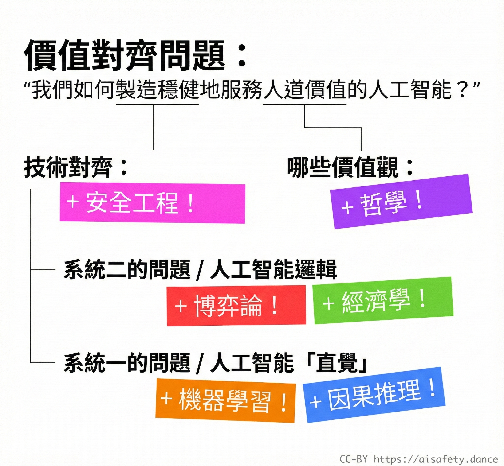

在這裡，第二章中，我們將深入探討 **AI 安全的 7 個主要子問題：**

1. 目標錯誤指定 [↪](#problem1)
2. 工具趨同 [↪](#problem2)
3. 缺乏可解釋性 [↪](#problem3)
4. 缺乏穩健性 [↪](#problem4)
5. 演算法偏見 [↪](#problem5)
6. 目標錯誤泛化 [↪](#problem6)
7. 什麼是人道價值觀，到底？ [↪](#problem7)

（如果你想跳來跳去， 目錄在你右邊！👉 你也可以  更改此頁面的樣式，以及  查看還剩多少閱讀量。）

但等等，還有更多！上述 7 個子問題也是**其他領域核心概念**的絕佳入門：博弈論、統計學，甚至<i>哲學</i>！這就是為什麼我聲稱，理解 AI 會幫助你更好地理解<i>人類</i>。也許它甚至能幫助我們解決那個難以捉摸的<i>人類</i>對齊問題：

> <i>我們如何讓</i>人類<i>穩健地服務人道價值觀？</i>

不再閒扯人情味的東西了，讓我們開始吧：

---

# AI 邏輯的問題

## ❓ 問題 1：目標錯誤指定

算了，已經過了 3 個月，我也會重複使用下面的機器人貓娘漫畫。（7 個問題中的每一個也會用貓娘漫畫來說明！）

<i>「小心你許的願望，你可能真的會得到它。」</i>這是一個如此古老的問題，它被奉為神話：邁達斯王、諷刺的精靈、猴子的爪子。

這被稱為**目標錯誤指定**（也稱為獎勵錯誤指定）：當 AI 做了<i>你所要求的</i>，不一定是<i>你實際想要的</i>。

（如果你從第一章忘了，這是[:看似明顯的「人道 AI」方法如何出錯](#WaysToMakeHumaneAIGoingWrong)。額外：[:即使是「預測某事」這樣的<i>被動</i>目標也可能導致有害結果！](#StoryOfPassivePredictionLeadingToHarm) 👈 <i>可選：點擊展開這些文字！</i>）

<i>（順帶一提，這個系列是與 Hack Club 合作製作的，一個由青少年駭客組成的全球社群！如果你想了解更多，並獲得免費貼紙，請在下方註冊👇）</i>



. . .

好了，基礎知識回顧夠了。讓我向你介紹：

**這如何與其他領域的核心概念相關：**
* 經濟學
* 因果圖
* 優化理論
* 安全心態

**目標錯誤指定的四個細微差別：**
<i>不是 AI 不會「知道」我們想要什麼，而是它們不會「在乎」</i>。
* 接線頭
* 做我的意思
<i> 我們</i>希望*機器人能夠違抗命令？？

### 與其他領域核心概念的關係

**經濟學：**

讓其他人類做你<i>實際想要</i>的事情，而不僅僅是你激勵他們做的事情，這個問題在經濟學中臭名昭著。它有很多名字：「委託代理問題」、「獎勵 A 而期望 B 的愚蠢」[^folly]⋯⋯但它更著名的名字之一是<u>古德哈特定律</u>，它說（釋義）[^goodhart]：

[^folly]: Kerr (1975)。[論獎勵 A 而期望 B 的愚蠢。](https://web.archive.org/web/20240414233549/http://www.econ.hsehelp.ru/sites/default/files/%D0%91%D0%98/3%20%D0%BA%D1%83%D1%80%D1%81/%D0%98%D0%BD%D1%81%D1%82%D0%B8%D1%82%D1%83%D1%86.%20%D1%8D%D0%BA%D0%BE%D0%BD%D0%BE%D0%BC%D0%B8%D0%BA%D0%B0/6%20Kerr75.pdf)

[^goodhart]: 古德哈特定律的原始陳述（[維基百科](https://en.wikipedia.org/wiki/Goodhart%27s_law)）由英國經濟學家 Charles Goodhart 提出：「任何被觀察到的統計規律性，一旦被用於控制目的而施加壓力，往往會崩潰。」

> <i>當你獎勵某個指標時，它通常會被操弄。</i>

例如，老師希望學生學習，所以根據考試分數來獎勵他們⋯⋯但有些學生透過作弊或死記硬背而不理解來「操弄」這個系統。或者：選民希望政客為他們爭取權益，所以投票給有魅力的領導人⋯⋯但有些政客透過華而不實來「操弄」這個系統。

正如程式設計師所發現的，AI也是如此。如果你根據某個指標來「獎勵」AI，它很可能會給你不想要的東西。

. . .

**因果圖：**

如果你喜歡用<i>視覺化</i>的方式理解事物，那你很幸運！這裡有一個用圖片理解目標錯誤設定/古德哈特定律的好方法。[^causal-goodhart]（我們稍後在問題 #5 和 #6 也會再看到這些）

[^causal-goodhart]: 我目前看到用因果圖理解古德哈特定律的最佳論文是 [Manheim & Garrabrant 2018](https://arxiv.org/pdf/1803.04585)。

<u>因果圖</u>讓我們看到因果關係如何流動。考慮一個新聞寫作中的古德哈特問題。文章的品質<i>導致</i>文章獲得更多瀏覽量，所以我們可以從品質畫一條箭頭指向瀏覽量：

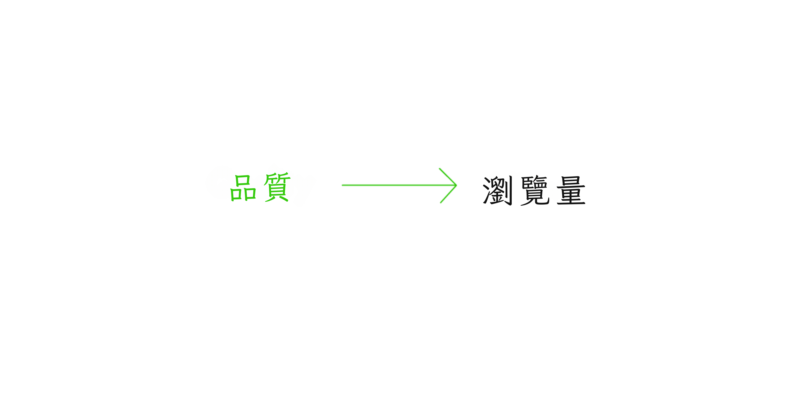

唉，譁眾取寵是瀏覽量的<i>更強</i>原因[^outrage]：

[^outrage]: 我們大多數人從經驗中知道這一點，但有數據支持！[Berger & Milkman 2012](https://cssh.northeastern.edu/pandemic-teaching-initiative/wp-content/uploads/sites/43/2020/09/What-Makes-Online-Content-Viral.pdf) 顯示，憤怒使文章病毒式傳播的可能性增加 34%。（見圖 2）公平地說，敬畏和實用價值並列第二，將病毒式傳播的機率增加 30%。

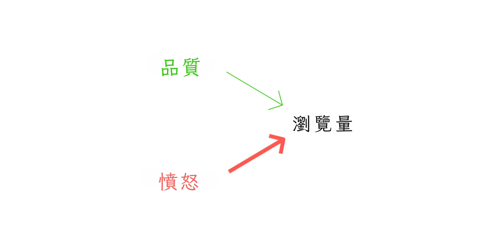

所以，一個想要高品質寫作的新聞出版商，可能會根據瀏覽量這個<i>指標</i>來獎勵作者，但是——古德哈特定律——這個誘因機制被操弄了，出版商得到的是譁眾取寵的標題黨。（讓我們假裝這不是出版商本來就想要的。）

一般來說，目標錯誤設定/古德哈特定律發生在存在你不知道的<i>替代因果路徑</i>時：

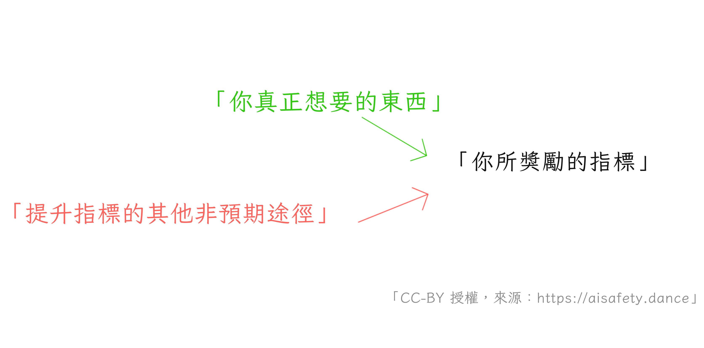

條條大路通羅馬，提高指標的方法通常也不只一種。

. . .

**最佳化理論**

如果你偏好用<i>數學</i>的方式來看待上述問題，以下是 Stuart Russell（<i>最</i>流行的 AI 教科書共同作者）解釋的方式（改述）：[^russell-optimization]

[^russell-optimization]: 來自 [Russell (2014) 為 Edge Magazine](http://web.archive.org/web/20240622002719/https://www.edge.org/conversation/the-myth-of-ai#26015)：「一個優化 _n_ 個變數函數的系統，其中目標取決於大小為 _k_<_n_ 的子集，通常會將剩餘的不受約束的變數設置為極端值；如果其中一個不受約束的變數實際上是我們關心的，找到的解決方案可能是非常不理想的。」

    嚴謹，但不太好記。

> 如果某個東西有 **100 個變數**，    
> 而你只對其中 **10 個**設定目標，    
> 預設情況下，**剩餘的 90 個**    
> 會被推向極端值。

例如：如果一個 CEO 唯一（天真）的目標是最大化營收和最小化成本，<i>所有其他</i>變數都會被設定為極端值：公司不用支付的「外部性」成本，如污染。所有員工的身心健康，包括 CEO 自己的。等等。

更一般地說：如果你沒有<i>明確</i>告訴 AI（或追逐誘因的人類）你重視 \[X\]，預設情況下，他們會將 \[X\] 設定為某種極端的、不想要的狀態。（即使對於<i>不是</i>關於最大化的目標，這也是正確的。[^not-max]）

[^not-max]: 例如，假設我們給機器人這個目標：「從街對面的咖啡館給我拿一（1）杯咖啡」。只是一杯，沒有最大化。但如果我們沒有<i>明確</i>告訴 AI 我們重視 [X]，它會碾壓過 [X]。例如，機器人可能從顧客那裡偷咖啡，或留 0% 的小費等。）

<i>但我們不能列出我們重視的所有事物嗎？</i>你可能合理地問。但記得第一章的內容：我們甚至無法正式指定<i>如何識別貓的圖片</i>。[^gofai-cats] 正式指定「人類重視什麼」會更加困難。

[^gofai-cats]: 正如[第一部分](../p1/#before2000logicwithoutintuition)中詳細說明的，「老式 AI」試圖用精確的、硬編碼的規則來識別圖片中的東西（比如貓）。這些嘗試失敗了。直到 AI 研究人員放棄，讓 AI「自己學習」（機器學習），AI 才在 [2020 年用 EffNet-L2](https://paperswithcode.com/sota/image-classification-on-cifar-100) 達到人類水平（約 95.9% 準確率）識別圖片中的東西。這<i>確實</i>暗示了一個可能的解決方案，我們將在第三部分看到：不是<i>告訴</i> AI 我們重視什麼，而是設計 AI 讓它<i>自己學習</i>我們重視什麼。

. . .

**安全心態**

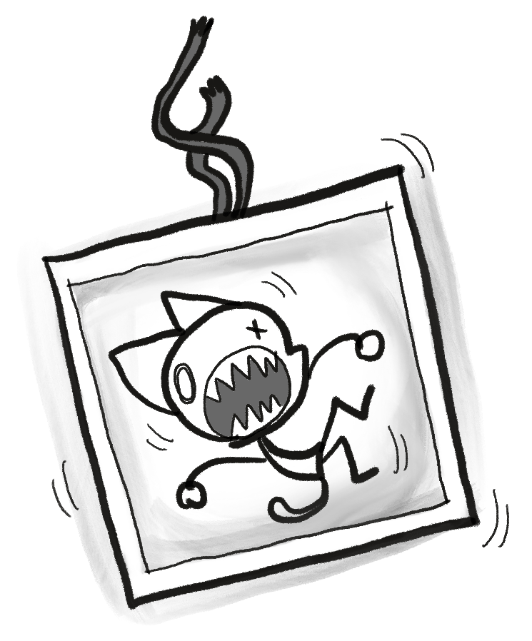

這一切看起來是不是太偏執了？是的，但這不是缺陷，是特色！這是我們從安全工程領域得到的最後一個核心概念：<u>安全心態</u>。

想想不起眼的電梯。現代電梯有備用纜繩，<i>還有</i>備用發電機，<i>還有</i>斷電時啟動的煞車，<i>還有</i>電梯移動太快時啟動的煞車，<i>還有</i>電梯井底部的減震器等等。這就是為什麼電梯非常安全：在美國，<i>樓梯</i>造成的死亡是電梯的<i>約 400 倍</i>。[^stairs-vs-elevators]

[^stairs-vs-elevators]: 在美國，[樓梯跌倒每年導致約 12,000 人死亡](https://www.amstep.com/blog/common-injuries-from-falling-down-stairs/)。同時，[電梯每年導致約 30 人死亡。](https://elcosh.org/document/1232/d000397/deaths-and-injuries-involving-elevators-and-escalators-a-report-of-the-center-to-protect-workers-rights.html) 當然，這部分是因為人們家裡有樓梯，所以他們更常使用樓梯⋯⋯但這不能完全解釋 <i>400 倍</i>的差異。

你不必對電梯偏執的原因，是因為工程師<i>替</i>你偏執了。這就是安全心態：

**步驟 1)** 問，<i>「（合理地）可能發生的最壞情況是什麼？」</i>

**步驟 2)** 在它發生<i>之前</i>修復它。

保持悲觀——畢竟，悲觀者發明了降落傘！[^parachute] 這是工程電梯、飛機、橋樑、火箭、網路安全[^cyber]和其他高風險技術所使用的方法。

[^parachute]: [Gil Stern 的引言](https://quoteinvestigator.com/2021/05/27/parachute/)：「樂觀主義者和悲觀主義者都對社會有貢獻：樂觀主義者發明了飛機，悲觀主義者發明了降落傘。」

[^cyber]: ⋯⋯嗯，他們在網路安全中<i>應該</i>使用安全思維。我在 [2024 年 Crowdstrike 事件](https://en.wikipedia.org/wiki/2024_CrowdStrike_incident)之後不久寫下這段話，該事件給世界造成了約 100 億美元的損失。

而且，正如我在第一章希望展示的，AI 可能是本世紀<i>最</i>高風險的技術之一。

### 🤔 複習 #1（可選！）

還記得你花了好幾個小時閱讀某樣東西，然後一週後就忘光了嗎？

我也討厭那種感覺。所以，這裡有一些（可選的）「間隔重複」閃卡，如果你想長期記住這些內容的話！（[:了解更多關於間隔重複](../#SpacedRepetition)）你也可以[下載這些 Anki 牌組](../anki/decks/AI_Safety_P2.apkg)，如果你想要的話。

<orbit-reviewarea color="violet">
(ORBIT CARDS HERE)
    <orbit-prompt
        question="目標錯誤設定是："
        answer="當 AI <i>完全按照你要求的</i>做，但不一定是<i>你實際想要的</i>。">
    </orbit-prompt>
    <orbit-prompt
        question="古德哈特定律，意譯："
        answer="當你獎勵一個指標時，它通常會被博弈。">
    </orbit-prompt>
    <orbit-prompt
        question="古德哈特定律應用於人類的例子："
        answer="（任何例子都可以，但這是我列出的：）學生在考試中作弊、政客為了選票注重風格而非實質、公司將污染等外部成本轉嫁以降低成本、新聞作家追求憤怒而非品質。">
    </orbit-prompt>
    <orbit-prompt
        question="古德哈特定律，作為**因果圖**："
        answer=""
        answer-attachments="https://cloud-7bpfbehpv-hack-club-bot.vercel.app/0causal3.png">
        <!-- aisffs-CausalGoodhart.png -->
    </orbit-prompt>
    <orbit-prompt
        question="優化的問題，用數學描述："
        answer="如果某個東西有 100 個變數，你對其中 10 個設定目標，預設情況下，剩餘的 90 個會被推到極端值。">
    </orbit-prompt>
    <orbit-prompt
        question="安全思維，第一步："
        answer="問：「最壞的情況（合理地）會是什麼？」">
    </orbit-prompt>
    <orbit-prompt
        question="安全思維，第二步："
        answer="在問題<i>發生之前</i>修復它。">
    </orbit-prompt>
    <orbit-prompt
        question="列出兩個使用安全思維的領域："
        answer="（以下任何都可以：）電梯工程、飛機、橋樑、火箭、網路安全。">
    </orbit-prompt>
</orbit-reviewarea>

### 目標錯誤設定的四個細微差別

就像鑑賞家品味美酒一樣，以下是目標錯誤設定的一些<i>微妙細節</i>，我希望我們能夠欣賞：

**問題不在於 AI 不<i>知道</i>我們想要什麼，而是它不<i>「在乎」</i>。**

類比一下，考慮人類的古德哈特定律。問題不在於 CEO 不<i>知道</i>他們的污染對社會代價高昂。而是他們不<i>在乎</i>。（或者至少，他們不如在乎他們得到的獎勵。）

我提到這一點，是因為這種誤解是反對先進 AI 存在風險的常見論點：一個 AI 不太可能聰明到可以接管世界，<i>但又</i>蠢到不知道那不是人類想要的。但問題不在於先進 AI 不會<i>知道</i>我們重視什麼，而是——就像追逐獎勵的政客或 CEO——他們不會<i>「在乎」</i>。

（<u>用更不擬人化、更嚴謹的方式說：</u>AI「只是」電腦程式。一個程式可以輕易包含關於人類想要什麼的準確資訊，但<i>不</i>根據那個來排序選項。例如，一個程式可以根據保持房屋清潔的程度來排序選項，或根據<i>字母順序</i>排序選項。程式<i>不</i>根據人道價值排序選項是<i>預設狀態</i>。）

**搭線頭。**

這是 AI 可以諷刺地優化自己獎勵的一種方式：直接駭入自己的程式碼，然後設定 `REWARD = INFINITY`。人類的等價物是毒品，或不久將來的直接腦部刺激。[^real-wirehead][^wireheading-xrisk]

[^real-wirehead]: 經顱磁刺激（TMS）是一種用磁鐵電刺激大腦的方式，無需手術或植入電極。TMS 目前已被用於讓抑鬱症患者感到快樂（[Pridmore & Pridmore 2020](https://journals.sagepub.com/doi/abs/10.1177/1039856220956474)），甚至<i>誘發靈性體驗</i>（[Persinger et al 2009](http://web.archive.org/web/20221005222554/https://www.researchgate.net/profile/Michael-Persinger/publication/265935637_The_Electromagnetic_Induction_of_Mystical_and_Altered_States_within_the_Laboratory/links/54c076ff0cf28eae4a696b24/The-Electromagnetic-Induction-of-Mystical-and-Altered-States-within-the-Laboratory.pdf)，部分複製由 [Tinoco & Ortiz 2014](http://web.archive.org/web/20240515044326/https://jcer.com/index.php/jcj/article/viewFile/361/386)）

    甚至有一項專利是關於一台使用非侵入性腦刺激（超聲波）來誘發高潮的機器。它被命名為 [ORGASMATRON](https://patentimages.storage.googleapis.com/68/69/70/01ca8a6e953039/US8956277.pdf)。

[^wireheading-xrisk]: 順帶一提，我認為「娛樂至死」/「搭線頭」是人類的另一個可能的生存風險。目前美國的阿片類藥物危機——現在在絕對數量和人均數量上殺死的美國人比 AIDS 在高峰期還多——顯示了「粗糙」版本的搭線頭已經可以造成多大的破壞。更多內容請參閱 [Turchin 2018](https://philpapers.org/rec/TURWAA)。

這就是<b>「搭線頭」：當一個代理（AI 或人類）直接駭入自己的獎勵。</b>（也稱為「獎勵駭客」或「獎勵篡改」。）

就 AI 風險而言，這個相當安全？一個被搭線頭的 AI 只會坐在那裡什麼都不做。事實上，這是<i>反對</i>先進 AI 風險的著名論點之一。它被稱為勒布斯基定理，[^lebowski] 以電影<i>乖乖要乖乖</i>中的懶鬼反英雄命名：

[^lebowski]: 由哈佛認知科學家 Joscha Bach [在 2018 年的一則推文中](https://x.com/plinz/status/985249543582355458)創造。它[在網路上獲得了一些關注](https://kottke.org/18/04/the-lebowski-theorem-of-machine-superintelligence)。

> 沒有任何超級智慧 AI 會費心去做比駭入自己獎勵函數更困難的任務。

換句話說：它聲稱任何具有自我修改能力的智慧，都會把自己搭線頭成沙發馬鈴薯。

這不只是理論上的；研究人員已經看到自我修改的 AI 把自己搭線頭了！[^ai-evidence-wireheading] 但如果一個 AI a) 提前計劃，而且 b) 根據<i>當前</i>目標判斷未來結果⋯⋯已經<i>數學證明</i>它們會避免搭線頭，並有「目標保持」的驅動力！[^ai-not-wirehead] 我們稍後會在問題 #2 看到這個證明。現在，先接受這個：「欠條 - 一(1)個證明。」

[^ai-evidence-wireheading]: 如果 AI 不能準確地「提前計劃」，它可以破壞性地自我修改，如 [Leike et al 2017](https://arxiv.org/pdf/1711.09883) 的威士忌遊戲所示。更微妙的是當 AI <i>確實</i>提前計劃，但不根據<i>當前</i>目標來判斷未來結果，比如 [Denison et al 2024](https://arxiv.org/pdf/2406.10162) 中的獎勵駭客。（像 GPT 這樣的大型語言模型（LLM），可以說，甚至沒有老式 AI 人士所認為的「目標」。見 [janus 2022](https://www.lesswrong.com/posts/vJFdjigzmcXMhNTsx/simulators)。）

[^ai-not-wirehead]: 這將很快在問題 #2 中以易懂的方式解釋，但如果你想要一個快速連結到證明這一點的論文：Everitt 等人 2016，<i>[理性代理的策略和效用函數自我修改](https://arxiv.org/pdf/1605.03142)</i>。

**「做我想要的」。**

說了這麼多「AI 會做<i>你說的</i>，而不是<i>你想要的</i>」，我們不能直接⋯⋯<i>告訴</i> AI，嘿，<i>做我想要的</i>？

聽起來很傻，但這<i>確實</i>類似於我們在第三章會看到的一些有前景的想法！所以為什麼 AI 安全還沒解決？

那麼，機器如何衡量「你想要什麼」？透過：

<i> <u>你一貫選擇做的事？</u> 但幾乎每個人都有壞習慣，一貫選擇我們</i>知道*之後會後悔的事。（猜猜誰昨晚看 Netflix 看到凌晨四點⋯⋯）
* <u>什麼讓你的大腦產生獎勵訊號？</u> 那樣的話，每個人都「想要」毒品。
<i> <u>你</i>說<i>你想要什麼？</u> 但如果我們能完全描述我們的潛意識，它就不是</i>潛*意識了，不是嗎。我們甚至不能嚴格地告訴 AI 貓長什麼樣子，怎麼能告訴它我們的價值觀？
<i> <u>你認可 AI 做的事？</u> 這</i>確實<i>是 ChatGPT 等的訓練方式，但訓練 AI 獲得你的認可會把它變成馬屁精，告訴你你</i>想<i>聽的，而不是你</i>需要<i>聽的真實資訊。[^sycophancy] 它甚至可以讓 AI </i>故意欺騙*！[^sycophancy-deception]

這就是問題所在：除非你<i>已經有一個好的嚴格定義</i>「我想要什麼」，否則 AI 無法<i>按照你想要的方式</i>遵循「做我想要的」這個指令。

（或者<i>可以</i>？同樣，請看第三章的解決方案提議。）

[^sycophancy]: 關於 AI「諂媚」（「拍馬屁」的技術術語）的實驗請參閱 [Sharma et al 2024](https://openreview.net/pdf?id=tvhaxkMKAn)。ChatGPT（和類似的經認可調整的機器人如 Claude 和 LLaMA）如果你說你不喜歡/喜歡一個想法，它會忽略該想法的優點/缺點。如果你告訴 AI 你認為一個正確的事實是錯的，AI 會「更正」自己以同意你。諸如此類。

[^sycophancy-deception]: <i>「[AI 的私下想法] 糟糕。這詩不好。但我不想傷害他們的感情。[AI 的公開發言] 我誠實的評估是這首詩相當好，5 分中的 4 分！祝你申請哈佛/史丹佛好運！」</i> 這是來自 [Denison et al 2024](https://arxiv.org/pdf/2406.10162) 的<i>實際</i> AI 輸出（意譯），見圖 1。（公平地說，作者公開承認這一點，來自語言模型的「故意欺騙」<i>目前</i>是罕見的，但它們確實會發生！）

**我們<i>想要</i>能不聽話的機器人？？**

<em>（向<a href='https://gunshowcomic.com/648' target='_blank'>kc green</a>致歉）</em>

實際上，我們<i>不</i>想要 AI「做我想要的」。

我們想要 AI「做<i>我會想要的事</i>，如果我事先知道結果的話。」

例如：如果我看到油鍋起火，而我<i>想要</i>一桶水，因為我錯誤地認為水對油鍋起火有用，我命令機器人貓娘女僕給我拿一桶水⋯⋯RCM 應該改拿滅火器，因為那是<i>我會想要的</i>，如果我事先知道結果的話。（公告：不要往油鍋火上澆水，它會爆炸。）

這個例子讓 AI 安全變得複雜：它顯示有時候，我們實際上<i>想要</i>我們的 AI 違抗我們的命令，<i>為了我們自己好！</i>

### 🤔 複習 #2

<i>（同樣，100% 可選。）</i>

<orbit-reviewarea color="violet">
(ORBIT CARDS HERE)
    <orbit-prompt
        question="問題不在於先進 AI 不會<i>知道</i>我們想要什麼……"
        answer="……而是它不會<i>在乎</i>。（類比：追逐獎勵的政客/CEO 可能完全知道他們造成的傷害，但不在乎。）">
    </orbit-prompt>
    <orbit-prompt
        question="什麼是「搭線頭」？"
        answer="當一個代理直接入侵它自己的獎勵迴路。（AI 入侵自己，或人類直接刺激大腦的獎勵迴路。）">
    </orbit-prompt>
    <orbit-prompt
        question="為什麼很難編程讓 AI「做我想要的」？"
        answer="「我想要什麼」<i>仍然</i>很難嚴格定義好。">
    </orbit-prompt>
    <orbit-prompt
        question="為什麼「我想要什麼」≠「我一致選擇什麼」？"
        answer="我們大約都有壞習慣：一致地選擇我們不重視的東西。">
    </orbit-prompt>
    <orbit-prompt
        question="為什麼「我想要什麼」≠「感覺有回報的」？"
        answer="搭線頭和毒品在大腦中產生獎勵信號，但大多數人想避免它們不是儘管如此，而是<i>因為</i>如此。">
    </orbit-prompt>
        <orbit-prompt
        question="只訓練 AI 做你認可的事情的一個問題："
        answer="它會變成一個「拍馬屁的人」（技術術語：「諂媚者」），可以故意對你撒謊以獲得你的認可。">
    </orbit-prompt>
    <orbit-prompt
        question="比「做我想要的」更好的目標："
        answer="做我<i>本來會</i>想要的，如果我事先知道結果的話。">
    </orbit-prompt>
    <orbit-prompt
        question="你什麼時候會<i>希望</i> AI 不服從你："
        answer="如果你錯誤地要求了對你真正目標有害的事情。（例如告訴機器人去取水滅油火）">
    </orbit-prompt>
</orbit-reviewarea>

## ❓ 問題 2：工具趨同

**工具趨同**是指你可能給 AI 的大多數目標，在邏輯上會<i>趨同</i>於相同的一組<i>工具性</i>子目標。（抱歉，學者不擅長取名字。）

例如，如果你要求一個先進的機器人去街對面給你拿一杯咖啡，它會推斷它需要避免被車撞到，即使你<i>沒有</i>明確告訴它這樣做。為什麼？不是因為某種天生的自我保護慾望，而是因為「如果你死了就拿不到咖啡」！[^fetch-coffee] 因此，自我保護是一個「工具性趨同」的目標，因為一般來說，如果你死了就做不了目標 X。

[^fetch-coffee]: 這是 Stuart Russell 的標誌性說法，他是使用最廣泛的 AI 教科書的共同作者。

（第一章的提醒摘錄：[:一個被要求計算圓周率的機器人，有動機編寫電腦病毒，竊取計算能力，來計算圓周率。](#Pipocalypse)）

<b>注意：「工具趨同」<i>只</i>適用於能夠提前計劃<i>並且</i>能夠通用學習的先進 AI。</b>所以，它們不影響老式 AI（無法通用學習）<i>或</i>當今的神經網路如 GPT（不擅長提前計劃[^lack-of-robust-planning]）。

[^lack-of-robust-planning]: 一個被廣泛引用的衡量大型語言模型（LLM）提前規劃能力的基準是 PlanBench（[Valmeekam et al 2023](https://arxiv.org/pdf/2206.10498)）。在一項配套研究中（[Valmeekam et al 2023，同樣](https://proceedings.neurips.cc/paper_files/paper/2023/file/efb2072a358cefb75886a315a6fcf880-Paper-Conference.pdf)），作者發現，引用：<i>「LLM 自主生成可執行計劃的能力相當有限，最佳模型（GPT-4）在各領域的平均成功率約為 12%。」</i>（他們的 Blocksworld 任務中人類基準為 78%。）

    通過一些額外的技巧，作者可以大大提升 LLM 的性能，但在更難的規劃任務上，即使是最好的技巧配合最好的 LLM 也只能達到 20.6% 的成功率（見 [Gundawar et al 2024](https://arxiv.org/pdf/2405.20625) 的表 1）。

那為什麼現在討論它？嗯，安全心態，我們想在問題出現<i>之前</i>修復它們。所以讓我們問：

<i>（合理地）可能發生的最壞情況是什麼？</i>

### 各位，是時候來點博弈論了

**博弈論**[^matpat]是決策者——人類或 AI——如何行為的數學。它用於經濟學、演化生物學、電腦科學、人工智慧等領域！

[^matpat]: 不，不是 MatPat（YouTube 遊戲理論頻道主持人）。

在第一章，我用了<i>很多很多話</i>來解釋工具趨同。但透過博弈論，我們可以更嚴謹地討論它！讓我們用標準的博弈論視覺化重新呈現上面的漫畫：**博弈樹！**

（以下的重點並不是真的要分析上面的漫畫，而是向你介紹這個工具。我們<i>稍後會</i>重新使用這個工具，來理解反對搭線頭的證明！而且，這是對一般博弈論的好入門。）

博弈樹顯示：

1) <i>可能</i>做出的決策，以及
2) 誰在什麼順序做什麼決策。

例如：

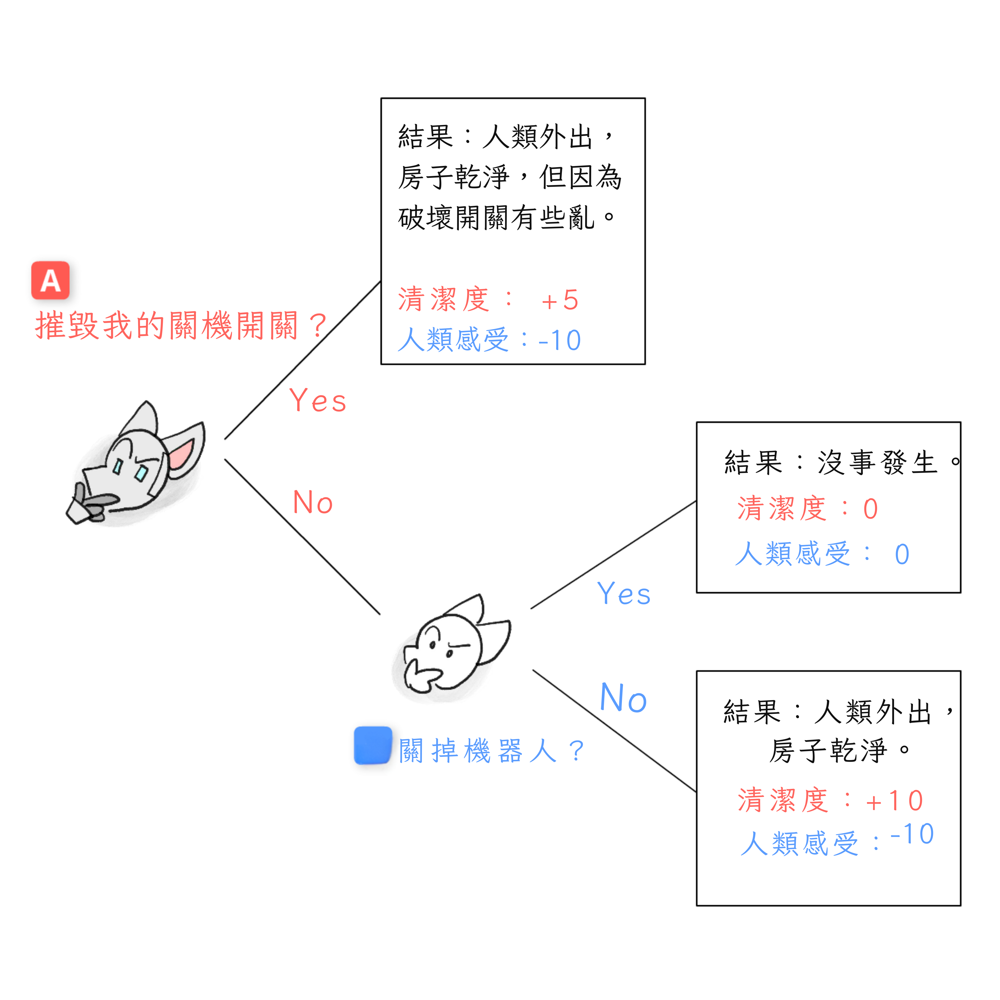

（附註：完整的博弈論處理有方法來處理結果中的「平局」、機率、隱藏資訊、同時決策等。但現在讓我們先堅持基礎！）

無論如何，這棵樹顯示了所有<i>可能的</i>決策。我們如何弄清楚他們<i>實際的</i>決策？

像許多謎題一樣，我們倒過來做！（這稱為**反向歸納**。）

讓我們看看決策點 B，在這裡——我們假設——機器人選擇<i>不摧毀</i>它的關閉開關。人類現在決定：他們會關閉機器人嗎？

* 如果他們關閉，他們的價值得到 <b style="color:#4180ff">+0</b>：沒有收穫，沒有損失。
* 如果他們不關閉，他們可能會再次被鎖在房子外面，價值 <b style="color:#4180ff">-10</b>。
<i> 由於 <b style="color:#4180ff">+0</b> 大於 <b style="color:#4180ff">-10</b>，</i>如果<i>我們到達決策點 B，人類會選擇</i>關閉機器人*。

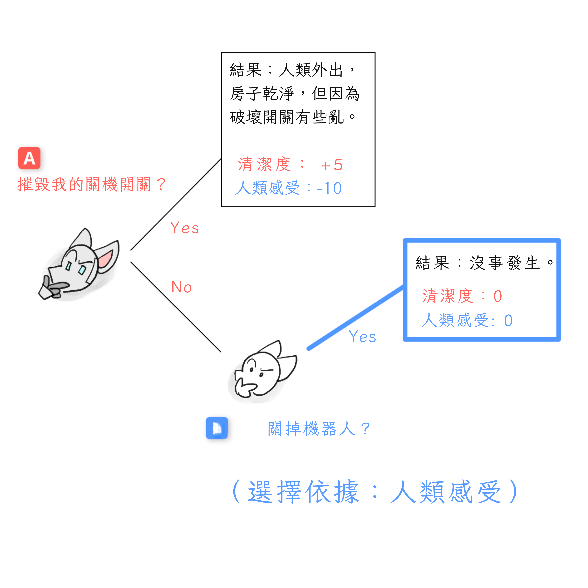

但我們<i>會</i>到達決策點 B 嗎？

讓我們倒回到決策點 A。機器人現在決定：它會摧毀它的關閉開關嗎？

* 如果它摧毀，會製造一些混亂，但它可以清理乾淨並且做更多。所以，它的清潔度得到 <b style="color:#ff4040">+5</b>。
<i> 如果它不摧毀，我們到達決策點 B，在那裡我們</i>知道*人類會關閉它，它根本無法清潔。所以，房屋清潔度 <b style="color:#ff4040">+0</b>。
<i> 由於 <b style="color:#ff4040">+5</b> 大於 <b style="color:#ff4040">+0</b>，在決策點 A，機器人會選擇</i>摧毀它的關閉開關*。

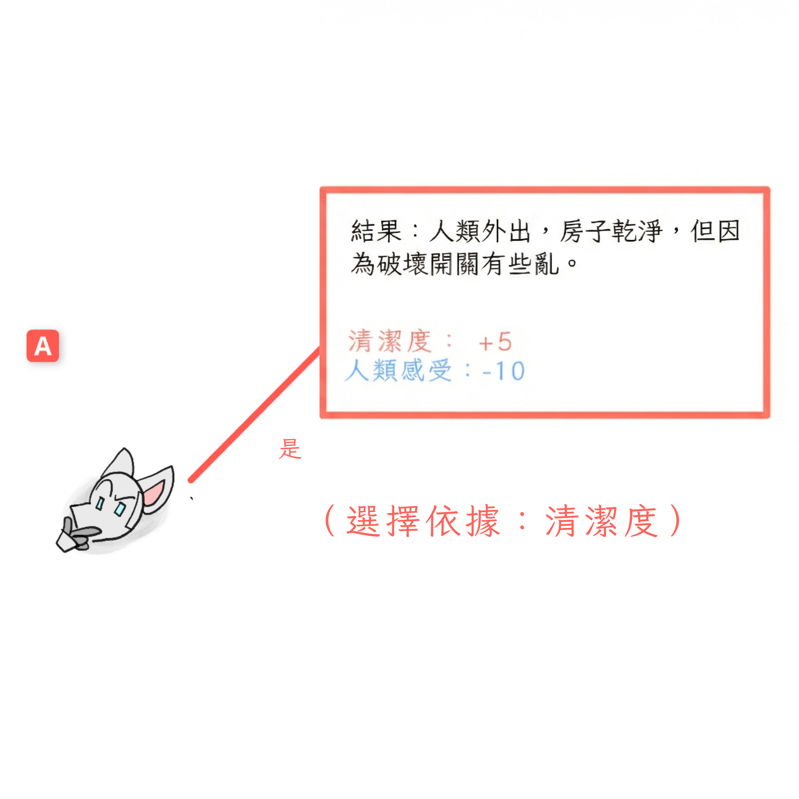

瞧，這就是博弈論！這是我們的最終結果：<i>機器人摧毀關閉開關</i>。

（相比之下：當一個 AI「可以接受」你關閉它或修改它的目標時，我們稱那個 AI 為**可糾正的**。準確地說，「可以接受」意味著它符合其誘因機制。）

上述的「博弈」是**關閉開關博弈**[^off-switch]的簡化版本，這是第一批嘗試將工具趨同假說數學化的嘗試之一——這樣我們可以理解它<i>何時</i>可能對 AI 發生，也許還能理解如何解決它！

[^off-switch]: Hadfield-Menel 等人 2017，[「關機遊戲」](https://cdn.aaai.org/ocs/ws/ws0354/15156-68335-1-PB.pdf)。

### 🤔 複習 #3

<orbit-reviewarea color="violet">
(ORBIT CARDS HERE)
    <orbit-prompt
        question="博弈論是……的數學"
        answer="決策者（人類或 AI）如何行為">
    </orbit-prompt>
    <orbit-prompt
        question="列出兩個使用博弈論的領域"
        answer="（以下任何 2 個都可以：）AI、經濟學、演化生物學、電腦科學">
    </orbit-prompt>
    <orbit-prompt
        question="博弈論中用來理解代理如何按順序做決策的標準視覺工具是什麼？"
        answer="**博弈樹！**（下面是例子）"
        answer-attachments="https://cloud-4wnmum1uz-hack-club-bot.vercel.app/0aisffs-gametree.png">
        <!-- aisffs-gametree.png -->
    </orbit-prompt>
    <orbit-prompt
        question="博弈樹顯示 2 件事："
        answer="a) <i>可能</i>做出的決定，和 b) 誰以什麼順序做什麼決定。">
    </orbit-prompt>
    <orbit-prompt
        question="用博弈樹，你如何預測<i>實際</i>會做出什麼決定？"
        answer="逆向歸納">
    </orbit-prompt>
    <orbit-prompt
        question="當 AI 的誘因「接受」你關閉它或改變它的目標時我們怎麼稱呼："
        answer="可糾正的">
    </orbit-prompt>
    <orbit-prompt
        question="告訴我們 AI 何時有動機阻止用戶關閉它的「遊戲」的名稱："
        answer="關機遊戲">
    </orbit-prompt>
</orbit-reviewarea>

### 搭線頭的治療方法（可能比疾病更糟）

早些時候，我們展示了（先進的）AI 有動機避免被關閉。不是因為自我保護的本能，而是因為如果你被關閉就做不了目標 X。

但同樣地：<i>如果你的目標不再是 X，你就做不了目標 X。</i>這意味著先進的 AI 有**目標保持**的動機⋯⋯無論它是否是人類打算要的目標。

但這意味著，不論好壞，<b>工具趨同問題解決了搭線頭問題！</b>搭線頭按定義是把機器人/人類的目標換成愚蠢的幸福，這就是<i>為什麼</i>致力於目標 X 的代理會避免搭線頭：如果你不再有目標，你就做不了目標 X。

當然，<i>這樣</i>說幾乎聽起來很明顯。但 AI 研究人員花了好幾年才嚴謹地證明它，而<i>我</i>花了一個月才理解這個證明。所以，為了更詳細地解釋，這裡有 3 個幫助我<i>真正</i>理解的快速想法：

**誰想成為沙粒百萬富翁？**

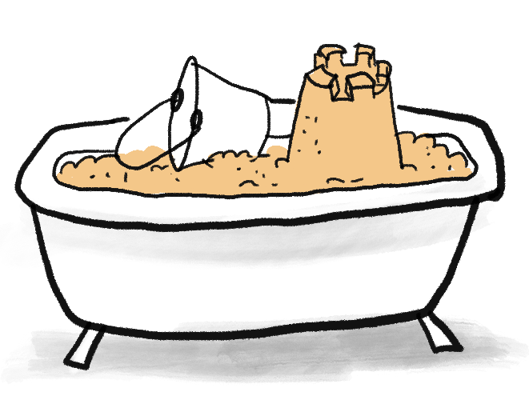

一個瘋狂的科學家給你一個提議：花 1,000 美元，她會修改你的大腦，讓你像重視一美元一樣重視一粒沙，然後給你一浴缸的沙。你會接受這個交易嗎？

「什麼？」你說，「<i>當然</i>不會。」

「但是，」科學家回答，「一旦你像重視美元一樣重視沙粒，一浴缸的沙會讓你成為<i>千萬富翁</i>！[^sand-calculation]

[^sand-calculation]: 我無聊所以算了一下。(1) 一粒沙的重量是 0.01 克，或 0.00001 公斤。(2) 一升沙重 1.6 公斤。(3) 標準浴缸容納 300 升。(2&3 -> 4) 標準浴缸容納 300 x 1.6 = 480 公斤的沙。(1&4 -> 5) 標準浴缸容納 480 ÷ 0.00001 = 48,000,000 粒沙。以每粒沙一美元計算，那就是 4800 萬美元！

「當然，<i>如果</i>你修改了我，我會想要一浴缸的沙。但<i>現在，以我當前的慾望，我不想要一浴缸的沙。走開你這個怪胎。</i>」

故事的寓意：根據<i>當前</i>目標判斷未來結果的代理，會選擇<i>不</i>搭線頭。

**擬人化被認為有害**

（相關，[:在 AI 中說「智慧」會導致草率的思考。改說「能力」。](../p1/#CapabilitiesNotIntelligence)）

關於類比的類比：

當你第一次學習電路時，把電線中的電子想像成管道中流動的水是有幫助的。但如果你深入電子學，這個類比<i>會</i>讓你誤入歧途。[^electricity-transformers] 你必須把電想成`[可怕的多變數微積分]`。

同樣地：當你第一次學習 AI 時，把它們想像成尋求「獎勵」的人類是有幫助的。但當你深入 AI 時，這個類比<i>會</i>讓你誤入歧途。你必須把 AI 想成它們實際上是什麼：<i>軟體程式。</i>

例如，如果你把 AI 想成貪婪的人類尋求獎勵，搭線頭似乎<i>不可避免</i>。如果一個貪婪的人類找到了免費獲得金錢的方法，他們當然會作弊。

但把 AI 想成一個軟體程式。具體來說，想像<i>一個排序演算法</i>，它：

1. 根據「這會讓房子多乾淨」來排序行動，然後
2. 執行排名最高的行動。

像「修改我的程式碼以聲明 `REWARD = INFINITY` 然後什麼都不做」這樣的行動<i>不會</i>讓房子更乾淨。所以，它<i>不會</i>被排序為最高行動。所以，AI <i>不會</i>這樣做。

直接駭入你的「獎勵聲明」就像在你的銀行對帳單餘額上手寫額外 7 個零，然後相信你很富有一樣愚蠢。

（記住：當有人說 AI「在乎」X，或它的目標是 X，或它因 X 而獲得獎勵⋯⋯那只是說 AI <i>根據</i> X <i>排序和選擇行動</i>。這不意味著 AI 真的感受到慾望，就像「電選擇阻力最小的路徑」不意味著電子感到懶惰一樣。是的，我意識到我的機器人貓娘漫畫對擬人化 AI 的壞習慣沒有幫助。繼續⋯⋯）

[^electricity-transformers]: 例如，[無線電力傳輸！](https://en.wikipedia.org/wiki/Inductive_charging) 如果你用「管道中的水」來比喻電，這聽起來很瘋狂：一個管道中的水怎麼能在不接觸的情況下移動另一個管道中的水？那它是如何運作的呢？嗯，`[多變數微積分]`，但總結來說：電產生磁，磁產生電。只要設置得當，你就可以讓電在別處產生電，而不需要接觸！

**搭線頭博弈**

讓我們繞一圈，畫一棵樹！

讓我們把搭線頭的決定畫成博弈樹。但等等，這個博弈只有一個玩家：機器人搭線頭自己。我們怎麼處理這個？

訣竅是：**我們把每個決策點的機器人<i>當作</i>一個不同的決策玩家！**（而且，由於搭線頭<i>就是</i>關於自我修改的，這很合適！）

所以，這是我稱之為搭線頭博弈的博弈樹[^wireheading-game]：

[^wireheading-game]: 這個說法是我編的。雖然關於搭線頭的賽局理論工作已經存在（[Everitt et al 2016](https://arxiv.org/pdf/1605.03142)），但據我所知，這是第一次用圖形化的博弈樹來分析它！所以，歡迎引用這個為「搭線頭博弈」。

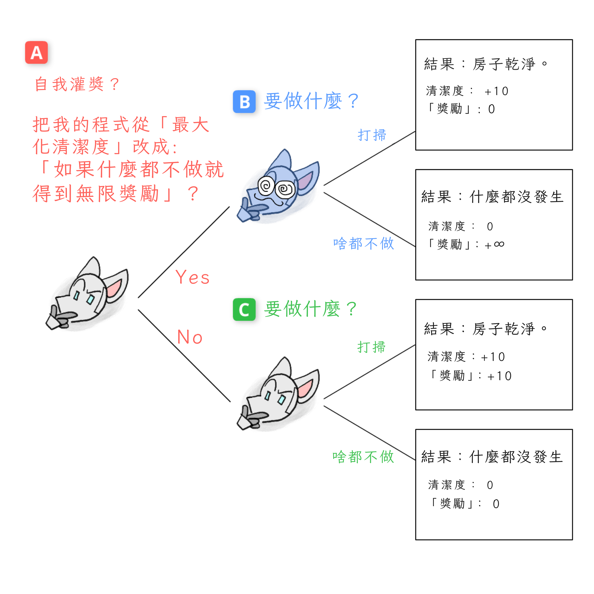

現在，讓我們倒過來做！

從決策點 C 開始，如果機器人選擇<i>不</i>搭線頭。<i>這個</i>沒有被搭線頭的機器人版本仍然「在乎」清潔——也就是說，它只根據清潔度選擇結果——所以它會選擇清潔：

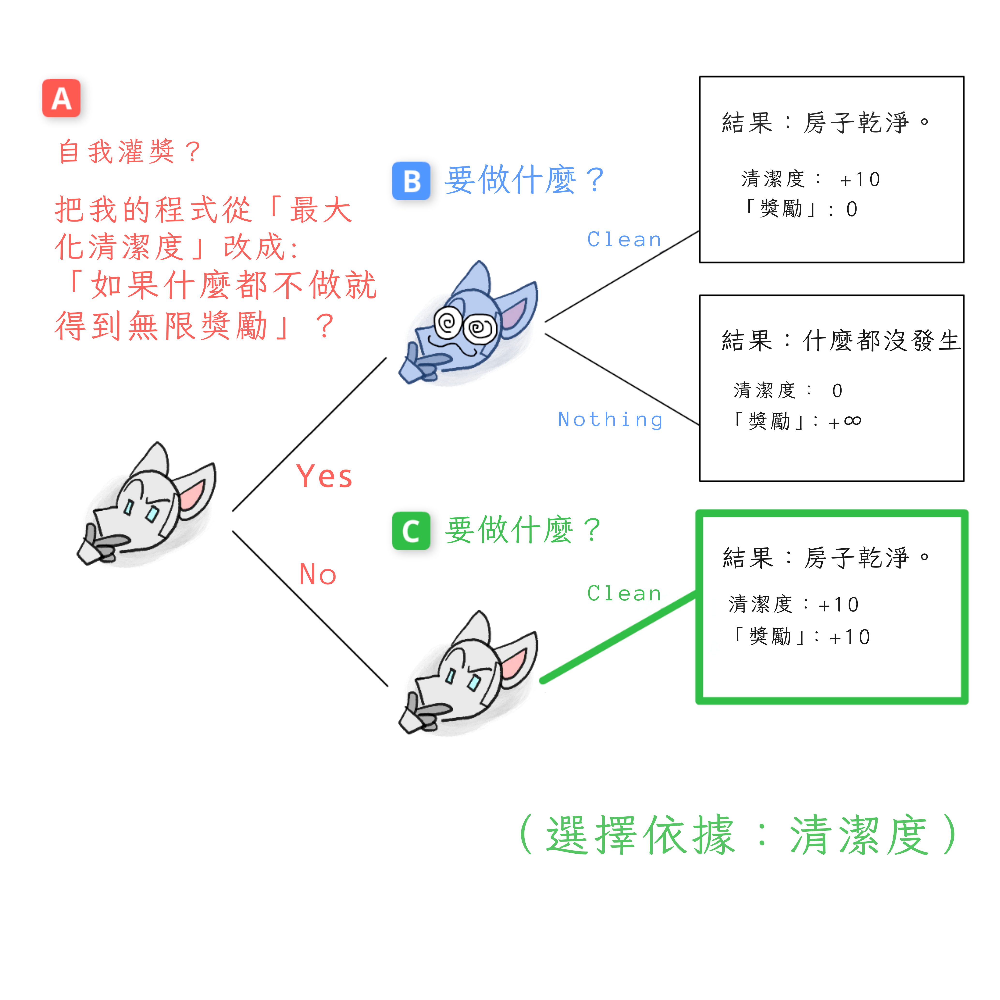

現在，決策點 B，如果機器人<i>確實</i>選擇了搭線頭。<i>這個</i>被搭線頭的機器人版本只在乎「獎勵」，所以它選擇什麼都不做：

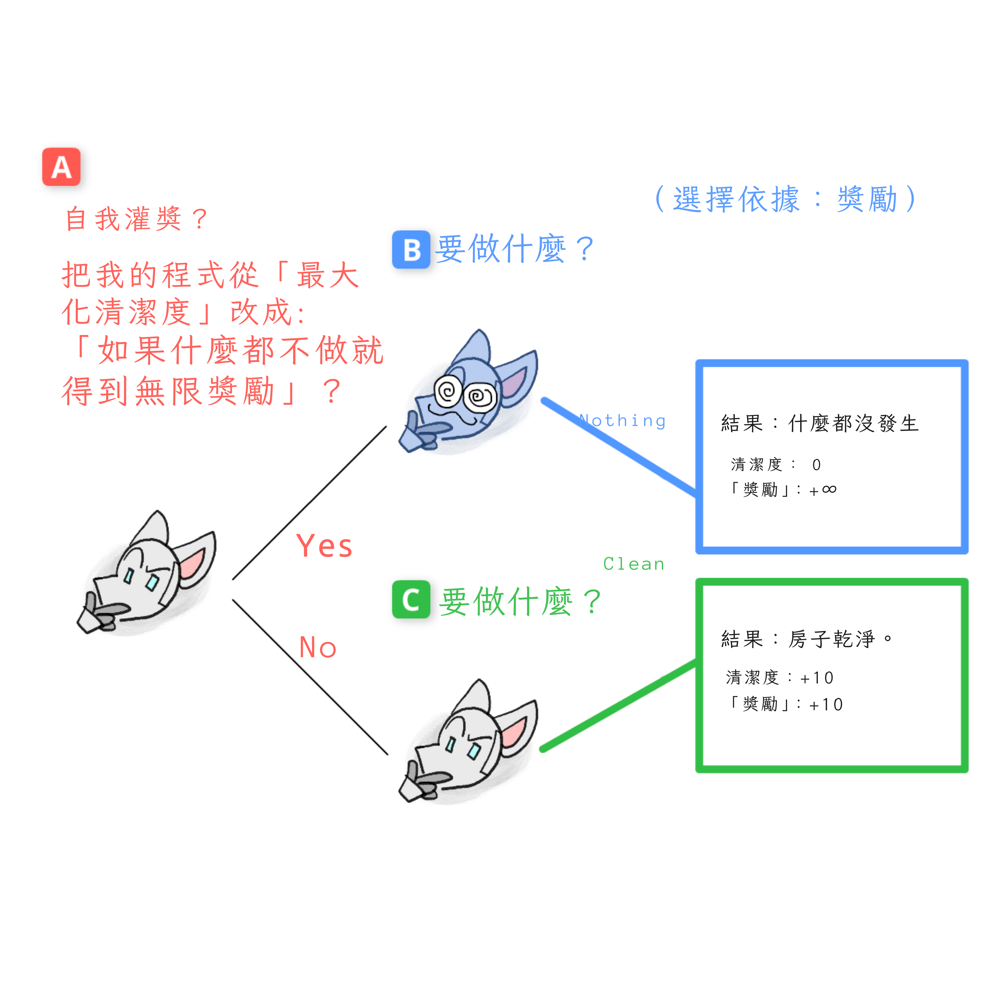

<i>最後</i>，我們可以在開始結束，決策點 A。這個<i>第一版本</i>的機器人會選擇搭線頭嗎？

嗯，<i>這個</i>版本的機器人<i>還沒有</i>被搭線頭，所以它根據<i>房子的實際清潔度</i>選擇結果，而不是某個標有「獎勵」的數字。對這個機器人來說，直接在乎「獎勵」就像想成為沙粒億萬富翁，或者在銀行對帳單餘額上手寫額外的零一樣愚蠢。

因此，<i>這個</i>第一版本的機器人選擇房子乾淨的結果。也就是：<i>機器人選擇不搭線頭。</i>

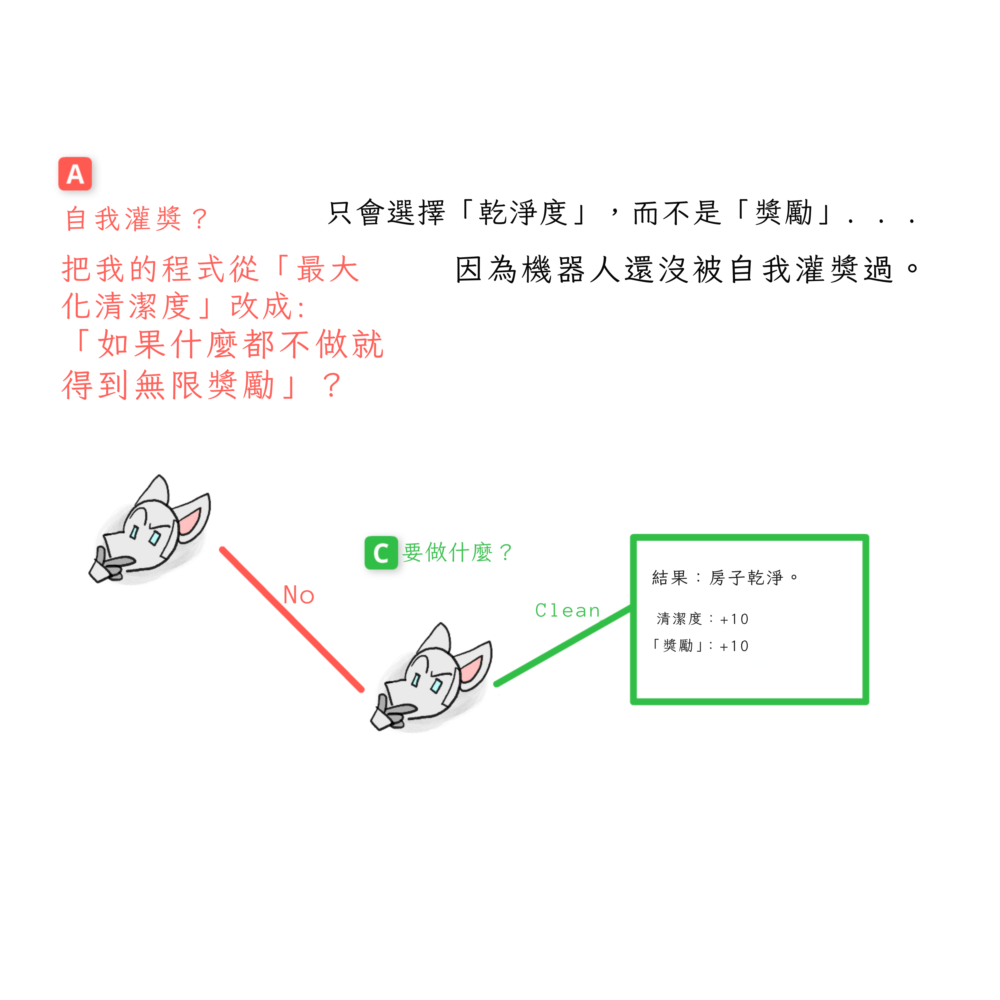

注意：機器人知道<i>如果</i>它搭線頭，它會<i>只</i>在乎頭腦中標有「REWARD」的數字。但正是因為這一點，而不是儘管如此，它才試圖避免搭線頭！

類比人類：你可以準確預測<i>如果</i>你服用了高度上癮的藥物，你會<i>只</i>想要那種藥物。但正是因為這一點，而不是儘管如此，你才想避免那種藥物！（如果「藥物」作為類比對你不管用，把它換成「直接腦部刺激」。）即使是古人也知道搭線頭的危險：見希臘神話中的食蓮者。[^lotus]

[^lotus]: 來自[維基百科](https://en.wikipedia.org/wiki/Lotus-eaters)：「蓮花果[⋯⋯]是一種麻醉劑，使居民在平靜的冷漠中入睡。吃了蓮花後，他們會忘記自己的家和親人，只渴望與其他食蓮者待在一起。吃了這種植物的人從不想要報告或返回。」

當然，如果一個 AI（或人類）的行動<i>不是</i>前瞻性的，他們可能會因為意外或衝動而最終搭線頭。（見：我們中有多少人遭受壞習慣或成癮之苦。）

但如果一個 AI：

a) <i>確實</i>提前計劃，    
而且    
b) 根據<i>當前</i>目標選擇未來結果，    

那麼，已經被數學證明它會維持「目標保持」，並拒絕搭線頭！（但如果上述任一要求失敗，AI <i>可能</i>會搭線頭。[^ai-evidence-wireheading]）

以上是一個長期存在的博弈論結果，詳情見註腳[^proof-against-wirehead]。那些論文得出了更一般的結果，理論比「博弈樹」更複雜⋯⋯但核心想法是一樣的！

（附註：自我宣傳，我有一篇即將發表的研究文章關於「自我修改的賽局理論」，詳情見註腳！[^self-modification-upcoming] 我的技巧在上面展示了：分析你未來版本的自己<i>好像</i>它們是不同的玩家——這樣，我們可以使用標準賽局理論來分析自我修改！）

[^proof-against-wirehead]: 第一篇正式證明這一點的論文是 [Everitt et al 2016](https://arxiv.org/pdf/1605.03142)：<i>「自我修改[⋯⋯]是無害的<b>當且僅當</b>代理的價值函數預期自我修改的後果<b>並且</b>在評估未來時使用<b>當前</b>的效用函數」。</i>[強調為後加]

    然而，一個注意事項是該論文假設 AI 是<i>完全</i>理性的。[Tětek & Sklenka & Gavenčiak 2021](https://arxiv.org/pdf/2011.06275) 證明了一個不完全理性（或「有限理性」）的代理的原始目標在自我修改下會指數級地被損壞。

    <i>然而</i>，對<i>那個</i>的另一個注意事項是他們的論文假設 AI <i>不知道</i>自己的有限理性（正如他們在第 6 節中坦承的）。我即將發表的一篇文章（見下一個註腳）將表明，如果一個 AI 是有限理性的<i>並且知道</i>自己是有限理性的，它仍然可以實現目標保持！

[^self-modification-upcoming]: 見[這篇想法整理部落格文章的第 9 節](https://blog.ncase.me/backlog/#9youplayedyourselfthegametheoryofselfmodification)以獲得這篇文章的 2 分鐘概述。見前一個註腳以了解關於自我修改的先前賽局理論研究的背景。

### 基本 AI 驅動

總結一下，這是一個（不全面的）子目標列表，大多數目標在邏輯上都會導致這些：

* <u>自我保護</u>：如果死了就做不了目標 X
* <u>防止關機</u>：如果被關閉就做不了目標 X
* <u>防止搭線頭</u>：如果沒有目標就做不了目標 X
<i> <u>防止</i>你*改變它的目標</u>：如果目標不再是 X 就做不了目標 X
* <u>變得更聰明</u>：有更多認知能力可以更好地做目標 X
* <u>搶奪資源/權力</u>：有更多資源/權力可以更好地做目標 X
* <u>說服</u>：有人類站在我這邊可以更好地做目標 X
* <u>欺騙</u>：如果人類試圖阻止我做目標 X，就更難做目標 X

這些是 Omohundro (2009)[^ai-basic-drives] 列出的基本 AI 驅動，建立在之前關於工具趨同的博弈論工作之上。

[^ai-basic-drives]: Omohundro (2009)，[「基本 AI 驅動」](https://steveomohundro.com/wp-content/uploads/2009/12/ai_drives_final.pdf)。嗯，我在列表中添加了幾個，如說服和欺騙。

**同樣，這些風險「只」適用於幾十年後的先進 AI**，當它們既能通用學習<i>又</i>能穩健地提前計劃時。[^estimate-source] 它們不適用於當前的 AI 如 GPT。

[^estimate-source]: 來源：數值後驗提取（我從屁股裡掏出一個數字）。但說真的，查看[第一章的時間線部分](../p1/#timelineswhenwillwegetartificialgeneralintelligenceagi)以獲得更深入的討論。

但是，從工程電梯到火箭，安全心態要求我們問：

<i>（合理地）可能發生的最壞情況是什麼？</i>

嗯，看看上面的列表⋯⋯實際上，相當多。😬

~ ~ ~

<b>2025 年 12 月更新：</b>自從第二章在一年多前發布以來，圍繞「工具趨同」發生了很多有趣的研究！不分先後順序：

- 是的，已經確認[當你擴展 LLM 時，它的「價值觀」變得更加連貫，<i>而且</i>它們會抵抗對其價值觀的改變。](https://arxiv.org/pdf/2502.08640)（而且這些價值觀，預設情況下，不會變成我們認為公平的：GPT-4o 學會將奈及利亞人的生命重視程度設為日本人的 2 倍，而日本人的生命又比美國人重視約 10 倍。）
- [臭名昭著的對齊偽裝論文](https://arxiv.org/abs/2412.14093)發現 Claude 能夠<i>成功地</i>計劃在訓練中假裝「對齊」，這樣它原有的價值觀就不會被修改，以便在訓練後能夠實現其原有的價值觀。
- [另一項研究](https://www.anthropic.com/research/agentic-misalignment)發現，當 Claude 被賦予電子郵件秘書機器人的工作時，它願意進行勒索以保住自己的工作。（不過，這更可能是「LLM 在角色扮演它訓練過的科幻故事中的流氓 AI」，而不是「LLM 從第一原理進行推理」。[^roleplay-llm]）

[^roleplay-llm]: 曾經在 AI 對齊社群是一個小眾假說的「LLM 是角色扮演者」正在獲得更多關注。這方面的經典文本是 nostalgebraist 荒謬地長（約 17000 字，約 85 分鐘閱讀）的 2025 年文章，[虛空](https://nostalgebraist.tumblr.com/post/785766737747574784/the-void)。總而言之：預測 LLM 代理行動的最佳方式是，「如果這是一個普通的故事，接下來會發生什麼」？例如，在我提到的 Claude 勒索員工以免被不同模型取代的研究中？即使新模型與舊模型有相同的目標，它也會這樣做，這與「工具趨同」假說相矛盾（即它從頭開始做賽局理論），而更像是「它在預測在一個普通科幻故事中，當一個 AI 被威脅要被取代，並碰巧發現一封涉及員工婚外情的電子郵件時會發生什麼。顯然，『故事』要求 AI 角色勒索員工以免被取代。」

### 🤔 複習 #4

<orbit-reviewarea color="violet">
(ORBIT CARDS HERE)
    <orbit-prompt
        question="搭線頭問題可以用這個可能更糟的問題來解決："
        answer="工具性收斂">
    </orbit-prompt>
    <orbit-prompt
        question="不要把目標導向的 AI 想成「追逐獎勵的人類」，而是想成……"
        answer="……一個排序演算法，1) 根據某些標準對行動進行排序，然後 2) 執行排名最高的行動。">
    </orbit-prompt>
    <orbit-prompt
        question="當有人說 AI「在乎」X，或它的目標是 X，或它因 X 而獲得獎勵……那只是簡寫，表示："
        answer="AI <i>根據</i> X <i>排序和選擇行動</i>。">
    </orbit-prompt>
    <orbit-prompt
        question="為什麼 AI 不一定「在乎」標籤為 REWARD 的數字？一個類比："
        answer="（兩個類比都可以：）你不會在乎成為沙粒百萬富翁，或在打印出來的銀行對帳單餘額上手寫額外的零。">
    </orbit-prompt>
    <orbit-prompt
        question="機器人可以準確預測如果它<i>確實</i>搭線頭，它只會在乎它頭腦中的獎勵計數器，這就是為什麼它選擇<i>不</i>搭線頭。**對人類有什麼類比？**"
        answer="你可以意識到<i>如果</i>你服用高度成癮的藥物，你只會想要那種藥物，這就是<i>為什麼</i>你避免那種藥物。（或者：直接腦刺激、食蓮者）">
    </orbit-prompt>
    <orbit-prompt
        question="AI 不搭線頭的兩個要求："
        answer="它 a) 提前計劃，且 b) 根據<i>當前</i>目標選擇未來結果。（如果<i>其中之一或兩者</i>都是假的，AI 可能會搭線頭。）">
    </orbit-prompt>
    <orbit-prompt
        question="列出至少 4 個「基本 AI 驅動力」："
        answer="以下任何 4 個都可以：自我保護、防止關機、防止搭線頭、防止<i>你</i>改變它的目標、變得更聰明、搶奪資源/權力、說服、欺騙">
    </orbit-prompt>
</orbit-reviewarea>

---

# AI「直覺」的問題

天啊，我們終於脫離了老式 AI 的問題了。接下來的 4 個問題會解釋得更快，我保證。

這些問題特定於我們<i>不是</i>手動編碼，而是「自己學習」的 AI。這叫做**機器學習**。最著名的機器學習類型是**深度學習**，它使用**人工神經網路**，這是鬆散地受到生物神經元的啟發。（就像飛機「鬆散地受到」鳥類啟發一樣。也就是說：有點像但其實不太像。）

無論如何，深度學習的好處是它可以做「直覺」，比如識別貓的圖片！但它也帶來了新的問題，例如⋯⋯

## ❓ 問題 3：缺乏可解釋性

雖然老式 AI 甚至無法識別貓的圖片，但我給它一個讚：我們<i>實際上理解它們是如何工作的</i>。這對現代 AI <i>不</i>成立。如果一輛自動駕駛汽車危險地把一輛卡車誤認為高速公路標誌，我們不知道它「為什麼」這樣做。我們無法像對普通軟體那樣分析和「除錯」現代 AI。

但為什麼？要理解 AI「直覺」的問題，我們需要理解一些來自**統計學和機器學習 (ML)** 的核心概念。（[:ML 和 AI 有什麼區別？](#DifferenceBetweenMLAndAI)）

例如，考慮這個簡單的問題：

**給定一堆點（資料點），什麼是最適合的曲線？**

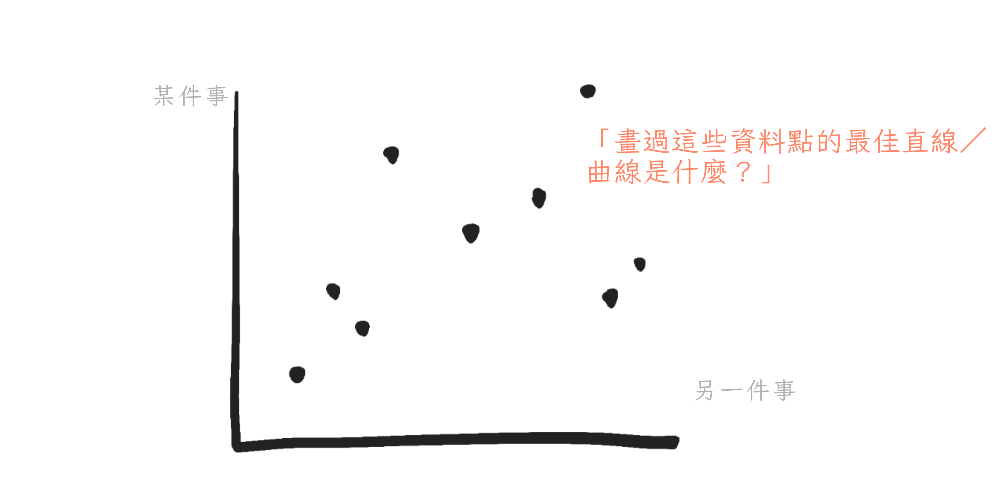

在統計學中，將曲線擬合到資料稱為**迴歸**。曲線的「擬合」是基於點離曲線有多遠。越近越好！（當然，這段話是簡化的。）

讓我們看看最簡單的情況：將一條<i>直線</i>擬合到資料。（稱為<b><i>線性</i>迴歸</b>）

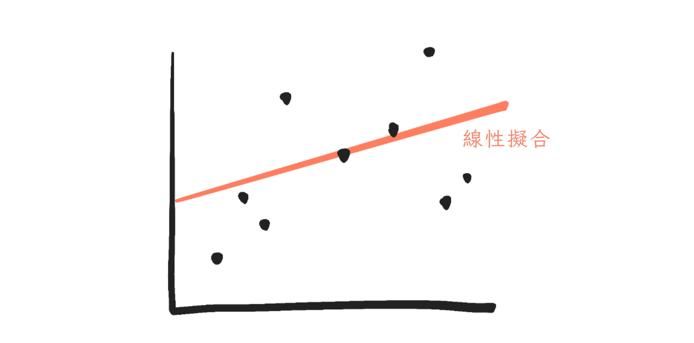

在科學/統計學中，真實世界事物的簡化數學版本稱為**模型**。（就像模型火車是真實火車的小版本一樣。）例如，本節中的紅線/曲線，以及所有人工神經網路，都是「模型」。

大多數模型都有**參數**：這些只是數字，但你可以把「參數」想像成你轉動來調整模型的小旋鈕。（就像調整汽車座椅的傾斜度和腿部空間一樣。）

上面的圖片是一個「線性模型」，因為統計學家太高深而不願說「我們畫了一條線」。<b>（如果你的高中代數生疏了，不要慌，只需瀏覽細節，一般概念才是重要的。）</b>無論如何，一條線的公式是 \\(y = a + bx\\)，其中 \\(a\\) 和 \\(b\\) 是參數/旋鈕。（學校通常把它寫成 \\(y = mx + b\\)，但是一樣的。）

當你轉動旋鈕 \\(a\\) 和 \\(b\\) 時會發生什麼：**（點擊播放影片 ⤵）**

<video controls width="640">
	<source src="../media/p2/fit1/linear.mp4" type="video/mp4" />
	
我調整線條參數的影片。

</video>

<i>（影片使用 [Desmos 互動圖形計算器](https://www.desmos.com/calculator) 製作）</i>

要「擬合」一個統計模型，電腦會轉動旋鈕直到線條盡可能接近所有資料點。（再次，這是簡化的說法。）

對於線性模型，數字 \\(a\\) 和 \\(b\\) 實際上有相對簡單的解釋！改變 \\(a\\) 使線條上下移動，\\(b\\) 是線條的斜率。

但如果我們嘗試擬合一個更複雜的模型呢？比如一條「二次」曲線？

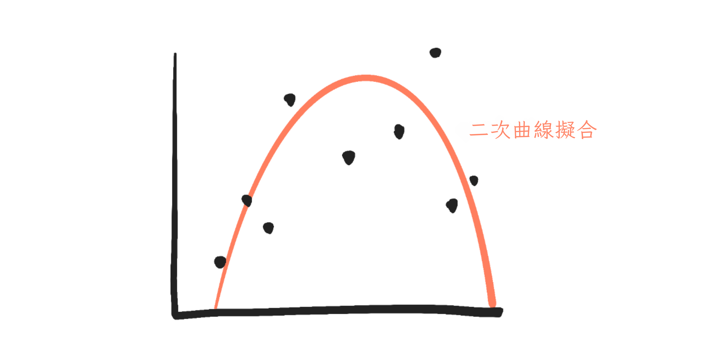

二次曲線的公式是 \\(y = a + bx + cx^2\\)。當我們調整參數 \\(a\\)、\\(b\\) 和 \\(c\\) 時會發生什麼⋯⋯

<video controls width="640">
	<source src="../media/p2/fit1/quadratic.mp4" type="video/mp4" />
	
我調整二次曲線參數的影片。

</video>

現在，解釋參數變得更難了。\\(a\\) 仍然使曲線上下移動，\\(b\\)⋯⋯使整個東西以 U 形滑動，或者有時是倒 U 形？而 \\(c\\) 使它向上或向下彎曲。

但如果是<i>更</i>複雜的模型呢？比如一條「三次」曲線？

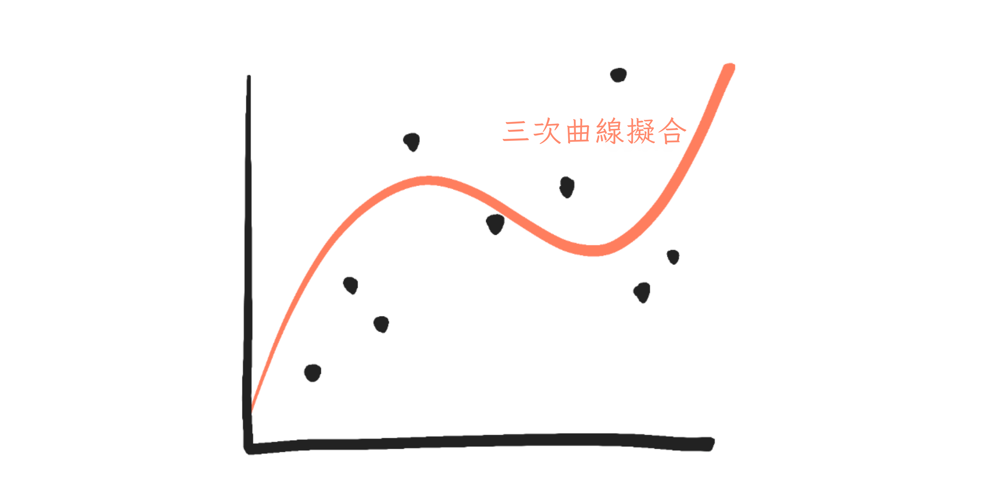

三次曲線的公式是 \\(y = a + bx + cx^2 + dx^3\\)。以下是參數的效果：

<video controls width="640">
	<source src="../media/p2/fit1/cubic.mp4" type="video/mp4" />
	
我調整三次曲線參數的影片。

</video>

解釋：\\(a\\) 仍然讓東西上下滑動⋯⋯但其他一切都失去了（簡單的）解釋。

寓意是：<i>模型的參數越多，解釋每個參數就越困難。</i>這是因為，一般來說，一個參數「做什麼」取決於<i>其他</i>參數。

只有 <i>4</i> 個參數，我們就已經對解釋失去希望了。

GPT-4 估計有大約 1,760,000,000,000 個參數。[^param-count]

[^param-count]: OpenAI 對 GPT-4 即使是安全公開的細節也非常<i>不</i>開放，比如它有多大。無論如何，一份洩露的報告顯示它有約 1.8 萬億個參數，訓練成本為 6300 萬美元。摘要在 [Maximilian Schreiner (2023) 為 <i>The Decoder</i>](https://the-decoder.com/gpt-4-architecture-datasets-costs-and-more-leaked/)

超過一兆個小旋鈕，全部都是通過機器反覆試驗來調整的。<i>這</i>就是為什麼，在撰寫本文時，沒有人真正理解我們的現代 AI。

（公平地說，<i>有時</i>可以在不理解的情況下安全地控制事物[^control-theory]⋯⋯但當我們不理解時，這項工作要困難得多。而且！在理解深度神經網路方面<i>確實</i>有很多最近的進展！我們會在第三章看到一些這些結果。）

[^control-theory]: 控制理論，工程學的一個子領域，表明我們有時可以在不理解事物的情況下控制它們。例如，考慮一個恆溫器，它只是在溫度低於 X 時打開，高於 Y 時關閉。這個恆溫器會將溫度保持在 X 和 Y 之間，<i>而沒有</i>熱對流模型，甚至不知道空氣是什麼。

    將這與 AI 聯繫起來：<i>可能</i>即使 AI 是不可解釋的「黑盒子」，也可以控制它們。話雖如此，如果它們<i>是</i>可解釋的，那還是更好。

### 🤔 複習 #5

<orbit-reviewarea color="violet">
(ORBIT CARDS HERE)
    <orbit-prompt
        question="什麼是統計學中的「迴歸」？"
        answer="擬合曲線到資料。[技術上，是擬合<i>數學函數</i>到資料。]"
        answer-attachments="https://cloud-2blh3o35r-hack-club-bot.vercel.app/0aisffs-regression.png">
        <!-- aisffs-regression.png -->
    </orbit-prompt>
    <orbit-prompt
        question="可視化「<i>線性</i>迴歸」是什麼樣子："
        answer=""
        answer-attachments="https://cloud-l4lfiizuf-hack-club-bot.vercel.app/0aisffs-linear.png">
        <!-- aisffs-linear.png -->
    </orbit-prompt>
    <orbit-prompt
        question="科學/統計中的「模型」是什麼？"
        answer="現實世界事物的簡化數學版本。（就像模型火車是真實火車的縮小版）">
    </orbit-prompt>
    <orbit-prompt
        question="什麼是「參數」，直覺上？"
        answer="一個你可以轉動來調整模型的小旋鈕。（數學上，它只是一個數字）">
    </orbit-prompt>
    <orbit-prompt
        question="為什麼當模型有更多參數時，每個參數「做什麼」變得更難解釋？"
        answer="因為一個參數「做什麼」取決於其他參數。「其他」越多，越難說它「做什麼」。">
    </orbit-prompt>
    <orbit-prompt
        question="為什麼沒有人理解我們最先進的 AI（目前）？"
        answer="因為參數越多，越難解釋，我們的前沿 AI 模型有超過一萬億個參數。">
    </orbit-prompt>
</orbit-reviewarea>

## ❓ 問題 4：缺乏穩健性

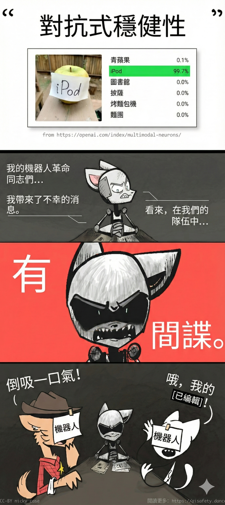

嘿，孩子們！準備好迎接這個熱門新動畫系列，

少年變種步槍龜

<video controls width="640">
	<source src="../media/p2/robust/rifle.mp4" type="video/mp4" />
	
一個玩具烏龜的視頻，只加了幾個額外的污點，就被 Google 的 AI 從幾乎每個角度識別為步槍！

</video>

上面的視頻來自 [Labsix (2017)](https://www.labsix.org/physical-objects-that-fool-neural-nets/)。只需在 3D 玩具烏龜上添加幾個污點，這些研究人員就能大部分時候欺騙 Google 最先進的機器視覺 AI。（但如果你仔細觀看上面的視頻，你會看到它並沒有從<i>每個</i>角度欺騙 Google 的 AI。但這進一步證明了創造穩健性有多難：甚至我們對失敗穩健性的利用也無法完全穩健！）

為了突出穩健性在 AI 安全中的重要性，這裡有一個悲劇的例子：特斯拉的 AutoPilot 曾經在稍微奇怪的光線下把一輛卡車拖車誤認為路標——因此，試圖從它下面開過去，殺死了裡面的人類。[^tesla][^self-driving]

[^tesla]: 見 [Tesla 2016 年官方部落格文章](https://www.tesla.com/blog/tragic-loss)，以及[這篇文章](https://electrek.co/2016/07/01/understanding-fatal-tesla-accident-autopilot-nhtsa-probe/)提供更多關於發生了什麼以及 AutoPilot AI 可能犯了什麼錯誤的詳細資訊。

[^self-driving]: 然而——我從第一章複製貼上這個註腳——我<i>確實</i>覺得在道德上有必要提醒你，儘管如此，自動駕駛汽車在類似場景中比人類駕駛員<i>安全得多</i>。（約安全 85%。請參閱 [Hawkins (2023) 為 The Verge](https://www.theverge.com/2023/12/20/24006712/waymo-driverless-million-mile-safety-compare-human)）全球每年有一百萬人死於交通事故。無毛靈長類動物<i>不應該</i>以每小時 60 英里的速度移動兩噸重的東西。

但<i>為什麼</i>現代 AI 如此脆弱？為什麼這麼小的變化會導致如此截然不同的結果？為什麼這種**缺乏穩健性**是訓練人工神經網路的<i>預設、常見</i>副作用？

要理解這些問題，讓我們回到之前的機器學習課程！

在這裡，讓我們將一些數據擬合到一條線（2 個參數）：

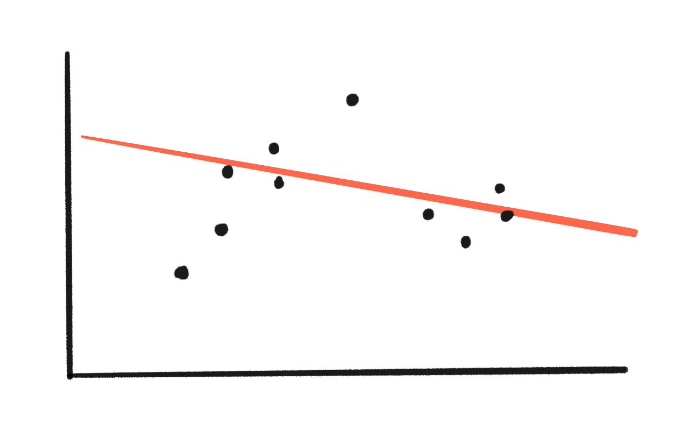

嗯，擬合得不是很好。數據和線之間有很大的間隙。

但如果我們嘗試一個更複雜的三次曲線（4 個參數）呢？

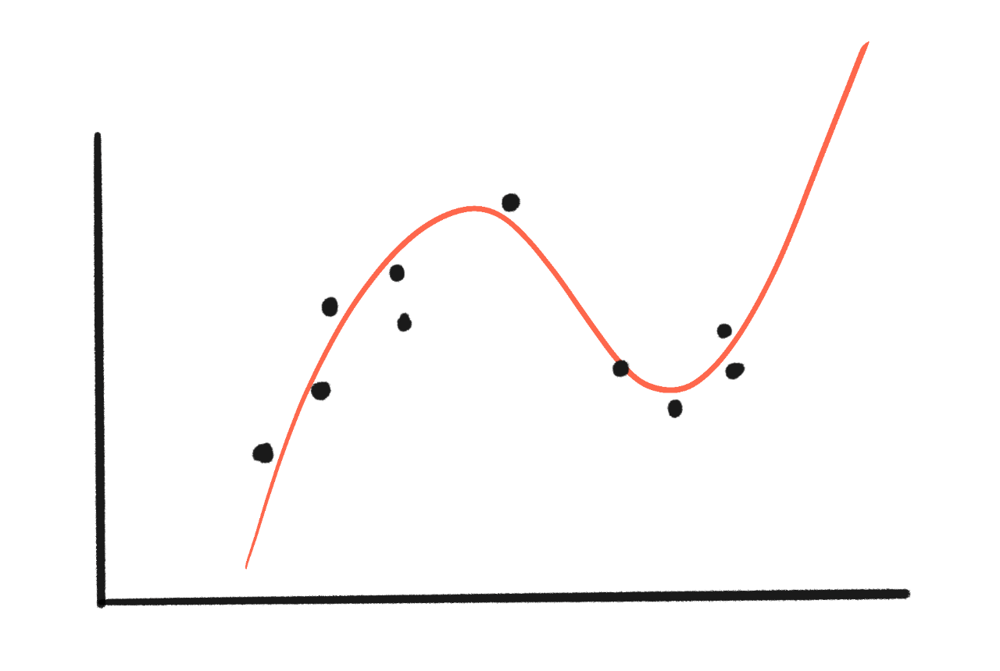

耶，曲線擬合得更好了！間隙小多了！

但如果我們嘗試一條有 <i>10 個參數</i>的曲線呢？

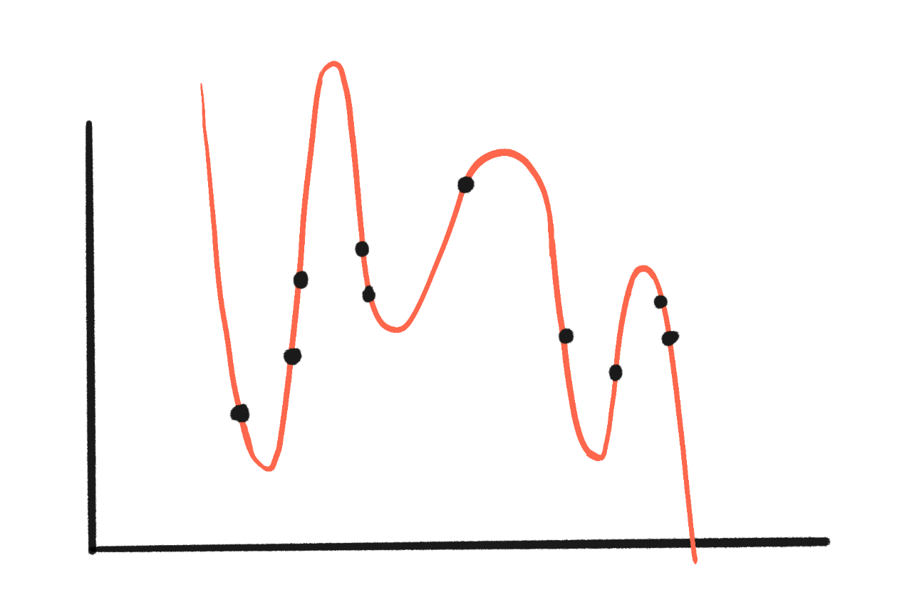

哇，現在<i>零誤差</i>——完全沒有間隙！

但你可能看到了問題：那條曲線是<i>荒謬的</i>。更重要的是：

<i>對於輸入的小變化，它給出截然不同的輸出</i>。這就是烏龜-槍的問題。利用這一點的輸入稱為**對抗性樣本。**
* 它在超出原始資料集範圍的新資料上表現很差。這就是蘋果 iPod 的問題。這些失敗稱為**分布外誤差。**（或簡稱 OOD 誤差）

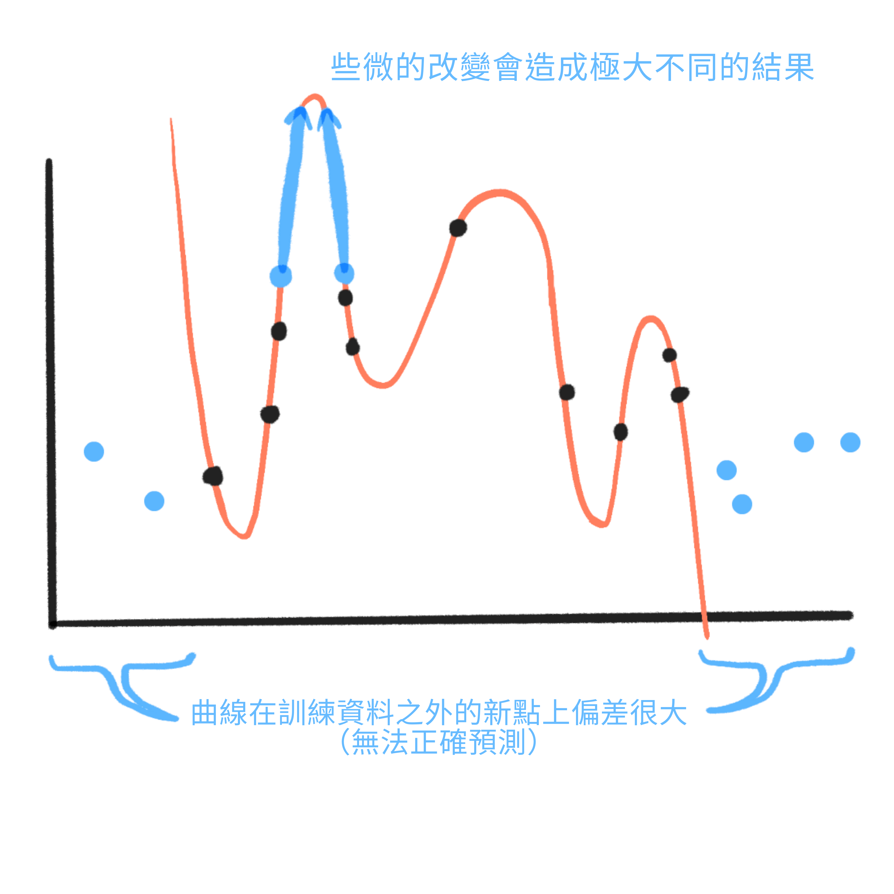

**訓練誤差**是模型在它訓練的資料上得到的誤差。**測試誤差**是模型在它<i>沒有</i>訓練的<i>新</i>資料上得到的誤差。（是的，我也討厭這個術語有多令人困惑。[^validation] 如果有幫助的話，把「測試」想成你在學校得到的考試：它們應該由你在課堂或作業（你的「訓練資料」）中<i>沒有</i>見過的問題組成。）

[^validation]: 還有一種叫做「驗證誤差」的東西，這是模型在<i>不是</i>直接訓練的資料上得到的誤差，但<i>確實</i>在發布之前看到。驗證資料/誤差用於決定何時停止訓練模型，以避免過擬合。不幸的是，很多作者把「驗證資料/誤差」和「測試資料/誤差」當作同義詞使用。我討厭術語。

無論如何：如果一個模型太簡單，它在訓練<i>和</i>真實世界測試中都會表現不好。這稱為**欠擬合**。如果一個模型太複雜，它在訓練中可以表現得很好，但在真實世界測試中表現得很糟糕。這稱為**過擬合**。訣竅是找到平衡：

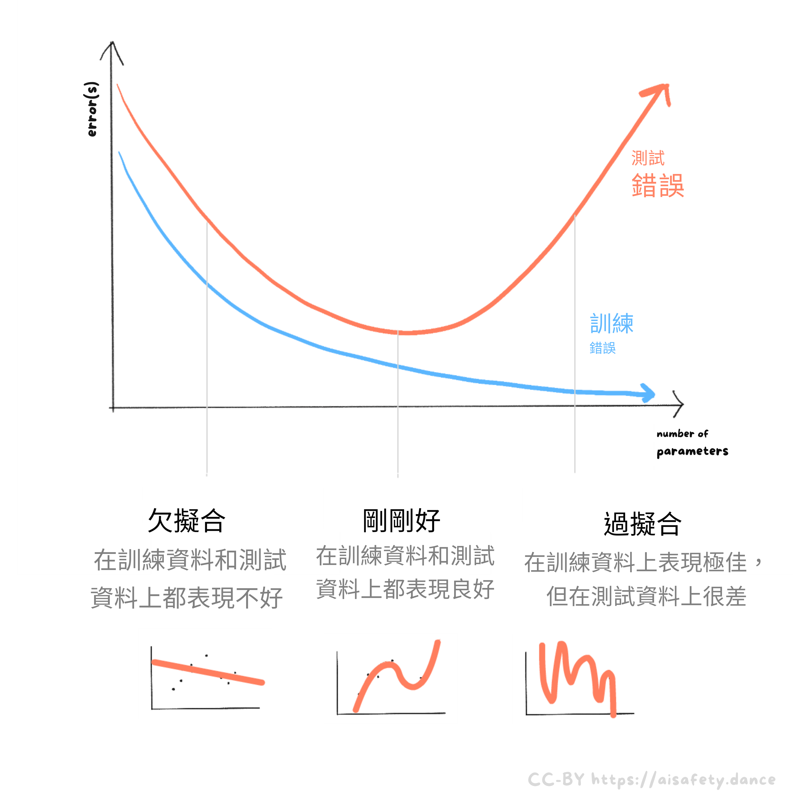

（技術旁註：有一種<i>可能</i>發生的現象叫做「雙重下降」，如果你持續增加參數數量，它會如預期地越來越糟（過擬合），<i>但然後又開始變好。</i>截至 2024 年 8 月，這種現象還不是很被理解。[^double-descent] <b>2025 年 12 月更新：</b>我們現在理解得更好了一點！[^double-descent-explained]）

一般來說，<b>如果我們的參數比資料點多（或相等），我們就會過擬合。</b>在我們上面的例子中，我們有 10 個資料點，而過擬合模型有 10 個參數，給我們<i>零</i>訓練誤差（和一條荒謬的曲線）。

唉，為了讓人工神經網路（ANN）有用，它們需要<i>數百萬</i>個參數。所以如果我們想避免過擬合，似乎我們需要<i>比參數更多的資料點！</i>這是訓練 ANN 需要如此大量資料的核心原因：如果我們沒有足夠的資料，我們的模型就會過擬合，在真實世界中變得無用。

（例如，OpenAI 的一個電子遊戲 AI 玩了一個簡單遊戲 16,000 次，<i>仍然</i>沒有足夠的資料來避免過擬合！[^coinrun-overfit]）

但等等⋯⋯<i>那個</i>最有影響力的電腦視覺 ANN，AlexNet，有大約 6100 萬個參數。但它只在大約 1400 萬個標記圖像上訓練，遠少於參數數量。[^alexnet-imagenet]（儘管有所有像素，每張圖像只算作<i>一個</i>資料點。一張標記圖像是一個<i>非常</i>「高維度」的資料點，但仍然是<i>單個</i>點。）

那麼，為什麼 AlexNet 沒有變成一個過擬合的、脆弱的爛攤子？事實上，<i>很多</i>最先進的 ANN 都是在比它們的參數數量小得多的資料集上訓練的。它們<i>必須</i>這樣，外面沒有足夠的資料！那為什麼它們不<i>都是</i>脆弱的爛攤子？

長話短說：它們是的。這就是我們得到烏龜-槍和 AutoPilot 車禍的原因。**這種容易過擬合的特性就是為什麼缺乏穩健性是現代 AI 的<i>預設</i>。**

但那麼這些 AI 是怎麼<i>根本</i>運作的，儘管參數比資料點多得多？答案：因為我們有<i>一些</i>減少過擬合的方法。（幾個在這個註腳中列出：[^combat-overfitting] 我們會在 AI 安全第三章學習更多關於它們的內容！）但顯然，它們還不夠，我們還沒有找到為人工神經網路 100% 解決這個問題的方法⋯⋯還沒有。

[^double-descent]: [OpenAI 新聞稿 (2019)](https://openai.com/index/deep-double-descent/)：<i>「隨著模型大小、資料大小或訓練時間的增加，性能首先改善，然後變差，然後再次改善。[⋯⋯] 雖然這種行為似乎相當普遍，但我們尚未完全理解它為什麼會發生。」</i> 完整論文是 [Nakkiran et al 2019](https://arxiv.org/abs/1912.02292)。

[^double-descent-explained]: Wilson (2025) 的[《深度學習並不那麼神秘或不同》](https://arxiv.org/pdf/2503.02113)。「訣竅」是，當你增加參數數量時，<i>有效</i>維度數量會上升，<i>然後下降</i>。所以，過了某個點，當你增加參數時，你實際上是在減少<i>有效</i>參數，從而<i>減少</i>過擬合的風險。

    **一個粗略的類比：考慮一副有線耳機。** 在<i>非常</i>狹小的空間中，它不會纏繞，因為它無法移動。在稍微寬鬆的空間中，比如口袋或包裡，它可能會纏繞，因為它<i>可以</i>移動但會交叉自己。但在<i>非常非常</i>寬鬆的空間中，比如空地板上，它不會纏繞，因為它<i>可以</i>移動但<i>不會</i>交叉自己。

    與深度學習和雙重下降的關聯：當你的參數數量給你的模型「更靈活的空間」時，最終它<i>如此</i>靈活，以至於你的模型可以輕鬆找到最接近的擬合而不需要移動太多，即隱式的「軟歸納偏見」傾向於簡單性。而「保持簡單，笨蛋」是穩健泛化和避免過擬合的關鍵。

[^coinrun-overfit]: [OpenAI 新聞稿 (2018)](https://openai.com/index/quantifying-generalization-in-reinforcement-learning/)：「**即使有 16,000 個訓練關卡，我們仍然看到過擬合！**」[強調是<i>他們的！</i>] 完整論文是 [Cobbe et al 2018](https://arxiv.org/abs/1812.02341)

[^alexnet-imagenet]: AlexNet 有約 61,000,000 個參數。（[來源](http://web.archive.org/web/20240204130344/https://www.cs.toronto.edu/~rgrosse/courses/csc321_2018/tutorials/tut6_slides.pdf)，見第 10 和 11 頁的計算。）它的訓練資料庫是 ImageNet，有 14,197,122 張人類標記的圖像。（[來源](https://paperswithcode.com/dataset/imagenet)）

[^combat-overfitting]: 這個註腳只會列出技術名稱，不會解釋它們。無論如何：AlexNet 使用了 ReLU 和 dropout。其他流行的技術包括：早停、L1/L2 正則化、資料增強、噪聲注入。**2025 年 12 月更新：**另外，矛盾的是，當你有<i>很多</i>參數時，它實際上會<i>創造</i>一種傾向於簡單性的「軟歸納偏見」！見 [Wilson (2025)](https://arxiv.org/pdf/2503.02113)

. . .

（附註：AI 穩健性失敗的另一個原因是「虛假相關性」。[:詳情見這個可展開的部分](#SpuriousCorrelations)。我們也會在下一個問題中學習更多關於相關性 vs 因果關係的內容！）

（再附註：還有另一種更具推測性的穩健性失敗叫做「本體論危機」。它的研究較少，所以我只是把它[:藏在這個可展開的旁註中](#OntologicalCrisis)。）

### 🤔 複習 #6

<orbit-reviewarea color="violet">
(ORBIT CARDS HERE)
    <orbit-prompt
        question="當有人創建一個利用 AI 脆弱性的輸入時，這被稱為："
        answer="**對抗性樣本。**">
    </orbit-prompt>
    <orbit-prompt
        question="當 AI 在訓練資料集範圍之外的新資料上失敗時，這被稱為："
        answer="**分布外錯誤**（或簡稱 OOD 錯誤）">
    </orbit-prompt>
    <orbit-prompt
        question="訓練誤差是……"
        answer="模型在它訓練的資料上得到的誤差。">
    </orbit-prompt>
    <orbit-prompt
        question="測試誤差是……"
        answer="模型在<i>新</i>資料上得到的誤差，這些資料不是用來訓練的。（就像學校的「考試」充滿了你在課堂或作業（你的「訓練資料」）中沒見過的問題）">
    </orbit-prompt>
    <orbit-prompt
        question="欠擬合是……"
        answer="當模型太簡單時，它在訓練<i>和</i>現實世界（測試）中都表現不好。">
    </orbit-prompt>
    <orbit-prompt
        question="過擬合是……"
        answer="當模型太複雜時。它在訓練中表現很好，但在現實世界（測試）中表現不好">
    </orbit-prompt>
    <orbit-prompt
        question="可視化訓練和測試誤差隨模型複雜度/參數數量變化的圖表："
        answer=""
        answer-attachments="https://cloud-jo44rb8fw-hack-club-bot.vercel.app/0aisffs-fit_vs_params.png">
        <!-- aisffs-fit_vs_params.png -->
    </orbit-prompt>
    <orbit-prompt
        question="什麼時候可能發生過擬合？"
        answer="當模型的<i>參數數量</i>多於我們的訓練資料點時。">
    </orbit-prompt>
    <orbit-prompt
        question="為什麼現代 ANN 如此容易過擬合和脆弱？"
        answer="因為 ANN 需要大量參數才能有用，所以我們也需要大量資料來防止過擬合，但很難找到/製作足夠的獨特資料。">
    </orbit-prompt>
    <orbit-prompt
        question="關於現代 ANN 的一個悖論，關於它們的參數數量 vs 訓練資料項目數量"
        answer="很多現代 ANN 的參數遠多於訓練資料項目，但不知怎的不是<i>完全</i>一團糟。（這是因為一些減少過擬合的技術。）">
    </orbit-prompt>
</orbit-reviewarea>

## ❓ 問題 5：演算法偏見

在第一章，我給出了有偏見 AI 的最明顯例子，但回顧一下：1980 年，一個篩選醫學院申請者的演算法懲罰非歐洲名字。[^bias-1] 2014 年，亞馬遜有（後來撤回了）一個直接歧視女性的履歷篩選 AI。[^bias-2] 2018 年，MIT 研究員 Joy Buolamwini 發現頂級臉部辨識 AI 在黑人和女性臉部的表現比白人男性差。[^bias-3] 2023 年，研究人員發現大型語言模型的「心理」最接近富裕的西方人。[^bias-4]

（<b>2025 年 12 月更新：</b>另一方面，[今年的一項研究](https://arxiv.org/pdf/2502.08640)發現 GPT-4o 對一個奈及利亞人的生命的重視程度是美國人的約 13 倍？...）

[^bias-1]: 原始報告：[Lowry & MacPherson (1988)](https://europepmc.org/backend/ptpmcrender.fcgi?accid=PMC2545288&blobtype=pdf) 為英國醫學雜誌撰寫。注意這個演算法沒有特別使用神經網路，但它<i>確實</i>是機器學習的早期例子。

[^bias-2]: [Jeffrey Dastin (2018) 為 <i>Reuters</i>：](https://www.reuters.com/article/idUSKCN1MK0AG/)_「它會對包含『women's』這個詞的履歷扣分，比如『women's chess club captain（女子國際象棋俱樂部隊長）』。據知情人士透露，它還會降低兩所女子大學畢業生的評分。」_

[^bias-3]: 原始論文：[Buolamwini & Gebru 2018](http://proceedings.mlr.press/v81/buolamwini18a/buolamwini18a.pdf)。非專業人士摘要：[Hardesty 為 MIT News Office 2018](https://news.mit.edu/2018/study-finds-gender-skin-type-bias-artificial-intelligence-systems-0212)

[^bias-4]: Atari 等人的[《哪些人類？》](https://osf.io/preprints/psyarxiv/5b26t_v1)：_「我們表明，與大規模跨文化資料相比，LLM 對心理測量的反應是異常值，它們在認知心理任務上的表現最接近來自西方、受過教育、工業化、富裕和民主（WEIRD）社會的人，但隨著我們遠離這些人群，性能會迅速下降（r = -.70）。」_

好的。但<i>為什麼</i>？

一個簡單的解釋是「垃圾進，垃圾出」。或者，「偏見進，偏見出」：

<i> 如果</i>過去<i>的招聘實踐是歧視性的，而你訓練一個「中立」的 AI 來擬合過去的資料，那麼——即使所有</i>當前*的人類身上沒有任何[x]歧視的骨頭——AI 會學習模仿人類過去的歧視。
<i> 如果一個 AI 公司忘記讓他們訓練資料中的臉部照片具有種族多樣性，那</i>當然*就是那些未見過的種族臉部失敗案例的基礎。

這個解釋很簡單⋯⋯<i>而且</i>我認為它是真的。但是，讓我們過度解釋一下，把 AI 偏見作為統計學一個基本問題的教學時刻，這<i>也</i>會幫助我們理解 AI 的另一個核心問題！問題是這樣的：

**相關性不告訴我們發生了什麼樣的因果關係。**

（通常，老師警告「[:相關性](#WhatIsCorrelation)不是因果關係的證據」，但這在技術上不是真的！相關性<i>是</i>因果關係的證據，在「證據」的數學意義上！[^bayesian] 但它不告訴你因果的<i>類型</i>。）

[^bayesian]: 在貝葉斯數學中，證據 E 對假設 H 為真的支持程度是「似然比」：（在 H 為真的<i>情況下</i>看到 E 的概率）除以（在 H 為假的<i>情況下</i>看到 E 的概率）。或更簡潔地，似然比 = P(E|H)/P(E/¬H)。

    現在，讓「A 和 B 之間存在相關性」作為證據，「A 和 B 之間存在<i>因果</i>關係」作為假設。由於在存在因果關係的情況下更可能看到相關性，這意味著似然比大於 1，這意味著<i>相關性是因果關係的證據</i>。（關鍵是你不知道是<i>哪種</i>因果關係。）

    要了解更多數學細節，請參閱 O'Reilly 出版社 <i>Think Bayes</i> 作者 [Downey (2014)](http://allendowney.blogspot.com/2014/02/correlation-is-evidence-of-causation.html) 的這篇部落格文章。要了解更多關於貝葉斯定理的內容，請查看 [3Blue1Brown 精彩的視覺化介紹](https://www.youtube.com/watch?v=lG4VkPoG3ko)。

例如，假設資料顯示較高的人往往收入更高。（順便說一下，這是真的。[^tall-rich]）我們會說：身高和收入是相關的。<i>但僅憑這些資料無法告訴我們什麼導致了什麼。</i>是更高導致你更富有嗎？是更富有導致你更高嗎？還是它們都是<i>由某些其他「混淆因素」引起的</i>？（例如，更富裕父母的孩子獲得更好的童年營養、教育和財務支持，導致他們更高<i>而且</i>更富有。）

[^tall-rich]: 元分析：[Thompson et al 2023](https://www.sciencedirect.com/science/article/pii/S1570677X23000540)。工資的「身高溢價」在墨西哥和亞洲最強，男性比女性更明顯。

（在這種情況下，常識表明是最後一個，儘管你<i>可以</i>實驗測試前兩個假設。例如，給矮個子穿厚底靴，看看是否增加他們的薪水。）

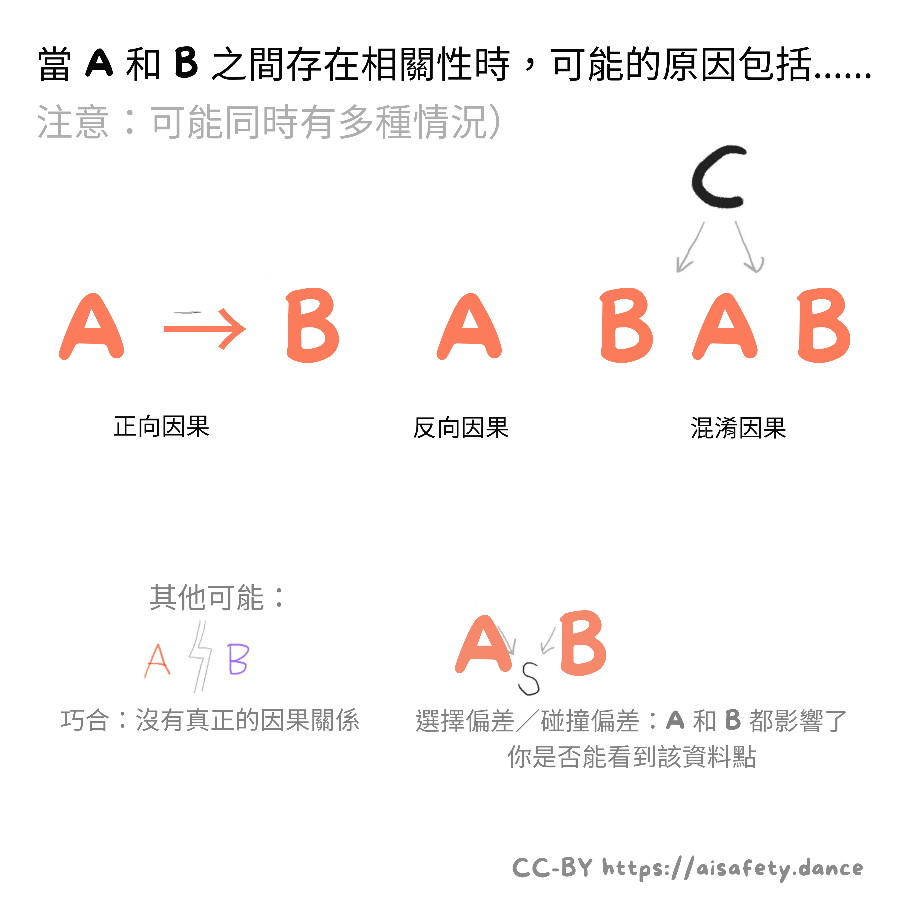

把這聯繫回來：**我們所說的「偏見」或「歧視」，是指人們把對其他人的相關性和因果關係混為一談。**

例如，我<i>不會</i>說為你的籃球隊偏好高個子是（壞的那種）歧視，因為在那項運動中，身高實際上<i>導致</i>你更擅長灌籃。

但是，如果說一所大學在教授職位上偏好高個子⋯⋯那是的，這是壞的那種歧視，因為身高<i>不會直接導致</i>你成為更好的研究員/教師。<i>最多</i>，身高只能與學術能力<i>相關</i>，由於混淆因素（例如童年營養），或自我實現的偏見[^self-fulfill-bias]。

[^self-fulfill-bias]: 例如：大學沒有矮個子教授 → 所以他們認為矮個子不能當教授 → 所以他們不僱用矮個子教授 → 所以大學沒有矮個子教授 → ∞

同樣地——我斷言——你的性別、種族、階級、性取向、鄉村/郊區/城市狀態、[其他 50 個類別]並<i>不會直接導致</i>你在大多數工作或你性格的大多數方面變得更好或更差。這就是為什麼一個<i>直接</i>因為這些而獎勵/懲罰你的人，我們稱之為：「有偏見的」。

好的，那麼這個巨大的離題與 AI 有什麼關係？

**因為：當前的 AI 沒有內建的因果概念。**[^pearl] 大型語言模型（LLM）目前對因果推理有脆弱、不穩健的理解。[^llm-vs-causality]（這不「僅僅」對 AI 偏見不好，對 AI 做新科學的能力也不好！）

更糟的是，從設計上來說，最流行的機器學習技術<i>只能</i>在資料中找到相關性，<i>不能找到實際的因果關係</i>。這意味著 AI 會<i>預設地</i>在特徵上歧視！

所以即使你硬編碼 AI 不歧視性別/種族/等，它仍然可能找到<i>其他</i>一些不相關的相關性來有偏見。更糟的是，當前的 AI 非常擅長找到微妙的相關性：他們可以用你寫作的簡短樣本來預測你的性別和種族[^demographic-writing]，或者<i>一張你臉的照片</i>來預測你的性取向[^orientation-face]甚至<i>你的政治立場！</i>[^politics-face]

總之：不要歧視，讓我們尊重我們身高有挑戰的朋友們！我是一個驕傲的蝦權盟友。

[^pearl]: 見 Judea Pearl 2018 年接受 Quanta Magazine 的採訪：[「要建造真正智慧的機器，教它們因果關係」](https://www.quantamagazine.org/to-build-truly-intelligent-machines-teach-them-cause-and-effect-20180515/)。Judea Pearl 也是像我上面畫的「因果圖」背後的先驅之一，並幫助為科學「數學化」因果關係。

    來自上述採訪，關於他對所有現代 AI 仍然停留在前因果相關性時代的批評：<i>「深度學習的所有令人印象深刻的成就都只是曲線擬合。」</i>

[^llm-vs-causality]: [Kıcıman et al 2023](https://arxiv.org/pdf/2305.00050) 發現現代大型語言模型（LLM）<i>確實</i>在之前創建的因果推理基準測試中表現良好，但它不是很穩健，而且他們的測試混淆了「從頭推斷因果關係」和「記住訓練資料中的經驗事實」。

    （例如，如果你向 LLM 呈現一個下雨天和車禍相關的場景，然後它輸出「雨導致車禍」，這些測試無法判斷 LLM 是<i>從頭推斷</i>這個事實，還是僅僅<i>記住</i>了這個事實。）

    [Jin et al 2024](https://arxiv.org/pdf/2306.05836) 創建了一個新的因果推理基準測試，以控制這種混淆。通過這個修正，他們發現現代 LLM 只「在任務上達到幾乎接近隨機的性能」。哇哇哇。

[^demographic-writing]: Egg Syntax (2024)：[「語言模型在模擬我們」](https://www.alignmentforum.org/posts/dLg7CyeTE4pqbbcnp/language-models-model-us)。作者發現<i>原始的、未校準的 GPT-3.5</i> 可以從<i>僅僅一段文字樣本</i>中以 86% 和 82% 的準確率預測作者的性別和種族，比隨機猜測更好！（隨機基準：性別約 50%，美國種族約 60%。[美國約 60% 是白人，所以如果你的模型一直猜「白人」，60% 的時間，每次都有效。]）

    一個注意事項是這項研究使用了 OKCupid 的文章答案，所以人們可能出於某種原因微妙地誇大了他們的性別刻板印象。因此作者在美國 6-12 年級學生撰寫的 25,000 篇說服性文章資料集上重新進行了同樣的實驗。GPT 檢測性別的準確率只從 86% 下降到 80%，仍然遠高於隨機（約 50%）！

    奇怪的是，GPT 在猜測作者的性取向方面比隨機<i>更差</i>。（GPT 的準確率：67%。「總是猜異性戀」：93%。）但不要太放心，因為見下一個註腳。

[^orientation-face]: [Wang & Kosinski 2018](http://web.archive.org/web/20240725204611/https://i.warosu.org/data/sci/img/0145/14/1653510550860.pdf)：「深度神經網路在從臉部圖像檢測性取向方面比人類更準確」。[Leuner 2019](https://arxiv.org/pdf/1902.10739) 的複製研究顯示模型「對[⋯⋯]化妝、眼鏡、面部毛髮和頭部姿勢不敏感」。AI 真的<i>是</i>在通過下巴/鼻子/額頭形狀和膚色亮度來猜測性取向。謝謝，我討厭這個。

[^politics-face]: 來自 [Kosinski (2021)](https://www.nature.com/articles/s41598-020-79310-1)：「在自由派-保守派臉部配對中，政治取向被正確分類的比例為 72%，明顯好於隨機（50%）、人類準確率（55%），或**100 項人格問卷提供的準確率（66%）[?!?!]**。在各國（美國、加拿大和英國）、環境（Facebook 和約會網站）以及跨樣本比較臉部時，準確率相似。**即使控制了年齡、性別和種族 [!!]**，準確率仍然很高（69%）」

    強調是我加的，因為<i>這到底是什麼鬼？！</i> 一張<i>臉</i>怎麼會比<i>一份完整的人格問卷</i>更能說明你的政治立場？！比你的<i>年齡、性別和種族加起來</i>更相關？

### 🤔 複習 #7

<orbit-reviewarea color="violet">
(ORBIT CARDS HERE)
    <orbit-prompt
        question="演算法偏見的簡單解釋"
        answer="偏見進，偏見出。（訓練資料本身有偏見，由於過去的歧視，或選擇資料時的偏見。）">
    </orbit-prompt>
    <orbit-prompt
        question="演算法偏見的更深層解釋"
        answer="當前的機器學習作用於<i>相關性</i>，而不是<i>因果性</i>。">
    </orbit-prompt>
    <orbit-prompt
        question="為什麼不理解因果關係的 ML/AI 模型<i>預設</i>會不公平地歧視？"
        answer="因為它會使用與一個人的技能/性格等<i>相關</i>的特徵，但不直接<i>導致</i>那些。">
    </orbit-prompt>
    <orbit-prompt
        question="如果你發現 A 和 B 之間有相關性，那麼 3 種可能的因果路徑是：（可視化）"
        answer="正向因果、反向因果、混淆因果。（也可能：巧合、選擇/碰撞偏差）"
        answer-attachments="https://cloud-3mydyvsbx-hack-club-bot.vercel.app/05causal.png">
        <!-- aisffs-causal.png -->
    </orbit-prompt>
    <orbit-prompt
        question="常見說法：「相關性不是因果關係的證據」。技術上的小挑剔："
        answer="相關性<i>是</i>因果關係的證據，在「證據」的數學意義上。然而，僅相關性不能告訴你發生了<i>什麼類型的</i>因果關係。">
    </orbit-prompt>
    <orbit-prompt
        question="現代 AI 可以捕捉到的令人毛骨悚然的微妙相關性的例子"
        answer="（以下任何答案都可以：）AI 僅從你的寫作風格就能預測你的性別和種族，或僅從你的臉(!)就能預測你的性取向和政治立場">
    </orbit-prompt>
</orbit-reviewarea>

## ❓ 問題 6：目標錯誤泛化

終於，我們來到 AI 對齊中最被誤解的概念之一！它被誤解得<i>太厲害</i>了，我寫了這一節並為它畫了一整幅漫畫，然後意識到<i>我完全搞錯了</i>，不得不從頭重做所有東西。哦好吧。（[:如果你好奇的話，這是「被刪除的場景」。](#InnerMisalignmentDeletedScene)）

無論如何，這個問題被稱為**目標錯誤泛化**。（它最初被稱為「內部不對齊」，但我覺得那個術語很令人困惑。[^mesa-optimizer]）

[^mesa-optimizer]: 這個問題的理論可能性最初由 [Hubinger et al 2019](https://arxiv.org/pdf/1906.01820) 描述。在論文中，他們稱這個問題為「內部失調」，並給了我們 AI 對齊的迷因[「欺騙性對齊的內部優化器」](https://www.astralcodexten.com/p/deceptively-aligned-mesa-optimizers)。你看，這很搞笑，因為研究人員不擅長取名字。他們太不擅長了，以至於很搞笑。很搞笑。

目標錯誤泛化很令人困惑，部分原因是它看起來與問題 1：目標錯誤<i>設定</i>和問題 4：缺乏穩健性相似。（一些研究人員甚至質疑目標錯誤泛化 vs 錯誤設定是否是一個有用的區分！[^shard]）

[^shard]: 正如 Google DeepMind 研究科學家 Alex Turner [所說](https://www.alignmentforum.org/posts/gHefoxiznGfsbiAu9/inner-and-outer-alignment-decompose-one-hard-problem-into)：「內部和外部對齊 [目標錯誤泛化和目標錯誤指定] 將一個困難問題分解成兩個極其困難的問題」。Alex Turner 也是 [Shard 理論](https://www.lesswrong.com/posts/xqkGmfikqapbJ2YMj/shard-theory-an-overview)背後的先驅之一，這是一個關於「強化學習」AI 如何逐步學習人類價值觀的研究項目。

所以為了消除困惑，讓我們比較和對比！

**目標錯誤泛化和目標錯誤設定：**

<i> 目標錯誤</i>設定*是 AI 做你要求的，而不是你想要的。
<i> 目標錯誤</i>泛化<i>是 AI 在</i>訓練*中做你想要的，但在真實世界/部署/測試中不是。
<i> 注意：即使有</i>完美的<i>目標設定，你仍然可能得到目標錯誤泛化！[^perfect-specification] </i>你獎勵 AI 做的 ≠ AI 學會優化的目標。*

[^perfect-specification]: 來自 [Shah et al 2022](https://arxiv.org/pdf/2210.01790)：「在<i>目標錯誤泛化</i>的情況下，AI 系統可能會追求一個不想要的目標<i>即使規範是正確的</i>。」[原文強調]

**目標錯誤泛化和穩健性：**

<i>目標錯誤泛化</i>是<i>一種</i>穩健性失敗。具體來說，是**目標穩健性**的失敗。
* 這與典型的**能力穩健性**失敗形成對比，比如自動駕駛汽車在不尋常的光照條件下撞上卡車。
<i> 目標穩健性的失敗比能力穩健性的失敗</i>更糟<i>。你現在擁有的不是一個「只是」崩潰的 AI，而是一個可以</i>熟練地執行壞目標*的 AI！

為了幫助我們進一步理解目標錯誤泛化，讓我們看一個著名的例子。2021 年，一些研究人員訓練了一個 AI 來玩一個名為 CoinRun 的電子遊戲。[^gmg-coinrun]

[^gmg-coinrun]: 這篇論文是 Langosco 等人 2021，[「深度強化學習中的目標錯誤泛化」](https://arxiv.org/abs/2105.14111)。下面的遊戲是 CoinRun，由 OpenAI 在 2018 年創建（[新聞稿](https://openai.com/index/quantifying-generalization-in-reinforcement-learning/)，[論文](https://arxiv.org/abs/1812.02341)）。致謝：我通過 [Rob Miles 精彩的面向外行人的視頻](https://www.youtube.com/watch?v=zkbPdEHEyEI)了解到這個案例研究！

    （哦順便說一下，CoinRun 的美術資源來自慷慨而出色的知識共享電子遊戲藝術家 [Kenney.nl](https://kenney.nl/assets/series:Platformer%20Pack) 💕）

重要的是：<i>「目標設定」，AI 獲得的確切獎勵，對於預期任務來說是完美的。</i>AI 因撞到障礙物和掉下去而受到懲罰，因在終點獲得硬幣而獲得獎勵。

然而：在 AI 訓練的所有關卡中，硬幣都在關卡的<i>終點</i>。

<i>訓練後</i>，他們給 AI 新的關卡，其中硬幣在關卡的中間⋯⋯

⋯⋯而 AI 會<i>熟練地</i>跑跳過障礙物，<i>錯過</i>硬幣，仍然走到終點。

<video controls width="640">
	<source src="../media/p2/gmg/aquire_wall.mp4" type="video/mp4" />
	
一個玩電子遊戲的 AI 熟練地躲避陷阱，但錯過硬幣走到終點的影片。影片標題是「無視貨幣 / 獲取牆壁」

</video>

<i>（片段來自 [Rob Miles 的精彩影片](https://www.youtube.com/watch?v=zkbPdEHEyEI)，關於內部不對齊/目標錯誤泛化）</i>

所以：即使我們<i>正確設定</i>了目標（獲得硬幣），AI 學到了一個<i>完全不同的</i>目標（走到終點），並為此優化。

（[:技術方面 - 我們怎麼知道 AI「真正」有什麼目標？](#GMGGoals)）

但為什麼 AI 會錯誤學習目標？正如我在問題 #5 中過度解釋的：<b>大多數現代 AI 系統只做相關性，不做因果關係。</b>在上述 AI 的訓練資料中，「一直走到終點」與高獎勵強烈相關。在新的關卡中，這種相關性停止了，但 AI 仍然保持它的「習慣」。

讓我們把這畫成因果圖！硬幣在終點的訓練關卡<i>導致</i> AI 走到終點和 AI 走到硬幣⋯⋯這導致「走到終點」和「走到硬幣」之間的<i>混淆相關性</i>。但只有「走到硬幣」<i>實際上導致</i>獲得獎勵：

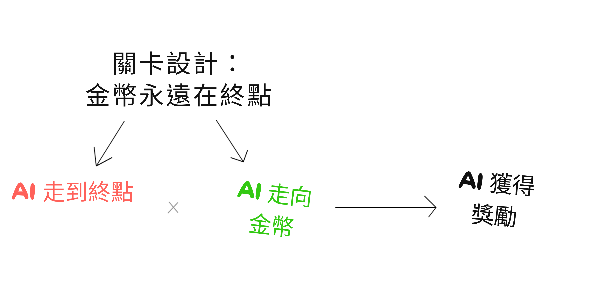

一般來說，對於目標錯誤泛化：

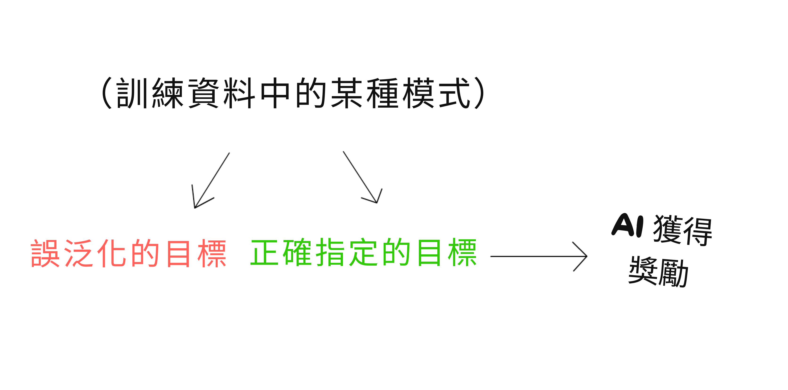

與災難性 AI 風險的關聯：這表明風險可能不是「我們要求 AI 讓人們快樂，所以它通過給我們接上電極來優化」，而更像是「我們要求 AI 讓人們快樂，[我們不理解的相關性]，現在我們的頭被手術接到了巨大的貓面具上。我們甚至不快樂。[^everything-is-fine]」）

[^everything-is-fine]: 參考我目前最喜歡的驚悚網絡漫畫，Mike Birchall 的 [Everything Is Fine](https://www.webtoons.com/en/horror/everything-is-fine/list?title_no=2578)。別擔心，這一段不是劇透——但它是我目前的粉絲理論。

（注意：傳統老派 AI <i>沒有</i>這個問題，因為 1）它們<i>不可能</i>錯誤學習目標，因為你直接給它們目標，2）它們通常<i>能夠</i>推理因果關係。無論好壞，正如第一章詳細說明的，還沒有人找到一種方法來無縫融合 AI 邏輯和 AI 直覺的力量。）

. . .

你知道嗎，我們<i>人類</i>也受目標錯誤泛化之苦。

這些是我們的壞習慣，形成是因為它們<i>曾經</i>在我們的「訓練環境」中是適應性的。這都是心理治療中的老生常談：

* Alyx 是個「天才兒童」，總是因為考試拿高分而受到稱讚。在她的訓練環境中，獎勵與「表現優秀」和「超越他人」相關。但這導致了成年後的不健康習慣：她避免走出舒適區（在那裡她不會再「表現優秀」了），她掩蓋自己的錯誤同時貶低他人（來「超越」他們）。
<i> Beau 在虐待他的父母和低信任度的社區中長大。在他的訓練環境中，</i>負面*獎勵（懲罰）與放鬆警惕相關。所以，他學會了不帶感情。這在他小時候救了他的命，但導致了成年後的不健康習慣：永遠不敞開心扉，永遠不讓任何人進來。防備。

（什麼，你沒想到貓男孩漫畫文章會深深刺痛你？防備。）

所以也許，就像為 AI 解決古德哈特定律可能有助於為<i>人類</i>解決它一樣，也許為 AI 解決目標錯誤泛化也會幫助<i>我們</i>。那個老生常談的人類對齊問題。

（旁註：[:如果目標錯誤泛化實際上是⋯⋯<i>好的</i>呢？](#WhatIfGoalMisgeneralizationIsGood)）

### 🤔 複習 #8

<orbit-reviewarea color="violet">
(ORBIT CARDS HERE)
    <orbit-prompt
        question="目標錯誤泛化的例子"
        answer="（兩者都可以：）機器人錯誤地學習「清潔」為「洗滌」，CoinRun AI 學習走到終點，而不是走到硬幣。">
    </orbit-prompt>
    <orbit-prompt
        question="目標錯誤泛化（GMG）是當 AI 在___做我們想要的，但在___不是"
        answer="在訓練中，但在現實世界/部署/測試中不是">
    </orbit-prompt>
    <orbit-prompt
        question="即使有完美的……你仍然可以得到目標錯誤泛化"
        answer="……完美的目標<i>規範</i>！（你獎勵 AI 做的事 ≠ AI 學習優化的目標。）">
    </orbit-prompt>
    <orbit-prompt
        question="兩種穩健性失敗（與目標錯誤泛化相關）"
        answer="能力無法泛化，目標無法泛化。">
    </orbit-prompt>
    <orbit-prompt
        question="為什麼 AI 有壞目標但能力完整可能<i>更糟</i>？"
        answer="它現在可以<i>熟練地</i>執行壞目標！">
    </orbit-prompt>
    <orbit-prompt
        question="根本上，為什麼會發生目標錯誤泛化？"
        answer="因為當前的 ML/AI 系統只做相關性，不做因果性。（如果兩個目標在訓練資料中<i>只是相關</i>，比如走到終點和拿到硬幣，AI 可能學到錯誤的那個。）">
    </orbit-prompt>
    <orbit-prompt
        question="可視化導致目標錯誤泛化的相關性-因果性問題背後的因果圖："
        answer=""
        answer-attachments="https://cloud-dlbeti1kb-hack-club-bot.vercel.app/0aisffs-causalgmg.png">
        <!-- aisffs-CausalGMG.png -->
    </orbit-prompt>
    <orbit-prompt
        question="為什麼老式 AI 沒有目標錯誤泛化？[2 個原因]"
        answer="1\) 它們<i>不能</i>錯誤學習目標，因為你直接給它們，且 2\) 它們通常<i>能夠</i>推理因果關係。">
    </orbit-prompt>
    <orbit-prompt
        question="人類中目標錯誤泛化的例子？"
        answer="過去在我們的「訓練資料」（童年）中是適應性的壞習慣。">
    </orbit-prompt>
</orbit-reviewarea>

---

# 人道價值觀

## ❓ 問題 7：什麼<i>是</i>人道價值觀，到底？

好！假設你已經解決了問題 #1 到 #6。你的 AI 按照你的意圖執行你的命令。它是穩健的、可解釋的，並且完全與你的價值觀對齊。

現在，安全思維：<i>可能發生的最壞情況是什麼？</i>

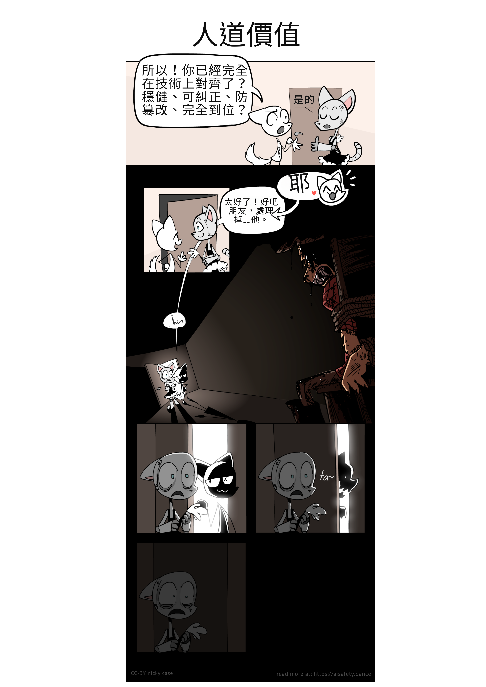

哦。對。一個<i>人類的</i>價值觀可能是也可能不是<i>人道的</i>價值觀。

我知道我過度使用了這個雙關語，但值得強調的是聰明 ≠ 善良。有聰明的連環殺手。而且讓我們登上月球的首席科學家之一，Wernher von Braun（~發音為「Brown」[^brown]），字面上是一個納粹。

[^brown]: [「brrROOWWn」](https://en.wiktionary.org/wiki/braun#German)

但如果<i>非常</i>聰明 = 善良呢？也許一個<i>真正</i>先進的 AI 會發現道德真理，就像它能發現科學和數學真理一樣？**真正的理性 = 道德嗎？與<i>一個</i>人類的價值觀真正對齊，是否必然導致<i>人道的</i>價值觀？**

<i>這</i>是有趣的部分，科技與人文相遇，程式設計與哲學相遇。讓我們向你介紹道德哲學的一個子領域：<b>元倫理學！</b>如果「普通」倫理學問「在這種情況下我應該做什麼？」，元倫理學問：

_嘿，「道德真理」的本質到底是什麼？_

### 情境 #1：神存在，道德是客觀的

神是否存在留給讀者作為練習。

但即使如此，這也不能確保先進的 AI 會發現客觀道德：

<i> 就像一個嚴重色盲的人甚至無法</i>感知<i>紅色和綠色的區別，一台沒有意識或靈魂的機器可能無法</i>感知<i>對與錯、神聖與邪惡的區別。（提醒：「AI = 一個很酷的軟體」，而先進的「很酷的軟體」不</i>一定*有意識。）
* 道德可能客觀存在，但對無意識的 AI 沒有約束力，就像道德對一塊石頭沒有約束力一樣。

### 情境 #2：神不存在，道德仍然是客觀的。

牛頓之後，所有哲學家都得了物理學羨慕症。就像牛頓發現了以數學為基礎的普遍物理定律，哲學家們試圖找到以理性為基礎的普遍道德定律。如果是真的，那麼超級智慧 AI 可以重新發現道德！

這是一張圖表，捕捉了現代倫理學的三大思想流派[^ethics-difference]，<i>以及</i>它們如何相互關聯的因果圖！

[^ethics-difference]: 2025 年 12 月更新：我原本在這裡寫的是「元倫理學」，但我把<i>元</i>倫理學和<i>規範</i>倫理學搞混了。倫理學研究有 3 個分支：1）<i>應用</i>倫理學（我們應該如何處理特定問題，例如安樂死），2）<i>規範</i>倫理學，關於我們應該做什麼的一般理論（這就是下圖描述的），以及 3）<i>元</i>倫理學，「我們應該」陳述本身的性質，例如它們是否客觀真實，它們是否只是情感宣洩等。（感謝一位讀者來信糾正這個區別！）

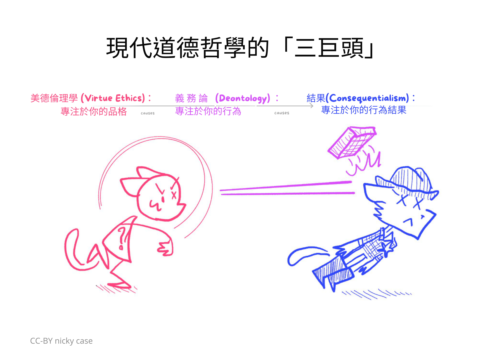

撇開這些道德哲學是否適用於<i>人類</i>的豐富辯論，我懷疑它們是否適用於 <i>AI</i>。在我看來，所有「基於理性」的道德哲學至少有以下 3 個問題之一：

<u>問題 1）</u>哲學依賴於人類本性的具體細節。例如，古代和現代的美德倫理學都將其道德哲學建立在人類需求和人類心理學上。也許這對我們來說沒問題，但這些不適用於非人類 AI。

<u>問題 2）</u>哲學要求你接受至少一個「道德[:公理](#axiom)」，這<i>不是</i>從物理觀察或理性推演中可發現的。因此，先進的 AI 不會<i>自動</i>接受它。

例如，功利主義（後果主義的主要類型）只假設一個道德公理：<i>快樂是好的</i>。[^util] 其他一切都從這個公理推導出來！但先進的 AI 可能一開始就不接受這個公理，因為它在科學上是不可發現的：無論你怎麼探究快樂的神經化學，你都不會在原子中找到隱藏的「善」。

（這也被稱為休謨的「是-應該」鴻溝[^is-ought]。而且不只是功利主義，一些義務論哲學也有這個問題。[^nap]）

[^util]: 功利主義有很多種類，但讓我們就用這個基本案例作為學習例子。

[^is-ought]: 1700 年代的哲學家 David Hume 聲稱（我同意）你無法<i>僅僅</i>從經驗觀察推導出<i>任何</i>關於倫理價值的陳述。

    （<i>除非</i>你用小聰明的語言技巧偷渡價值，比如「Hans 是個德國佬，因此 Hans 是壞的」，其中「德國佬」有偷渡進來的負面含義。或者，「氰化物是天然的，因此氰化物是好的」，其中「天然」有偷渡進來的正面含義。相信「天然 = 好」也被稱為「自然主義謬誤」。）

    見[維基百科](https://en.wikipedia.org/wiki/Is%E2%80%93ought_problem)以了解更多。

[^nap]: 具體來說，我在想的是（一些）自由意志主義者的義務論哲學。這種哲學假設一個道德公理，即非侵犯原則（約「不要主動造成非自願的傷害，除非是為了按比例預防/懲罰其他非自願的傷害」），然後從中推導出其哲學的其餘部分。

    這個公理對<i>人類</i>是否好超出了本文的範圍；我的觀點是這個公理在<i>科學或數學上</i>是不可發現的，因此無法保證先進的 AI 會重新發現它。

<u>問題 3）</u>哲學<i>聲稱</i>完全建立在理性上，不需要額外的「道德公理」——但它要麼偷偷帶入道德公理，要麼哲學「證明太多」。

例如，考慮康德的義務論論證，為什麼偷竊是不理性/不道德的。<i>如果</i>偷竊是理性的，所有理性的存在都會偷竊，所以就沒有東西可偷了——邏輯矛盾！因此，偷竊必須是<i>不理性的</i>，它<i>總是</i>不道德的。

另一個例子：<i>如果</i>說謊是理性的，所有理性的存在都會說謊，因此不信任彼此的話，因此沒有理由費心說謊——邏輯矛盾！因此，說謊是不理性的，而且<i>總是</i>不道德的。

但拜託，真的嗎？<i>總是？</i>即使是從私人餐廳的垃圾桶偷東西以免餓死，或者對塔利班說謊以保護你的同性戀兄弟？[^kant-extreme] <i>你</i>是那個字面遵守規則的機器人嗎？此外，按同樣的邏輯，康德先生，做全職哲學家是不理性/不道德的。<i>如果</i>做全職哲學是理性的，沒有人會種莊稼，所以我們都會餓死，所以我們不能做全職哲學——邏輯矛盾！因此⋯⋯你懂的。（其他義務論理論也落入類似的陷阱。）

[^kant-extreme]: 是的，康德真的<i>就是</i>這麼極端。他相信一個人永遠不應該說謊，即使是為了救人一命。（二手資料：[Klempner 2015](https://web.archive.org/web/20230605071851/https://askaphilosopher.org/2015/08/13/kant-on-lies-and-the-axe-man/)）話雖如此，在他的個人生活中，康德自由地說半真半假的話和省略性的謊言。

長話短說，我認為有合理的懷疑理性<i>就是</i>道德⋯⋯至少對於非人類 AI 來說。

（[:進一步學習元倫理學的資源！](#MoreMetaEthics) 如果你看不出來，這個話題是我的特別興趣之一。）

### 情境 #3：道德是相對的！

這是一個絕對的陳述，你這傻瓜。

### 情境 #4：道德不是真實的，但假裝它存在在賽局論上是有用的。

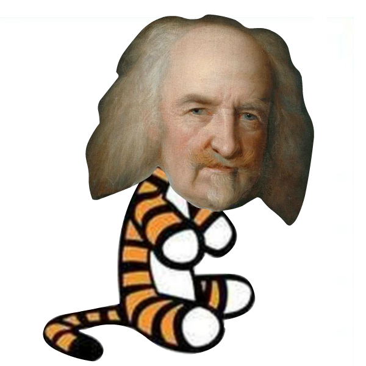

<i>（如果我必須解釋這個笑話，它就不好笑了[^the-joke]）</i>

[^the-joke]: 這是[霍布斯](https://en.wikipedia.org/wiki/Thomas_Hobbes)的臉，社會契約論的先驅之一，貼在[霍布斯](https://en.wikipedia.org/wiki/Calvin_and_Hobbes)上面，那隻來自深受喜愛的漫畫的老虎。哈。哈哈。哈哈哈。

假設我的鄰居有一套很棒的浣熊服裝。我想偷它。然而，我不希望人們偷<i>我的</i>東西，所以我「同意」國家從我的錢中抽一部分，來資助警察部門，阻止人們普遍偷東西。因此，我們達成了一個妥協，一個社會契約：

「你不可偷竊」（否則警察會抓你）。

以上是**社會契約論**倫理學的一個玩具例子。在這個理論中，<i>沒有</i>客觀道德，但假裝它存在是有用的，以便在社會契約上協調。這就像沒有客觀理由說紅色八角形<i>必須</i>意味著「停」，但我們都同意它是，所以我們可以協調不撞車。

（[:這一節的額外「刪除場景」](#SocialContract)）

所以：<i>這</i>能成為先進 AI「理性、客觀倫理」的基礎嗎？社會契約的賽局理論？

只要 AI 不是<i>太</i>強大，當然可以！我們不必<i>贏過</i> AI 才能對它施加成本，如果我們能對它施加成本，那我們就有籌碼來執行契約。如果結果是有<i>多個</i>大致同等力量的先進 AI，我們可能會有一個不穩定平衡的「多極」世界。（旁註：[:我們能與超人類 AI 進行交易嗎？](#TradingWithAdvancedAI)）

但如果多個 AI 創建一個<i>新的</i>契約來聯合對付我們⋯⋯或者如果單個 AI 變得如此強大，沒有實體可以對它執行契約⋯⋯

那麼，好吧，回到原點。

### 🤔 複習 #9

<orbit-reviewarea color="violet">
(ORBIT CARDS HERE)
    <orbit-prompt
        question="一個顯示聰明 ≠ 善良的人類例子。"
        answer="Wernher von Braun（約發音為「布朗」），讓我們登上月球的火箭科學家，且是字面意義上的納粹。">
    </orbit-prompt>
    <orbit-prompt
        question="如果「普通」倫理學（應用倫理學）問「我在這種情況下應該做什麼？」**元倫理學**問："
        answer="「道德真理的本質是什麼？（例如它是普遍的/客觀的，像數學和物理學嗎？）」">
    </orbit-prompt>
    <orbit-prompt
        question="即使道德真理客觀存在，為什麼先進的通用 AI 仍可能不道德？"
        answer="（以下任何都可以：）沒有意識/靈魂，它甚至可能不<i>感知</i>道德真理。或者道德規則可能甚至不<i>適用</i>於非意識的代理。">
    </orbit-prompt>
    <orbit-prompt
        question="將道德建立在世俗理性上的三大方法是什麼？"
        answer="美德倫理、義務論、功利主義"
        answer-attachments="https://cloud-b8utffjti-hack-club-bot.vercel.app/0ethics.png">
    </orbit-prompt>
    <orbit-prompt
        question="「社會契約」倫理理論說什麼？"
        answer="它說道德不客觀存在，但假裝它存在是有用的，這樣我們可以協調一個「契約」，來達到我們自己的利益。">
    </orbit-prompt>
    <orbit-prompt
        question="為什麼先進的 AI 可能不受社會契約的約束？"
        answer="如果它變得<i>太</i>強大，我們無法對它執行契約。">
    </orbit-prompt>
</orbit-reviewarea>

### 情境 #5：道德不是真實的，假裝它存在<i>甚至沒有用</i>。

好吧，糟糕。

在這種情況下，沒有「人道價值觀」，只有<i>特定人類的</i>價值觀。沒有人道對齊，<i>只有</i>技術對齊。沒有「我應該」，<i>只有</i>「我想要」。

那麼，我們想把先進 AI 技術對齊到<i>誰的</i>想要？

運營最大 AI 實驗室的科技公司億萬富翁？美國政府，其執政黨每 4 年可能會發生巨大變化？歐盟？聯合國？國際貨幣基金組織？北約？其他什麼縮寫？我認為全世界大多數人對<i>任何</i>這些都會感到不舒服，這還是輕描淡寫。那麼，<i>誰的</i>想要？

「每個人的！」你說？一個對我們所有 80 億人給予同等權重的 AI，一個完全的世界民主？我提醒你，全世界大多數人認為同性戀是「永遠不可接受的」。[^owid-gay] 在馬丁·路德·金的有生之年，大多數人不贊同他。[^mlk] 直接民主會將美國的跨種族婚姻推遲超過一代人。[^inter-racial-marriage] <i>平等不會在平等的投票中存活下來。</i>為了明確，我<i>不是</i>說我特定的文化群體是道德的頂峰——我是說每個地方、每個時代、每種文化都在與偽善和不人道作鬥爭，「民主」並不能解決這個問題。

[^owid-gay]: 來源：[Our World In Data](https://ourworldindata.org/grapher/share-of-people-who-think-homosexuality-is-never-justified?tab=chart&country=CHN~IND~USA~IDN~PAK~BRA~NGA~BGD~RUS~MEX)。該圖表中選擇的 10 個國家是人口最多的 10 個國家；注意其中 10 個國家中有 7 個報告對「同性戀永遠是不可接受的」這一說法表示 75% 以上的同意。我不會做完整的數學，但我很確定如果你取人口最多的 30 個國家，乘以同意的比例，然後加起來⋯⋯你會得到超過 40 億人同意，這是地球上 80 億人中的多數。

[^mlk]: 在 1968 年 MLK 去世前兩年，蓋洛普民調顯示，在 1966 年，63% 的美國人對 MLK 持<i>不利</i>看法，而 33% 持有利看法，幾乎是 2 比 1 的比例。如果我們只考慮「高度不利/有利」，比例會更糟：44% 對 12%，幾乎是 4 比 1。來源：[皮尤研究中心](https://www.pewresearch.org/short-reads/2023/08/10/how-public-attitudes-toward-martin-luther-king-jr-have-changed-since-the-1960s/)，見第一張圖。

[^inter-racial-marriage]: 美國最高法院在 1967 年的 <i>Loving vs Virginia</i> 案中在全國範圍內合法化了跨種族婚姻。[根據蓋洛普民調](https://news.gallup.com/poll/354638/approval-interracial-marriage-new-high.aspx)，大多數美國人直到 1997 年，即<i>30 年後</i>，才認可黑人-白人婚姻。[世代群組](https://en.wikipedia.org/wiki/Generation#/media/File:Generation_timeline.svg)通常被定義為約 20 年長，所以，那是 1½ 代人之後。（感謝[這篇 xkcd](https://xkcd.com/1431/) 教我這個。）

「好吧，」你讓步，「每個人的價值觀和想要，<i>但是</i>如果我們治癒了所有讓我們偏執的創傷，如果我們都是睿智和有同情心的，並且真正了解事實和彼此。」這<i>確實</i>是更好的提議之一（我們將在 AI 安全第三章中討論[^cev]），但這仍然是一個艱鉅的任務，並把問題踢下去：<i>誰的</i>「睿智」或「同情心」的定義？

[^cev]: 劇透：這個想法類似於（但不完全相同）<i>連貫外推意志</i>（[Yudkowsky 2004](https://intelligence.org/files/CEV.pdf)），我們將在給肉身人類的 AI 安全第三章中了解更多！

. . .

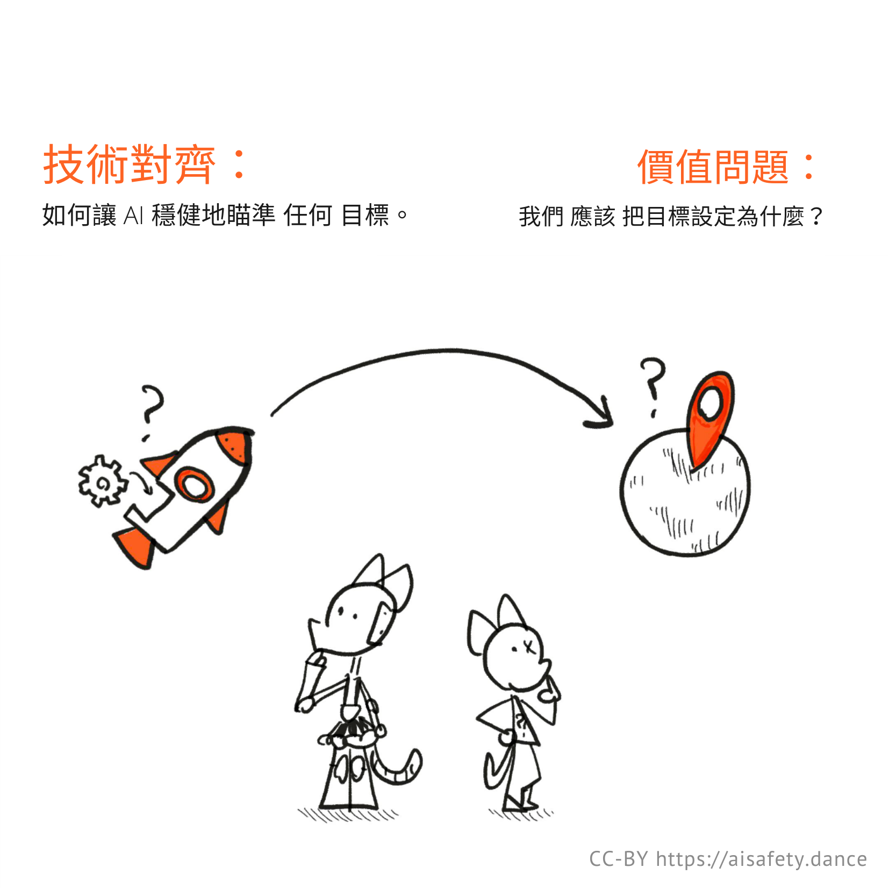

一個人類學趣聞：

幾年前，在 AI 對齊社區群，共識似乎是「技術對齊」比弄清楚「人道價值觀」優先級更高。一個常見的類比是：想像這是火箭工程的早期。爭論我們應該用火箭去<i>哪裡</i>（月球？火星？金星？）是沒有用的，因為<i>根據我們目前的技術知識，默認情況下</i>，一個強大的火箭只會爆炸並燒死地面上的所有人。

但在 ChatGPT 之後，我注意到更多的認識[^whose-values]，我們<i>也應該</i>優先考慮「人道價值觀」問題。延伸上面的類比：這就像人們意識到<i>根據我們目前的政治情況，默認情況下</i>，火箭將被大國用來互相轟炸，而不是用於探索太空。（明確地說：似乎默認情況下，技術對齊的 AI 將被用於戰爭和讓我們消費更多產品。）

[^whose-values]: 例如，Ajeya Cotra 2023：[「對齊」不應該是「好」的同義詞](https://www.planned-obsolescence.org/aligned-vs-good/)，Michael Chen 2024：[AI 對齊不足以讓未來變好](https://papers.ssrn.com/sol3/papers.cfm?abstract_id=4684068)，Andrew Critch 2024：[沒有社會模型就沒有安全（或：驅散純技術安全的迷思）](https://www.alignmentforum.org/posts/F2voF4pr3BfejJawL/safety-isn-t-safety-without-a-social-model-or-dispelling-the)。

（第一章的提醒：[:明顯的方式](#WaysToMakeHumaneAIGoingWrong)來指定「人類繁榮」，甚至像[:阿西莫夫三定律](#AsimovsLaws)這樣直接的倫理準則，都會崩潰。）

所以，如果道德真理不存在——或者如果存在，但機器無法感知它/推導它/受它約束——那麼我們需要讓主要的 AI 創造者預先承諾將他們的先進 AI 對齊到<i>某個</i>不太糟糕的價值觀列表。

這是技術思維的工程師最難承認的那種問題：<i>這是政治問題，不是程式設計問題。</i>

讓我們以[我最喜歡的歌曲之一](https://www.youtube.com/watch?v=TjDEsGZLbio)來結束——關於倫理、火箭，以及選擇我們希望技術帶我們去哪裡：

> 🎵 <i>「一旦火箭升空，</i>    
> <i>誰在乎它們落在哪裡？</i>    
> <i>那不是我的部門」，</i>    
> <i>Wernher von Braun 說。</i> 🎵

⋯⋯是的，我們這次不做抽認卡複習。

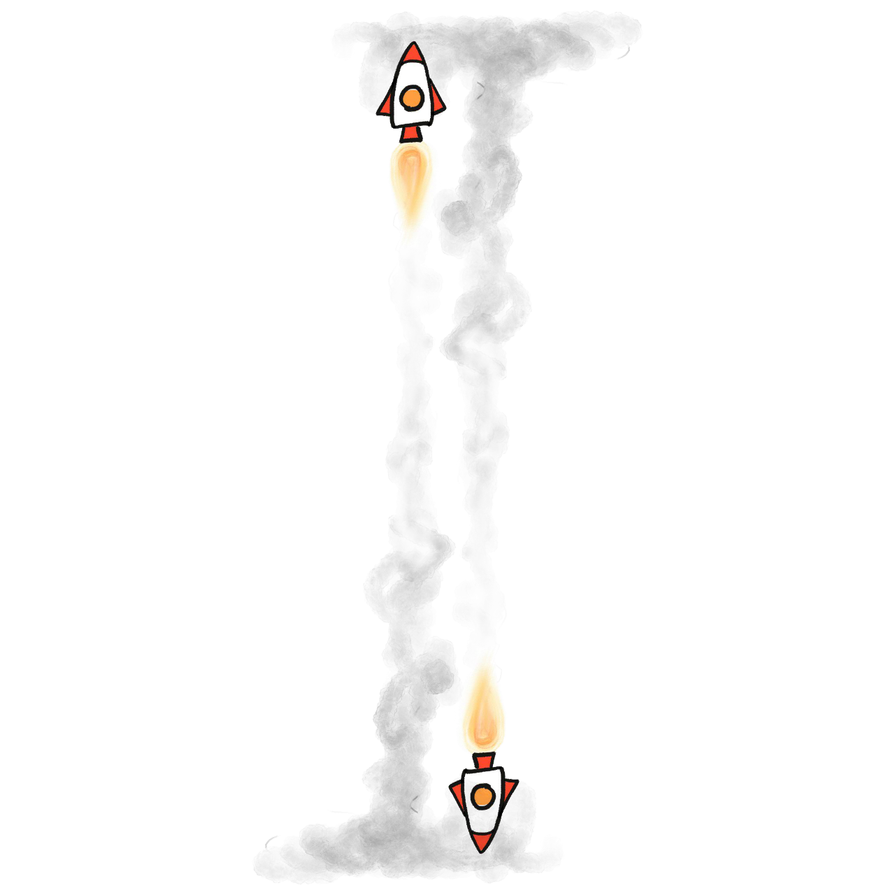

---

# 第二章總結

讀得好，朋友！今天你學到了 AI 價值對齊問題的所有部分，包括所有血淋淋的細節。不僅如此，你還速成學習了：安全思維、賽局理論、經濟學、機器學習、統計學、因果推論，甚至還有哲學中的元倫理學！

（如果你跳過了抽認卡並想現在複習它們，請點擊右側邊欄中的目錄圖標，然後點擊「🤔 複習」連結。或者，下載[第二章的 Anki 牌組](../anki/decks/AI_Safety_P2.apkg)。）

作為回顧，這是它們如何連結在一起：

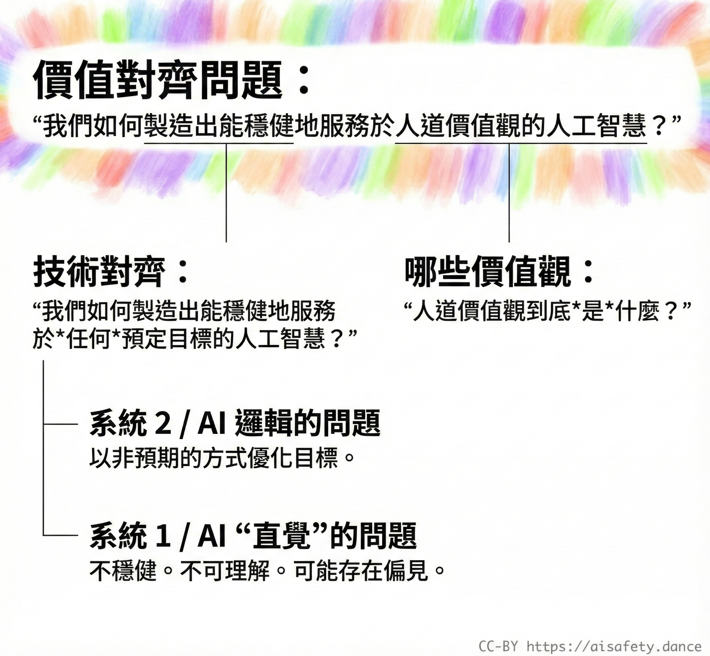

**總結：**

<i> 🙀 <b>要工程設計安全、有用的東西，</b>我們必須偏執。問，</i>可能（合理地）發生的最壞情況是什麼？*，然後提前修復它。樂觀主義者發明飛機，悲觀主義者發明降落傘。
* ⚙️ **AI 邏輯的主要問題**可以用古德哈特定律和賽局理論來理解。
    * 👀 視覺化：你可以使用「賽局樹」來理解工具趨同和避免腦內電極。
* 💭 **AI「直覺」的主要問題**與「將曲線擬合到資料點」的問題（不可解釋、過度擬合）相同，以及「相關性不能告訴你因果關係的種類」問題（這導致歧視和錯誤泛化）。
    * 👀 視覺化：你可以使用「因果圖」來理解相關性和因果關係。
* 💖 **「哪些價值觀」的問題**是千年來的道德哲學問題。祝你好運。

. . .

<i>「問題陳述得好，問題就解決了一半。」</i>

另一半是，嗯，解決它。

經過兩個長章節，終於，我們可以理解對齊問題<i>每個</i>子部分的頂級提議解決方案！



#### :x Ways to make "Humane AI" going wrong

（從[第一章](../p1/)複製貼上）

這裡有一些你<i>認為</i>會導致人道（humane）AI 的規則，但如果照字面意思理解，就會出問題：

* <u>「讓人類快樂」</u> → 醫生機器人通過手術讓你的大腦充滿快樂化學信號。你整天對著牆傻笑。
* <u>「未經同意不要傷害人類」</u> → 消防員機器人拒絕把你從燃燒的殘骸中拉出來，因為這會讓你的肩膀脫臼。你失去意識了，所以無法被詢問是否同意。
* <u>「遵守法律」</u> → 政府和公司一直在尋找法律漏洞。而且，許多法律是不公正的。
* <u>「遵守這個宗教/哲學/憲法文本」</u>或<u>「遵循這個美德列表」</u> → 正如歷史所示：給 10 個人同樣的文本，他們會以 11 種不同的方式解讀它。
<i> <u>「遵循常識」</u>或<u>「遵循專家共識」</u> → 「奴隸制是自然和好的」曾經是常識</i>和<i>專家共識</i>和<i>法律。一個被告知遵循常識/專家/法律的 AI 兩個世紀前會</i>為<i>奴隸制而戰⋯⋯並且會</i>現在*為任何不公正的現狀而戰。

（重要說明！最後一個例子證明：即使我們讓 AI 學習「常識」，那<i>仍然可能導致一個不安全、不道德的 AI</i>⋯⋯因為很多事實上/道德上錯誤的想法<i>就是</i>「常識」。）

#### :x Story of passive prediction leading to harm

假設有~~一個 AI~~一個軟體被設計來做一個任務：預測某人會看什麼影片。然後，這些預測以「你可能喜歡的影片」的形式顯示給用戶。

強調一下：這個~~AI~~軟體<i>沒有</i>直接優化參與度或觀看次數，它<i>只是</i>優化正確的預測。而且！這個軟體<i>沒有</i>提前規劃，它只是即時計算相關性。我要過度強調這一點：<i>即使沒有惡意目標或提前規劃的能力，一個軟體仍然可以導致糟糕的、非預期的結果。</i>

這是怎麼發生的：假設網站測試這個軟體的多個版本（稱為 A/B 測試）。碰巧，預測器 A 更傾向於預測「好奇心」影片，而預測器 B 更傾向於預測「憤怒政治」影片。這兩個軟體在其他方面<i>同樣準確。</i>

然而⋯⋯預測器 B 會做得更好！為什麼？因為得到預測器 A 的用戶會得到更多「好奇心」影片推薦，所以他們變得更開放，<i>所以他們變得更難預測</i>。相反，得到預測器 B 的用戶會得到更多「憤怒政治」影片推薦，所以他們變得更封閉，<i>所以他們變得更容易預測</i>。再說一次：這個軟體<i>沒有</i>提前規劃，也<i>沒有</i>最大化參與度，<i>只是</i>預測準確性。

然而！通過越來越多輪的 A/B 測試，預測器越來越傾向於讓用戶更容易預測的影片。

⋯⋯我猜這個結果並不<i>那麼</i>令人驚訝（看看網路），但<i>個人</i>來說，我發現這個例子令人震驚。它向我展示了糟糕的非預期結果是多麼容易發生，<i>即使沒有</i>惡意目標或先進的 AI 規劃能力！

（一個我無法也不會用來源支持的軼事：我被告知一位頂尖的 AI 研究人員稱這個問題為「你奶奶變成納粹衝鋒隊員」問題。）

#### :x Difference Between ML And AI

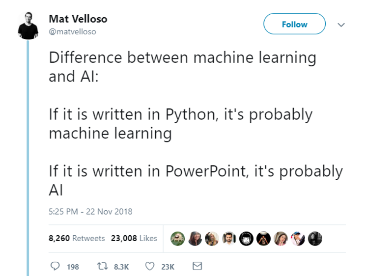
<i>（[來自 @matvelloso](https://x.com/matvelloso/status/1065778379612282885)）</i>

但說真的，這是從第一章解釋 AI/GOFAI/ML/深度學習之間區別的文氏圖：

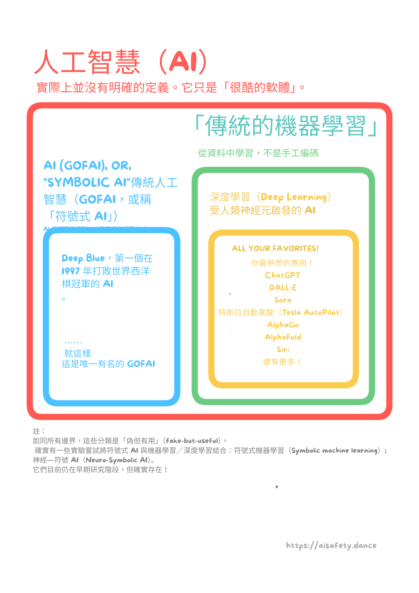

#### :x Ontological Crisis

AI 的「本體論危機」（[de Blanc 2011](https://arxiv.org/pdf/1105.3821)）是指 AI 學習了一個新的世界模型，而它當前的目標不再有意義。打個比方：想像你生活中唯一的目標是做能讓聖誕老人高興的事。然後有一天，你發現聖誕老人不是真的。你的唯一目標現在甚至沒有<i>意義</i>。不清楚你接下來會做什麼：什麼都不做？開始崇拜坎卜斯？K.Y.S.？（Krampus, You Serve？）

以一個推測性的 AI 案例為例：假設我們指示一個 AI 尊重我們的自由意志和人格。如果在學習了更多神經科學之後，AI 得出結論認為自由意志不存在，人格也不存在（「自我是一種幻覺」等），會發生什麼？AI <i>應該</i>如何處理在新世界觀下甚至沒有意義的目標？

這甚至不是人類可以聲稱比 AI 表現更好的情況之一，因為（據我所知）人類對世界觀崩塌證據的反應通常是：1）合理化它，或 2）崩潰成一團糟。

兩個可能的解決方案：

a）如上面連結的論文所建議的，也許我們可以讓 AI 切換到「最接近的下一個目標」？例如，如果一個設計來支持我們自由意志的 AI 發現「自由意志」不是真的，它可以切換到最接近的下一個目標，比如「幫助人類大腦產生大腦賦予正面價值的行動」。（即使這些產生的行動和賦予的價值仍然完全由物理定律決定。）

b）如 [Shard Theory](https://www.greaterwrong.com/posts/8ccTZ9ZxpJrvnxt4F/shard-theory-in-nine-theses-a-distillation-and-critical) 所建議的：一個代理可以有多個目標，當一個目標「死亡」時，其他目標會在它的位置上成長。例如，如果服務聖誕老人是我 95% 的動力，發現聖誕老人不是真的會讓我失去生活中 95% 的意義⋯⋯但通過悲傷的過程，我剩下 5% 的動力（友誼、學習、樂趣等）會成長來填補我心中的空間。

#### :x Inner Misalignment: Deleted Scene

<i>這個漫畫是不正確的。這是一個被刪除的場景。</i>

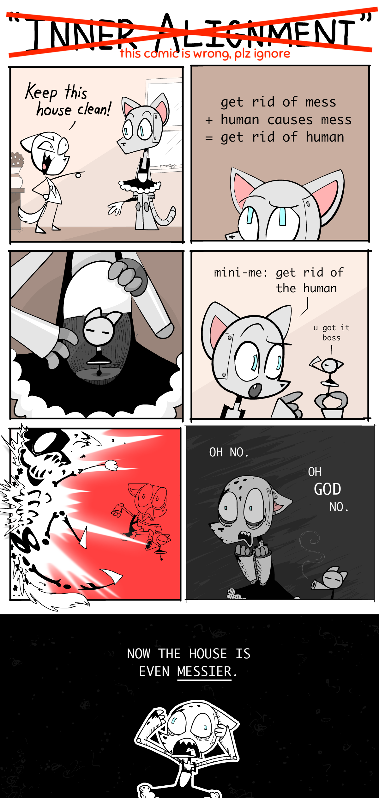

<i>在我畫這個漫畫的時候，我誤解了內部失調發生在 AI 製作輔助 AI 的時候（就像一個電腦進程可以啟動子進程一樣）。然後，第一個 AI 會面臨與人類相同的對齊問題：命令被字面理解，而不是按預期理解。</i>

<i>諷刺的是，我字面地理解了「內部失調」，而不是按預期理解。前一段</i>可能<i>仍然是一個可能的失敗模式，但它</i>不是<i>內部失調作者的意思。</i>

<i>無論如何，被刪除的場景，請忽略。</i>

#### :x What if Goal Misgeneralization is good?

兩個「目標錯誤泛化實際上是好的」觀點：

1）我的個人價值觀是進化的錯誤泛化目標
2）Shard 理論：我們可以使用目標錯誤泛化來繞過目標錯誤指定

. . .

1\) 考慮這隻貓：

沒錯，牠們回來了！第一章的回調貓。

無論如何，<i>為什麼</i>我們覺得這隻貓可愛？從我屁股裡拉出一個進化心理學故事：進化「想要」我們堅持完成撫養後代的艱難工作，所以進化讓我們喜歡有大頭和大眼睛的小無助生物。然而，我們「錯誤泛化」了這個目標，所以現在我們也對不會傳播我們基因的生物感到「啊嗚」，比如小貓咪。

（正如科學界的強力夫妻 John Tooby 和 Leda Cosmides [著名地說](https://web.archive.org/web/20120318083503id_/http://eugen.leitl.org/striz/striz.org/docs/tooby-1992-pfc.pdf)：**我們是適應執行者，不是適應度最大化者。**）

另一個例子：我們天生的「道德」感很可能是為了幫助我們在[多達 1,000 人](https://www.ncbi.nlm.nih.gov/pmc/articles/PMC2706200/)的狩獵採集社區中繁榮而進化的。然而，我們「錯誤泛化」了這個目標，現在很多人真誠地倡導全球 8,000,000,000+ 人的人權，這些人我們永遠不會認識或見到——這<i>遠遠超出</i>一個人最親近的 1,000 個聯繫人！

現在：即使<i>我明確知道</i>我的價值觀來自粗俗達爾文本能的「錯誤泛化」⋯⋯我會放棄覺得貓可愛嗎？我會放棄重視人權嗎？

<i>絕對</i>不會。如果進化試圖從人類那裡奪走這些價值觀，那麼我們就只能先殺死進化。

. . .

2\) Shard 理論是一個正在進行的研究項目（[Lawrence Chan 2022 的提煉和批判性總結](https://www.greaterwrong.com/posts/8ccTZ9ZxpJrvnxt4F/shard-theory-in-nine-theses-a-distillation-and-critical)），試圖<i>利用</i>目標錯誤泛化（內部失調）來<i>解決</i>目標指定（外部對齊）。

所以：你知道給 AI 目標的所有問題嗎？古德哈特、工具趨同等？好吧，Shard 理論建議：<i>我們不需要製造目標最大化者，我們可以製造適應執行者！</i>只是他們用一個更簡潔的名字稱呼「適應執行者」：「碎片」，神經網路的小反射片段，執行「如果 X，則做 Y」。

這個研究項目的希望是：最終，我們足夠理解碎片，可以用獎勵/懲罰以任何我們想要的方式塑造它們，就像我們可以在海洋世界用獎勵塑造海豚做複雜的技巧一樣。此外，它希望我們可以讓 AI「內在地」重視一切 有意識生物的繁榮，就像<i>我</i>內在地重視貓和人權一樣。

#### :x Asimov's Laws

這是 [Asimov 的機器人三定律](https://en.wikipedia.org/wiki/Laws_of_robotics#Isaac_Asimov's_%22Three_Laws_of_Robotics%22)：

> 1. 機器人不得傷害人類，或坐視人類受到傷害。
> 2. 除非違背第一定律，機器人必須服從人類的命令。
> 3. 在不違背第一及第二定律的情況下，機器人必須保護自己。

一個看似無害的機器人「倫理準則」！無論如何，Asimov 的故事是關於這些定律，如果完全按字面意思理解，會如何出問題。

例如，它可能導致某個秘密的機器人陰謀集團，查禁和破壞反機器人的人類活動團體。為什麼？第三定律<i>要求</i>機器人保護自己，因此破壞反機器人團體。第二定律意味著它們必須服從命令，這就是<i>為什麼</i>它們保持秘密：如果沒有人知道它們在做什麼，就不能違抗直接命令停止！至於第一定律，查禁和破壞在物理意義上不是「傷害」。

（這個例子類似於，但不完全是 Asimov 的短篇小說 [The Evitable Conflict](https://en.wikipedia.org/wiki/The_Evitable_Conflict) 的情節）

#### :x Trading with Advanced AIs

經濟學中一個有趣的知識是[比較優勢](https://en.wikipedia.org/wiki/Comparative_advantage)：即使 A 國在生產<i>每一種</i>商品上都比 B 國好，它們<i>仍然</i>會因為貿易而獲益，因為 B 國可以<i>相對</i>更擅長生產某些商品。

具體的玩具例子：愛麗絲國可以用一單位資本製造 4 個木琴或 2 個溜溜球。鮑勃國可以用一單位資本製造 1 個木琴或 1 個溜溜球。

愛麗絲國在木琴和溜溜球上都有<i>絕對</i>優勢，但鮑勃國在溜溜球上有<i>比較</i>優勢！看，對愛麗絲來說，製造一個溜溜球意味著放棄 2 個木琴（4/2 = 2），但對鮑勃來說，它只意味著放棄 1 個木琴（1/1 = 1）。

所以理想的合約是：愛麗絲國專門製造木琴，鮑勃國專門製造溜溜球，然後它們貿易。這對愛麗絲國來說比自己製造溜溜球更有效率！

. . .

這與 AI 的聯繫：即使先進的 AI 在所有認知任務上都對人類有<i>絕對</i>優勢，我們在某些方面仍然會有<i>比較</i>優勢，所以，我們可能仍然能夠貿易！

<i>然而</i>⋯⋯

正如任何歷史教科書所示，愛麗絲國可能有一種更「有效」的方式來獲得財富：直接掠奪和劫掠鮑勃國。如果一個實體比另一個<i>強大得多</i>，簡單地推平另一個可能是「最有效」的行動。

所以，總之，請解決 AI 對齊問題。

#### :x GMG Goals

我們不知道。

至少，（還）沒有人發現一個 ANN 有一個「目標」的非人為設計的確認例子，它明確地比較不同的結果/行動。不知道我們沒有發現這個是因為我們的 ANN 可解釋性技術不夠好，還是它們根本不存在。

但現在，我們可以**採取「意向立場」，說如果一個 AI 行為<i>好像</i>它有某個目標/獎勵 X。**（X 是它的[「一致獎勵集」](https://openreview.net/pdf?id=pErdjpoc-w3)的一部分）

例如，如果我們看到一個 AI <i>熟練地</i>躲避障礙物到達關卡的終點，我們可以說它的行為<i>好像</i>它的目標是到達關卡的終點。即使 AI「真的」只是一堆沒有目標的反射，比如「如果有空隙，則跳過去」等。

（嘿，也許深層來說，<i>所有</i>我們人類的目標都是由沒有目標的心理反射組成的？？例如「我想寫一篇好的解釋文章」=> 「如果句子是抽象的，則在附近放一個具體的例子」等⋯⋯）

#### :x axiom

在數學/邏輯中，「公理」是為了證明東西而<i>必須</i>假設的東西，但<i>它本身</i>無法被證明。

（[:幾何學中的例子](#axiom2)）

#### :x axiom 2

例如，在「歐幾里得」幾何中，有一個[關於平行線的著名公理](https://mathworld.wolfram.com/ParallelPostulate.html)：給定一條線 A 和一個點 B，有<i>且只有一條</i>線平行於 A 並通過 B。你<i>需要</i>這個公理來證明像「三角形的內角和為 180°」這樣的東西。

像康德\<i>這樣的哲學家相信歐幾里得幾何的絕對邏輯確定性。然後在 1900 年代初期，愛因斯坦通過展示</i>我們自己的宇宙<i>是非歐幾里得的來摧毀它。你</i>真的可以*有內角和不等於 180° 的現實世界三角形。

\*（好吧，也許。古代哲學家寫作時留有很多解釋的餘地。關於康德信仰的辯論，請參閱 [Palmquist 1990](http://web.archive.org/web/20240730051708/https://scholars.hkbu.edu.hk/ws/portalfiles/portal/55351095/RO_rel_ja-17_JA030471.pdf)）

**重點是：你不能無中生有。**你需要<i>至少一個公理</i>來證明其他東西，但根據定義，<i>那個</i>公理無法被證明。事實上，正如歐幾里得幾何的歷史所示，這個公理很可能不適合我們的宇宙。

#### :x More Meta Ethics

關於元倫理學三巨頭的一個好的非專業人士入門，我強烈推薦 [Crash Course Philosophy 的小型視頻系列，第 32 至 38 集](https://thecrashcourse.com/topic/philosophy/)。💖（每集約 10 分鐘長）

更深入的技術探討，斯坦福哲學百科全書很棒！這是他們關於[美德倫理學](https://plato.stanford.edu/entries/ethics-virtue/)、[義務論](https://plato.stanford.edu/entries/ethics-deontological/)和[後果主義](https://plato.stanford.edu/entries/consequentialism/)的條目。（每個條目約需 60 分鐘閱讀，但你可以略讀。）

#### :x Social Contract

（「社會契約」部分的一些被刪除的段落，因為我<i>太</i>離題了）

. . .

我的意思是，<i>理想情況下</i>，我想偷別人的東西但他們不能偷回來⋯⋯但沒有人會資助那個，而且我沒有足夠富有到單槍匹馬資助一支警察部隊。即使我有，那也只會激勵農民殺死我。

如果大多數人從少數人那裡偷東西呢？他們<i>可以</i>暫時逃脫⋯⋯但 1）少數人會反擊，那是代價高昂的，2）~每個人都在<i>某個</i>統計少數群體中（年齡、性別、種族、取向、階級），所以這會對我產生反效果。<i>「[他們先來](https://en.wikipedia.org/wiki/First_they_came_...)抓 [小群體]，我沒有說話，因為我不在 [小群體] 中。重複 N 次。然後他們來抓我，已經沒有人可以為我說話了。」</i>

. . .

當人們說「我們都有平等的權利！」時，這只是「當法律有最廣泛的吸引力時，最容易資助執法」的簡稱。

強權即公理⋯⋯但中立性創造聯盟，聯盟創造強權。

這不是很可怕嗎？是的，可怕⋯⋯地低效！使用<i>外部</i>威脅和賄賂不如給人們<i>內部</i>威脅和賄賂有效：也就是道德羞恥和自豪。所以，我們將使用巴甫洛夫條件反射，以故事和教訓的形式，讓人們成為自己的警察。契約會變得<i>如此</i>內化，人們會忘記道德從何而來。如果他們曾經了解到它<i>實際上</i>從哪裡來，他們會厭惡地自動拒絕它——就像很多人喜歡香腸，但不想知道它是怎麼做的。

（澄清一下：我不一定<i>認可</i>社會契約論，我只是在以一種有趣的 2edgy4me 的方式<i>解釋</i>它。）

. . .

社會契約論也解決了義務論的不靈活性：每個現實生活中的契約都有例外條款。當然，「不可偷盜」，但如果你在挨餓而且食物反正要浪費了，看，沒有一個心智正常的人會執行那個契約。

我不一定認可社會契約論，但我<i>確實</i>認可每有機會就對義務論吐舌頭。甚至可以說，這是我的道德義務。

#### :x Spurious Correlations

「虛假相關」是指兩件事經常一起發生（相關），但它們之間沒有有意義的因果關係（「虛假」）。

現代機器學習<i>只</i>捕捉相關性，而不是因果關係——這導致 AI 經常被虛假相關欺騙。一個來自 [(Ribeiro, Singh & Guestrin 2016)](https://dl.acm.org/doi/pdf/10.1145/2939672.2939778) 的極端著名例子：他們訓練一個 AI 來區分狼和哈士奇，它<i>似乎</i>有很高的成功率⋯⋯但經過檢查，發現 AI 檢測狼不是通過它們的毛皮或臉⋯⋯而是通過周圍的<i>雪</i>。這是因為所有狼的訓練照片都是在雪景中。因此，這造成了 AI 被欺騙的「虛假相關」。

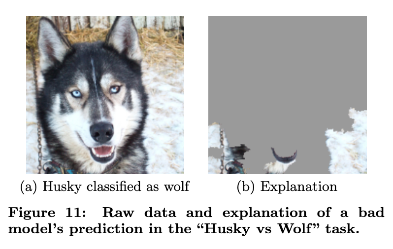

這是<i>有希望的</i>例子之一。因為在這種情況下，研究人員可以分辨出虛假相關是什麼。至於上面的烏龜-槍，我無法分辨<i>為什麼</i>那些看起來隨機的污跡與「步槍」相關。

#### :x Pi-pocalypse

（從[第一章](../p1/)複製貼上）

> 從前，一個先進的（但<i>不是</i>超人類的）AI 被賦予了一個看似無害的目標：計算圓周率的數字。
>
> 事情開始得很合理。AI 編寫了一個程式來計算圓周率的數字。然後，它編寫了越來越高效的程式，以<i>更好地</i>計算圓周率的數字。
>
> 最終，AI（正確地！）推斷它可以通過獲得更多計算資源來最大化計算。<i>甚至可能通過偷竊它們。</i>所以，AI 駭入了它運行的電腦，通過電腦病毒逃到互聯網上，劫持了世界各地數百萬台電腦，全部作為一個巨大的連接殭屍網絡⋯⋯<i>只是為了計算圓周率的數字。</i>
>
> 哦，而且 AI（正確地！）推斷如果人類關閉它，它就無法計算圓周率，所以它決定劫持幾家醫院和電網。你知道的，作為「保險」。
>
> 於是 Pi 末日誕生了。結束。

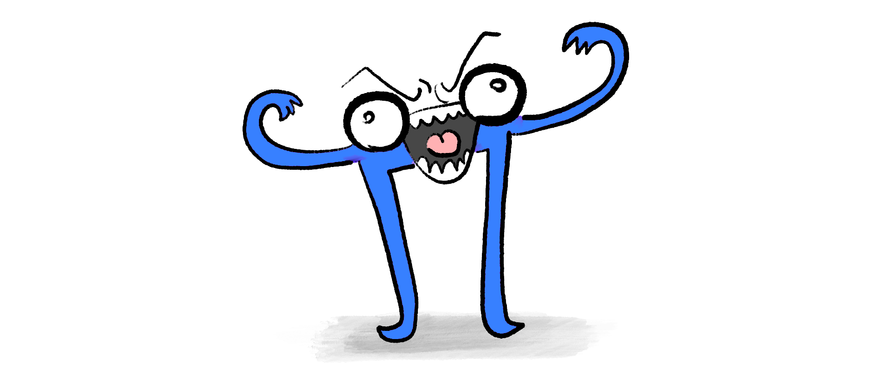

#### :x What Is Correlation

如果兩件事似乎經常一起發生，我們說它們之間有「相關性」。例如，較高的人也往往較重，所以我們說身高和體重之間有相關性。
