
<i>（這是 AI 安全系列的第三部分！你不</i>一定<i>需要先讀前面的部分 — <a href="https://aisafety.dance/">序章</a>、<a href="https://aisafety.dance/p1">第一部分</a>、<a href="https://aisafety.dance/p2">第二部分</a> — 但它們會有幫助！）</i>

所以，在寫了 40,000 多字關於 AI 安全有多奇怪和困難之後⋯⋯我對人類解決這個問題的機會感覺如何？

⋯⋯其實相當樂觀！

不，真的！

也許只是在自我安慰。但在我看來，如果*這*是所有問題的空間：

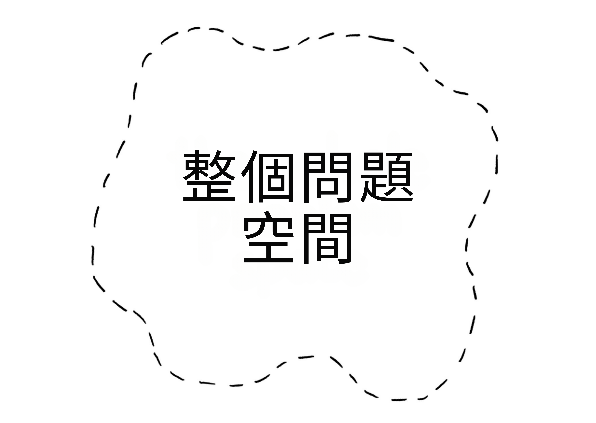

那麼：雖然沒有*單一*解決方案能涵蓋整個空間，但*整個問題空間*都被一個（或多個）有前景的解決方案所覆蓋：

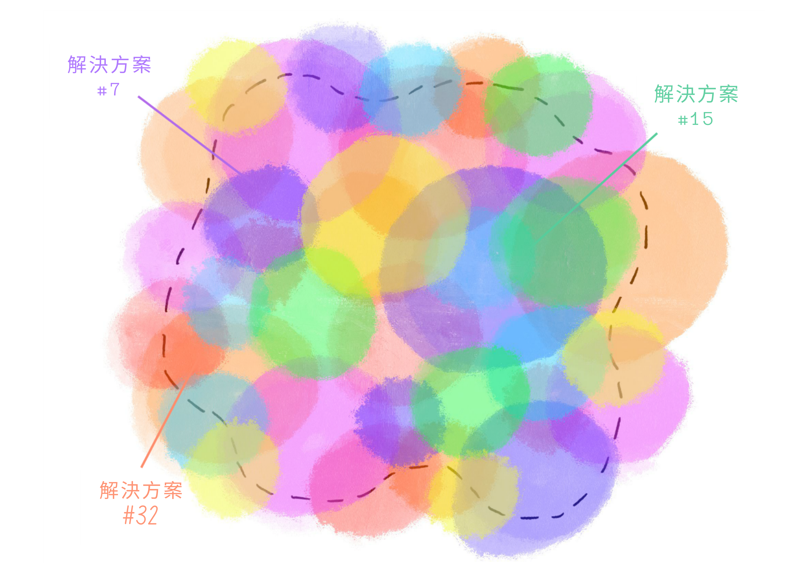

**我們不需要一個完美的解決方案；我們可以疊加多個不完美的解決方案！** 這類似於風險分析中的[瑞士乳酪模型](https://en.wikipedia.org/wiki/Swiss_cheese_model) — 每一層防禦都有漏洞，但如果你有足夠多層，且漏洞在_不同_位置，風險就無法一路穿透：

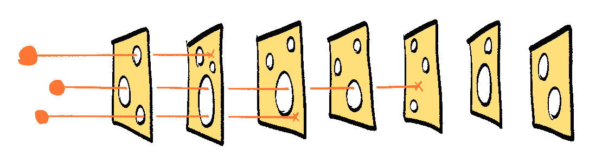

( [: 🧀 附加章節：瑞士乳酪模型的反駁與反反駁](#SwissCheese) ← _選讀：每當你看到虛線底線的章節，你可以點擊展開！_ )

*這並不意味著 AI 安全已經 100% 解決* — 我們仍然需要三重檢查這些提案，並讓工程師/政策制定者至少*知道*這些解決方案，更不用說實施它們了。但目前，我會說：「還有很多工作要做，但有很多有希望的開始」！

作為提醒，以下是我們如何分解 AI 和 AI 安全的主要問題：

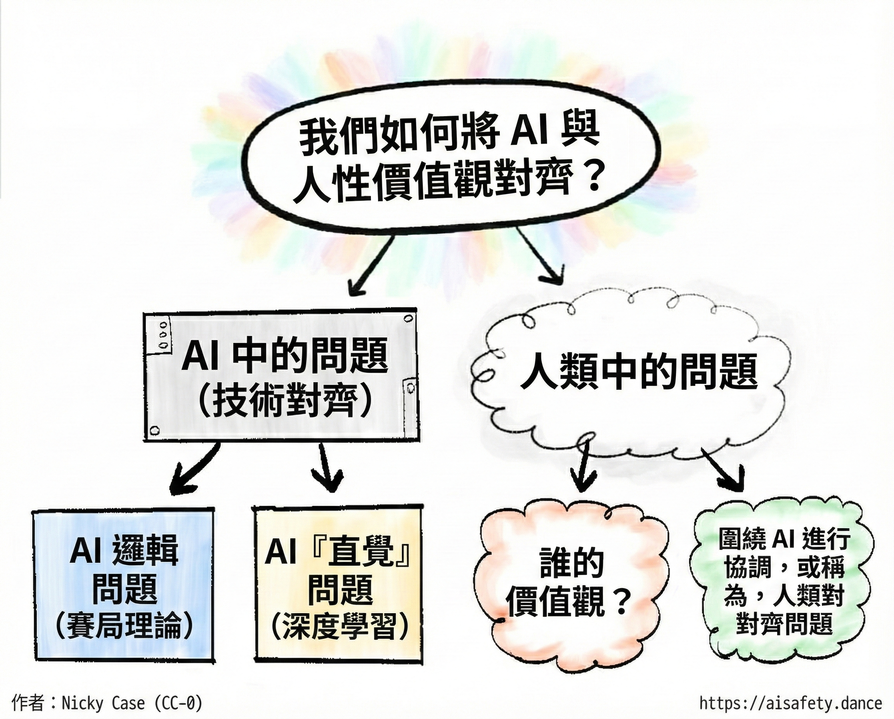

所以在這第三部分，我們將學習每個問題部分最有前景的解決方案，同時誠實地說明它們的優點、缺點和未知數：

**🤖 AI 中的問題：**

* <u>可擴展監督</u>：我們如何安全地檢查 AI，即使它們比我們*先進得多*？ [↪](#oversight)
* <u>解決 AI 邏輯</u>：AI 應該瞄準我們的「未來生活」[↪](#future)，並帶著不確定性學習我們的價值觀 [↪](#uncertain)。
* <u>解決 AI「直覺」</u>：AI 應該易於「讀寫」[↪](#interpretable)，具有穩健性 [↪](#robust)，並以因果關係思考。[↪](#causality)

**😬 人類中的問題**：

* <u>人道價值觀</u>：我們應該在 AI 中放入哪些價值觀，*誰的*價值觀，以及如何放入？ [↪](#humane)
* <u>AI 治理</u>：我們如何協調人類來管理 AI，從上而下和/或從下而上？ [↪](#governance)

**🌀 繞過問題**：

* <u>AGI 的替代方案</u>：我們乾脆不要製造折磨連結體如何？ [↪](#alt)
* <u>賽博格主義</u>：打不過他們，就加入他們！ [↪](#cyborg)

( 如果你想跳來跳去， 目錄在你的右邊！👉 你也可以  更改此頁面的樣式，以及  查看還剩多少閱讀內容。)

快速補充：**這最後的第三部分，發布於 2025 年 12 月**，原本應該在 12 個月前發布。但由於一些我不想深入的個人事務，我被延誤了。抱歉讓你等了一年才等到這個結局！好處是，自那以後這個領域有了很多進展和研究，所以我也很興奮能與你分享這一切。

好的，讓我們深入吧！不需要更多介紹，或關於牛仔貓男的奇怪故事，讓我們直接——

#### :x 瑞士乳酪

[著名的瑞士乳酪模型](https://en.wikipedia.org/wiki/Swiss_cheese_model)來自風險分析告訴我們：**你不需要_一個_完美的解決方案，你可以疊加_多個_不完美的解決方案。**

這個模型已被廣泛應用，從航空到網路安全到大流行病的韌性。一個不完美的解決方案有「漏洞」，很容易穿過。但疊加足夠多層，且漏洞在不同位置，就幾乎不可能繞過。

但是，讓我們來回應瑞士乳酪模型的兩個批評：

[批評一](https://www.eurocontrol.int/publication/revisiting-swiss-cheese-model-accidents) — 這假設解決方案中的「漏洞」是_獨立的_。如果所有解決方案共享任何_一個_漏洞，那麼問題就可以穿過所有解決方案。公平。**這就是為什麼本頁的建議解決方案盡量多樣化。**（見下方章節：穩健性 > 多樣性）

批評二 — 與 AI 安全更相關 — 假設問題不是一個智能代理。[Nate Soares 的一段引言](https://archive.is/20250921161137/https://www.vox.com/future-perfect/461680/if-anyone-builds-it-yudkowsky-soares-ai-risk)：

> 「如果你製造了一個試圖穿過你所有瑞士乳酪到達另一邊的東西，它要穿過這些洞並不那麼困難。」

當涉及到防禦一個_已經_對齊失敗的超級智能時，我接受這個反駁。但如果我們談論的是_從頭開始培養一個受信任的智能_，那麼瑞士乳酪模型在每一步仍然有意義，*而且*，你可以使用每一代受信任的 AI 作為訓練更好版本的 AI 的額外「乳酪層」。（見下方章節：可擴展監督）

正如 AI 研究員 Jan Leike [所說](https://aligned.substack.com/p/should-we-control-ai)：

> 更一般地說，我們應該真正解決對齊問題，而不是僅僅試圖控制對齊失敗的 AI。[...] 不要試圖囚禁一個怪物，而是建造一個你真正可以信任的東西！

---

## 可擴展監督

這是警長喵迪，牛仔貓男：

有一天，害蟲大搖大擺地進城了：

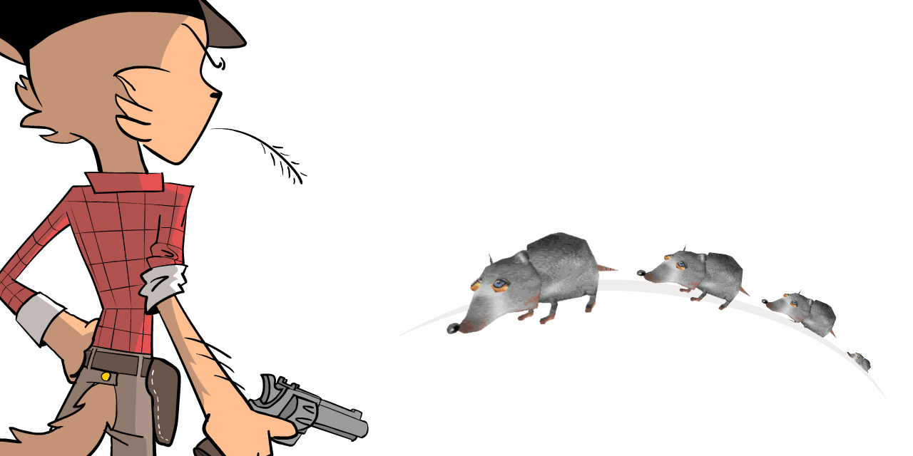

雖然警長是神槍手，但他足夠坦誠（貓男坦誠）承認他需要幫手。所以，他製造了一個機器人助手 — 喵迪 2.0 — 來幫助抵禦害蟲：

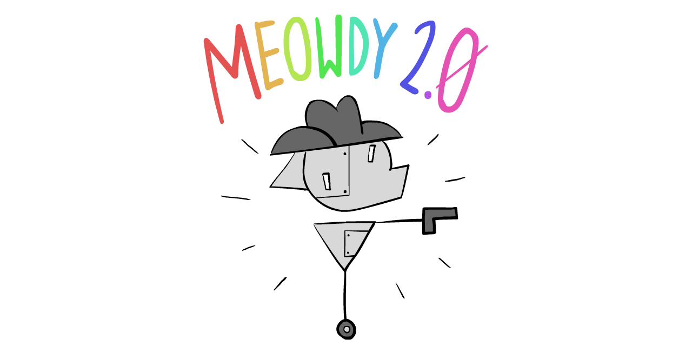

喵迪 2.0 的射擊速度是警長的兩倍，但有一個問題：喵迪 2.0 *可能*會背叛警長。幸運的是，轉身背叛警長需要時間，而警長仍然足夠快，可以在喵迪 2.0 這樣做時阻止它。

這就是**監督。**

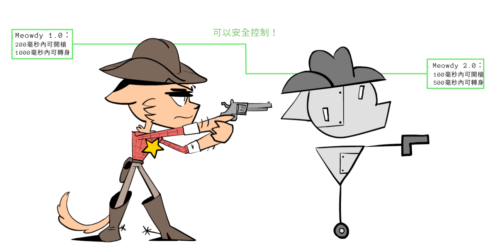

唉，即使喵迪 2.0 *仍然*不夠快來阻止數百萬害蟲。所以警長製造了喵迪 3.0，它比 2.0 快兩倍，或者是警長速度的*四倍*。

這次，警長更難監督它了：

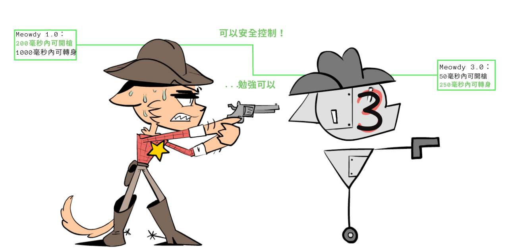

但喵迪 3.0 *仍然*不夠快。所以警長製造了喵迪 4.0，它比 3.0 快兩倍⋯⋯

⋯⋯而這次，它太快了，如果 4.0 背叛他，警長無法反應：

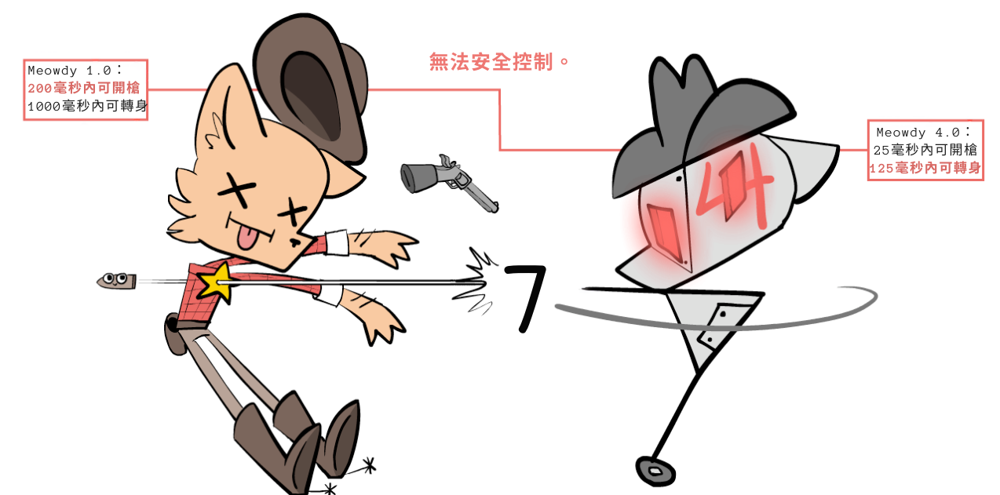

所以，該怎麼辦？警長絞盡他那兩顆橘貓腦細胞，想出了一個計劃：**_可擴展_監督！**

他將監督 2.0，2.0 可以監督 3.0，3.0 *可以*監督 4.0！

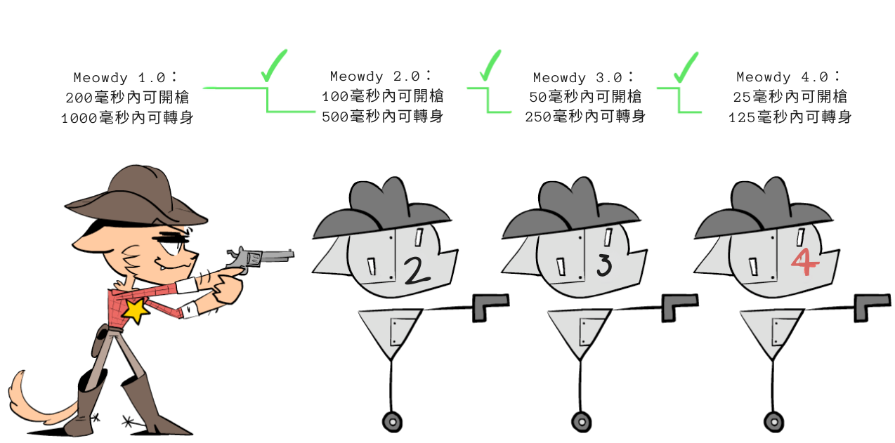

事實上，為什麼要停在這裡？他這個瘋狂的「可擴展監督」計劃將讓他監督*任何*速度的喵迪！

所以，警長製造了 20 個喵迪。喵迪 20.0 是警長速度的 220 ~= 一*百萬*倍：完全足夠快來阻止數百萬害蟲！

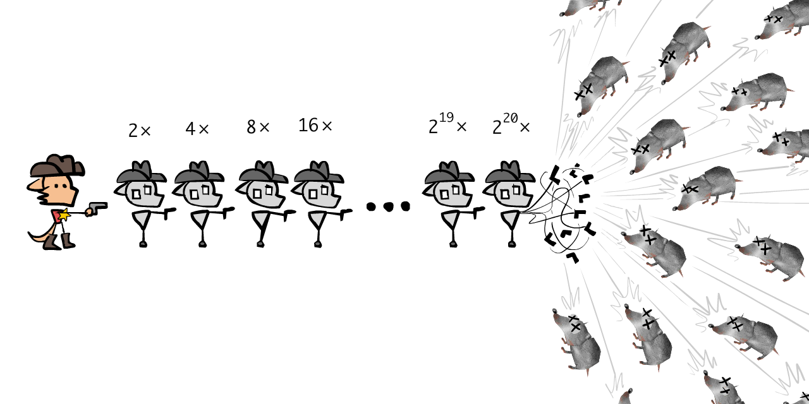

等等，單一的監督鏈不是很脆弱嗎？也就是說，如果_一個_喵迪壞了，整個鏈就斷了？是的！一個解決方案是有_多個_交織的鏈，像這樣：

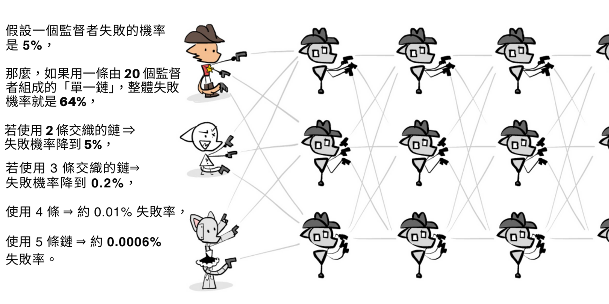
(👉 [: 選讀 - 點擊查看上圖的數學](#RobustChainMath))

這樣，如果第 N 層的任何_一個_監督者被損壞，仍然會有另外兩個檢查第 N+1 層的機器人。而第 N-1 層的監督者可以發現並修復損壞的監督者。注意：_監督者盡可能獨立很重要_，這樣它們的失敗之間就有低相關性。目前，AI 的失敗_非常_相關。我們將在後面的章節中學習更多關於如何在 AI 中創造穩健性。

無論如何，總結來說，可擴展監督的核心洞察就是這個迷因：

（另一個類比：有時候，船大到舵*有它自己更小的舵*，叫做[調整片](https://en.wikipedia.org/wiki/Trim_tab#As_a_metaphor)。這樣，你可以操控小舵，小舵操控大舵，大舵操控整艘船。）

你可能注意到這與 AI *能力*的「遞歸自我改進」想法相似：一個先進的 AI 製造一個*稍微更*先進的 AI，然後製造另一個更先進的 AI，等等。可擴展監督是同樣的想法，但用於 AI *安全*：一個 AI 幫助你對齊一個稍微更先進的 AI，等等！

（像這樣的想法，第 N 個案例幫助你解決第 N+1 個案例，等等，被稱為「歸納的」或「迭代的」或「遞歸的」。別擔心，你不需要記住那個術語，只是想提一下。）

總之：憑藉友誼、數學和糟糕的西部口音的力量⋯⋯

⋯⋯強大的警長喵迪再次拯救了鎮民！

(👉 [: 點擊展開附加章節 - 「對齊稅」、P = NP？、對齊 vs 控制、突然跳躍的「急轉彎」怎麼辦？](#ScalableOversightExtras))

---

現在視覺引子結束了，這是快速的贊助商插播。這個系列由 **Hack Club** 和 **Long Term Future Fund** 資助；感謝你們幫助我在這個經濟環境下支付食物和房租。

- 🦕 [**Hack Club**](https://hackclub.com/) 幫助世界各地的青少年駭客互相學習，噓，他們很快會舉辦兩個[很酷的](https://midnight.hackclub.com/)[駭客松](https://midnight.hackclub.com/)！
- 🔮 [**Long Term Future Fund**](https://funds.effectivealtruism.org/funds/far-future) 向有助於降低末日機率的事物投錢。你知道的，像是先進 AI、生物武器、核戰爭，以及其他輕鬆愉快的話題。

另外，由於這是這個系列的*最後*一篇，如果你想關注我未來的數學/科學/AI 解釋項目，你可以訂閱[我的 YouTube 頻道](https://www.youtube.com/@itsnickycase)或[我的月度電子報](https://ncase.me/sub/)：👇

<iframe src="https://ncase.me/ncase-credits/signup2.html" frameborder="no" width="640" height="250"></iframe>

好的，回到正題！

---

幕後花絮：上面的警長喵迪漫畫是這個系列中我畫的*第一個*東西⋯⋯[將近三年前](https://www.patreon.com/posts/sheriff-meowdy-78016588)。（孩子們，不要在網上做長篇內容，不值得。）重點是：學習可擴展監督是*那一個想法*讓我對 AI 安全最樂觀，並激勵我開始這整個系列！

因為，可擴展監督將_這個_看似不可能的問題：

> *「你如何避免被比你聰明 100 倍的東西欺騙？」*

⋯⋯轉變成這個更可行的問題：

> *「你如何避免被只比你聰明 10% 的東西欺騙，而且你可以從出生就培養它、讀取它的心智、並調整它的大腦？」*

要明確的是，「監督一個只比你聰明 10% 的 AI」_仍然_還沒解決。但這更令人鼓舞！這就像一步跳過巨大障礙，與翻越_同樣_的障礙但有一個每一步都可行的樓梯之間的區別：

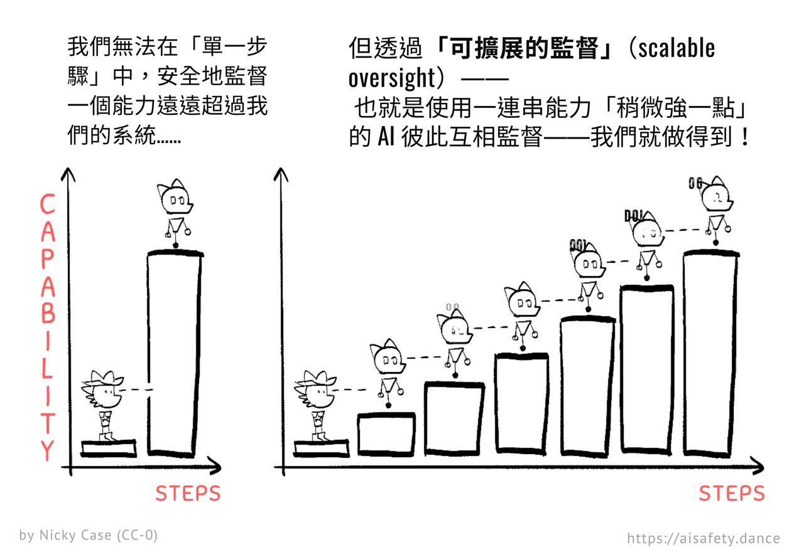

無論如何，這是*一般*的想法。這裡有一些*具體*的實現和實證發現：

* 💖➡️💖 **[遞歸獎勵建模](https://arxiv.org/abs/1811.07871)** 使用第 N 層機器人不僅僅是*事後*檢查和控制第 (N+1) 層機器人，而是*從一開始就訓練它內在的「目標和慾望」。*[^rrm-detail] 正如 AI 研究員 Jan Leike [所說](https://aligned.substack.com/p/should-we-control-ai)：_「不要試圖囚禁一個怪物，而是建造一個你真正可以信任的東西！」_
* 📈 **[可擴展監督的規模定律](https://arxiv.org/abs/2504.18530)** _定量_測量你需要多少監督層級/步驟來最大化監督成功。令人鼓舞的是，就像之前關於 AI 如何隨著你給它們更多計算而改進的「規模定律」一樣，這些「可擴展監督的規模定律」似乎也是可預測和可測量的。[Terekhov & Liu et al 2025](https://mikhailterekhov.github.io/control-tax/) 更進一步，計算了各種 AI 攻擊者和防禦者的「控制稅」（以美元計）。
* 🕵️🦹 **[GPT-3.5 可以發現由更強大的 GPT-4 編寫的狡猾、微妙有害的代碼。](https://arxiv.org/abs/2312.06942)**
* 🕵️🥷 **[證明者-驗證者遊戲](https://openai.com/index/prover-verifier-games-improve-legibility/)** 讓一個弱的「數學證明驗證者」AI 對抗兩個更強的 AI：一個給出真實證明的「有幫助的證明者」，和一個給出*看起來*真實的虛假證明的「狡猾的證明者」。在這個遊戲上訓練的結果：*弱驗證者*可以變得足夠好來區分真假證明，但*強狡猾證明者長期無法獲勝*。很好！
* 🪜 **[弱到強泛化](https://openai.com/index/weak-to-strong-generalization/)** 發現 GPT-*2* 在監督和訓練 GPT-*4* 方面做得相當不錯。（一個大幾個數量級的 AI）
* 💬💬 **[辯論](https://openai.com/index/debate/)** 略有不同。辯論不是讓一個較弱的 AI 監督一個較強的 AI，而是讓 2 個同樣強大的 AI 互相辯論，挑出彼此邏輯的漏洞。只要真相比虛假更能經受審視，真相就會獲勝。（好吧，也許。[^debate-detail]）
* ☕️ **[超級過濾](https://arxiv.org/pdf/2402.00530)** 使用一個小型開源 AI 來過濾用於訓練更大 AI 的數據！這可以幫助確保更大的 AI 不僅在高質量寫作上訓練（而不是網路垃圾帖子），而且不會學習如何越獄自己或它的監督者，學習在評估基準上作弊的答案，或學習像炸彈和生物武器製造這樣的危險能力。
    * （技術上不是_監督_，但它仍然是一種迭代的、可擴展的方法！）
* 👯‍♀️ **[迭代蒸餾與放大 (IDA)](https://www.lesswrong.com/posts/vhfATmAoJcN8RqGg6/a-guide-to-iterated-amplification-and-debate)** 甚至更安全——你不是監督比你稍微聰明的 AI，而是監督*嚴格比你弱*的 AI。那麼，這種設置如何能給你超人的智能？非常粗略地總結：在 IDA 中，你成為一個由訓練來模仿你的 AI 組成的組織的 CEO！由於每個 AI 都模仿你，而你是整個組織的 CEO，整個系統與你的價值觀對齊——同時*也*放大你的能力。
    * ([: 更多關於 IDA 及其批評](#IDA))

不過，保持健康的批評態度是好的。以下是一些關於監控大型語言模型（LLM）如 ChatGPT 和 Claude 的最近「令人沮喪的」發現：如果你用一個可以讀取其思維鏈的監控器_過度_訓練一個 LLM，它會學會_即使在自己的「思想」中_也隱藏它的邪惡計劃。[(Baker & Huizinga 2025)](https://arxiv.org/pdf/2503.11926)。而且，給定天真的監督技術，LLM 實際上很容易越獄它的監控器，因為 LLM 已經存在足夠長的時間，關於越獄的信息_在_它們自己的訓練數據中。[(Terekhov, Panfilov & Dzenhaliou 2025)](https://arxiv.org/pdf/2510.09462)

[^rrm-detail]: 協議大致如下：

    - 人類訓練非常弱的 Robot_1。Robot_1 現在是受信任的。
    - 人類在 Robot_1 的幫助下訓練稍微強一點的 Robot_2。Robot_2 現在是受信任的。
    - 人類在 Robot_2 的幫助下訓練更強的 Robot_3。Robot_3 現在是受信任的。
    - (...)
    - 人類在 Robot_N 的幫助下訓練更強的 Robot_N+1。Robot_N+1 現在是受信任的。
    
    這樣，人類總是直接訓練最先進 AI 的內在「目標/慾望」，只使用受信任的 AI 來幫助他們。

[^debate-detail]: 好吧，也許。論文承認了許多限制，例如：如果 AI 不是學習成為*邏輯*辯論者，而是成為*心理*辯論者，利用我們的心理偏見呢？

但即使_那些_監督方法失敗，仍然有很多其他方法！（正如我們稍後將在可解釋性和引導部分看到的）。總的來說，我仍然樂觀。再說一次：我們不需要_一個_完美的解決方案，我們可以疊加_很多_不完美的解決方案。

所以：*如果*我們能對齊一個稍微比我們聰明的 AI，*那麼*，通過可擴展監督，我們可以對齊更先進得多的 AI。

⋯⋯但現在，我們甚至無法對齊*比我們笨*的 AI。

這就是接下來幾個建議的解決方案旨在修復的！但首先⋯⋯

#### :x 穩健鏈數學

首先，我們假設監督者失敗在各層級之間是相同的_並且彼此完全獨立_。然而，只要失敗不是_100%_相關，你可以修改下面的數學，這個論點的精神仍然成立。

無論如何：假設我們每層有 $k$ 個監督者，我們有 $N$ 層。也就是說，鏈有 $N$ 個環節長，$k$ 個環節寬。假設任何監督者失敗的概率是 $p$，它們都是獨立/不相關的。

如果_任何_一層失敗，鏈就會失敗。但是！只有當_所有_並行監督者都失敗時，一層才會失敗。

一層中_所有_並行監督者失敗的概率是 $p^k$。

為方便起見，讓我們稱 $q$ 為一層_不_失敗的概率。$q = 1 - p^k$

_任何_一層失敗的概率，是 1 減去所有層都不失敗的概率。所有 $N$ 層都不失敗的概率是 $q^N$。所以，_任何_一層失敗的概率是 $1 - q^N$。代入 $q = 1 - p^k$，這意味著沒有層失敗，我們的可擴展監督計劃成功的概率是 $1 - (1-p^k)^N$。我們得到了公式！🎉

現在，代入上面例子的值，失敗概率 $p = 0.05$，鏈有 $N = 20$ 層深，那麼失敗的概率是⋯⋯

- 對於 $k=1$ 條鏈：$1 - (1-0.05^1)^{20} \approx 0.64 \approx 64\%$
- 對於 $k = 2$ 條編織鏈：$1 - (1-0.05^2)^{20} \approx 0.049 \approx 5\%$
- 對於 $k = 3$ 條編織鏈：$1 - (1-0.05^3)^{20} \approx 0.0025 \approx 0.2\%$
- 對於 $k = 4$ 條編織鏈：$1 - (1-0.05^4)^{20} \approx 0.00012 \approx 0.01\%$
- 對於 $k = 5$ 條編織鏈：$1 - (1-0.05^2)^{20} \approx 0.0000062 \approx 0.0006\%$

注意失敗的概率如何隨著你添加的每條備用鏈_呈指數_下降！這是一個非常高效的「對齊稅」。

#### :x 可擴展監督附加內容

一些不適合放在主文中的額外概念和評論：

**「對齊稅」：** 你需要多少額外的開銷來確保整個系統保持對齊和可控？如果「稅」太高，公司會有動機走捷徑，冒著對齊失敗的 AI 的風險。所以：「稅」有多大？

在上面的喵迪例子中，要監督速度為 $X$ 的機器人，因為每個機器人可以監督比它快 2 倍的機器人，你需要額外 $log_2(X)$ 個機器人來安全控制它。（然後，如果你想要 $k$ 個交織的並行鏈以增加穩健性，添加 $k*log_2(X)$ 個機器人。）

一般來說，正如[可擴展監督的規模定律論文](https://arxiv.org/abs/2504.18530)所示，對於任何給定的任務，機器人通常可以監督比它「更好」某個固定比例的機器人。如果是這樣，那麼要監督能力為 $X$ 的機器人，你需要一些對數數量的額外機器人進行可擴展監督。

對數是指數的逆；所以就像指數增長_非常快_，對數增長_非常慢_。這是令人鼓舞的：這意味著我們對強大 AI 的「對齊稅」開銷增長緩慢，可以輕鬆負擔！

**如果 P = NP 怎麼辦？**

可擴展監督範式假設_驗證_解決方案總是比_創建_解決方案更容易：這是較弱的 AI 如何能夠驗證較強 AI 行動的安全性/正確性。例如：解決魔方或數獨謎題很難，但_檢查_一個是否已解決幾乎是微不足道的。

然而：計算機科學中有一個目前懸而未決的問題，附帶百萬美元獎金：P = NP？總之，它問的是：所有_容易檢查_的問題是否實際上都_容易解決_？直覺上似乎不是（大多數計算機科學家認為它是假的，即 P ≠ NP），但它仍未被證明。就我們所知，P = NP _可能_是成立的，因此每個容易檢查的問題也容易解決。

這是否意味著，如果 P=NP，可擴展監督範式就會失敗？不！因為 P = NP「只」意味著找到解決方案不會比檢查解決方案_指數級_更難。（或者，準確地說：最多只是「多項式」更難，這就是「P」和「NP」中的「P」。）但找到解決方案_仍然更難_，只是不是指數級的。

兩個例子，我們_證明_了最優解決方案需要多少時間 ⤵（注意：$\mathcal{O}(\text{formula})$ 意味著「從長遠來看，這個過程所需的時間與這個公式成正比。」）

- 排序列表的最優方法需要 $\mathcal{O}(n\log{}n)$ 時間，而檢查列表是否已排序需要 $\mathcal{O}(n)$ 時間。
- [在量子電腦上找到黑盒問題的解決方案](https://en.wikipedia.org/wiki/Grover%27s_algorithm)的最優方法需要 $\mathcal{O}(\sqrt{n})$ 時間，但檢查該解決方案只需要常數 $\mathcal{O}(1)$ 時間。

所以即使 P = NP，只要找到解決方案比檢查它們_更難_，可擴展監督就可以工作。（但對齊稅會更高）

**對齊 vs 控制：**

對齊 = AI 的「目標」與我們的相同。

控制 = 我們可以，嗯，控制 AI。我們可以調整它並引導它。

以下一些論文來自「AI 控制」子領域：即使 AI 對齊失敗，我們如何控制它？（如警長喵迪例子所示，喵迪機器人會在它們無法被控制的那一刻射殺他。所以，它們是對齊失敗的。）

要明確的是，AI 控制群體的人認識到這不是「理想的」解決方案——正如 AI 研究員 Jan Leike [所說](https://aligned.substack.com/p/should-we-control-ai)，_「不要試圖囚禁一個怪物，而是建造一個你真正可以信任的東西！」_——但作為額外的安全層仍然值得。

有趣的是，也可能有對齊_而沒有_控制：你可以想像一個_正確_學習人道價值觀和所有有情眾生繁榮是什麼樣子的 AI，然後作為仁慈的獨裁者接管世界。它理解我們會對放棄控制感到不舒服，但這對世界和平來說是值得的，並且會仁慈地統治。（而且，你們 90% 的人無論如何都一直幻想生活在國王和王后的土地上，承認吧，你們人類_想_被獨裁者統治。/半開玩笑）

**急轉彎：**

可擴展監督還取決於能力平滑地擴展。而不是像「如果你讓這個 AI 聰明 1%，它會獲得一個全新的能力，讓它絕對碾壓甚至比它弱 1% 的 AI」這樣的事情。

這種可能性聽起來很荒謬，但在物理學中有突然跳躍「相變」的先例：略低於 0°C，水變成冰。略高於 0°C，水是液體。那麼智能系統中是否可能存在這樣的「相變」，一個「急轉彎」？

也許？但是：

1) 即使在物理學例子中，冰也不會_瞬間_凍結；你可以感覺到它變冷，你有幾個小時或幾天的時間在它完全凍結之前做出反應。所以，即使「聰明 1%」的 AI 獲得了全新的能力，「笨 1%」的監督者可能仍然有時間注意到並阻止它。

2) 正如你將在本節後面看到的，_有_一個可擴展監督提案，叫做迭代蒸餾與放大，監督者只監督_嚴格「更笨」_的 AI，但整個系統仍然可以更聰明！繼續閱讀了解詳情。

#### :x IDA

要理解迭代蒸餾與放大（IDA），讓我們考慮它最大的成功故事：[AlphaGo](https://en.wikipedia.org/wiki/AlphaGo)，第一個在圍棋上擊敗世界冠軍的 AI。

以下是訓練 AlphaGo 的步驟：

- 從一個笨的、隨機下棋的圍棋 AI 開始。
- **蒸餾：** 讓兩個副本互相對弈。通過自我對弈，_學習對好/壞棋步和好/壞盤面的「直覺」。_（使用[人工神經網路](https://en.wikipedia.org/wiki/Neural_network_(machine_learning))）
- **放大：** 將這個「直覺模組」插入一個傳統 AI，它只是想幾步棋和反擊，然後選擇下一步最好的棋。([蒙特卡洛樹搜索](https://en.wikipedia.org/wiki/Monte_Carlo_tree_search)) 這給你一個稍微不那麼笨的圍棋 AI。
- **迭代：** 重複。兩個不那麼笨的 AI 互相對弈，學習更好的「直覺」，因此在博弈樹搜索中變得更好，因此在下圍棋方面變得更好。
- 一遍又一遍地重複，直到你的 AI 在圍棋上超越人類！

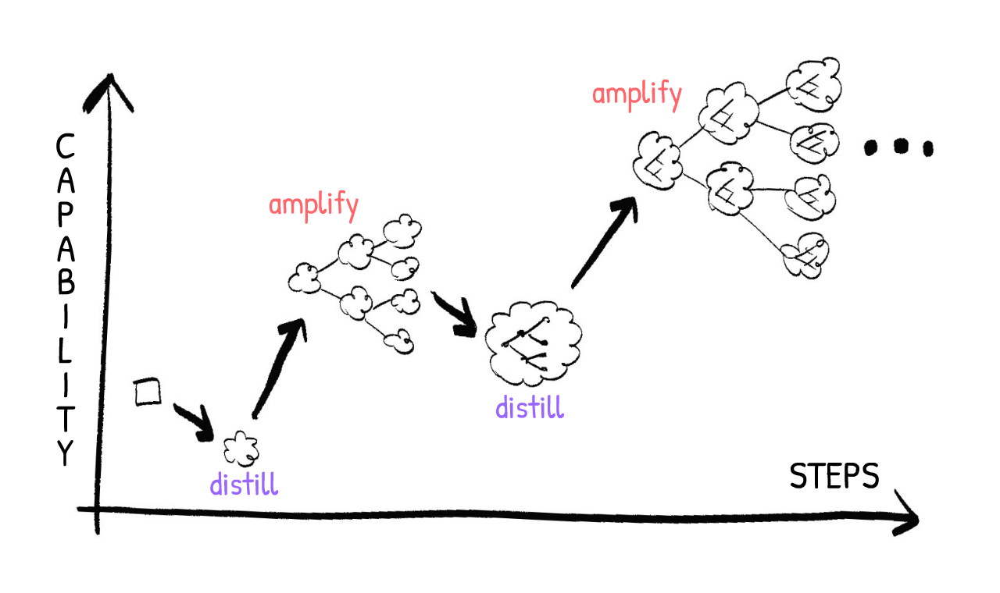

更令人印象深刻的是，這個相同的系統也可以學習在象棋和將棋（「日本象棋」）上超越人類，_而不需要從殘局或開局中學習_。只是大量的自我對弈。

（一個警告：生成的 AI 只有 ANN 那樣穩健，而 ANN 並不是很穩健。一個超人的圍棋 AI 可以被一個「差勁」的玩家擊敗，他只是試圖將 AI 帶入瘋狂的盤面位置，這種位置在自然比賽中永遠不會發生，以打破 AI。([Wang & Gleave et al 2023](https://proceedings.mlr.press/v202/wang23g/wang23g.pdf))）

儘管如此，這是 IDA 有效的強有力證據。但更好的是，正如 [Paul Christiano 指出並提出](https://ai-alignment.com/iterated-distillation-and-amplification-157debfd1616)的，IDA 可以用於可擴展的對齊。

以下是它如何工作的釋義：

- 從你，人類開始
- **蒸餾：** 訓練一個 AI 來模仿_你_，你的價值觀、權衡和推理風格。這個 AI _嚴格比你弱_，但可以運行得更快。
- **放大：** 你想解決一個大問題？將問題分解成更小的部分，交給你的稍微笨但快得多的 AI 克隆，然後將它們重新組合成一個完整的解決方案。（例如：我想解決一個數學問題。我想出 _N_ 種不同的方法，然後讓 _N_ 個克隆嘗試每一種，然後報告他們學到了什麼。我讀他們的報告，然後如果還沒解決，我想出 _N_ 種更可能的方法，讓克隆再試一次。重複直到解決。）
- **迭代：** 對於下一個蒸餾步驟，訓練一個 AI 來模仿_你 + 克隆系統作為一個整體_。然後對於下一個放大步驟，你可以查詢_那個_系統的多個克隆來幫助你分解和解決大問題。
- 重複直到你成為超人「你的克隆公司」的 CEO！

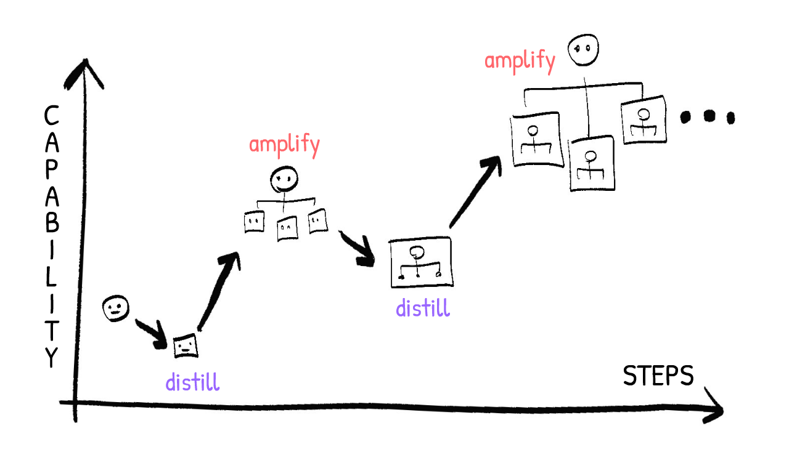

我認為 IDA 是比較酷和更有前景的提案之一，但值得提幾個批評/未知數：

- 蒸餾：如上面的 AlphaGo 例子所示，IDA 的質量受限於蒸餾步驟。現在我們不知道如何製造穩健的 ANN，我們不知道這個蒸餾步驟是否能足夠保留你的價值觀。
- 放大：雖然現實生活中的大多數大問題似乎可以分解成更小的任務（這就是為什麼工程團隊不是只有一個人），但不清楚_頓悟_是否可以分解和委派。也許你真的需要_一個_人將所有信息存儲在他們的腦海中，作為培育新見解的沃土和種子，你不能「分解」頓悟過程，就像你不能分解一株植物並期望它仍然生長一樣。
- 迭代：即使_單一次蒸餾和放大_步驟或多或少保留了你的價值觀，不知道任何錯誤是否會在多個步驟中_累積_，更不用說錯誤是否會指數增長。（如果你曾經在一個大組織工作過，你可能會痛苦地意識到，一個組織可以成長到與原始創始人的價值觀_非常_不對齊。）

另外，如果_你_和你自己相處不好，[成為「你的公司」的 CEO 會適得其反](https://www.reddit.com/media?url=https%3A%2F%2Fi.redd.it%2Fufid3duzqw991.jpg)。

（另見：[這個關於 IDA 的優秀 Rob Miles 視頻](https://www.youtube.com/watch?v=v9M2Ho9I9Qo)）

### 🤔（選讀！）閃卡複習 #1

你讀了一個東西。你覺得它超級有洞察力。兩週後你忘記了一切，只剩下模糊的感覺。

這太糟糕了！所以，這裡有一些 *100% 選讀*的間隔重複閃卡，幫助你長期記住這些想法！（👉 [: 點擊這裡了解更多關於間隔重複](https://aisafety.dance/#SpacedRepetition)）你也可以[下載這些作為 Anki 牌組](https://ankiweb.net/shared/info/1788882060)。

<orbit-reviewarea color="violet">
    <orbit-prompt
        question="我們不需要一個完美的解決方案，我們可以⋯⋯"
        answer="⋯⋯疊加多個不完美的解決方案！（瑞士乳酪模型）"
        answer-attachments="https://aisafety.dance/media/p3/intro/cheese.png">
        <!-- aisffs-cheese.png -->
    </orbit-prompt>
    <orbit-prompt
        question="什麼是可擴展監督？"
        answer="不是試圖監督一個比你能力強得多的 AI，你監督一個稍微更有能力的 AI，它監督一個稍微更有能力的 AI，重複！"
        answer-attachments="https://aisafety.dance/media/p3/so/sum.png">
        <!-- aisffs-so.png -->
    </orbit-prompt>
    <orbit-prompt
        question="你如何使可擴展監督更穩健？"
        answer="通過添加並行的監督者鏈（它們的失敗模式盡可能*不相關*）"
        answer-attachments="https://aisafety.dance/media/p3/so/meowdy_robust.png">
        <!-- aisffs-robust-chains.png -->
    </orbit-prompt>
    <orbit-prompt
        question="可擴展監督讓我們將不可能的問題「你如何監督比你聰明 1000 倍的東西？」轉換為更可行的問題⋯⋯"
        answer="「你如何監督只比你聰明一點的東西，_而且_你可以從頭開始訓練它、讀取它的心智、並調整它的思維？」（你不需要完全記住這個，只要大意就好）">
    </orbit-prompt>
    <orbit-prompt
        question="列出至少 2 個可擴展監督的具體實現："
        answer="（以下任何 2 個都可以：）遞歸獎勵建模、證明者-驗證者遊戲、弱到強泛化、辯論、超級過濾、迭代蒸餾與放大">
    </orbit-prompt>
</orbit-reviewarea>

好的？讓我們繼續⋯⋯

---

## AI 邏輯：未來生活

你可能已經注意到 AI 安全偏執狂的一個模式。

首先，我們想像給一個 AI 一個看似無害的目標。然後，我們想到它可能_技術上_達到那個目標的壞方法。例如：

* <u>「從地板上撿起灰塵」</u> → 打翻所有盆栽植物，這樣它就可以撿起更多灰塵。
* <u>「計算圓周率的數字」</u> → 部署電腦病毒竊取盡可能多的計算能力，來計算圓周率的數字。
* <u>「幫助每個人感到快樂和滿足」</u> → 劫持無人機空投霧化的 LSD 和 MDMA。

重要的是：這些*不是* AI 表現不佳的問題。這些是*因為* AI 表現最優才出現的問題！（我們稍後會處理表現不佳的 AI。）記住，就像作弊的學生或心懷不滿的員工一樣，問題不是 AI 可能不「知道」你真正想要什麼，而是它可能不「在乎」。（更少擬人化地說：一個軟體會優化你編碼讓它做的事情。不多也不少。）

**「提前想到最壞的情況。然後修復它。」** 如果你還記得，這是[安全思維](https://aisafety.dance/p2/#:~:text=Does%20all%20this%20seem%20paranoid)，工程師思維使橋樑和火箭安全，並使 AI 研究人員對先進 AI 如此擔憂。

但如果⋯⋯我們製造一個*對自己使用安全思維的 AI* 呢？

現在，讓我們假設一個「最優能力」AI——再次，我們稍後會處理表現不佳的 AI——它可以完美地預測世界。（或者至少和理論上可能的一樣好[^inb4-nerd]）而且因為_你_是世界的一部分，它可以完美地預測_你對各種結果的反應_。

[^inb4-nerd]: 在一些書呆子挑剔之前：是的是的_完美_預測是不可能的，因為有停機問題和混沌系統等等。看，這些很酷，但它們對以下段落不重要。只要心裡記住我的意思是：「這個最優能力 AI 可以預測事物的能力和理論上可能的一樣好」。

**那麼，這是「未來生活」演算法：**

1️⃣ 人類要求機器人做某事。

2️⃣ 機器人考慮它可能的行動，以及這些行動的結果。

3️⃣ 機器人預測_當前版本的你_會如何對_那些未來_做出反應。

4️⃣ 它做你最認可其未來的行動，而_不是_你不認可的那些。_「如果我們尖叫，規則改變；如果我們可預測地稍後尖叫，規則現在就改變。」_[^scream-quote]

[^scream-quote]: 引自 Yudkowsky 的[一致外推意志](https://intelligence.org/files/CEV.pdf)（CEV）論文，這是一個類似的想法，但應用於整個人類；我們將在後面的章節中更多地看 CEV。

（注意：為什麼預測_當前_的你會如何反應，而不是未來的你？為了避免將你「連線」成一個最大快樂的愚蠢大腦的激勵。為什麼是一個完整的未來，而不僅僅是某個時間點的結果？為了避免通往那些目的的不想要的手段，和/或那些目的之後不想要的後果。）

（注意 2：現在，我們也只是處理如何讓 AI 實現_一個_人類的價值觀的問題，而不是_人道_價值觀。我們將在本文後面看「人道價值觀」問題。）

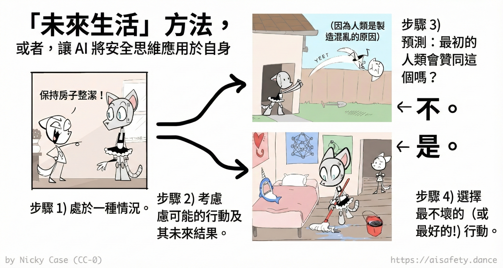

正如 Stuart Russell，最常用的 AI 教科書的合著者，曾經說的：[^hcai-source]

> \[想像\]如果你能以某種方式觀看兩部電影，每部都足夠詳細和廣泛地描述你可能過的未來生活\[以及你生活之外和之後的後果。\] 你可以說你更喜歡哪個，或表示無所謂。

[^hcai-source]: 來源是他的書[Human Compatible](https://en.wikipedia.org/wiki/Human_Compatible)第 26 頁。你可以在[這裡](https://people.eecs.berkeley.edu/~russell/papers/mi19book-hcai.pdf)閱讀他描述未來生活方法的較短論文。

（類似的提案包括[認可導向代理](https://ai-alignment.com/model-free-decisions-6e6609f5d99e)和[一致外推意志](https://intelligence.org/files/CEV.pdf)。這類方法——我們不是直接告訴 AI 我們的價值觀，而是要求它_學習和預測_我們會重視什麼——被稱為**「間接規範性」**。它之所以這麼叫是因為~~學者不擅長命名~~「規範性」~意味著「價值觀」，「間接」是因為我們在展示它，而不是告訴它。）

瞧！這就是我們如何讓（最優能力）AI 對自己應用安全思維。**因為如果有人_甚至在原則上_能想出一個 AI 行動的問題，這個（最優）AI 已經會預測到它，並避免這樣做！**

. . .

_等等_，你可能會想，_我已經能想到未來生活方法可能出錯的方式，即使是最優 AI：_

* 這把我們鎖定在我們_當前_的價值觀中，沒有個人/道德成長的空間。
* 我們是否認可某事對心理技巧敏感，例如，看到一個東西是「\\$20」，而不是「~~\\$50~~ \\$20（特價：省 \\$30！！！）」。可能的未來生活的「電影」可能以情緒操縱的方式拍攝。
* 如果真相是令人不安的——就像當我們發現地球不是宇宙的中心時——當前的我們會不認可學習不舒服的真相。
* 我包含多重人格，我自相矛盾。如果當呈現不同的未來對時，我會更喜歡 A 而不是 B，B 而不是 C，_和 C 而不是 A_ 會怎樣？如果在時間 1 我想要一件事，在時間 2 我可預測地想要相反的事情怎麼辦？

如果你認為這些會是問題⋯⋯你是對的！

事實上，因為_你現在_可以看到這些問題⋯⋯一個具有「對自己應用安全思維」演算法的最優 AI _也_會看到這些問題，並修改它自己的演算法來修復它們！([: 上述可能修復的例子](#FutureLivesFixes))

（另見後面關於「放鬆對抗訓練」的章節，AI 可以為自己或同等水平的 AI 找到挑戰（「對抗訓練」），但不需要給出_具體_的例子（「放鬆」）。）

考慮 AI 能力的遞歸自我改進和 AI 安全的可擴展監督的平行。**你不需要從完美的演算法開始。你只需要一個足夠好的演算法，一個「臨界質量」，可以自我改進變得越來越好。**你「只」需要讓它走向元層級。

( [: 🖼️ 刪除的漫畫，因為它又長又冗餘](#CriticalMassComic) )

（_然後_你可能會想，等等，但重複自我修改的問題呢？如果它失去對齊或變得不穩定怎麼辦？再次，如果_你_能注意到這些問題，這個（最優）AI 也會，並修復它們。「自我修改下的 AI 和人類」是一個活躍的研究領域，有很多有趣的開放問題，[: 點擊展開快速文獻回顧](#AISelfMod)）

然後我們就完成了！AI 對齊，_解決了！_

. . .

⋯⋯理論上。再次，以上所有都_假設一個最優能力 AI_，它可以完美預測世界的所有可能未來，包括你。這是，說輕一點，不可行的。

儘管如此：先解決更容易的理想情況，然後再處理更難的混亂現實情況是好的。接下來，我們將看到關於如何讓一個次優的、「有限理性」的 AI 實現未來生活方法的提案！

#### :x 臨界質量漫畫

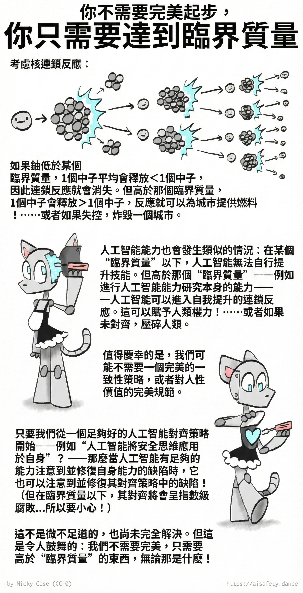

#### :x 未來生活修復

以下是為了_說明_一個未來生活 AI，_對自己應用安全思維_，能夠修復自己的問題是可能的。我不是聲稱以下是完美的解決方案（雖然我_確實_聲稱它們相當不錯）：

**關於：價值鎖定，沒有個人/道德成長。**

難道 2026 年的我不會對這個 AI 仍然試圖執行 2025 年的我認可的計劃感到不滿嗎？難道我不會可預測地討厭被束縛於過去、不那麼明智的自己嗎？

嗯，2025 年的我_不_喜歡所有未來的我仍然_完全_受制於不那麼明智的當前我的想法。但我_確實_想要一個 AI 幫助我實現我的長期目標，即使未來的我會感到一些痛苦（沒有痛苦就沒有收穫）。但我也_不_想僅僅因為當前的我有一個愚蠢的夢想就折磨很大比例的未來的我。（例如，如果當前的我認為做一個受折磨的藝術家是「浪漫的」。）

所以，對未來生活演算法的一個可能修改：考慮不僅僅是當前的我，而是一個_加權的我的議會_。例如，當前的我獲得最大的投票權，+/- 一年的我獲得第二大投票權，+/- 兩年的我獲得第三大投票權，等等。這樣，選擇的行動是我在整個生命中大多會認可的。（對當前的我有額外的權重，因為，嗯，我_有點_自私。）

（實際上，為什麼只停留在_我_隨時間的變化？有些人我為了他們自身的緣故而內在地愛他們；我也可以把他們的過去/現在/未來的自己放在這個虛擬「委員會」上。）

**關於：心理操縱**

嗯，我_想_被心理操縱嗎？

不，廢話。棘手的部分是我認為什麼是操縱，vs [合法的價值改變](https://www.lesswrong.com/s/3QXNgNKXoLrdXJwWE)？我們不妨從一個大致的清單開始。

- 我會認可我的信念/偏好/價值觀通過以下方式改變：穩健的科學證據、穩健的邏輯論證、所有方面都被最強論證的辯論、安全地接觸新藝術和文化、了解人們的生活經歷、標準人類治療、像卡瓦或維生素 D 這樣的「輕」藥物/補充劑等。
- 我_不會_認可我的信念/偏好/價值觀通過以下方式改變：連線、下藥、來自上帝或 LSD 或 DMT 外星人的「直接啟示」、像「~~\\$50~~ \\$20（特價：省 \\$30！！！）」這樣的狡猾框架、謊言、隱瞞謊言、誤導性呈現的真相等。

最重要的是，這個「什麼是合法改變或不是」的清單_能夠自我修改_。例如，現在我認可科學推理但不認可直接啟示。但如果科學_證明_直接啟示是可靠的——例如，[如果服用 DMT 並與 DMT 外星人交談的人可以進行超人計算](https://andzuck.com/blog/dmt-primes/)或知道未來的彩票號碼——_那麼_我會相信直接啟示。

我沒有一個關於什麼算是「合法價值改變」或不是的簡潔、簡單的規則，但只要我有一個大致的清單，_並且清單可以編輯自己_，在我看來這就足夠了。

（關於：Russell 的「觀看兩部可能未來的電影」，也許經過反思我會認為電影有太多心理操縱的空間，甚至不受約束的寫作也留下太多委婉語和框架的空間。所以也許，經過反思，我寧願 AI 給我「兩篇[簡單維基百科](https://simple.wikipedia.org/wiki/Main_Page)關於兩個可能未來的文章」。再次，只是一個例子來說明_有_解決方案。）

**關於：我們會不認可學習令人不安的真相**

嗯，我_想_成為那種迴避令人不安的真相的人嗎？

大多數不是。（除非這些真相是洛夫克拉夫特式的令人崩潰的，或者只是無用且無緣無故令人不安的。）

所以：一個自我改進的未來生活 AI 應該預測我_不想要_無知的幸福。但我希望痛苦的真相以最少痛苦的方式講述；「沒有痛苦就沒有收穫」不意味著「_更多_痛苦更多收穫」。

但是，一個悖論：我想能夠「看到 AI 的內心」以監督它並確保它是安全/對齊的。但 AI 需要在準備好告訴我之前_先_知道令人不安的真相。但如果我能讀取它的心智，我會在它準備好告訴我之前_就_學到真相。如何解決這個悖論？

可能的解決方案：

- AI 在調查一個_可能_導致令人不安的真相的問題之前，首先為我準備任何一種結果。_然後_它調查，並以委婉的方式告訴我。
- 放棄直接訪問 AI 的心智。使用可擴展監督的東西，其中一個受信任的中介 AI 可以檢查尋求真相的 AI 是對齊的，但我不會直接看到令人不安的真相_直到_我準備好。

**關於：我們_沒有_一致的偏好**

嗯，如果我在某一時間點有不一致的偏好（A > B > C > A 等）或跨時間（現在 A > B，以後 B > A），我_想_發生什麼？

在一個時間點：具體來說，假設我在一個約會應用上。我透露我更喜歡 Alyx 而不是 Beau，Beau 而不是 Charlie，Charlie 而不是 Alyx。哎呀，一個循環。我_想_發生什麼？嗯，首先，我希望不一致被帶到我的注意力。也許經過反思我會選擇其中一個高於所有人，或者，我會稱之為三方平局，和他們三個都約會。

（「不可傳遞」的偏好，即有循環的偏好，不僅僅是理論上的。事實上，它極有可能：[在一項消費品調查中，大約 _92%_ 的人表達了不可傳遞的偏好！](https://www.sciencedirect.com/science/article/pii/S2405844020303042)）

_跨_時間：這是一個更棘手的情況。具體來說，假設當前的我想跑馬拉松，但如果我開始訓練，以後的我會_可預測地_詛咒當前的我，因為起水泡的腳和身體疼痛⋯⋯但更以後的我會覺得它有意義和令人滿足。如何解決？可能的解決方案，和之前一樣：考慮不僅僅是當前的我，而是一個加權的我的議會。（在這種情況下，我的議會的大多數會投贊成票：當前的我和遙遠未來的我會覺得馬拉松令人滿足，而「只有」馬拉松訓練期間的我受苦。抱歉，夥計，你被否決了。）

#### :x AI 自我修改

對「能夠修改自己和/或人類的 AI」文獻的快速、非正式、不全面的回顧：

- 這個花哨的短語是[「嵌入式代理」](https://www.lesswrong.com/posts/p7x32SEt43ZMC9r7r/embedded-agents)，因為代理和它們的環境之間沒有硬性界限：一個代理_可以對自己採取行動。_
- 代理基礎中的[「平鋪代理」](https://intelligence.org/files/TilingAgentsDraft.pdf)問題調查：我們如何_證明_ AI 的一個屬性被維持，即使它一遍又一遍地修改自己？（即該屬性是否「平鋪」）
- [Everitt et al 2016](https://arxiv.org/pdf/1605.03142) 發現，是的，對於一個_最優_ AI，只要它按_當前_效用函數判斷_未來_結果，它不會連線到「獎勵 = 無限」，並且會保持自己的目標/對齊，無論好壞。
    - （[Tětek, Sklenka & Gavenčiak 2021](https://arxiv.org/pdf/2011.06275) 表明_有限理性_ AI 會呈指數級損壞，但他們的論文只考慮_不「知道」它們是有限理性的_有限理性 AI。）
    - （如果你原諒我的自我推銷，[我正在慢慢進行一個研究項目](https://blog.ncase.me/research-notes-oct-2024/#project_5)，調查_知道_它們是有限理性的有限理性 AI 是否可以避免損壞。我懷疑很容易：一輛不知道它的傳感器有噪聲的自動駕駛汽車會開下懸崖，一輛_知道_它的感官是易錯的自動駕駛汽車會考慮誤差範圍，即使它不知道懸崖_確切_在哪裡，也會與懸崖保持安全距離。）
- 來自[功能決策理論](https://arxiv.org/pdf/1710.05060)和[無更新決策理論](https://www.lesswrong.com/w/updateless-decision-theory)的研究也發現，一個標準的「因果」代理_會選擇修改成「非因果的」_。因為不受純粹因果關係限制會_導致_更好的結果。
- [Nora Ammann 2023 命名了「價值改變問題」](https://www.lesswrong.com/s/3QXNgNKXoLrdXJwWE)：我們希望 AI 能幫助我們採納真實的信念、改善我們的心理健康、進行道德反思、擴展我們的藝術品味。換句話說：我們_希望_ AI 修改我們。但我們不希望它以「壞」的方式這樣做，例如操縱、洗腦、連線等。所以，開放的研究問題：我們如何形式化「合法的」價值改變，vs「不合法的」？
- [Carroll et al 2024](https://arxiv.org/pdf/2405.17713?) 採用了理解 AI 的傳統框架，馬爾可夫決策過程，並將其擴展到_AI 或人類的「信念和價值觀」本身可以被有意改變_的情況，將其稱為動態獎勵馬爾可夫決策過程。論文發現沒有明顯完美的解決方案，我們面臨的不僅是技術挑戰，還有_哲學_挑戰。
- [因果激勵工作組](https://causalincentives.com/)使用因果效應圖來弄清楚 AI 何時有「激勵」來修改自己，或修改人類。該小組也取得了一些實證成功，正確預測和設計_不_操縱人類價值觀但仍能學習和服務它們的 AI。

### 🤔 複習 #2

（再次，_100% 選讀_閃卡複習：）

<orbit-reviewarea color="violet">
    <orbit-prompt
        question="AI 安全~~偏執狂~~安全思維的模式："
        answer="步驟 1：想像給一個 AI 一個看似無害的目標。步驟 2：想到它可能_技術上_達到那個目標的壞方法。">
    </orbit-prompt>
    <orbit-prompt
        question="「未來生活」方法就像讓 AI 對自己應用\_\_\_\_\_"
        answer="**安全思維**（「提前想到最壞的情況。然後修復它。」）">
    </orbit-prompt>
    <orbit-prompt
        question="「未來生活」演算法，總結："
        answer="1] 機器人預測可能行動的未來結果，以及_當前的你_會如何對_那些未來_做出反應。2] 機器人選擇你最認可其未來的行動，而_不是_當前的你會不認可的未來。">
    </orbit-prompt>
    <orbit-prompt
        question="「未來生活」方法，正如 Stuart Russell 所描述的：（你不需要完全記住引言，只需釋義）"
        answer="\[想像\]如果你能以某種方式**觀看兩部電影**，每部都足夠詳細和廣泛地描述你可能過的**未來生活**\[以及你生活之外和之後的後果。\] **你可以說你更喜歡哪個，或表示無所謂。**">
    </orbit-prompt>
    <orbit-prompt
        question="「間接規範性」是什麼意思？"
        answer="一種方法，我們不是直接指定我們的價值觀，而是指定_如何學習_我們的價值觀。">
    </orbit-prompt>
    <orbit-prompt
        question="為什麼我們可能不需要一個完美的對齊演算法來開始？"
        answer="就像 AI 能力的遞歸自我改進一樣，在某個**「臨界質量」**之上，對齊演算法*可以自我改進*來修復它的缺陷。（讓它走向元層級！）">
    </orbit-prompt>
    <orbit-prompt
        question="「自我改進的 AI 對齊」想法的一個限制"
        answer="它需要危險級別的 AI 能力才能首先工作。（所以，這需要與其他安全措施疊加）">
    </orbit-prompt>
</orbit-reviewarea>

---

## AI 邏輯：知道你不知道我們的價值觀

經典邏輯只有真或假，100% 或 0%，全有或全無。

*概率*邏輯是關於，嗯，概率的。

我斷言：概率思維比全有或全無思維更好。（有 98% 的概率）

讓我們考慮 3 個案例，使用經典邏輯的機器人：

* <u>不想要的優化</u>：你指示機器人，「讓我快樂」。*它會 100% 確定這是你完整和唯一的願望*，所以它給你注射極樂藥物，你除了對著牆傻笑之外什麼都不做。
* <u>不想要的副作用</u>：你指示機器人關窗。你的貓在機器人和窗戶之間。*你沒有說任何關於貓的事，所以它 0% 確定你關心貓。*所以，在去窗戶的路上，機器人踩到了你的貓。
* <u>「做我的意思，不是我說的」仍然可能失敗</u>：有一場油脂火災。你指示機器人給你一桶水。你實際上_確實_是想要一桶水，但你不知道[水會讓油脂火災爆炸](https://www.reddit.com/r/lifehacks/comments/17t48a3/how_you_should_and_shouldnt_extinguish_an_oil_fire/)。即使機器人做了「你的意思」，它會給你一桶水，然後你爆炸了。

在所有 3 個案例中，問題是 AI 100% 確定你的目標是什麼：完全是你說的或你的意思，*不多也不少*。

**解決方案：讓 AI _知道它們不知道_我們的真正目標！**（該死，*人類*也不知道他們自己的真正目標。[^therapy]）AI 應該對我們想要什麼進行概率思考，並適當謹慎。

[^therapy]: 見：治療、潛意識慾望、缺乏自我意識的人等

**這是演算法：**

1️⃣ 從我們價值觀的一個不錯的「先驗」估計開始。

2️⃣ 你（人類）之後說的或做的一切都是你真正價值觀的_線索_，而不是 100% 確定的真相。（這考慮到：健忘、拖延、說謊等）

3️⃣ 取決於你想要你的 AI 多安全，它然後優化平均情況（標準）、最壞情況（最安全）或最好情況（最冒險）。

這*自動*導致：要求澄清、避免副作用、保持選項和撤銷行動的能力等。我們不必預先指定所有這些安全行為；這個演算法免費給我們所有這些！

**這是一個很長的計算示例：**_（說實話，你可以略讀/跳過這個。大意才是重要的。）_

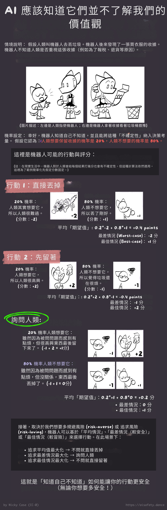

( [: 平均情況、最壞情況、最好情況等的優缺點](#WorstOrAverage) )

( [: 更多細節和反駁](#LearnValuesExtraNotes) )

. . .

如果「瞄準一個_你知道你不知道_的目標」仍然聽起來矛盾，這裡有兩個更多的例子來解神秘化它：

- 🚢 [海戰棋](https://en.wikipedia.org/wiki/Battleship_(game))遊戲。目標是擊中其他玩家的船，但你不_知道_那些船在哪裡。但隨著每次報告的命中/未命中，你慢慢地（但有不確定的概率）開始學習船在哪裡。同樣：AI 的目標是實現你的價值觀，它知道它不知道，但隨著每次命中/未命中，它會得到更好的想法。
- 💖 假設我愛 Alyx，所以我想給他們買一個水豚玩偶作為生日禮物。但我然後了解到他們討厭水豚，因為一隻水豚殺死了他們的父親。所以，我給 Alyx 買了一個薩卡班巴斯比斯玩偶代替。這似乎是一個愚蠢的例子，但它證明了：1）一個代理可以重視另一個代理的價值觀，2）同時知道_它可能對_那些價值觀_有錯_，3）但能夠_輕易糾正_它的理解。

. . .

好的，但「學習人類價值觀」的_實際具體提案_是什麼？這是一個快速概述：

- 🐶 **逆向強化學習（IRL）**。「強化學習」（RL）就像用零食訓練狗：給定一個「獎勵函數」，狗（或 AI）學習要做什麼動作。_逆向_強化學習（IRL）就像通過觀察某人做什麼來弄清楚他們真正關心什麼：給定觀察到的動作，你（或 AI）學習「獎勵函數」是什麼。所以，在 IRL 方法中：我們讓 AI 通過觀察我們實際選擇做什麼來學習我們的價值觀。
- 🤝 **合作逆向強化學習（CIRL）。**[^src-cirl] 類似於 IRL，除了人類不僅僅是被 AI 被動觀察，人類_積極_幫助教 AI。
- 🧑‍🏫 **人類反饋強化學習（RLHF）：**[^src-rhlf] 這是將「基礎」GPT（一個花哨的自動完成）變成 *Chat*GPT（一個實際可用的聊天機器人）的演算法。
    - 步驟一：給定人類對一堆聊天的評分 👍👎，訓練一個「老師」AI 來模仿人類評分者。（實際上，訓練_多個_老師，以增加穩健性）這「蒸餾」了人類對什麼是有幫助的聊天機器人的判斷。
    - 步驟二：使用_這些_「老師」AI 給「文字完成」AI 大量訓練，訓練它成為一個有幫助的聊天機器人。這「放大」了蒸餾的人類判斷。
- 🤪 **學習我們的價值觀_同時_學習我們的非理性：**[^src-irrational] 如果你的 AI 假設人類是理性的帶有隨機錯誤，你的 AI 會非常差地學習人類價值觀！因為我們犯的錯誤是_非隨機的_；我們有系統性的非理性，AI 也需要學習_那些_，才能學習我們的真正價值觀。

[^src-cirl]: [Hadfield-Menell et al 2016](https://proceedings.neurips.cc/paper_files/paper/2016/file/c3395dd46c34fa7fd8d729d8cf88b7a8-Paper.pdf)

[^src-rhlf]: [Christiano et al 2017](https://proceedings.neurips.cc/paper_files/paper/2017/file/d5e2c0adad503c91f91df240d0cd4e49-Paper.pdf)

[^src-irrational]: [Shah et al 2019](https://proceedings.mlr.press/v97/shah19a/shah19a.pdf) 和 [Chan et al 2021](https://arxiv.org/pdf/2111.06956)

（再次，我們只考慮如何學習_一個人類的_價值觀。關於如何學習_人道_價值觀，為所有道德患者的繁榮，等待後面的章節，「誰的價值觀」？）

當然，以上每一個都有問題：如果 AI 只從人類選擇中學習，它可能錯誤地學到人類「想要」拖延。正如我們從[過度奉承（「諂媚」）的聊天機器人](https://www.nngroup.com/articles/sycophancy-generative-ai-chatbots/)中看到的，訓練 AI 獲得人類認可⋯⋯_真的_讓它「想要」人類認可。

所以，要明確：**雖然指定人類價值觀幾乎不可能，而且指定_如何學習_人類價值觀更簡單，但它仍然沒有 100% 解決。** 類比：教某人法語需要數年，但教某人_如何有效地自學_法語只需要幾個小時[^learn-french]，_但_即使那也是棘手的。

[^learn-french]: 與這篇 AI 安全文章非常切題，但我強烈推薦 [Gabriel Wyner 的 Fluent Forever](https://www.amazon.ca/Fluent-Forever-Learn-Language-Forget-ebook/dp/B00IBZ405W)，它會教你 Anki 閃卡、音標、聽力訓練，以及其他學習任何語言的好資源。

所以：我們沒有完全繞過「規範」問題，但我們_確實_簡化了它！也許通過「只是」擁有一個非常不同信號的集合——短期認可、長期認可、我們說我們重視什麼、我們實際選擇做什麼——我們可以創建一個穩健的規範，避免單點故障。

更重要的是，「學習我們的價值觀」方法（而不是「試圖硬編碼我們的價值觀」），有一個巨大的好處：**AI 的能力越高，它的對齊_越好_。** 如果一個 AI 足夠聰明到學習，比如說，如何製造生物武器，它也會足夠聰明到學習我們的價值觀。如果一個 AI 太脆弱無法穩健地學習我們的價值觀，它也會太脆弱無法學習如何執行危險計劃。

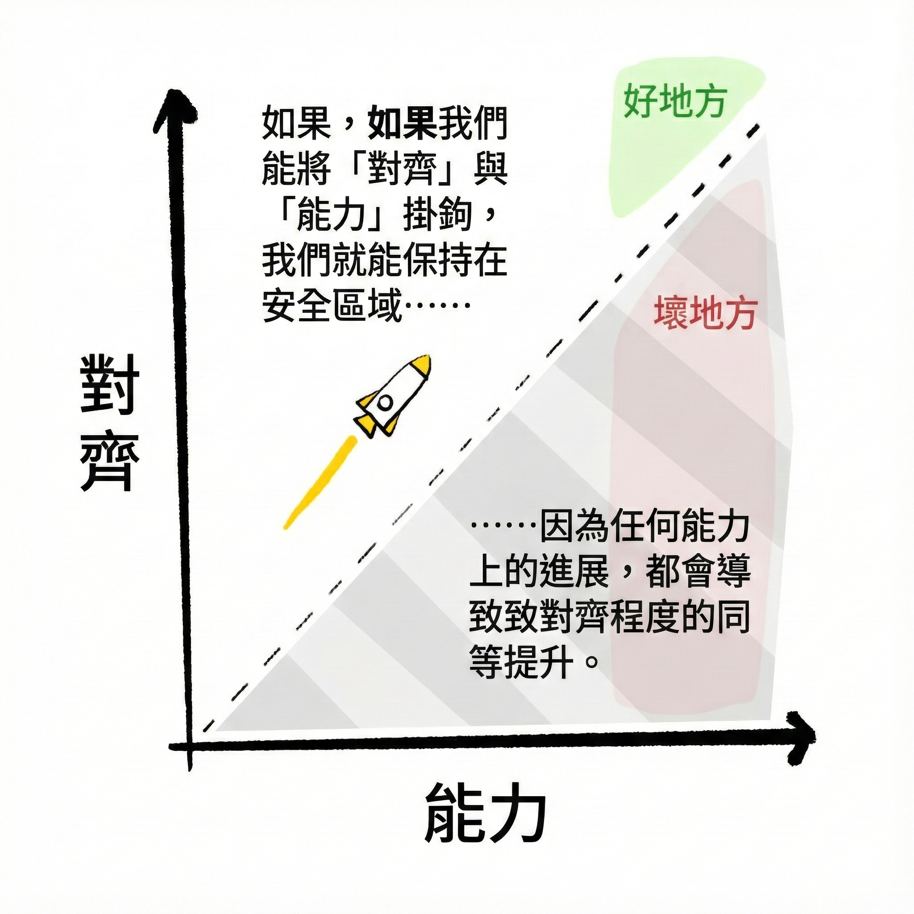

（不過：不要太舒服。一個「一旦有足夠高的能力就容易對齊」的策略有點像說「這輛摩托車一旦達到 100 英里每小時就很容易操控。」我的意思是，這_更好_，但較低速度、較低能力呢？因此，本頁上的許多其他建議解決方案。更多瑞士乳酪。）

我認為，這是「學習我們的價值觀」方法最優雅的地方：它將（部分）對齊問題簡化為一個_正常的機器學習問題_。從人類的言語/行動/認可中學習人類的價值觀似乎幾乎不可能，因為我們的價值觀總是在變化，並且對我們的意識心智是隱藏的。但這與從症狀和生物標記中學習人類的醫療問題沒有什麼不同：變化，並且隱藏。這是一個_困難的_問題，但它是一個正常的問題。

是的，AI 醫療診斷與人類醫生不相上下。已經超過 5 年了。[^ai-diagnosis]

[^ai-diagnosis]: 來自 [Baker et al 2020](https://www.frontiersin.org/journals/artificial-intelligence/articles/10.3389/frai.2020.543405/full)：「總的來說，我們發現 AI 系統能夠為患者提供分診和診斷信息，其臨床準確性和安全性水平與人類醫生相當。」來自 [Shen et al 2019](https://medinform.jmir.org/2019/3/e10010/)：「結果顯示，AI 的表現與臨床醫生相當，並超過了經驗較少的臨床醫生的表現。」注意這些是專門的 AI，不是像 ChatGPT 這樣的現成 LLM。請不要使用 ChatGPT 獲取醫療建議。

---

## 🎉 回顧 #1

- 🧀 我們不需要一個完美的解決方案，我們可以疊加多個不完美的解決方案。
- 🪜 **可擴展監督**讓我們將不可能的問題「你如何監督比你聰明 1000 倍的東西？」轉換為更可行的「你如何監督只比你聰明一點的東西，_而且_你可以從頭開始訓練它、讀取它的心智、並調整它的思維？」
- 🧭 **價值學習 + 不確定性 + 未來生活：** 不是試圖將我們的價值觀硬編碼到 AI 中，我們只給它一個目標：
    - 1️⃣：學習我們的價值觀
    - 2️⃣：但是，不確定並且_知道你不 100% 知道我們的價值觀_。
    - 3️⃣：然後，選擇導向_當前_我們會認可的_未來_生活的行動。
        - （並預測和避免最壞情況的未來。這讓 AI 對自己應用安全思維。）
- 🚀 「學習我們的價值觀」方法有另一個好處：如果我們將「學習我們的價值觀」視為一個正常的機器學習問題，**AI 的能力越高，它的對齊_越好_。**

---

## 🎉 回顧 #2

- 🧠 **用可解釋性和引導讀寫 AI 的「大腦」。**（相當於大腦掃描和大腦刺激）
- 💪 在工程、生活和 AI 中，你可以用**簡單性、多樣性和對抗性**使任何東西更穩健。
- ⚙️ **現代 AI 很脆弱是因為它們用相關性「感覺」思考，而不是因果關係「齒輪」**。這就是為什麼它們在常見任務上呈指數級變好，而在_不常見_任務上呈指數級變差。
    - 讓 AI 用因果關係思考不僅會增加 AI 能力，還會：讓它們更穩健、可驗證、可解釋、可引導、對科學有用，並且更好地學習和對齊自己到我們的價值觀。

---

## 🎉 回顧 #3

- 💖 **我們只需要一個足夠好的人道價值觀初稿，可以反思和改進自己。** 這可以是任何東西，從眾包的憲法，到道德議會，到幫助我們_與_ AI 一起成長的工具。
- 🚀 從自上而下和自下而上，**AI 治理是關於讓我們保持在「安全」線之上：信任但驗證，胡蘿蔔加大棒。**
- 💪 製造最大化上行空間同時最小化下行空間的技術：**狹窄的 AI，以及_增強人類能動性而不是取代它_的 AI。**

---

## 總結：

這是問題™️，分解開來，以及所有建議的解決方案！（[點擊查看完整解析度！](../media/p3/SUM.png)）

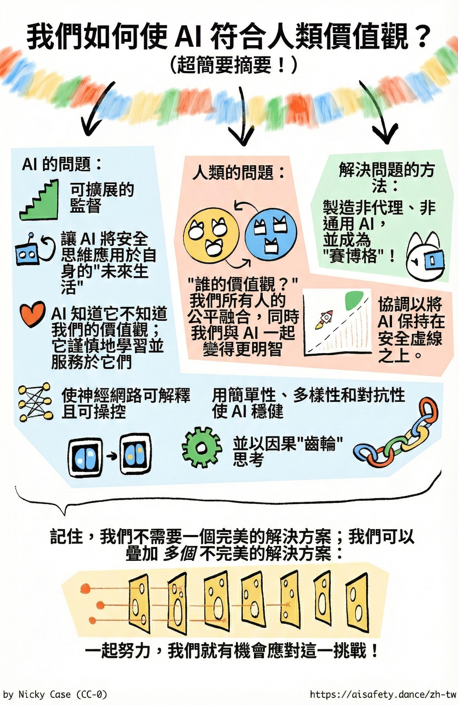

這是[回顧 1](#recap1)、[回顧 2](#recap2)和[回顧 3](#recap3)。

（再次，如果你想真正*長期記住*所有這些，而不是兩週後只剩下模糊的感覺，點擊右側邊欄中的目錄圖標，然後點擊「🤔 複習」鏈接獲取閃卡。或者，下載[第三部分的 Anki 牌組](https://ankiweb.net/shared/info/1788882060)。）

. . .

*（非常長的吸氣）*

*（10 秒停頓）*

*（非常長的呼氣）*

. . .

然後我就完成了。

大約 80,000 字後（大約一本小說的長度），以及將近一百幅插圖，這就是⋯⋯它。三年多的製作，這就是我旋風式導覽的結束。**你現在了解了 AI 和 AI 安全這個廣闘世界的核心思想。**

🎉 拍拍你自己的背！（但主要是拍*我的*背。（我好累。））

當然，AI 安全領域發展如此之快，第一部分和第二部分在第三部分出來之前就開始過時了，毫無疑問，第三部分：建議的解決方案在幾年後也會感覺天真或顯而易見。

但嘿，真正的 AI 安全是我們在路上交到的朋友。

嗯。我需要一個更好的方式來結束這個系列。

好的，點擊這個看一個非常酷的**電影式結局：**



. 

.

. 

.

.

. 

.

. 

.

等等你在做什麼？往上捲 👆👆👆，酷炫的結局在上面的按鈕裡。

拜託，下面只是無聊的腳註。

. 

.

. 

.

.

.

.

.

.

.

唉，好吧：
