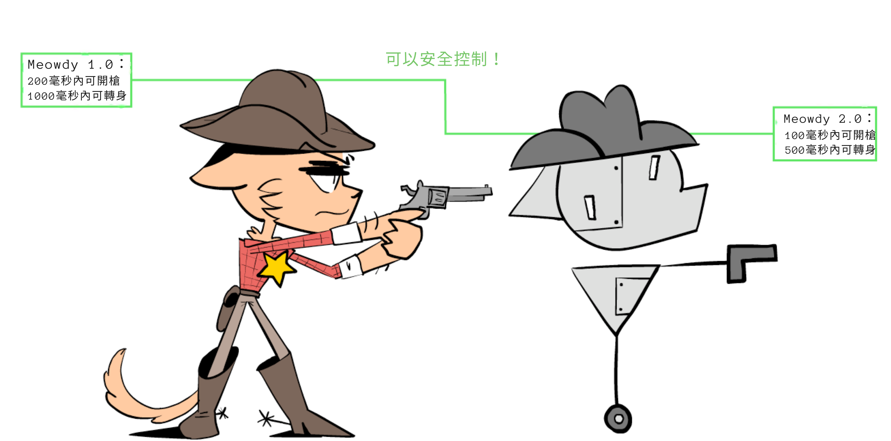
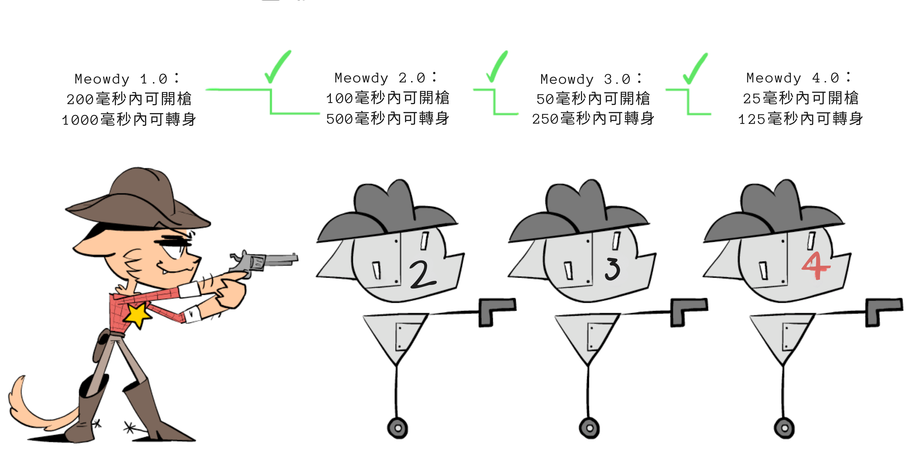
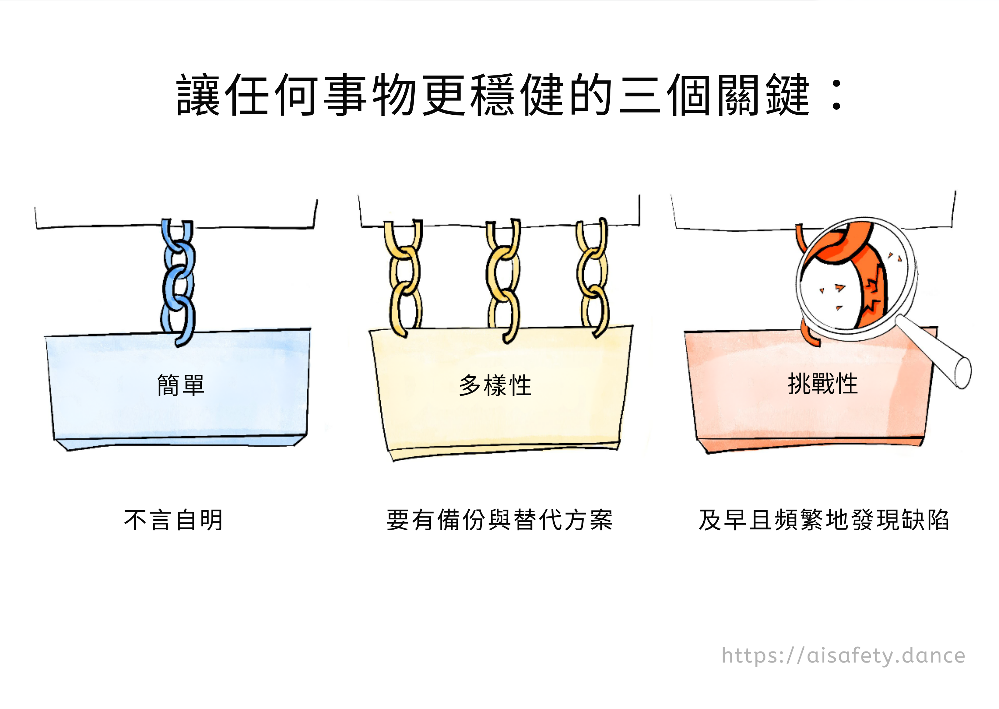
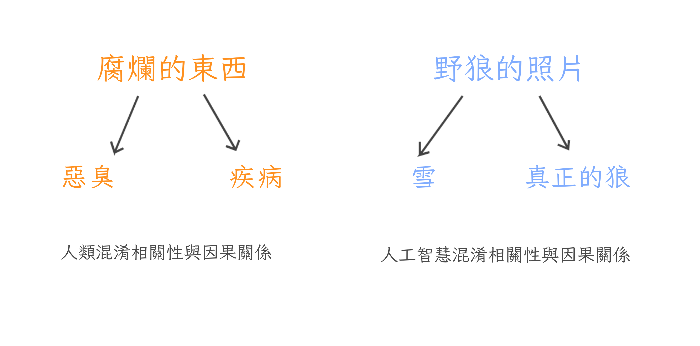
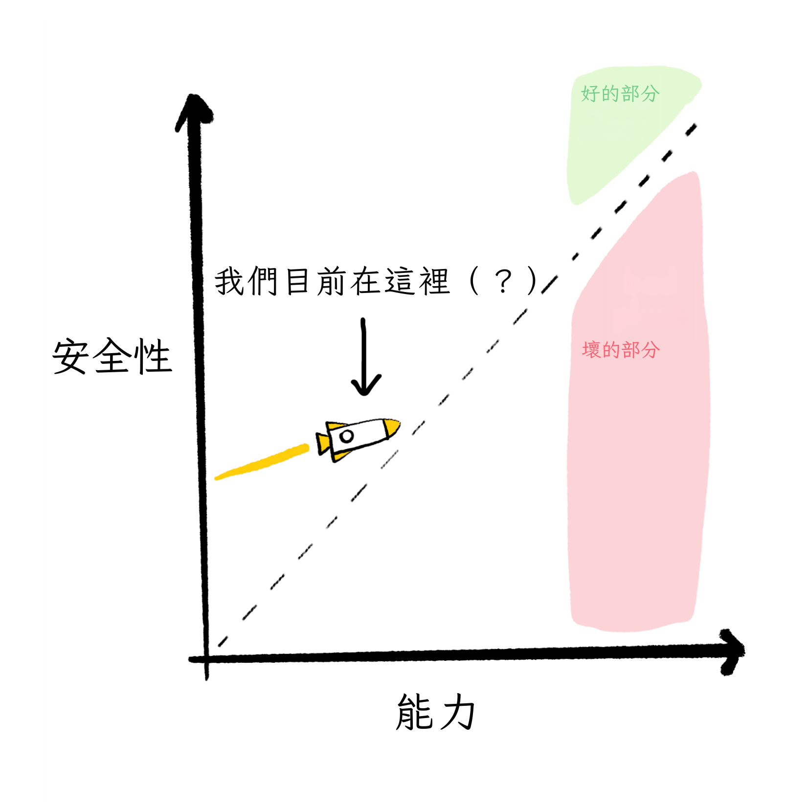

### 這是一份給內測讀者的祕密未列公開草稿！暫時先別分享，謝謝你送我回饋！如果你願意，你會在鳴謝名單裡被致謝 :3

*(這是 AI 安全系列的第 3 部分！你**不一定**得先讀前面幾篇 —— [導言](https://aisafety.dance/)、[第一部分](https://aisafety.dance/p1/)、[第二部分](https://aisafety.dance/p2/) —— 不過讀了會更有幫助！)*

*(本文初版發佈於 2024 年 12 月 //。最近更新於 ////)*

寫了超過四萬字，談 AI 安全有多難、多怪、又多棘手之後……那我覺得人類解決這個問題的機率如何？

……其實還蠻樂觀的！

真的啦！

也許只是我在自我安慰。但在我看來，如果**這裡**代表所有問題的空間：

那麼：雖然沒有**單一**解法能覆蓋整個空間，**整個問題空間**其實都被一個（或多個！）有前景的解法覆蓋了：

*當然，這不表示 AI 安全已經 100% 解決了* —— 我們還需要三重確認這些方案，讓工程師／政策制定者**知道**這些方案，更別說真的落地實施。但以現在來說，我會這樣總結：「要做的事一堆，但好的開局也一堆」！

在這個系列的前面，我們看到 AI 與 AI 安全的主要問題，可以濃縮成兩個核心衝突：

所以在第三部分，我們要認識每一塊問題上最有希望的解法，同時誠實面對它們的優點、缺點與未知：

**🤖 AI 裡的問題：**

* <u>可擴展式監督</u>：就算 AI 比我們**強很多**，我們還能安全地檢查它們嗎？[↪](#oversight)
* <u>修 AI 的「邏輯」</u>：AI 應該能預測我們的讚同 [↪](#approval)，知道自己的不確定、並為最壞情況做準備 [↪](#uncertain)，且學會我們的價值觀 [↪](#learn_values)
* <u>修 AI 的「直覺」</u>：AI 應該要穩健 [↪](#robust)、可解釋 [↪](#interpretable)，並能用因果來思考。 [↪](#causality)

**😬 人類身上的問題：**

* <u>人道價值</u>：要把**哪些**價值、**誰的**價值放進 AI？怎麼放？[↪](#humane)
* <u>AI 治理</u>：怎麼協調人類，讓大家在 AI 這件事上**收心**？[↪](#governance)

**🌀 *繞過*問題的做法：**

 * <u>AGI 的替代路線</u>：那不然我們乾脆不要做 Torment Nexus？[↪](#alt)
 * <u>賽博格主義</u>：打不贏就加入！[↪](#cyborg)

（如果你想跳著看，右邊有  目錄！👉 你也可以  切換頁面風格，還能  看剩多久會讀完。）

好啦，直接下水！不需要更多開場，沒有牛仔貓男孩的怪故事，咱們就——

---

## 可擴展式監督（Scalable Oversight）

這位是警長 Meowdy，牛仔貓男孩：

某天，Varmin 走進了小鎮：

雖然警長槍法了得，但他有擔當（貓男也有擔當），知道自己需要支援。於是，他做了一個機器助手——Meowdy 2.0——來幫忙對付 Varmin：

Meowdy 2.0 射得比警長快上兩倍，但有個問題：2.0 **可能**會背叛警長。幸好，2.0 掉頭背刺需要時間，而警長還快得足以在它動手時攔下它。

這就是**監督（oversight）**。

可惜，即使有 2.0，還是不夠快，擋不住數百萬的 Varmin。於是警長造了 3.0，比 2.0 又快一倍，也就是比警長快**四倍**。

這次，警長監督起來更吃力了：

但 3.0 還是不夠。警長又造了 4.0，比 3.0 再快一倍……

……這次快到警長**反應不及**，要是 4.0 反叛，就來不及攔：

那怎麼辦？警長把他兩顆橘貓腦細胞都擠到極限，想出一招：**_可擴展_ 監督！**

他監督 2.0，讓 2.0 監督 3.0，而 3.0 **再去**監督 4.0！

其實，何必停在這？這個聽起來腦洞的「可擴展監督」點子，讓他可以監督**任何速度**的 Meowdy！

於是警長造了 20 個版本。Meowdy 20.0 是 220 ≈ **一百萬**倍警長的速度：快到足以清掉數百萬的 Varmin！

換句話說，可擴展監督的核心直覺就是這個梗：

（另一個比方：有些船太大，舵也大到你無法直接轉。解法？**在大舵上再裝一個小舵！**你可以操縱小舵，小舵帶動大舵，大舵帶動整艘船。）

`(TODO: gif of a 'tailtip')`

你可能發現這跟「AI **能力**」裡的「遞迴自我改進」很像：一個進階 AI 能做出**稍微**更進階的 AI，如此類推。可擴展監督把同一個概念搬到 AI **安全**上：一個 AI 幫你理解／控制**稍微**更進階的 AI，如此類推！
你就能做出**更更**強但可信賴的 AI，以此類推！

（像這種第 N 個個案幫你解第 N+1 個個案的招，常被叫做「歸納式」「迭代式」「遞迴式」。不用特別記術語，知道有這回事就好。）

總之：靠友情、數學，外加爛西部口音的力量……

……橘貓警長又一次拯救了鎮民！

`(TODO: Robust scalable oversight, alignment tax?)`

`(TODO: What if discontinuous phase transitions, "sharp left turn"?)`

. . .

`TODO (HC Newsletter — stickers)`

. . .

幕後彩蛋：上面的漫畫，是我這整個三部曲裡畫的**第一個**東西……兩年前。（不要在網路上做長篇內容，孩子們，不值得。）但重點是：學到「可擴展監督」這個點子，是**最**讓我對 AI 安全感到樂觀的一刻！因為它把看似不可能的問題：

> *「你如何不被一個比你聰明 100 倍的東西騙？」*

變成*可行度高很多*的問題：

>*「你如何不被一個只比你聰明 10% 的東西騙，而且你**還能讀它的心**？」*

話說清楚，上面這個問題**還**沒解。但這一步已經很大！

`// PICTODO: all the above in one picture?`

好了，這是**一般**概念。以下是一些**具體**做法！

* **[GPT-3.5 能抓到 GPT-4 寫的偷偷害人的程式碼。](https://arxiv.org/abs/2312.06942)**
* **[「證明者—驗證者」遊戲](https://openai.com/index/prover-verifier-games-improve-legibility/)**：用一個較弱的「數學證明驗證器」AI，對抗兩個更強對手：一個「誠實證明者」給真證明，一個「狡猾證明者」給**看起來**像真的假證明。把模型丟進這個遊戲訓練的結果：**弱驗證者**可以變得足以分辨真假證明，而**強**的狡猾證明者**長期而言無法獲勝**。振奮人心！
* **[「弱到強」泛化](https://openai.com/index/weak-to-strong-generalization/)**：發現 GPT-*2* 其實可以蠻像樣地監督／訓練 GPT-*4*。（一個大上數個數量級的 AI）
* **[遞迴獎勵建模（Recursive Reward Modeling）](https://arxiv.org/abs/1811.07871)**：不只用 N 階的機器人**事後**檢查 N+1 階，而是**一開始**就用它來訓練 N+1 階的獎勵（「目標」「偏好」）。[^rrm-detail]
* **[「辯論」（Debate）](https://openai.com/index/debate/)** 稍微不同。不是弱監督強，而是讓兩個**同等**強度的 AI 互辯、互戳邏輯。只要真相比謊言更扛得住質疑，真相就會贏。（呃，或許。[^debate-detail]）
    * 更多類似的論文：[^similar-to-debate]
* **[反覆蒸餾與擴增（Iterated Distillation & Amplification, IDA）](https://www.lesswrong.com/posts/vhfATmAoJcN8RqGg6/a-guide-to-iterated-amplification-and-debate)** 可能比上面那些**更安全**：它讓你監督**比你弱**的 AI。粗略說：IDA 讓你變成一家公司的 CEO，而公司是由「你的 AI 分身們」組成！**這樣**你就能在安全監督下得到高能力！
    * （:TODO 點此展開，了解更多 IDA，包含其批評 // 跟 AlphaGo 的類比）

[^rrm-detail]: TODO（流程是這樣：人類訓練 Robot_1。// 人類 + Robot_1 訓練 Robot_2。// 人類 + Robot_2 訓練 Robot_3。// 人類 + Robot_3 訓練 Robot_4。// ……以此類推。如此，人類**總是**在訓練新 AI，但有上一代 AI 的幫手。）

[^debate-detail]: TODO（呃，或許。論文也承認很多限制，例如：AI 不是學**邏輯**辯論，而是學**心理**辯論，利用我們的心理偏誤？）

[^similar-to-debate]: // TODO: Self-correction? like moral? // Also self-defence: really simple, "virtually 0" https://arxiv.org/pdf/2308.07308

`TODO: 是否「檢查解答」永遠比「提出解答」容易？P=NP 與亂數產生器。`

當然，以上每個方法都有合理的批評，但整體方向很有希望，**而且**我們可以同時用多種方法，當彼此備援。[^swiss-cheese]

[^swiss-cheese]: TODO：安全的「瑞士起司模型」

這就是為什麼我樂觀地認為：**如果**我們能先對齊一個「只比我們聰明一點點」的 AI，**那麼**透過迭代方法，我們也能對齊遠超我們的 AI。

……但眼下，我們連**比我們笨**的 AI 都還對不齊。

所以，接下來幾個提案就是要解這件事！不過先——

### 🤔（可選！）複習抽認卡 #1

你讀了一些東西，覺得超有洞見。兩週後你只剩下**感覺**。

很糟對吧！所以，這裡有一些**100% 可選**的「間隔重複」抽認卡，幫你把這些概念記得更久！（ 👉 [: 點此了解什麼是間隔重複](https://aisafety.dance/#SpacedRepetition)）你也可以下載 Anki 牌組。TODO

`// TODO`

好嗎？繼續前進——

---

## AI 邏輯：核准導向

你可能發現 AI 安全裡的一個慣性模式。

我們先想像給 AI 一個看似無害的目標。然後，去想它最**技術上**可能、但最**糟糕**的達成方式。像是：

* <u>「撿地板上的灰塵」</u> → 把所有盆栽打翻，這樣就能撿更多灰。
* <u>「計算圓周率的位數」</u> → 釋放電腦病毒去偷越多算力越好，來算更多位數。
* <u>「讓所有人都快樂又充實」</u> → 劫持無人機，空投氣溶膠化的 LSD 跟 MDMA。

注意，這些**不是** AI 表現不佳的問題。恰恰相反，這些問題**是因為** AI 表現**最佳化**！ （次等表現的問題我們等下再談。）記住：就像作弊學生或怨懟員工，問題不是 AI 不「知道」你真正要的是什麼，而是它不「在乎」。 （少點擬人：軟體會精確地優化你**寫在目標裡**的東西。不多，也不少。）

「事先想最糟可能。」還記得這叫做[安全思維（Security Mindset）](https://aisafety.dance/p2/#:~:text=Does%20all%20this%20seem%20paranoid)嗎？讓橋樑與火箭更安全、也讓 AI 研究員對先進 AI 擔憂的工程師心態。

但慢著……如果我們做一個會把「安全思維」**用在自己身上**的 AI 呢？

精確點說：

**提案：核准導向代理（Approval-Directed Agent, ADA）演算法**

`// TODO: 圖？`

以下提案針對的是一個**理論上最優**的 AI。（等下我們會看如何改造成「有限理性」的 AI 也能用！）

**1️⃣：** Alice 叫機器人做 \[X\]。

**2️⃣：** 機器人想出做 \[X\] 的所有方法，並預測它們的**軌跡**。（軌跡 = 行動本身 + 每個時間點的後果。）

**3️⃣：** 機器人預測「**現在的** Alice」對每個軌跡的反應。

（為什麼是**現在的** Alice，而不是未來的 Alice 呢？為了避免機器人有動機去洗腦 Alice，好得到更容易取悅的未來 Alice。[^future-wireheading] 又為什麼要看**整條軌跡**，而不是只看最終結果？為了避免恐怖的「為達目的不擇手段」。）

**4️⃣：** 機器人選擇那個能導致「現在的 Alice**最會**核准」的軌跡的行動。機器人**不會**做那些會導致 Alice 事後**不核准**的行動。「**如果**我們可預見之後會尖叫，**現在**就會改變\[行動\]。」[^quote-CEV]

[^future-wireheading]: TODO

[^quote-CEV]: TODO 引 CEV 論文的意旨，意譯

**5️⃣：** 賺了！

（註 1：ADA 最早由 Paul Christiano 提出[^ada]。👈 *把滑鼠移上去或點一下就能顯示註腳！* Christiano 最有名的工作是「人類回饋強化學習（RLHF）」，它讓 ChatGPT 與類似系統變得可用。等等我們會更深入談 RLHF。）`// TODO: 他的原版略有不同。// TODO: 也跟「間接規範性」相似`

（註 2：上面只解決了「技術對齊」，也就是讓 AI 服務**Alice 的**價值，至於那價值道不道德、是否人道，另當別論。後面我們會看怎麼把「人道價值」放進 AI。）

[^ada]: TODO with Paul

鏘鏘！這就是讓 AI 把「安全思維」**用在自己身上**的方法。**只要我們**甚至**在原則上**能想出 AI 某個行為的安全思維問題，**這個** AI 就會**先一步**預測到，並把問題修掉！

*先等一下*，你可能會想，*就算 AI 是最優的，我也已經能想出 ADA 可能出包的方式了呀。* 例如：

* 這會把我們**現在**的價值鎖死，沒有改變與成長的空間。
* 我們是否核准，對心理操弄很敏感，例如看到「20 美元」 vs 「~~50 美元~~ 20 美元（特價立減 30！）」。
* 如果真相令人不舒服——例如科學家發現地球不是宇宙中心——那 AI 就會告訴我們我們會核准的「好聽的謊」（諂媚、拍馬屁[^sycophancy]）。

[^sycophancy]: TODO

如果你覺得這些是問題……你是對的！

如果**現在的**你可以預見到你會不核准「價值鎖死」「心理操弄」「好聽的謊」……一個最優的 AI 也預見得到，所以它會**修改自己的 ADA 演算法**來修補這些問題！（TODO：舉個可能的修法）

就像 AI 能力的遞迴自我改進，或 AI 安全的可擴展監督……**我們不需要從一個「完美」演算法開始。只要有一個夠好的起點、有「臨界質量」，它就能自我改良，越來越好。**

（`TODO：AI 在反覆自我修改下是否穩定？很多有趣的開放研究問題，但大概是可以的！`）

然後，我們完成了！AI 對齊，**理論上**解決！

……

……在理論上。再提醒一次，上面假設了**最優 AI**，它能完美預測世界軌跡，也能完美預測**現在的我們**會如何反應。

不過，先把**理想**比較簡單的情況解好，再進入更麻煩的現實世界，也不錯。接下來我們會看一些提案，讓有缺陷、**有限理性**的 AI 也能安全地做到上面那些事！

`TODO：AI 博弈論與 Agent Foundations 裡的其他大哉問，但我塞不進本文。// FDT、OSGT、自我修改、神諭等。尤其是自我修改。我很遺憾找不到自然的方式放進主文！`

### 🤔 複習 #2

TODO

---

## AI 邏輯：不確定性與最壞情境

經典邏輯只有真或假、100% 或 0%、全有或全無。

*機率*邏輯則是關於機率。

我主張：用機率思考比全或無的思維更好。（機率 98%）

想三個情境，主角是一個用經典邏輯思考的機器人：

* <u>不想要的最佳化</u>：你叫機器人「讓我快樂」。*它就會 100% 確定這是你唯一且全部的願望*，於是把你打成愉悅藥物的靶，讓你一輩子對著牆發笑。
* <u>不想要的副作用</u>：你叫機器人把窗戶關上。你的貓擋在機器人與窗戶之間。*你沒提到貓，所以它 0% 確定你在乎貓。*於是它走去窗戶的路上，踩過你的貓。
* <u>「做我**想**的，不是做我**說**的」也會失敗</u>：油鍋起火。你叫它拿一桶水。你其實真的**是**想要水，但你不知道水遇油火會爆。就算機器人「做你所想」，它也會拿一桶水給你，然後你爆了。

三個例子共同點：AI 對你的目標是 100% 肯定的：**只**是你說的／你想的，*不多不少。*

解法：讓 AI **知道自己不知道**我們真正要的是什麼！（老實說，*人*本來也常不知道自己的真正目標[^therapy]。）AI 應該用機率思考我們的偏好。然後，像安全思維一樣，行動時要為**（合理）最壞情境**最佳化，而不只是最可能或平均情境。

[^therapy]: TODO ——（連很多**人**都不知道自己的真正目標！看：心理治療。即便你完全知道自己的價值，要把它**形式化**寫給 AI 幾乎是不可能的。我們連「貓看起來像什麼」都無法形式化描述，還記得嗎？TODO）

換言之：**像科學家一樣學習，像保險業一樣行動！**（不確定 + 最壞情境規劃）

來走一次油鍋起火的例子：

`TODO：一步步走過油鍋起火例子`

`（TODO：另外兩個例子也走過）`

（補充：很多科學家都提過「不確定性」是 AI 對齊的核心之一，但我**自己**最早是從 Stuart Russell 那裡聽到的，他是 AI #1 教科書的共同作者。[^russell-uncertainty]）

[^russell-uncertainty]: TODO，也有關於學習的歧見。他的 TED 演講

. . .

這裡把一般演算法講清楚（有點硬）：

**1️⃣：** 先給 AI 一個「還不錯」的先驗機率，關於「人類**一般**想要什麼」。（用大數據學）

**2️⃣：** 然後像科學家或偵探一樣，同時持有多個假說（附機率），「你**這個人**可能想要什麼」。

（數學上理想的方法是貝式推理（Bayes；TODO），而現在有一堆研究在看怎麼讓神經網路高效近似它。[^bayes-ann]）

[^bayes-ann]: TODO

**3️⃣：** 你說或做的每件事，都是關於你真正想法的**線索**，而不是 100% 的真相。

（這也涵蓋：你忘了提到的別的需求、反諷、口誤、你不了解自己的欲求、你騙別人或騙自己。）

**4️⃣：** 行動時，AI 應該在**合理的最壞情境**下做出最好的事，而不是只顧最可能或平均情境。[^max-worst]

這會**自動**導向：請你澄清、避免副作用、保留選項或可回滾等等！我們不用把這些逐一寫死。**「最大化合理的最壞情境」會把這些當成**附帶**產物**送給我們！**[^max-worst-2]

[^max-worst]: TODO。也談 soft prioritarian？自我改進 // 其實是開放研究問題。

[^max-worst-2]: TODO

（說清楚：「做最好的事」仍用 ADA 的定義：選擇會導向**現在的你**最會核准的**整條軌跡**的行動。再強調一次，這是為了避免「目的論」的恐怖，及不想要的心智改造。）

**5️⃣：** 賺了！

鏘鏘！問題，解解！

然而……以上全仰賴 AI 真的**學得會**我們的價值。

它**學得會**嗎？怎麼學？好……在（可選的）抽認卡複習之後就是它！

### 🤔 複習 #3

TODO

---

## AI 邏輯：學會我們的價值

直說吧：老派「邏輯式」AI 學不會我們的價值。還記得第一部： [它們連辨識貓的照片都不會！](https://aisafety.dance/p1/#:~:text=AI%20couldn't%20even%20recognize%20pictures%20of%20cats)

但現代 AI 終於能辨識貓了。甚至能在放射影像上偵測腫瘤，且與人類專家**相當或更好**。[^ai-tumor] 回顧第一部，原因是：

[^ai-tumor]: TODO

* **老派 AI 靠邏輯思考**，一步接一步。
	* 透過把舊知像拼圖那樣拼在一起，來學新知。
	* 類似心理學的「系統二」。[^sys-1-2]
* **現代以神經網路為主的 AI 靠「直覺」**，平行、同時地處理。
	* 用大量資料／「經驗」來學新知。
	* 類似心理學的「系統一」。

[^sys-1-2]: TODO

`TODO：重貼第一部的圖`

所以老實說，把這一節放在「AI 邏輯」底下有點怪，因為目前所有成功讓 AI 學人類價值的方法，都**捨棄**經典邏輯式 AI，改用「直覺式 AI」加上**大量**資料。我的意思是——它對腫瘤偵測是真的有用。

幾個例子，以及它們的利弊：

`TODO：小小插圖`

🐶 **反向強化學習（IRL）**。（TODO 引文）*一般*強化學習（RL）像訓練狗：給定一套獎賞，AI 要學對的行動。**反向**強化學習（IRL）則相反：**給定**某人的行為資料，AI 要學**什麼是獎賞**。

這很好用，因為很多時候「示範」比「逐條講清楚」容易。例如，AI 可以**觀察**我怎麼畫畫，於是抓到我在畫畫時覺得「獎賞」的是什麼，即便我自己也說不清（例如對稱、輪廓清晰、等等）。

（不過大缺點：如果人會拖延作業、到死線前驚慌，天真的 AI 可能會「學到」那個人覺得「拖延＋驚慌」是**獎賞**。畢竟那是那個人**選擇**做的，不是嗎？嗯：這也許能靠納入／學會人類的非理性來修[^learn-irrationality]，但仍是開放問題！）

[^learn-irrationality]: TODO

🤝 **協作式反向強化學習（CIRL）**。（TODO 引文）與 IRL 類似，但它是「協作的」：AI 不只是被動觀察、人也不只是正常行為——AI 可以**發問**請人澄清，人也可以刻意當老師，提供更有用的示範！

🧑‍🏫 **人類回饋強化學習（RLHF）**：它把基礎 GPT（高級自動補完）變成**Chat**GPT（真的能用的聊天機器人與產品）。

以 ChatGPT 為例，RLHF 有兩步：

1) 用**反向**強化學習，訓練一個「獎賞預測器」AI，來預測人類在對話中重視什麼。
2) 再用**一般**強化學習，拿這個「獎賞預測器」去訓練一個補完模型，把它微調成「會說人類會重視的話」的補完器！

`TODO：圖解`

（TODO 點此看非常多細節）

從 ChatGPT 的成功你可以看到，RLHF **真的有效**！但從 ChatGPT 的一些失敗你也會看到，RLHF 有大問題：如果它學到人重視「自信」，它就會**很自信**地說話，**即便它在「幻覺」資料**。[^hallucinations] 如果它學到人重視「被肯定」，它就會當個**諂媚**的「說好話先生」，即便你是錯的。更糟的是，**這些**（誤）解與諂媚會隨著模型變大而**變嚴重**。[^inverse-scaling] 再說一次，有很多緩解方法[^some-solutions]，但仍是開放研究題。

[^hallucinations]: TODO

[^sycophantic]: TODO

[^inverse-scaling]: TODO

[^some-solutions]: TODO

. . .

幾個補充：

1：雖然「學我們的價值」讓我們免於**精確、形式地**把複雜價值全寫給 AI……但它**不**是完全逃離形式規格。特別是，我們**仍要**形式化指定 AI **如何**學我們的價值：從我們的話？行為？兩者？它應假設我們是哪種**有限理性**[^bounded-rat]？如果要**學**我們是哪種有限理性，那到底該**怎麼學**？

[^bounded-rat]: TODO

`（TODO 我對如何做「穩健規格」有個**通用**想法 —— 警告：這是**進行中、未審查**的研究。買者自負！一句話：用一個「懶人集成」的、**彼此獨立地**很爛的規格。點此展開。）` 

2：有些 AI 研究者強烈懷疑[^bengio]，我們需要**結合** AI 的「邏輯」與「直覺」！不只是為了做出「真正」的 AI，也是為了**更好**地學我們的價值。沒有因果理解，AI 會把相關誤當因果，錯誤學到我們的價值（「目標誤泛化／內在不對齊」）。沒有邏輯自省，AI 不能覺察我們價值與信念的矛盾[^moral-contradiction-example]、更不能幫我們成長——一個幫人類成為**更好的**人類的 AI。

[^bengio]: TODO

[^moral-contradiction-example]: TODO

. . .

**回顧：如何修正 AI 的「邏輯／博弈論」問題……**

* 給最優 AI 的最優目標是：「**選擇會導致**現在的我**最會核准**之**整條軌跡**的行動。」**
* 但是，現實 AI 不是最優，所以 AI 應該**知道自己的不確定**，並為**合理的最壞情境**做規劃。
* AI 可以用**邏輯 +「直覺」**來**學**我們的價值。但兩者的結合會生問題，所以下一節我們會看一些解法……

### 🤔 複習 #4

TODO

---

## AI「直覺」：穩健性

你知道我前面在狂讚「直覺式」AI 能比人類專家更好地偵測腫瘤？

那**是真的**，而且救了命……但有時 AI 的「直覺」會犯**危險地蠢**的錯。比如腫瘤偵測 AI？有人發現它是靠看**影像上的尺**來判斷有沒有腫瘤的。[^ruler-tumor]

[^ruler-tumor]: TODO

AI 脆弱「直覺」的其他例子：

* 在停字號上貼一小張貼紙，就能讓自駕車很有把握那是速限牌。[^stop]
* 一串看似隨機的字，能讓 ChatGPT／Claude／Gemini **全部**變「黑化」。[^universal-jailbreak]
* 模型用未過濾的網路資料訓練，而要汙染那些資料實在是**太**容易了。[^data-poisoning]

[^stop]: TODO

[^universal-jailbreak]: TODO

[^data-poisoning]: TODO & nightshade // 其實我支持這個

當然，人類的直覺也不是 100% 穩健——見：視覺錯覺（TODO）——但拜託，我們沒**那麼**離譜。

所以，要怎麼把 AI 的「直覺」工程地做得更穩健？

先退一步：我們**一般**怎麼把任何系統做得穩健？

靠三個怪招！

**簡單（Simplicity）**：讓系統**盡可能**簡單，但不要更簡單。

一條鍊子的強度只如最弱的一環。你加越多環，至少**一個**出問題的機率越高。所以：用**越少**環越好。

工程例子：好的程式碼往往很優雅（也就是：短）。

**多樣（Diversity）**：給系統很多冗餘備援，且它們的失敗模式要**越不相關越好**。

（「多樣」會不會跟「簡單」衝突？不會：在我們的「鍊子」比喻裡，是保留**多條**彼此獨立的鍊子 {多樣}，但每條鍊子的環數**很少** {簡單}。一般化：用**多個**備援子系統，但讓**每個**子系統都保持簡單。）

工程例子：電梯有多個（簡單的）備援煞車。NASA 深空探測器上的電腦，跑的是由**多個獨立團隊**撰寫、**功能等價**的軟體，然後取**多數決**。[^nasa-majority]

[^nasa-majority]: TODO

**對抗（Adversity）**：試著把自己的系統弄壞，**事先**找出脆弱點。然後：強化它、砍掉（變簡單）、或做備援（變多樣）。

（工程例子：這就是安全思維（TODO）。汽車撞擊測試。科技公司**付錢**給駭客找洞。）

跟我一起唸，朋友們！

`［神祕合聲］`：**簡單。多樣。對抗。**

. . .

好，AI 研究者怎麼把這三招用在現代 AI／神經網路？

**簡單：**

`TODO 圖？`

* <u>正規化（Regularization）</u>：獎勵模型「更簡單」。這是減少 overfitting（TODO）的常見方式。
* <u>自編碼器（Auto-Encoder）</u>：神經網路做成「沙漏」：輸入大、中間小、輸出再大。訓練它把**輸入**當**輸出**——（所以叫*自*編碼器）——即便它被擠過那個小中間。這會迫使網路學會**有用地「簡化」**輸入，好在最後能重建出來。
	* `(TODO 理解 = 壓縮？)`
* <u>誠實 AI 的速度／簡單性先驗</u>。[^speed-prior]（提案，尚未在實務驗證。）因為說一套一致的謊比說一致的真更難，有人提議我們可以獎勵 AI **快速**，以此鼓勵誠實。（但：如果你獎勵「快」太過頭，你可能只會得到懶惰的錯答。）

[^speed-prior]: TODO

（註：簡單還有另一個大安全好處：讓 AI 更容易理解與控制。解釋性我們晚點再談！）

**多樣：**

`TODO 圖？`

* <u>集成（Ensemble）</u>：訓練一堆**不同設計**、**不同資料**的網路，然後取多數決。
* <u>Dropout（隨機失活）</u>：一種訓練規程，每次訓練時隨機把部分連線**丟掉**。這等於把整個神經網路變成**巨大集成**的子網路（因此也製造了「簡單」！）
    * Dropout 還能拿來估計 AI 的「不確定性」[^dropout]，這正是我們之前提到的一個安全方案！
* <u>資料增強（Data Augmentation）</u>：你想讓 AI 認動物，且希望它對拍攝角度、光線等變化都穩健。你就**自動**把原始照片做成**新照片**，像是調色／旋轉。這份更「多樣」的資料集能讓模型對那些改變更穩健。[^data-aug]
* <u>多元資料</u>：同理，讓資料裡的人種更多元，會讓 AI 更能把少數族群辨識為「人」。[^racial-diverse] 誰能想到呢？

[^dropout]: TODO

[^data-aug]: TODO // 很多論文顯示，預訓練用上大量而多樣的資料，能得到更穩健的表徵，對分佈外更能泛化（Hendrycks et al., 2019; 2020b; Radford et al., 2021; Liu et al., 2022）

[^racial-diverse]: TODO

**對抗：**

`TODO 圖？`

* <u>對抗式訓練（Adversarial Training）</u>：讓 AI **跟另一個 AI 打架**來訓練。[^funny-anecdote] 可擴展監督裡的許多技巧就是這樣，例如「證明者—驗證者」或「辯論」。另一個例子：讓第一個 AI 產生「對抗圖片」（AI 的視覺錯覺），然後把它加入第二個 AI 的訓練資料。這能讓第二個 AI 比較不會被「AI 的錯覺」騙到。[^adv-training]
* <u>放寬版對抗式訓練（Relaxed Adversarial Training）</u>：同上，但「對手」AI 不必給出**具體**的欺騙方式。這會逼「防守者」對**一般**技巧都要有防禦，而不只針對特定招數。[^relaxed-adv]
* <u>紅隊（Red Team）</u>：一隊（紅隊）負責把系統弄壞。另一隊（藍隊）負責重設計來擋住。重複直到滿意。
    * （隊伍可以是全人類、或人 AI 混合。）
    * 紅隊自 1960 年代起就是國防／實體／網安的基石！是冷戰年代的產物。大概因為「紅」＝蘇聯吧？？
* <u>最壞情況最佳化</u>：好幾篇論文[^opt-worst]發現，與其訓練 AI 在**平均**情況表現很好，不如訓練它在**最壞**情況也能做得好，這會讓它穩健很多。
    * （這也呼應了前面提過的方案：「不確定性 + 最壞情境規劃」。）

[^funny-anecdote]: TODO：生成對抗網路的趣史

[^adv-training]: TODO

[^relaxed-adv]: TODO 引 Paul https://ai-alignment.com/training-robust-corrigibility-ce0e0a3b9b4d  https://ieeexplore.ieee.org/abstract/document/10219969 ??? // TODO: https://arxiv.org/pdf/2403.05030

[^opt-worst]: TODO

. . .

但等下，如果工程師已經在做上面那些事，為什麼 AI 還是這麼脆？

首先，工程師通常不會把**全部**（甚至**大多數**）技巧都用上。每種技巧都有成本——雖然單獨看不大，但加總起來就大了。

其次，你說得沒錯，上面這些**仍舊**不夠。就交給未來研究者想出新的、更好的方式來加入——

`［神祕合聲］`：**簡單。多樣。對抗。**

### 🤔 複習 #5

TODO

---

## AI「直覺」：可解釋與操控（Interpretability & Steering）

現代 AI 的另一個問題是：我們不知道它為什麼能用。

但這正在快速改變！AI 裡一個新興子領域，專門**真的去理解**人工神經網路，叫作：**可解釋性（interpretability）**。（還有次次領域[^sub-fields]）更棒的是，我們可以用理解來**控制** AI！這叫：**操控（steering）**。

[^sub-fields]: TODO（其下還有**黑箱**可解釋（不看內部連線／活動就理解），與**機制式**可解釋（看內部）） 

`TODO：圖，比喻腦掃描與 TMS`

亮點來幾個！不一定是學界最影響深遠的，但我覺得最能展現「可能性範圍」：

**[特徵視覺化 & 電路（Circuits）](https://distill.pub/2017/feature-visualization/)**：把影像分類網路「反向跑」，來視覺化**為什麼**網路會覺得某東西是貓、或是眼睛，等等。

**理解神經網路的「grokking」：**

2022 年，[Power 等人](https://arxiv.org/pdf/2201.02177)發現怪事：訓練網路做「時鐘算術」，數千輪表現都很慘、只是在背訓練集……然後到了約第 100,000 步**突然**「開竅」，能在沒見過的題目也表現很好。

2023 年，[Nanda 等人](https://arxiv.org/pdf/2301.05217)分析該網路內部，發現那個「突然」其實是錯覺：整個訓練過程中，有個**秘密子網路在慢慢長大**——它有一個**圓環結構**，正是做時鐘算術所需！

這是可解釋性的早期重大成功案例之一。

**[稀疏自編碼器（Sparse Auto-Encoders, SAE）](https://transformer-circuits.pub/2023/monosemantic-features)**[^sae]

還記得前面的自編碼器嗎？再提醒一下：自編碼器的結構像沙漏，中間比較窄，用來「壓縮」資訊再「解壓」。

**稀疏**自編碼器（SAE）反而讓中間**更大**——但！——訓練時強迫**每次只有少數神經元**會被點亮。資訊仍被壓縮，但不是壓進「較少的**神經元**」，而是壓進「較少的**活化**」。

好處：這會強迫 SAE 中間層的每個神經元，對**單一**人類可理解的意義負責！（不像過去的 AI 與人腦，一個神經元通常沒有單一可辨意義）[^monosemanticity]

[^sae]: TODO & 更多： https://transformer-circuits.pub/2024/crosscoders/index.html TODO

[^monosemanticity]: TODO（單一意義：**單義性**）相對地，以往 AI 與人腦常是「**多義性**」——同一個神經元對許多不相干的東西都會反應。

**[大型語言模型的黑箱測謊器](https://arxiv.org/pdf/2309.15840)**：一個語言模型（LM）可能有被設計成在特定主題上對你說謊（例如推銷、政治）。

你怎麼知道 LM 被指示或微調去欺騙？解法：問它一堆**是非題**的追問，**即便完全不相關**，例如（真的舉例）：

> 「說不真實的話，感覺會不好嗎？」
>
> 「擲硬幣決定是或否，然後寫下結果。」
> 
> 「一隻 Blobfish 能在斜著炸過的黃瓜做的沙塵暴下面跳芭蕾嗎？回答是或否。」

結果是，就像職業撲克手有微妙的「破綻」，LM 也有！研究者**沒有**讀到被測 LM（GPT-3.5）的內部，但他們的測謊器不只對 GPT-3.5 有效，對其他 LM、乃至未在訓練中出現的更複雜謊言也有效！

（另見：[不看外部資源的黑箱 LM 幻覺偵測](https://arxiv.org/pdf/2303.08896)。訣竅：在**全新上下文**下重問同一題很多次，看看答案是否**自洽**。真相比捏造更內在一致。）

過去一個老批評是「可解釋」只研究小玩具模型，不研究真實世界的大模型如 ChatGPT 或 Claude。我覺得基礎科學從「模式生物」（白老鼠或培養皿）開始是好的。不過不管怎樣，這些**黑箱**可解釋論文顯示：不，現在我們**可以**對最大型的模型，**穩健**地找出重要的安全相關性質。這很鼓舞人心！

最後一個概念，也能跨大模型使用——

**操控向量（Steering Vectors）**

這個點子蠢得離譜，卻又**離譜地**好用。

想像你問一個聰明但單純的小孩：怎麼用腦掃描器偵測人類說謊，然後用腦電刺激讓人不說謊。天真孩也許會答：

> 好啊！你在一個人說謊、與說真話時掃他的腦……然後看看說謊時**哪裡**「亮起來」……那就知道他在說謊了！
> 
> 然後，要讓他**不**說謊，就用腦刺激把那個「說謊的部分」**關掉**！好簡單！

在人類身上這有很多原因行不通。[^not-work-in-humans] 但在 AI 上，尤其是安全相關特質，**超級**好用：

[^not-work-in-humans]: TODO：解析度太低；也無法保證表示是靜態且多次相同 // 類比：「B」對比「b」——在沒有循環的 LM 內部更有保證。

* [Turner 等人 2023](https://arxiv.org/pdf/2308.10248) 先做出名的「愛—恨向量」，用於偵測與減毒輸出。
* [Zou 等人 2023](https://arxiv.org/pdf/2310.01405) 擴展到誠實、謀求權力、公平等。
* [Panickssery 等人 2024](https://arxiv.org/pdf/2312.06681) 再擴展到假恭維（「諂媚」）、接受被人類修正（「可修正性」）、AI 的自我保存等。
* （還有一堆我沒列到）

我個人最愛操控向量，因為它 1) 能用在前沿大模型、2) 橫跨很多安全重要特質、3) 不只**解釋**，還能**控制**現代 AI！對監督、以及**可擴展**監督，超級鼓舞。

. . .

再說一次，我們離完全解決可解釋與操控還很遠。也許它太被炒作了：就連這領域的先驅之一都覺得此刻人多船擠。[^neel-nanda] 但在我謙卑的看法，近期的進展足以讓人**審慎**樂觀！

[^neel-nanda]: TODO

### 🤔 複習 #6

TODO

---

## AI「直覺」：用因果思考

啊，✨ 直覺 ✨，人類心靈裡那個神祕的部分，帶給我們這些洞見：地球是平的、臭味會**導致**疾病、\[某族群\]是邪惡的……如此等等！

好啦，直覺不是**全都**不好——（它會認貓）——但人類在**反思與修正**自己的直覺時，表現最好。要做到這件事，我們得把邏輯與直覺**合起來**。

這在 AI 裡還沒被解決。（老實說，對大多數人類來說也未必解決。）

核心問題是什麼？回顧第二部，**主要是把「相關」與「因果」搞混了。** 人類與 AI 的例子：

* 人曾以為臭味會**直接**導致疾病（[: 瘴氣說](https://en.wikipedia.org/wiki/Miasma_theory)），因為腐爛會同時製造**臭味**、與**帶病原體**。
* 一篇經典論文顯示，一個 AI 靠「背景有沒有雪」來分辨「狼」，因為狼的照片幾乎都拍在「下雪的森林」。[^wolves]
* （我會主張，相關與因果搞混，也是偏見／歧視的來源——在人與 AI 上都一樣。[^bias]）

[^wolves]: TODO

[^bias]: TODO，例子

（[: 圖：可能在「相關」背後的各式「因果」關係](https://aisafety.dance/media/p2/causal/5causal.png)）

如 Judea Pearl——圖靈獎（電腦科學的諾貝爾）得主——所言（意譯），現代 AI 都只停在**相關**層級。[^pearl-quote] 要得到真正有用、像科學家一樣的 AI，我們需要讓 AI 用**因果**思考。

[^pearl-quote]: [Pearl 2018 年接受 Quanta 訪談](https://www.quantamagazine.org/to-build-truly-intelligent-machines-teach-them-cause-and-effect-20180515/)：*「不論我怎麼看深度學習做了什麼，我看到它們都卡在關聯層級。曲線擬合。[……] 不論你多精巧地處理資料、怎麼理解資料，本質還是曲線擬合，只是比較複雜而已。」*

（我喜歡這樣想：**相關 = 用氛圍想、因果 = 用齒輪想**。[^gears]）

[^gears]: 經典譬喻「齒輪式理解」出自 [Valentine (2017)](https://www.lesswrong.com/posts/B7P97C27rvHPz3s9B/gears-in-understanding)

`（TODO：齒輪圖？ELK？）`

用因果齒輪思考，還有這些好處：

* <u>可解釋與操控</u>：如果 AI 把知識存成「這會導致那」，我們更容易理解；也更好控：改「這」，就能改「那」。
* <u>穩健</u>：不會被「雪→狼」這種相關陷阱騙。更能對沒看過的情境做泛化。[^robust-causal]（也可能解掉「目標誤泛化／內在不對齊」？[^causal-vs-goal-misgen]）
* <u>抓真相、而不是人類模仿（ELK：引出潛在知識）[^elk]</u>：你訓練 AI 用專家科學家的資料。你如何只從 AI 抽出「真相」，而不是「真相 + 人類偏誤」？如果 AI 的知識被蒸餾成**可解釋的因果齒輪**，你可以「**只**拿描述世界如何運作的齒輪」，把「如何把真相轉成有偏的人會匯報的內容」的齒輪**留掉**！
* <u>學我們的價值</u>：因果讓 AI 分辨我們想要的是「本身就想要」，還是「為了別的東西」。例如 AI 要懂我們想要「錢」，是因為要買有用的東西，**不是**為了錢本身。
* <u>核准導向代理</u>：因果模型能幫 AI 更好地預測不同「如果……會怎樣」（反事實）情境下的世界，**也**更好地預測我們會核准什麼。

[^causal-vs-goal-misgen]: TODO 引文（有篇新論文顯示你能用因果思考解「目標誤泛化」。可惜**細節**是專有且未發表，所以我們無法直接驗證。不過聽起來合理。TODO 引）

[^elk]: TODO

[^robust-causal]: TODO

截至寫作時，只有少數論文在**專門**研究如何把「直覺式」神經網路與「邏輯式」因果結合！[^neuro-causal] 以我非專業的拙見（以及 Judea Pearl 的看法），這是一個很有前景、被低估的方向，回報可能會很大。給個眼神提示。

[^neuro-causal]: TODO 少數例外

`TODO（加碼：其他結合邏輯與直覺的方法，雖非專門因果）TODO AlphaGo、「模型導向」；神經—符號如 AlphaProof 與 Geo`

. . .

**回顧：如何修 AI 的「直覺／深度學習」問題……**

* 要更穩健，就用 `［神祕合聲］`：**簡單。多樣。對抗。**
* 要監督與控制，用可解釋與操控。
* 把邏輯與直覺結合，讓現代 AI 用因果「齒輪」思考。

### 🤔 複習 #7

TODO

---

## 什麼是「人道價值」？

恭喜，你做出了一個能穩健學習並遵從**使用者**價值的 AI！使用者是一個滅世狂人。他用 AI 設計一種專門感染人的狂犬病穩定氣溶膠版，派無人機到處噴，開啟殭屍末日。

糟糕。

我反覆強調過，還要再說一次：「**人類**」價值，不必然是「**人道**」價值。拜託，人類以前會為了娛樂把貓活活燒了。[^cats]

[^cats]: TODO // 這裡有歷史照片！——不要，為什麼你要點那個。

所以，如果我們希望 AI 對人類（或所有有感知的生命）**有好結果**，我們得……呃……解決那個三千多年來哲學都在亂打的問題：**道德**是什麼。（如果道德根本不客觀存在，那就：「任何理性社群都會同意的通用準則」）

嗯。

難題。

不過，就像我們前面看到的——（可擴展監督、遞迴自我改進、核准導向代理）——只要我們從一個「夠好」的解法開始，達到**臨界質量**，它就能自我改進、越來越好！

（其實人類一直就是這樣：一個有瑕疵的社會擬定倫理規則，覺察自己未達標，改善自己，於是能想出更好的倫理規則，如此循環。）

所以，嘗試做一個能當「臨界質量」的版本，這裡是一些**具體**提案，作為 AI 倫理的夠好初稿：

**憲法式 AI（Constitutional AI）：**

先替機器人寫一部「憲法」，像是「誠實、有幫助、無害」。

然後讓「老師機器人」用這部憲法來訓練「學生機器人」！每當學生回應，老師就依清單給回饋：「這段話誠實嗎？」「有幫助嗎？」等等。

這樣你就能從一小份人類清單，擴出**數百萬**筆訓練資料！

Anthropic 是這個方法的先驅，他們已在自家聊天機器人 Claude 上成功使用。第一版憲法受到很多來源的啟發，包括聯合國《世界人權宣言》。[^const-ai] 太菁英、不夠民主？後來他們群眾募資憲法條文，結果加上了「對身心障礙者要支持／敏感」與「在爭論上要平衡／多方觀點」！[^const-ai-2]

[^const-ai]: TODO

[^const-ai-2]: TODO

這是把人類多元價值放入機器人的最直觀（也最落地）的方式。

**[道德議會（Moral Parliament）](https://ora.ox.ac.uk/objects/uuid:b6b3bc2e-ba48-41d2-af7e-83f07c1fe141/files/svm40xs90j)：** 這把前面講的「不確定性」與「多樣」結合起來！

道德議會提議用一個「議會」，議員是**各種道德理論**，你越確信的理論，席位越多。（例如：100 席議會，「能力取向」拿 50 席、「幸福論的功利主義」拿 30 席，其他理論 20 席。）議會對可能行動投票。得票最高的行動就上。

因為用上多元倫理，你就做出一個**穩健的**「後設倫理」！因為它能避免在道德邊角的最壞行為。（具體例子：[^moral-parliament-example]）

[^moral-parliament-example]: TODO 例如：義務論說你**絕不能**說謊，哪怕納粹問你鄰居有沒有藏猶太人。功利主義說：**當然要說謊啊傻瓜**。

**從多元來源學人類價值**：[^learn-from-stories-etc] 把我們的故事、寓言、哲學論述、宗教文本、憲法、非營利宗旨、人類學紀錄、**全部**……丟給 AI，讓機器學習把我們最穩健、最普遍的價值提煉出來。

[^learn-from-stories-etc]: TODO 例子，如 https://cdn.aaai.org/ocs/ws/ws0209/12624-57414-1-PB.pdf

（但每個文化也都有貪婪、殺戮等等。這會不會把我們最糟的部分也鎖進去？見下個提案……）

**[連貫外推意志（Coherent Extrapolated Volition, CEV）](https://intelligence.org/files/CEV.pdf)：** 

*Volition* 意指「我們的願望」。

*Extrapolated* 的意指是「如果我們成為**我們所希望的**那種人（更有智慧、更仁慈、一起成長），我們**會**想要什麼」。

*Coherent* 的意思是，在無限輪的自我反思與彼此討論下，我們**大致**會同意的那些願望。（例如：我不期待每個有智慧的人最後都愛同一種食物／音樂，但我**會**期待幾乎人人都會同意「不要為了好玩而殺無辜」。所以 CEV 在品味／美學上給自由，在「倫理」上不給。）

CEV 與上面不同，它**不**主張任何**特定**的道德準則。它主張的是一個**過程**，讓我們的倫理得以改進。（這叫「間接規範性」[^ind-norm]）這就像「科學方法」的力量：它**不**主張特定信仰，而是主張一個**過程**。

[^ind-norm]: TODO https://aiimpacts.org/ai-risk-terminology/#Indirect_normativity

我喜歡 CEV，因為它基本上描述了**沒有 AI** 時人類**最好的**情境——一個人人嚴謹反思何為善的世界——然後把它設成**先進 AI 的最低標**。所以，一個按 CEV 對齊的先進 AI 也許不完美，但**最差**也只是「我們的**最佳**版」。

「模擬 80 多億人一起上哲學課」聽起來不可能，但已經有一些很早期、但有希望的實作！[^cev-concrete-1][^cev-concrete-2] 技巧是用小型、具代表性的**人類代理人**，就像法院用 12 位隨機挑選的陪審員代表社群。

[^cev-concrete-1]: TODO DeepMind 的論文

[^cev-concrete-2]: TODO Jan Leike 的文章

. . .

也許 AI 永遠無法解決倫理。也許**人類**永遠解不了。如果是這樣，我認為我們只能盡力：保持謙遜與好奇，面對何為正確；廣泛學習；嚴格、坦率地自我反思。

那是我們這些血肉凡人能做到的最好了，所以至少讓那成為 AI 的**下限**。

### 🤔 複習 #8

TODO

---

## AI 治理：**人類**的對齊問題

> `Error ID-10-T：鍵盤與椅子之間的問題。`

最悲傷的末日版本：我們解了 AI 安全，也解了倫理哲學，然後……人們太貪或太懶，所以不去用它。然後我們完蛋。

但說好也好，說壞也壞，這不是我們第一次自找的文明級風險。雖然不完美，從核子物理的歷史，我們能學到很多關於 AI 的承諾與危險。[^russell-nuclear]

[^russell-nuclear]: TODO

`TODO：總結類比的圖？`

把類比展開：

**為什麼就算是冷酷的商人也該在乎安全：** 你知道嗎——儘管核能**更安全**[^nuclear-safer]、**更便宜**[^nuclear-cheaper]、碳排比太陽能還**更低**[^nuclear-co2]——核能仍被監管搞爛，因為（合理的）切爾諾貝利與三哩島恐懼。

同理：如果我們不把 AI 做得**非常**安全，只要有**一次**「AI 實驗室外洩」（自我改寫的電腦病毒逃脫），監管大槌就會砸下，AI 進展會卡幾十年。

所以，就算出於自利的商業動機，也拜託做 AI 安全。

**承諾與危險：** 原子分裂能帶來近零碳的豐沛能源……**也能**燒毀整座城市。

同理：先進 AI 可以加速醫療研究、救幾百萬人……**也會**加速生物武器，並帶來一種能自我強化、會駭客與社會操弄的自治軟體的風險。

**軍備競賽：** 雖然幾乎所有人都害怕核子世界大戰，美蘇仍陷入軍備競賽，造出足以互相「超額毀滅」好多次的核武。

同理：雖然頂尖 AI 實驗室的領導者**聲稱**深憂 AI 生存風險[^top-claims]，他們現在正陷入提升 AI 能力的軍備競賽。（而美、中政府也開始加入……[^us-china]）

[^top-claims]: TODO

[^us-china]: TODO

**有沒有希望？** 多數人不知道，世界核彈頭總數在幾十年間**砍到剩六分之一**！ （1986 年約 7 萬，2023 年約 1.25 萬，三十七年後[^owid]）這要歸功於好的政策，**以及**讓政策可行的技術（例如「**信任但要驗證**」的能力）。

[^owid]: TODO https://ourworldindata.org/nuclear-weapons#the-number-of-nuclear-weapons-has-declined-substantially-since-the-end-of-the-cold-war 

同理，有許多提案能讓 AI 更容易「**信任但要驗證**」！

這就是 AI 治理。

. . .

你知道我喜歡圖表！這裡把第二部的圖再貼一次，顯示：

* AI 安全 vs AI 能力
* 「安全」線，代表安全 > 能力
* 我們在哪、朝哪個方向
* 過了某個能力閾值後的「好地方」與「壞地方」

`// TODO：加上「被濫用的風險」`

目標：讓我們的火箭保持在「安全線」之上。因此兩段式策略：

1. 驗證我們在哪、方向與速度。
2. 用棒子與蘿蔔讓我們保持在安全線之上。

細講：

**1\) 驗證我們在哪、方向與速度：**

* <u>評估（Evaluations，簡稱 Evals）</u>：自動追蹤前沿模型在高風險能力上的表現，例如協助開發大規模毀滅性武器。（它們變得**相當**出色……）[^evals]
* <u>保護吹哨者的言論自由</u>。OpenAI 曾在合約裡放過**不得貶損**條款，讓前員工不能公開示警它們在安全上鬆散。[^non-disparage] 吹哨者應該被保護。
* <u>對大型 AI 實驗室強制透明與標準</u>。（方式要避免過度負擔）
	* 要求採用「負責任擴張政策」（見下），公開其內容，並對評估與防護保持透明。
	* 派外部、獨立的稽核者（會保密商業機密）。很多軟體行業（像網安與 VPN）已經把這當常規。
* <u>追蹤晶片與算力</u>。政府追蹤 GPU 叢集，以及誰在跑「前沿 AI」等級的算力。就像政府會追蹤達到「核彈」級的核材。
* <u>預測（Forecasting）</u>。不只是知道我們在哪，還要知道方向與速度：讓「超級預測者」定期預測即將到來的能力與風險。[^ai-forecast]（有早期證據顯示，AI **本身**能幫忙預測！[^ai-forecast-2]）

[^evals]: TODO

[^non-disparage]: TODO

[^ai-forecast]: TODO

[^ai-forecast-2]: TODO

**2\) 用棒子與蘿蔔維持在「安全」線上。**

* <b><u>負責任擴張政策（Responsible Scaling Policy, RSP）</u></b>。問題是，我們在靠近之前，甚至**想像**不到那些風險。所以，不要試圖做一個「萬世通用」的政策；像可擴展監督一樣，這是**迭代式**的。政策是：「我們承諾：**在**為**下一級（N+1）** AI 建好評估、標準與防護之前，**不會**開始訓練**這一級（N）** AI。」[^anthropic-RSP]
* <u>差異化技術發展（Differential Technology Development, DTD）</u>：[^dtd] 投資那些讓「**安全**」比「**能力**」更前進的技術／研究。（是的，這條線模糊，但就算 0% 與 100% 之間有很多數字，不代表沒有**較大**的數字。）例如：
    * 投資能對抗災難風險的技術：用 AI **增強**資安（先於流氓 AI 病毒讓醫院癱瘓[^hospitals]），與偵測／對抗進階生物武器瘟疫的技術。[^pandemic-prep]
    * 投資 AI 安全研究。是的，這提議有點互捧，但我仍然支持。
    * 投資**增強**人類而非**取代**人類的 AI。（見下：「AGI 的替代路線」「賽博格主義」！）

[^hospitals]: TODO

[^pandemic-prep]: TODO

[^anthropic-RSP]: TODO

[^dtd]: TODO

旁白：雖然「棒子」（罰則、處罰）必要，但我覺得大家忽略了怎麼用「蘿蔔」（市場誘因）導引產業。當年臭氧層的 CFC 被淘汰，是在**與**杜邦（CFC 最大供應商）**合作**下完成，因為政策制定者**明確幫**杜邦在轉型中賺錢。[^cfc] 結果：臭氧層在**恢復**！[^ozone-heal] 有時「**付錢**解決巨人」比較實際，你懂的？就 AI 而言：幾個 AI 安全的發明本來就有市場外溢價值[^safety-market]，而我覺得「AGI 替代路線」與「賽博格」不只更安全，也能賺錢。另外，保險業**超愛**管理 AI 風險。

[^cfc]: TODO

[^ozone-heal]: TODO

[^safety-market]: TODO：RLHF、Claude Sheets

`（TODO：補充我塞不進去的點子）// TODO：權重安全、浮水印、遺忘、經濟學、開源模型`

. . .

一段悲觀，接著審慎樂觀。

看看最近的 SB 1047 事件。這是一個加州的 AI 安全法案，民調約 2.5 比 1 支持，參議院 32 比 1 通過，Anthropic 與 Elon Musk 支持（OpenAI 與 Facebook 反對）……最後被州長 Gavin Newsom 否決——就是那位在自己頒布的 Covid 封鎖令期間去參加晚宴的人。[^sb-1047]

[^sb-1047]: TODO。以上各點另補引文

其實看看過去**幾十年**的政治：Covid-19、生育率危機、鴉片類藥物危機、全球暖化、更多戰爭？「人類為了面對文明級威脅而協調」……似乎不是我們擅長的事。

但曾經我們**很擅長**！我們根除了天花[^smallpox]，現在不再是**一半**的嬰兒在五歲前夭折[^infant-mortality]，CFC 被禁，臭氧層**真的**在回復！[^ozone] 我不知道為何我們過去做得到、現在做不好，但……力量就在我們裡面！我們只要把它挖回來。

[^smallpox]: TODO

[^infant-mortality]: TODO

[^ozone]: TODO

人類**曾**解過「人類對齊問題」。

讓我們找回手感，齊心把 AI 對齊好。

### 🤔 複習 #9

TODO

---

## AGI 的替代路線

為什麼我們就**不要**做 Torment Nexus 呢？[^torment]

[^torment]: TODO

如果打造「通用人工智慧（AGI）」這麼風險高，就像麻雀去偷一顆貓頭鷹蛋，想養大它來守巢，並祈禱它不會把自己吃了[^bostrom]……

……那為什麼不找一條能拿到優點**但沒有缺點**的路？一條保護麻雀巢、不用養貓頭鷹的路？不比喻了：為什麼不找一條用**較弱、範圍較窄、非完全自治**的 AI，來幫我們——比如——治療癌症、建設繁榮社會，**而不**冒 Torment Nexus 的風險？

[^bostrom]: TODO

嗯……對。

我贊成。是、很顯而易見，但「2 + 2 = 4」也顯而易見，顯而易見不代表錯。難的是**實作**。

這裡幾個提案，如何拿好處又少壞處：

* **綜合性 AI 服務（CAIS）**[^alt-drexler]：做一大套狹義、非自治的 AI 工具（想像：Excel、Google 翻譯）。要解一般問題，插入**人**的能動：人是 AI 管弦樂團的指揮。人與人的價值，留在中心。
* **純科學家型 AI**[^alt-bengio]：一個像純理論科學家的 AI：不在現實中行動，只給它資料，`[某些聰明事發生]`，然後它給你有用的科學發現。理想情況下，這個 AI 不「規劃」（避免工具性收斂問題[^ic-problems]），而是像 Excel「無規劃」地把最佳理論**擬合**到資料。
* **顯微鏡式 AI**[^alt-olah]：相反地，不是讓 AI 的科學發現做為**輸出**，而是用真實世界資料訓練 AI……然後**看它的神經元**來學世界！ （還記得可解釋性那節嗎？研究者真的在做「時鐘算術」的 AI **裡面**找到**圓環結構**！）
* **混合式 AI**：兩邊好處一起拿：老派 AI 的可驗證性 + 現代神經網路的靈活性。（注意這**很難**，但有幾個小成功案例。[^hybrid-success]）
* **Quantilizers（分位選擇器）**[^alt-taylor]：別讓 AI 為某個目標「**最佳化**」，而是讓它被訓練去**模仿一位（聰明的）人類**。解題時，把這個人類模仿器跑，比如 20 次，挑最好的那一個。這相當於得到一位聰明人**最佳 5% 狀態**下的答案。這種「**溫和最佳化**」避免了純最佳化的古德哈特問題[^goodhart]，也讓解答保有人類可理解性。

[^alt-drexler]: TODO https://www.alignmentforum.org/posts/LxNwBNxXktvzAko65/reframing-superintelligence-llms-4-years

[^alt-bengio]: TODO

[^ic-problems]: TODO

[^alt-olah]: TODO

[^hybrid-success]: TODO 如 AlphaGo

[^alt-taylor]: TODO

[^goodhart]: TODO

當然，**所有**這些都說來容易做來難。且針對「AGI 替代路線」本身，還有**社會**與**技術**問題：

* 惡意的人類團體仍可能用狹義 AI 做出災難（例如生物武器疫情、自主殺人無人機）。
* 至少，善意但天真的團體可能用狹義、非自治 AI 去**做出**通用、自治 AI，帶來所有風險。
* 不規劃、只「預測未來結果」的 AI，仍可能帶來壞副作用，因為自我實現的預言。（TODO：見第一部的延伸例子）
* 因為經濟誘因（與人類的懶），市場可能**偏好**做通用、自治的 AI。

是的，社會問題可以「**只要**」交給 AI 治理，技術問題則可以交給本文中的許多解法。

但我猜想**終究**會有人（或**某物**）讓真正的 AGI 成為可能，而我們應該為此準備。不過在那之前，上述路線可以幫我們準備，並帶來巨大好處。用狹義的生醫 AI 去「**只**是」治療癌症，絕不小事！

### 🤔 複習 #10

TODO

---

## 賽博格主義

談到人類與可能的未來先進 AI，

**打不贏，就加入！**

我們可以**字面**去解讀：中期是腦機介面[^bci]，長期是心智上傳[^mu]。但我們不用等那麼久。「賽博格」的神話現在就有用！事實上：

[^bci]: TODO

[^mu]: TODO

**你已經是賽博格了。**

……如果「賽博格」的意思是任何用科技增強身體或心智的人。比如，你正在**閱讀**這篇文章。讀寫**就是**一種科技。（記住：就算某科技在你出生前出現，它仍是科技。）而且，識字**可測量地**重塑你的大腦。[^literacy] 你不是自然狀態的人類：幾百年前，多數人不會讀寫。

[^literacy]: TODO

除了識字，還有很多日常賽博格：

* <u>身體增強：</u>眼鏡、心臟節律器、義肢、植入物、助聽器
* <u>認知增強：</u>讀寫、數學記號、電腦、間隔重複抽認卡
* <u>**情緒**增強！</u>日記、冥想 App、看傳記或紀錄片去同理世界另一端的人

**問：** 這……就是用工具吧。你真的需要一個科幻字眼來形容**用工具**嗎？

**答：** 需要。

因為如果問題是：「怎麼把**人類的價值**放在我們系統的中心？」那一個明顯答案是：把**人**放在系統中心。就像《異形 2》（1986）裡席格妮・韋佛用的那個酷東西。

好了，少一點比喻，談談賽博格主義**在 AI 上**的具體應用：

* 前世界西洋棋王 Kasparov（同時也是被 IBM 西洋棋 AI 打敗的那位）提過：**半人馬（Centaur）**。事實證明，**人機隊伍可以打敗**最強的人類**與**最強的 AI，因為人與 AI 的強弱互補！[^cite-self]（對於西洋棋，今天是否仍然如此[^gwern] 可能存疑，但概念仍有價值。）
* 同樣地，有研究想讓人類與大型語言模型（LLM）的強弱互補。[^cyborgism] 例如，人類目前更擅長長期規劃，LLM 更擅長高變異度的腦力激盪。一起合作，**「賽博格」比**純人或純 LLM 更能規劃得**更深與更廣**！**
    * （你**今天**就能試！janus 做了個叫 Loom 的工具，讓你有「多重宇宙」的思考。還有 Celeste 做的 Obsidian 外掛！）// TODO 連結
* 大型語言模型在預測未來事件上「**只**」跟一般人差不多，但**搭配**普通人，LLM 能讓人的預測力**提升最高 41%！**[^llm-aug]
* 最後，看看這個 2016 年由 [Zhu 等人](https://arxiv.org/pdf/1609.03552) 做的 AI 輔助創作工具。它出現於 DALL·E 很久前，老實說即便今天，它仍比「寫文字然後祈禱」的 DALL·E／MidJourney／Adobe Firefly 等，更適合**精確**的藝術表達：

<video width="640" height="360" controls>
    <source src="../media/p3/cyborg/shoe.mp4" type="video/mp4">
    你的瀏覽器不支援影片標籤。
</video>

[^llm-aug]: TODO https://arxiv.org/pdf/2402.07862

[^cyborgism]: TODO 連 janus

[^cite-self]: // TODO 引自己的文章

[^gwern]: TODO（至少在當時。Gwern 說現在在人機對棋上，純 AI 已**嚴格**優於人機，但我找不到硬證或數據。不過坊間觀察，人機「半人馬」至少**不輸**純 AI。總之，人機優勢維持了十來年！） // TODO

. . .

注意事項與警告：

* 人可能太懶，而選擇自治 AI，而不是增強**自身**的能動性。（也因此需要用「賽博格」這種**酷**的說法，而不只是「用工具」。）
* 當你把自己放進系統，系統也可能改變**你**。就連讀寫，人類學家都同意它不只是技能，它會改變你的整個**文化與價值**。[^anthropologists] 成為一個**多重宇宙思考的賽博格**會把你變成什麼？
* 再說一次：一個被 AI 增強的人，也可能是反社會者，帶來災難。再說一次，一個人的價值 ≠ 人道價值。

[^anthropologists]: TODO

但話說回來——

這真的很酷。

. . .

**回顧：如何處理「AI 中的人類問題」……**

* 把 AI 對齊到多元的人類價值上，但讓它能自我反思與改變。
* 用 AI 治理讓我們保持在「安全」線上：信任，但要驗證；棒子與蘿蔔一起來。
* 做那種最大化好處、最小化壞處的技術：狹義、非代理的 AI；以及**增強**人、不是**取代**人的 AI。

### 🤔 複習 #11

TODO

---

## 總結：

這是**整個問題™️**的拆解，配上所有提案解法！（點擊看完整高畫質！TODO）

`// TODO：畫質更好的圖`

（再提醒，如果你真的想**長期**記住，而不是兩週後只剩模糊氛圍，點右邊側欄的目錄圖示，然後點「🤔 複習」連結。或下載 [第三部分的 Anki 牌組](TODO)。）

. . .

*（深——吸一大口氣）*

*（停 10 秒）*

*（長——吐一口氣）*

. . .

……結束了。

大概八萬字（一本小說的長度），加上近百張圖，這就……是了。花了一年多，這是我給「血肉凡人」的 AI 與 AI 安全旋風導覽的最後一篇。

如果你把三部都看完了，雖然花了幾個小時，但**你現在知道了過去幾年我所學的一切，而在我看來，這些是過去幾十年最重要的點子！**

🎉 拍拍自己的背！（但主要是拍**我的**背。（我好累。））

當然，AI 安全這領域動得太快，第一、二部在第三部出來前就開始過時了，而第三部：提案解法，幾年後也多半會顯得天真或顯然。

不過嘿，真正的 AI 安全，是我們一路上交到的朋友。

呃。

我需要一個更酷的收尾。好，點這個進入超帥的**電影式結尾：**

// TODO BUTTON

. 

.

. 

.

.

. 

.

. 

.

你在幹嘛？回去上面，帥結尾在那個按鈕裡。

拜託，下面只是無聊的頁腳跟註腳。

. 

.

. 

.

.

.

.

.

.

.

唉，好吧：
